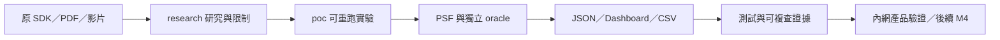

# FreeRTOS／RISC-V Observability：研究與可重跑 POC

**Cache 延遲研究更新：**[L1 格式、原廠參考值與校準](poc/docs/research/Cache延遲參考值與校準.md)；[QEMU 時間注入探針](poc/docs/time-control-probe.md)。158 個 Python 回歸測試通過；正增量注入仍逾時，guest stall 尚未完成，原始證據與下一步已保存。

**TCP 最佳化最新成果：**[實作比較、Web／離線畫面與重跑方法](poc/docs/tcp-optimization.md)。真實 lwIP 握手／傳送／ACK／重傳、三配置各三次、45 個 I/D trace 區段。

**新增 TCP/IP 實際元件研究：**[Stack 比較、公開案例與 RV32 checksum 實測](poc/docs/research/TCP-IP與Cache最佳化案例.md)。第一輪 checksum 元件實驗已完成；後續真 TCP 與 16+16 / 64 KiB cache 模型也已完成，見下方新報告。

這個 repository 保存 SDK／PDF／影片研究，以及能實際產生、解碼、驗證 PSF 的 FreeRTOS／RISC-V POC。

**目前完成：M1～M3 的 PSF parser、QEMU 控制案例、harness、本機 Python＋SVG Dashboard。** 單 trace 離線 HTML 已新增；M4 cache 相對最佳化、跨機重現與產品 U01～U16 尚未完成，不能以 POC 通過取代板上量測。

## 先從哪裡讀？

| 目的 | 文件入口 |
|---|---|
| 了解 SDK、hooks、CPU／RAM／UART／雲端與成本 | [完整研究報告](research/FreeRTOS-RISC-V-Observability-研究報告.md) |
| 操作 PSF POC | [POC README](https://github.com/swchen44/freertos_risvc_observability/blob/poc-history/README.md) |
| 看 Dashboard 操作與截圖 | [Dashboard 指南](https://github.com/swchen44/freertos_risvc_observability/blob/poc-history/docs/dashboard-guide.md) |
| 查看本次 todo／checklist 稽核和證據 | [GitHub 上傳與完成度稽核](research/github-upload-audit.md) |
| 帶到內網與產品 source 比對 | [POC handoff](https://github.com/swchen44/freertos_risvc_observability/blob/poc-history/docs/handoff.md)、[原始 U01～U16 任務](research/內部AI-接續研究任務.md) |

## 2026-10-04：離線 HTML、20 張截圖與最新驗證

[本輪完成紀錄](https://github.com/swchen44/freertos_risvc_observability/blob/337074f/artifacts/verification/offline/completion.json)｜[同步後的原知識庫文章](https://github.com/swchen44/personal-knowledge-base-from-ai/blob/83fd7d4/Research/2026-10-03-FREERTOS-RISCV-OBSERVABILITY-RESEARCH.md)

**Python 先將 PSF 轉成單檔 HTML，之後雙擊即可離線操作。** 新 PSF 需重新匯出；離線觀看端不需要 Python、Web Server 或網路。跨機重現依使用者 2B 整項暫緩。

[完整操作圖解](https://github.com/swchen44/freertos_risvc_observability/blob/5594d730adc432608013c2cd0855aa3794e8dc6e/docs/offline-guide.md)｜[下載 Queue 離線示範](https://github.com/swchen44/freertos_risvc_observability/blob/5594d730adc432608013c2cd0855aa3794e8dc6e/artifacts/offline/queue-baseline.html)｜[103 項 Python tests](https://github.com/swchen44/freertos_risvc_observability/blob/5594d730adc432608013c2cd0855aa3794e8dc6e/artifacts/verification/offline/full-suite.log)｜[curl integration](https://github.com/swchen44/freertos_risvc_observability/blob/5594d730adc432608013c2cd0855aa3794e8dc6e/artifacts/verification/offline/http-tests.log)｜[agent-browser E2E](https://github.com/swchen44/freertos_risvc_observability/blob/5594d730adc432608013c2cd0855aa3794e8dc6e/artifacts/verification/offline/browser-offline.log)｜[20 張圖片與版本 manifest](https://github.com/swchen44/freertos_risvc_observability/blob/5594d730adc432608013c2cd0855aa3794e8dc6e/artifacts/verification/offline/screenshot-manifest.json)

在初始化後的 `poc/`，依 Python 環境設定安裝，再執行：

```sh
npm --prefix web ci
npm --prefix web run build
.venv/bin/python -m psf_lab export-html fixtures/desktop/trace.psf --output artifacts/local/report.html
```

將 `report.html` 複製到閱讀位置後雙擊。GitHub 不會直接執行 HTML，範例需下載原始檔。離線單 trace 沒有案例 registry／oracle compare，該功能繼續在 Server 使用。

**Server 全覽：** 真實 Queue PSF 的時間軸、CPU share、事件表與來源。


**單檔 HTML 全覽：** 同一份 trace，右上角標明離線模式；保留互動能力。


**篩選與拖曳時間窗：** 選 consumer，CPU 分母仍保留整個窗口的排程。


**排序、欄寬與完整 CSV：** 本頁 20 筆，實測完整下載 281 筆。


**Server 案例對照：** Logger 干擾與改善有獨立 oracle，異常案例 pass 表示預期重現異常。


最新結果：103 Python（97 unit＋6 integration）、5 Node、11 Playwright regression 通過；另外以 curl 驗 5 項真實 HTTP integration、agent-browser 驗 Server／無 Server 的離線完整流程。離線 partial／10,000-event synthetic 與完整下載另有證據；不能把合成容量案例當硬體效能。

## 各資料夾與重要檔案

| 路徑 | 用途／重要內容 | 文件位置 |
|---|---|---|
| `research/` | 主研究報告、原始需求／MECE、驗證腳本與 JSON 證據 | `research/README.md`、`FreeRTOS-RISC-V-Observability-研究報告.md`、`內部AI-接續研究任務.md` |
| `research/pdf-text/`、`research/images/` | PDF 抽取文字、重要頁面圖片、Mermaid 的 `.mmd`／SVG／PNG | `pdf-manifest.json`、`pdf-visual-review.json`、`images/mermaid/README.md` |
| `research/measurements/`、`research/cases/` | object size 量測、桌面 demo PSF 與官方案例圖文證據 | `rv32-object-size.json`、`desktop-demo-evidence.json` |
| `research/next-phase/` | 進入實作前的 PSF／模擬／Dashboard 研究與設計歷史 | 此處狀態保留研究當時版本；現況以 POC 文件為準 |
| `data_from_web/` | 已下載文章資料；`whitepaper/` 保存 8 份 PDF | 主報告第 15 節與 `research/pdf-manifest.json` |
| `percepio/` | 原始 TraceRecorder／DFM SDK 快照 | `TraceRecorder/README.md`、SDK headers 與各自授權 |
| `Tracealyzer-SDK-demos/` | Percepio 原廠桌面／模擬器示範 | 目錄 README 與各 compiler demo 文件 |
| `Tracealyzer-STM32CubeIDE-SWO/` | STM32 SWO／STLINK 收集案例與產品圖片 | 目錄 README、`img/`；不代表 RISC-V 板上能力 |
| `poc/` | **可執行實驗、parser、案例、Dashboard 與完整 Git 歷史** | 詳見下一節；此目錄為 submodule |
| `.gitignore` | 排除本機暫存與研究 ZIP | 研究 ZIP 已從發布歷史移除；最新成果請依 Git 版本取得 |
| `.gitmodules` | 固定 POC commit，保留獨立實驗 repo 行為 | `poc-history` 分支可追查每次原始 commit |
| `LICENSE` | 保留此 GitHub repo 原有 MIT license | SDK、第三方套件與原始文章依各自授權，原 notices 保留 |

## POC 資料夾是什麼？

POC 的資料流為 **FreeRTOS＋TraceRecorder → QEMU PSF → Python JSON／獨立 oracle 驗證 → 本機互動 Dashboard／CSV**。

| POC 內路徑 | 重要檔案／用途 |
|---|---|
| `docs/` | `requirements.md`、`integration.md`、`format-support.md`、`query-semantics.md`、`server-api.md`、`case-results.md`、`benchmarks.md`、`handoff.md` |
| `docs/plans/`、`docs/design/` | M1～M3 的 13 項任務、資料契約、Dashboard 規格；M4 後續計畫 |
| `docs/reviews/`、`docs/journal/` | 獨立 review、RED→GREEN 修正、逐任務 ledger、過程日誌 |
| `firmware/` | `config/FreeRTOSConfig.h`、`app/main.c`、`app/cases/`、`port/` 與 Makefile |
| `src/psf_lab/` | parser、analysis、runner、harness、query／export、server／store、CLI |
| `cases/` | 七種正常／異常案例設定與 expected |
| `web/` | `package-lock.json`、ECharts SVG／Tabulator 介面、Node／Playwright tests |
| `tests/` | Python unit／integration 與 native transport tests |
| `fixtures/` | 固定 PSF 與來源；`fixtures/desktop/trace.psf` 可直接載入 |
| `runs/` | 每次正式實驗的 PSF、JSON、oracle、assertions、ELF／map、manifest |
| `artifacts/verification/` | 已提交的測試 log；本次上傳重驗另存 `github-upload/` |
| `artifacts/dashboard/`、`artifacts/benchmarks/` | 操作截圖、容量量測與明確標為 synthetic 的 fixtures |
| `tools/` | `toolchain-lock.json` 固定工具鏈及 hash；browser test server |
| `references/` | 原研究／SDK 的不可變基準與 422 檔 manifest |
| `third_party/FreeRTOS/` | 固定上游 commit 的 FreeRTOS submodule |
| `scripts/` | 保留用途說明；實際 CLI 在 `src/psf_lab/cli.py`，不能把空架構當已實作工具 |

## 下載與進行 POC

`main` 放研究入口；`poc-history` 保留完整 POC repo。`main:poc` 固定到其中一個 commit。GitHub 點選 `poc` 會開啟該 commit；下載 ZIP 不會包含 submodule 的內容，請使用 Git。

### 1. 下載並初始化 POC

```sh
git clone https://github.com/swchen44/freertos_risvc_observability.git
cd freertos_risvc_observability
git submodule update --init poc
cd poc
# submodule 預設 detached HEAD；開始修改前建立實驗分支。
git switch -c my-poc-experiment
```

### 2. 先分析已有 PSF，不需要 QEMU

需 Python 3.13 與 Node／npm。本次驗證版本為 Python 3.13.2、Node 26.0.0、npm 11.12.1。

```sh
python3.13 -m venv .venv
.venv/bin/python -m pip install -e . -r requirements-dev.lock
npm --prefix web ci
npm --prefix web run build
.venv/bin/python -m psf_lab serve
```

開啟 http://127.0.0.1:8000 ，載入 `fixtures/desktop/trace.psf`，或選擇已驗證案例。可看 task timeline／CPU share／response、篩選、排序、調欄寬、固定 details 與匯出全部符合事件的 CSV。

```sh
.venv/bin/python -m psf_lab decode fixtures/desktop/trace.psf --output artifacts/local/desktop.json
.venv/bin/python -m psf_lab analyze artifacts/local/desktop.json --output artifacts/local/desktop-analysis.json
.venv/bin/python -m psf_lab verify-docs
```

### 3. 重新編譯 FreeRTOS 並收集 PSF

先讀 POC 的 `docs/setup.md` 與 `docs/integration.md`。工具鏈依 `tools/toolchain-lock.json` 固定，包含本次 macOS arm64 路徑與 binary hash；`.tools` 不上傳。**新機器須安裝工具、核對版本／SHA-256，將新環境 lock 變更提交後再跑；不能直接把舊機器 lock 當可攜式設定。** `doctor` 只檢查可用工具，正式 runner 才會驗 lock。

```sh
git submodule update --init third_party/FreeRTOS
git -C third_party/FreeRTOS submodule update --init FreeRTOS/Source
.venv/bin/python -m psf_lab doctor
# 工具鏈與來源固定且 Git clean 後：
.venv/bin/python -m psf_lab run queue_baseline
# 上一份新 run 證據先 commit，再開始下一個正式實驗。
.venv/bin/python -m psf_lab suite --repeat 3
```

每次新 run 都有唯一 ID。用 `python -m psf_lab check <run目錄>` 重查 PSF／oracle／case；完整 suite 為七配置各三次及九組比較。QEMU 的 icount 不代表實體 CPU cycles、UART 或 cache penalty。

### 4. 複查完成證據

```sh
.venv/bin/python -m unittest discover -s tests/unit -t . -v
.venv/bin/ruff check .
.venv/bin/ruff format --check .
npm --prefix web run test:unit
npm --prefix web exec -- playwright install chromium
npm --prefix web run test:e2e
```

Integration tests 另需固定工具鏈與已建置 clock probe，見 POC integration 文件。完成判斷採「需求 → 實作 → 測試／run → log／hash」，詳細結果見 [上傳稽核](research/github-upload-audit.md)。



---

## 原始需求與研究過程紀錄

以下保留先前研究當時的完整 R01～R27／U01～U16 記錄；涉及「POC 未實作／未上傳」的歷史敘述，現況以上方導覽和本次上傳稽核為準。

# FreeRTOS／RISC-V Observability 研究紀錄

研究日期與本次更新：2026-10-03。

**研究報告與證據整理已完成；產品韌體整合、板上量測與正式費用評估尚未完成。** 本 README 記錄使用者提出的要求、研究過程、成果、待驗證事項與遺漏檢查，供後續放到內部網路及比對產品原始碼。

主要成果：[完整 Markdown 學習與研究報告](research/FreeRTOS-RISC-V-Observability-研究報告.md)。接續研究可使用[內部 AI 任務檔](research/內部AI-接續研究任務.md)，內含目的、source 比對、驗收與可直接貼給 AI 的指令。研究 ZIP 已依要求從 Git 歷史移除，不再上傳；請使用 Git 取得文件與 POC。

## 1. 這次的要求

目標是在 **FreeRTOS／RISC-V** 系統上了解每秒發生哪些事情，研究這個資料夾的 observability SDK 與工具是否適用，以及收集證據的成本與限制。

以下依使用者訊息整理。重複提出的題目合併記錄，保留後續新增的要求；補充研究建議另外標示，不當成使用者已確定的產品規格。

| 編號 | 明確提出的要求 | 目前狀態與報告位置 |
|---|---|---|
| R01 | 了解每秒系統做什麼、可以觀測哪些資料 | 研究完成；[第 1、4、5 節](research/FreeRTOS-RISC-V-Observability-研究報告.md#section-1)說明事件、摘要與觀測邊界 |
| R02 | 說明資料夾內容、功能、想解決的問題，以及是否真的解決 | 研究完成；[第 2、3 節](research/FreeRTOS-RISC-V-Observability-研究報告.md#section-2)區分 source 機制、供應商案例與尚未驗證的產品成效 |
| R03 | 說明運作原理 | 完成；[第 4 節](research/FreeRTOS-RISC-V-Observability-研究報告.md#section-4)說明 hook、timestamp、event、buffer、transport、host 分析 |
| R04 | 評估 code size、RAM、效能與其他代價 | 研究與 recorder object 編譯完成；[第 8～11 節](research/FreeRTOS-RISC-V-Observability-研究報告.md#section-8)；最終產品增量待量測 |
| R05 | CPU loading 約多少；單一事件或行為增加多少百分比 | 原廠描述、成本公式與情境試算完成；[第 8 節](research/FreeRTOS-RISC-V-Observability-研究報告.md#section-8)；板上數字待量測 |
| R06 | Observability 資料產生／傳送速率、介面、bandwidth | 完成格式推導、介面比較與頻寬試算；[第 5～7 節](research/FreeRTOS-RISC-V-Observability-研究報告.md#section-5)；實際吞吐待量測 |
| R07 | UART 能不能用、有哪些實際經驗 | 完成；[第 7 節](research/FreeRTOS-RISC-V-Observability-研究報告.md#section-7)含 Renesas 原廠 UART 案例、baud 換算、binary／hex 與 DMA 評估；本次未上板 |
| R08 | 安裝方式與使用方法 | 文件完成；[第 12 節](research/FreeRTOS-RISC-V-Observability-研究報告.md#section-12)；未安裝到產品韌體 |
| R09 | SDK 使用方法與 API 連結 | 完成；第 12.4、12.7 節含 recorder／DFM API、條件與範例；附本地 source 與官方連結 |
| R10 | SDK 如何 hook 現有 FreeRTOS；是否要改 FreeRTOS source | 完成；第 12.6 節說明既有 trace 巨集、預處理展開、設定／建置／BSP 的修改範圍及 kernel library 必須重編的情況 |
| R11 | 限制與 boundary | 完成；[第 1、10、11、13 節](research/FreeRTOS-RISC-V-Observability-研究報告.md#section-11)；含 RISC-V port、SMP、sleep／DVFS、crash、資料遺失與版本差異 |
| R12 | 能否上雲端、是否只能本地；兩者差異與建議 | 完成；[第 14、16、17 節](research/FreeRTOS-RISC-V-Observability-研究報告.md#section-14)含 gateway、自有後端、payload／signature 邊界與資料量；未部署後端 |
| R13 | 能否動態裁剪資料 | 研究完成；[第 13 節](research/FreeRTOS-RISC-V-Observability-研究報告.md#section-13)區分編譯裁剪、runtime 控制、host filter、preview 與 cloud retention；自訂策略未實作 |
| R14 | 是否便宜、如何評估成本 | 成本面向與小成本方案比較完成；[第 16 節](research/FreeRTOS-RISC-V-Observability-研究報告.md#section-16)；正式授權報價與實際總費用待評估 |
| R15 | 解析已下載 PDF，納入研究 | 完成 8 份 PDF、61 頁文字抽取與逐份解析；[第 15 節](research/FreeRTOS-RISC-V-Observability-研究報告.md#section-15) |
| R16 | PDF 圖片也要分析，找出有用資料 | 完成全部頁面渲染與縮圖檢查、重要圖表放大；第 15.4 節含統計值、時間線、架構與證據邊界 |
| R17 | 閱讀指定 YouTube 的字幕，評估研究用途 | 完成英文字幕閱讀與時間點摘要；[第 18 節](research/FreeRTOS-RISC-V-Observability-研究報告.md#section-18)；影片為 STM32／STLINK 示範 |
| R18 | 產生完整、清楚、不遺漏的 Markdown 學習／研究報告 | 完成 24 個主章節，包含需求對照、驗證邊界、新增案例操作與 MECE 檢查 |
| R19 | 使用 Mermaid 架構圖、流程圖、時序圖，方便快速理解 | 完成 12 張 Mermaid 圖；另含狀態圖，全部通過語法檢查，並提供 SVG／PNG |
| R20 | 想想還有哪些必須進一步研究的主題 | 完成；[第 19 節](research/FreeRTOS-RISC-V-Observability-研究報告.md#section-19)按 P0／P1／條件需求列出問題、方法與應產出的證據 |
| R21 | 不猜使用者意圖、保留先前題目、遵循 `i-have-adhd-zh-tw` | 以明確問題作需求對照；繁體中文敘述，保留 API／code／path；試算前提、產品未知資訊與補充建議明確標示 |
| R22 | 為後續內部網路分享、比對產品原始碼及持續研究準備 | 完成可攜套件、來源 SHA-256、相對連結與比對方法；[第 20 節](research/FreeRTOS-RISC-V-Observability-研究報告.md#section-20)；上傳與產品比對由使用者規劃後續執行 |
| R23 | 網路權限更新後重試 npm 安裝 | 完成重試；Mermaid、jsdom 與 Mermaid CLI 安裝成功，後續圖表驗證與渲染完成 |
| R24 | 將要求、過程、已完成／未完成事項寫進 README，再檢查遺漏 | 本檔完成記錄；新增本次需求稽核、README／附件連結檢查並同步套件 |
| R25 | 補出未完成事項與目的，讓有產品 source 的內部 AI 繼續完成 | 完成[交接任務檔](research/內部AI-接續研究任務.md)；U01～U16 含目的、source／build 工作、額外條件與驗收；產品工作仍待執行 |
| R26 | 把提供的文字／圖片案例寫入報告，說明收集後怎麼用 | 完成[第 22 節](research/FreeRTOS-RISC-V-Observability-研究報告.md#section-22) 9 組案例索引與操作解讀；桌面 demo 編譯／執行成功，GUI decode 未驗證 |
| R27 | 最後檢查討論是否夠 MECE | 完成[第 23 節](research/FreeRTOS-RISC-V-Observability-研究報告.md#section-23)；原討論分類軸混用，已補八類主要歸屬、資料生命週期與採用證據檢查 |

## 2. 研究範圍與證據分類

| 資料 | 本次用途 |
|---|---|
| `percepio/TraceRecorder/` | 主要 recorder；本地檔頭 v4.12.0；檢查 FreeRTOS／RISC-V、events、buffer、streamports、monitor、filter |
| `percepio/DFM/` | 本地檔頭 v2.1.0；檢查 alert、symptom、payload、cloud／storage、crash 與錯誤處理 |
| `Tracealyzer-SDK-demos/` | 了解自訂事件與新舊 API 差異；完整 GCC 桌面 demo 在暫存副本執行成功；不拿模擬 RTOS 當成板上效能 |
| `Tracealyzer-STM32CubeIDE-SWO/` | 研究 Arm SWO、STLINK、GDB server、Python 與本地 TCP bridge |
| `data_from_web/whitepaper/` | 8 份原始 PDF；兩份 Continuous Observability 文字相同，合計 7 組不同文字內容 |
| 指定 YouTube | [Tracealyzer streaming with STM32CubeIDE and STLINK v3](https://www.youtube.com/watch?v=3g2kV2eTKwk) 的英文字幕 |
| 官方公開文件 | Percepio、SEGGER、FreeRTOS、RISC-V、Renesas 與 USB 技術資料；API 網址另存檢查結果 |

證據分成「本地 source 已確認」、「官方／PDF／影片描述」、「實際編譯／host 執行驗證」與「工程試算／建議」。CPU、UART、buffer 與雲端容量的假設值保留前提；桌面模擬與試算未標示為產品實測。

本資料夾沒有使用者產品的完整 firmware、BSP、linker map、指定實體板或 workload。本次未檢查尚未提供的產品 source。

## 3. 研究過程

下表記錄本次工作的順序與方法，不填寫未記錄的各階段開始時間或耗時。

| 階段 | 做了什麼 | 留下的證據或結果 |
|---|---|---|
| 1. 整理需求與資料夾 | 檢查 README、source、config、headers；辨識 recorder、DFM、demos 與 PDF 的角色 | 主報告第 0～3 節、來源清單 |
| 2. 追 recorder 路徑 | 檢查 hook、事件格式、timestamp、critical section、buffer 與各 streamport | 主報告第 4～13 節與 source links |
| 3. 解析 PDF 文字 | 使用 `pdftotext -layout` 抽取、`pypdf` 確認頁數，計算 SHA-256 | `research/pdf-text/`、`pdf-manifest.json`；確認重複文件 |
| 4. 建立成本模型 | 由事件大小與 events/s 推導 bytes/s；計算 UART 8N1、hex、buffer 前史、CPU 與單次行為比例 | 主報告表格與 `verification.json` 的計算例 |
| 5. 查閱官方案例 | 查 FreeRTOS 整合、RISC-V counter、RTT 存取、Renesas UART、產品部署與授權 | 報告內的直接來源連結；區分 Arm 案例與 RISC-V 適用性 |
| 6. RV32 編譯探測 | 使用 Homebrew clang 23.1.1、RV32IMAC／ILP32、`-Os`，編譯 recorder＋BareMetal＋RingBuffer 共 28 個 objects；再次執行確認結果相同 | `measure_objects.py`、`measurements/`；未做產品 firmware link |
| 7. 閱讀影片字幕 | 用 `yt-dlp` 下載指定影片的英文字幕與 metadata，閱讀並整理時間點 | `youtube-evidence.json`、主報告第 18 節；未附完整字幕轉錄 |
| 8. 補 PDF 圖片 | 用 Poppler 渲染全部 61 頁，逐份看全部頁面縮圖，再放大重點圖表；保存 12 張重點頁面圖 | `images/`、`pdf-visual-review.json`、第 15.4 節 |
| 9. 驗證及渲染 Mermaid | 首次 npm 安裝遇 `ENOTFOUND`；網路權限更新後重試成功；使用 Mermaid 11.12.0／jsdom 驗證，Mermaid CLI＋Chrome headless 渲染 | 10 張圖通過語法檢查，SVG／PNG 與視覺檢查完成 |
| 10. 補 SDK API 與 hooks | 對照本地 headers、官方 API Reference、官方 FreeRTOS-Kernel V11.1.0 既有呼叫點 | 第 12.4、12.6、12.7 節；9 個官方 API URL 檢查；固定 tag 僅作機制範例 |
| 11. 整理缺口與來源版本 | 列出 P0／P1／條件研究主題，保存 source／PDF／字幕來源與 hash | 第 19～21 節與各 manifest |
| 12. 文件驗證與封裝 | 檢查章節、相對連結、圖片、Mermaid、來源 hash、計算例與 ZIP 內容 | `verify_report.py`、`verification.json`、可攜 ZIP |
| 13. 本次補工作紀錄 | 逐項對照使用者訊息與報告，建立根目錄 README；分開列文件完成、產品未驗證與使用者規劃的後續工作 | 本檔、`requirements-audit.json`；套件改為收錄本檔 |
| 14. 補案例使用流程 | 再看 PDF 原圖與 demo source；暫存副本使用 Apple clang 17 編譯、執行桌面 demo；核對 XML 名稱與圖說不一致 | 第 22 節 9 組案例；7,152 bytes PSF、build log、JSON；新增 starvation／jitter 原圖 |
| 15. 準備內部 AI 交接 | 展開未完成任務的目的、依賴、source／build／硬體條件與驗收；補 U13～U16 | `內部AI-接續研究任務.md`、可直接貼給 AI 的指令；未操作內部產品 |
| 16. MECE 與重新封裝 | 建立八個互斥的主要分類，對照全部要求與未完成項，新增兩張流程圖並更新檢查／ZIP | 第 23 節、27 項需求／16 項待辦稽核；12 張 Mermaid 與同步套件 |
| 17. 檢查所有套件 README 附圖 | 封裝檢查發現原 SWO README 的圖片沒有收錄；補 15 張原圖，檢查 Markdown 與 HTML `img src`；分析 Live Stream 與配置畫面 | 第 22.10 節與 `cases/source-image-review.json`；附圖能隨套件閱讀 |

## 4. 已完成事項

- [x] 使用者需求對照、資料夾角色、功能、問題與成效評估。
- [x] 事件產生、FreeRTOS hook、timestamp、buffer、transport 與 host 分析原理。
- [x] SDK 安裝／使用文件、API 表格、固定事件與 ISR 範例、DFM 回報流程。
- [x] 說明標準 FreeRTOS 通常透過設定與重編接上既有 hooks，並列出 fork／SMP／預編譯 library 的限制。
- [x] 資料率、介面、UART bandwidth、binary／hex、DMA／IRQ、buffer 容量與前史試算。
- [x] CPU loading、每事件與每行為增加比例的模型；區分 CPU usage、overhead、response time 與線路占用率。
- [x] 完成 RV32 object 編譯大小與再次執行確認，保留可重現腳本與原始結果。
- [x] 解析 8 份 PDF 共 61 頁，辨識文字重複文件，分析重要圖片與案例。
- [x] 閱讀指定 YouTube 英文字幕，加入時間點、用途與證據邊界。
- [x] 本地／雲端、資料主權、gateway、signature／payload、容量、授權與成本比較。
- [x] 動態裁剪、新舊 filter API 差異與會失去哪些分析資訊的評估。
- [x] 列出 timestamp、loss、worst-case latency、版本、trigger、snapshot、DMA、crash、SMP 與省電等後續研究題目。
- [x] 產出完整繁體中文 Markdown 報告與 12 張 Mermaid 圖，附 SVG／PNG 備用圖。
- [x] 保存 325 份 source 檔案的 SHA-256、PDF／字幕來源與各類驗證資料。
- [x] 整理可攜研究套件，檢查封裝後的相對連結與報告 hash。
- [x] 本 README 補上要求、過程、成果、未完成事項與遺漏檢查。
- [x] 案例操作手冊補上「收哪些事件、開哪些視圖、怎麼判讀、如何修正與驗收」，附原圖及 source。
- [x] 桌面 SDK demo 在暫存副本編譯／執行成功；保存 PSF、編譯 warning 與執行條件，未宣稱 GUI 解碼通過。
- [x] 整理內部 AI 接續任務、目的、依賴、驗收與直接可用的指令。
- [x] 完成 MECE 主要分類與 R01～R27／U01～U16 對照，保留技術交叉依賴與未知產品條件。

### 實際編譯的結果與邊界

| 項目 | 結果 |
|---|---:|
| Object 數 | 28 |
| Object text 合計 | 12,633 bytes，約 12.34 KiB |
| Object data 合計 | 0 bytes |
| Object BSS 合計 | 13,880 bytes，約 13.55 KiB |
| BSS 內的 RingBuffer | 10,240 bytes，10 KiB |

以上是 **recorder＋BareMetal／RingBuffer 的 object 大小**。沒有最終 link／GC／LTO，沒有計入 FreeRTOS kernel port／hook call sites、TzCtrl stack／TCB、UART driver、libc 實作、DFM、網路或 TLS；不能當成產品的新增 Flash／RAM，也不能由此推導 CPU loading。

### 已發現、後續值得驗證的 source 行為

| 發現 | 記錄位置與意義 |
|---|---|
| 本地 RV32 counter 頻率預設寫成 16 MHz | 第 11.1 節；必須對照真正 timestamp counter，不只看 CPU clock |
| SWO／ITM、STM32 flash 與 Arm crash 範例有平台依賴 | 第 6、11 節；RISC-V 需要自己的硬體／storage／trap 整合 |
| 主目錄沒有可直接套用的通用 UART trace streamport | 第 7 節；自訂 port 的方法完成，driver 尚未實作 |
| DFM Serial 把 binary byte 轉成約 3 字元 hex | 第 7.4 節；不能按 raw binary 估算有效資料率 |
| 舊 demo 的 filter API 與主目錄不同 | 第 13.2 節；不能由舊文件推定新版支援相同裁剪 |
| DFM payload chunk 底層錯誤可能被忽略，checksum 計算直接回傳 0 | 第 14.3 節；alert success 不等於完整 payload 已可靠保存；本次未修改 source |
| 桌面 demo README 的 XML 名稱與實際檔案不一致 | 第 22.7 節；source 實際使用 `my_krnl`／1.0.0，原 README 寫 `EXAMPLE-v1.0.1.xml` |
| TopFiveBugs deadlock 圖的一段物件圖說與事件標籤不一致 | 第 22.4 節；依時間線與持有關係核對，保留來源不一致的記錄 |

## 5. 未完成與尚未驗證事項

**這些事項保留未完成狀態。研究方法或安裝文件完成，不代表已在產品上實作或量測。**

| 編號 | 未完成事項 | 已具備的研究結果 | 完成需要什麼／目前原因 |
|---|---|---|---|
| U01 | 將 SDK 接入你們實際 FreeRTOS／RISC-V firmware | 第 12 節接入方法、API、hooks 與版本限制 | 產品 source、kernel／BSP 版本及建置設定；本次資料夾未提供完整產品 |
| U02 | 最終新增 Flash／RAM 的 A/B 比較 | RV32 recorder object 量級與可重現腳本 | 相同 compiler／flags 的產品 baseline／instrumented ELF、map；需要包含真正 FreeRTOS／driver／其他依賴 |
| U03 | 板上總 CPU loading、每類事件 cycles／耗時、單次行為比例 | 原廠量級、成本模型與 A～F 測法 | 指定晶片、counter、clock、實體板與相同 workload；本次沒有量到板上數字 |
| U04 | 最差 IRQ 延遲、critical section、request response／deadline | 已說明平均 overhead 與最差即時性不同 | 板上 timer／GPIO 等量測與產品 deadline；需要高事件率／滿 buffer 情境 |
| U05 | 自訂 RISC-V UART streamport／DMA driver 與實際吞吐 | UART 原廠案例、線速、buffer 與 ownership 方案 | 實際 UART／DMA／bridge、driver 與 host collector；需要驗證 baud、partial write、loss、斷線與 reconnect |
| U06 | Snapshot 前史、資料遺失、停止／複製／恢復與多次 trigger 的正確性 | Buffer 歷史與尖峰模型、loss 政策與研究項目 | 平台壓測、marker／sequence 對照、完整性與空窗量測 |
| U07 | RISC-V trap／crash dump、跨 reset／斷電保存與復原後回報 | Arm 範例 boundary 與 RISC-V 所需資料已列出 | 產品 trap／startup／linker／storage 實作與 reset／斷電測試 |
| U08 | 平台 timestamp／sleep／DVFS 正確性，及需要 SMP 時的跨核一致性 | Counter、IRQ masking、wrap 與 SMP 風險已研究 | 真正 timer／core／privilege／memory 架構；本次未知道產品是否需要全部條件 |
| U09 | Runtime 動態收集策略、trigger、monitor、去重與限流 | 已區分內建功能與需額外整合的策略 | 實際問題／門檻與產品實作；本次沒有完成客製功能或長測驗收 |
| U10 | 本地 collector／server 或雲端後端的端到端部署與可靠交付 | 本地／gateway／cloud 架構與 DFM 限制已研究 | 要選定實際部署、保存／確認／重送方式；本次未部署正式服務 |
| U11 | 正式授權報價、硬體採購與實際總費用 | 授權模式、每日資料量與成本面向已有比較 | 裝置數、retention、alert／存取量、產品組合與供應商報價；不能定量證明「便宜」 |
| U12 | 產品 workload 的問題改善與長期 regression 驗證 | PDF 案例與 CI／驗收方法已整理 | 產品問題案例、相同條件的修正前後資料與重複長測 |
| U13 | Tracealyzer／decoder 的解碼與分析驗收 | 桌面 PSF 已產生、案例操作流程已整理 | 實際 viewer／授權；已知事件、XML／symbols、時間／priority／物件對照與操作截圖 |
| U14 | Trace 證據格式與產品版本對應 | Metadata、source hash 與交接模板已整理 | 產品 build／device／session／symbols／config／loss 格式及保存驗收；目的為可重現與避免錯版本分析 |
| U15 | 收集生命週期與控制 | Start／stop／trigger／rearm／config 的研究項目已補 | 產品狀態表與反覆操作／reset 測試；遠端控制依實際需求；目的為收集行為一致、有界 |
| U16 | 有省電需求時的電流／能耗驗證 | 第 19 節與交接檔已有測法 | 若產品有省電目標，量 trace off／RAM／transport 的電量、sleep residency 與喚醒；未確認需求前保持條件式 |

各項任務的**目的、依賴、可先做的 source／build 工作與完成條件**，詳見[內部 AI 接續研究任務](research/內部AI-接續研究任務.md)。Source 在內部可用後能推進靜態確認、整合與最終建置；板上／服務／報價工作仍需相應條件。

### 使用者明確規劃的後續工作

- [ ] 將成果放到組織內部網路。
- [ ] 與組織目前的產品原始碼比較，繼續研究。

本次已準備可攜套件、來源 hash 與比對表方法；上述兩項尚未執行。這是使用者提到的後續安排，沒有把它延伸成當前的部署或 source 修改授權。

## 6. 再次檢查：有沒有遺漏？

**逐項對照後，R01～R27 都有對應的文件、結果或明確未完成記錄。** 有涵蓋 CPU、資料速率、UART 經驗、成本、PDF 圖片、影片字幕、SDK API、FreeRTOS hooks、Mermaid、案例使用、內部 AI 交接與 MECE。平台實測、費用與運作驗收仍有缺口，已列在 U01～U16，沒有標成完成。

本次補齊的文件缺口：

1. 原先根目錄沒有本次研究的 `README.md`，`research/README.md` 主要是成果索引；現在新增完整要求、過程與狀態紀錄。
2. 原先 ZIP 的根 README 由腳本另外產生短版，容易與工作目錄的紀錄不同；現在封裝直接收錄本檔。
3. 原先驗證範圍沒有根 README；現在納入根 README 與報告章節連結檢查。
4. 正式報價、實際安裝／driver、自訂裁剪、產品問題改善及使用者規劃的後續工作，現在各自列出狀態，避免混在「研究完成」裡。
5. 原案例圖已有技術分析，還缺少完整使用路徑；現在補上從收集、視圖、判讀到修正／重測的步驟，並加入實際桌面 PSF。
6. 原討論尚未嚴格 MECE；現在每項要求／待辦只登記一個主要分類，另以問題類型、資料生命週期與使用階段檢查完整性。
7. 原 SWO README 已收錄，但附圖未跟著封裝；現在補 15 張原圖並納入 Markdown／HTML 圖片連結檢查。

MECE 檢查的範圍是本次已提出的研究與待辦，沒有宣稱涵蓋未知產品的所有問題。新增 U13～U16 是待驗證缺口與條件式建議，未把它們當成產品已確定的功能。

本次需求稽核：[requirements-audit.json](research/requirements-audit.json)。文件與附件檢查：[verification.json](research/verification.json)。稽核是對照使用者已提出的要求，不代表已知道未提供的產品規格。

## 7. 成果與證據位置

| 檔案／目錄 | 用途 |
|---|---|
| [完整研究報告](research/FreeRTOS-RISC-V-Observability-研究報告.md) | 詳細學習、SDK 用法、架構與評估；第 0 節有閱讀對照 |
| [研究資料索引](research/README.md) | 附件與重現方式 |
| [內部 AI 任務](research/內部AI-接續研究任務.md) | 任務目的、source 比對、驗收與可直接使用的交接指令 |
| [Mermaid 圖片索引](research/images/mermaid/README.md) | 12 張 `.mmd`、SVG／PNG 備用圖 |
| `research/images/` | 13 張 PDF 重點頁面圖，附案例與技術解讀 |
| [桌面 demo PSF](research/cases/desktop-demo.psf)、[執行證據](research/cases/desktop-demo-evidence.json) | 學習事件格式；模擬 RTOS，GUI 解碼驗證尚未完成 |
| [SWO 圖片閱讀紀錄](research/cases/source-image-review.json) | 原廠資料率／事件率／loss 與 host 設定畫面的解讀；15 張原圖隨套件保留 |
| [PDF manifest](research/pdf-manifest.json)、[圖片檢查紀錄](research/pdf-visual-review.json) | PDF 頁數、hash、重點頁碼與分析範圍 |
| `research/pdf-text/` | 8 份 PDF 文字抽取 |
| [YouTube 證據](research/youtube-evidence.json) | 影片來源、字幕語言、時間點與邊界 |
| [Source manifest](research/source-manifest.json) | 325 份 source 檔案的 SHA-256 |
| [RV32 編譯腳本](research/measure_objects.py)、[編譯結果](research/measurements/rv32-object-size.json) | 本次 object 大小與條件 |
| [API URL 檢查](research/api-link-check.json) | 9 個官方 API 頁面的檢查結果；不是所有外部連結的即時可用性保證 |
| [Mermaid 語法檢查](research/mermaid-verification.json) | 本次 12 張圖的 parse 結果 |
| [文件驗證腳本](research/verify_report.py)、[驗證結果](research/verification.json) | 連結、圖片、章節、hash 與計算例 |
| [套件封裝腳本](research/package_report.py) | 保留相對目錄並重新產生 ZIP，檢查 archive integrity |

## 8. 分享與持續研究

分享 ZIP 時保留原相對目錄，讓圖片、原始 PDF、SDK source 與 README 連結持續有效。套件含本次 recorder／DFM source 快照、完整 GCC 桌面 demo 與引用的 SWO README／原始附圖；未收錄完整 STM32 或 IAR 專案。原始 SDK 與 PDF 的授權／著作權資訊保留。

目前工作目錄不是 Git repository，沒有可填寫的 root commit ID。後續產品比對應另外記錄產品 commit／build ID、compiler、FreeRTOS／BSP 版本、clock、core 數、收集配置與 workload，並附真正量測結果。

既有重現工具：

```sh
# 以本次 macOS／Homebrew LLVM 路徑做 recorder object 探測
python3 research/measure_objects.py

# 檢查文件與證據；套件使用者需先具備 Python 的 markdown-it-py、Pillow
python3 research/verify_report.py

# 同步目前 README、報告與附件到可攜套件
python3 research/package_report.py
```

編譯腳本沒有產生產品 firmware。驗證腳本對本次編譯重跑結果的比較仍依賴暫存檔；換主機或清除暫存後，需要先執行編譯探測。新增產品實測時，保留條件與證據，不把原先試算直接改稱實測。

## 9. 新增階段：知識庫、PSF、模擬與互動分析（歷史快照）

本節 N01～N12 保留進入實作前的狀態，不能當作目前 TODO。Parser、RISC-V 環境、案例／harness、本機 UI／tests 均已完成，最新成果及離線版見本 README 頂部；M4、跨機及產品任務仍另行追蹤。

本節保留後續新增要求，不改寫前一階段 R01～R27／U01～U16 的歷史範圍。研究與設計入口：[下一階段研究索引](research/next-phase/README.md)。

| 編號 | 使用者新增要求 | 目前狀態 |
|---|---|---|
| N01 | 先用 `kb-create` 將既有研究合併成一篇知識庫，完成 push 後通知並暫停 | 已完成，commit `63ac65685a796870804445e5d79b59c78054ce41`；已通知並暫停，後續收到使用者「請開始」後恢復 |
| N02 | 使用 `grilling`，不要猜意圖，尋找適當 skills 做 review | 已開始查證與釐清設計；設計／程式碼 review 分工見新索引 |
| N03 | 分析實際 PSF 的格式、解析方法，寫入研究報告 | 已完成 [PSF 格式研究](research/next-phase/PSF格式與解析研究.md)，核對既有 PSF 的 309 events／50 次序列；正式 Python decoder 尚未實作 |
| N04 | 新建資料夾並使用 Git 管理驗證計畫 | 已依使用者指定建立 [poc](poc/README.md) 獨立 Git，文件、目錄與研究快照集中保存；產品實驗待執行 |
| N05 | 取得 RISC-V 模擬器、FreeRTOS，整合 SDK 並重新編譯 | 正在確認官方範例、工具鏈、時鐘與 capture；尚未安裝／建置新環境 |
| N06 | 依案例／分析功能建立正常與異常 test cases，實際模擬並收集 PSF | 控制實驗提案整理中；尚未執行新案例 |
| N07 | Python PSF→JSON，依案例預期建立 harness，驗證文件正確性 | 整理格式、獨立 oracle 與驗收條件；尚未實作 |
| N08 | 研究 Tracealyzer 可觀測項目、filters、功能目的及 UI 圖片 | 完成 [Dashboard 功能研究](research/next-phase/Dashboard功能與設計研究.md)，保留官方已證實功能與自製提案的邊界 |
| N09 | Python 讀 PSF 轉互動 Dashboard HTML／SVG＋專業 JavaScript | 使用者明確更正：原本「PDF」是筆誤；PDF 僅作研究／案例參考 |
| N10 | 設計師協助 Dashboard：input／filters／views／hover、表格排序／欄寬／移動、時間軸互動與 CSV 匯出 | 使用者選本機 Python 服務，之後再改離線 HTML；正在依此收斂設計，尚未實作 UI |
| N11 | 不購買 Percepio Tracealyzer，自行試做 | 作為方案約束；未購買 |
| N12 | Python 互動 Dashboard 加上 `unittest` 與 `ruff` | 已納入新專案驗收要求；本機工具可用，尚未執行新專案測試 |

知識庫成果：[合併後的研究筆記](https://github.com/swchen44/personal-knowledge-base-from-ai/blob/main/Research/2026-10-03-FREERTOS-RISCV-OBSERVABILITY-RESEARCH.md)。當次驗證為 459 個本地連結、37 個原程式碼區塊、12 張 Mermaid、325 個來源 hash；本機與遠端 commit 一致。

前次研究代理曾遇使用額度限制；本輪已恢復 PSF、模擬環境與 Dashboard 三個研究分工。Agent 回報會再由主代理核對文件與證據。模擬條件下的結果與板上量測保留不同標籤。

本輪[獨立 review](research/next-phase/review-record.md)已核對研究與 PSF probe；已修正不必要的使用者決策負擔、QEMU 引用行號，並補出 platform schema key。沒有將研究 review 宣稱為新 firmware／decoder／UI 測試通過。

Q1／Q2 回答後的具體架構、parser 範圍、案例、SVG／JavaScript 介面與驗收，集中於 [PSF Lab 設計規格](research/next-phase/PSF-Lab-設計規格.md)。

後續實驗與文件的主要入口已改為 [poc/README.md](poc/README.md)。本目錄本身仍不是 Git repository；`poc/` 是獨立 repository。


## 2026-10-04：M4 前置實驗

官方 cache plugin 已在 QEMU 11.1.2 RV32 FreeRTOS Queue baseline 成功載入，取得 L1I／L1D／L2 統計，guest oracle 與原案例一致。這是 M4.1 smoke；尚未完成 cache 模型校驗、相對 A/B 或 Dashboard cache 視圖。

- [POC 原始 log、manifest 與限制](https://github.com/swchen44/freertos_risvc_observability/blob/poc-history/artifacts/verification/cache/README.md)
- [M4 六階段計畫](https://github.com/swchen44/freertos_risvc_observability/blob/poc-history/docs/plans/04-cache-relative-optimization.md)

下一步先釐清 instruction／data address 語意、驗證手算 cache oracle，再做相同工作量 A/B；產品 U01～U16 與暫緩的跨機工作仍維持原狀態。


## Cache 效率研究與內網還原

已新增 data-region 相對比較：RV32 FreeRTOS row／column 各三次、三組 L1D geometry、相同 checksum，並提供本機 Web 和離線 HTML Cache Dashboard。

- [研究：什麼是 cache 效率、PSF counter 接入與論文／論壇來源](https://github.com/swchen44/freertos_risvc_observability/blob/poc-history/docs/research/Cache效率與PSF擴充.md)
- [操作、實際截圖與內網還原方式](https://github.com/swchen44/freertos_risvc_observability/blob/poc-history/docs/cache-replay.md)
- [離線 Cache Dashboard](https://github.com/swchen44/freertos_risvc_observability/blob/poc-history/artifacts/offline/cache-comparison.html)
- [source 還原包](https://github.com/swchen44/freertos_risvc_observability/blob/poc-history/artifacts/restore/cache-replay-source.tar.gz)／[SHA-256](https://github.com/swchen44/freertos_risvc_observability/blob/poc-history/artifacts/restore/cache-replay-source.json)


4 KiB L1D 模型中，改成連續存取使 misses 從 8,192 降至 512，line byte-use 從 6.25% 升至 100%。這是可供最佳化參考的模型內相對結果，不能直接換算時間加速倍數。L1I、hot/cold function、資料拆分與逐 task cache 對時仍為後續。
