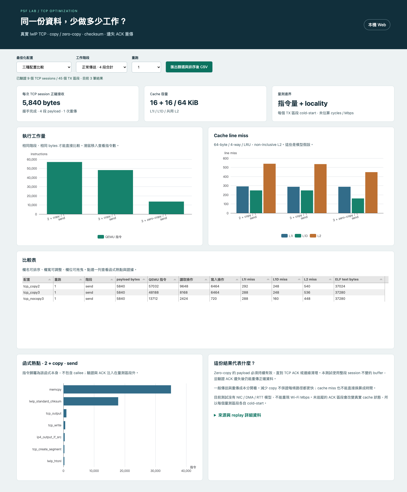
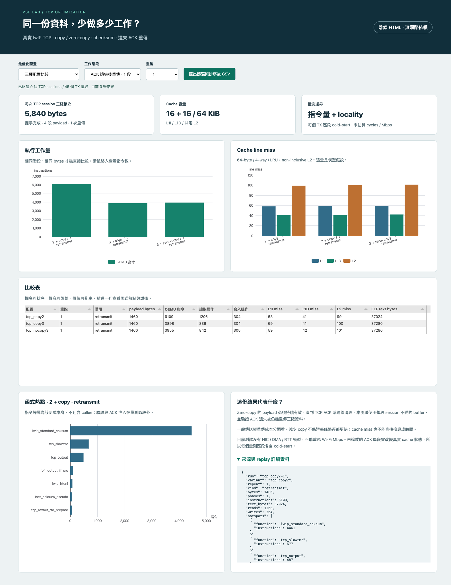

# FreeRTOS／RISC-V PSF POC

**T3b 小 Cache／-Os 三種實作比較：**[8/8/32 KiB、miss 歸因、code size 與重跑證據](docs/tcp-os-small-cache.md)。layout 慢 0.077%、checksum 快 0.106%、pbuf 接收驗證快 0.513%；皆為模型結果。已完成 C 改寫實驗，保留 baseline 預設；下方未完成敘述屬歷史，timing Dashboard 仍待做。

**T3a 首組最佳化 A/B 完成：**[checksum Os／O2、熱點、code size 與長度／對齊取捨](docs/tcp-checksum-optimization-t3a.md)。完整模型流程改善約 0.24%，stack 呼叫區間成本下降約 1.56%；20-byte header 反而較慢，保留 Os 預設。下方「尚未做 A/B」為歷史狀態；C 改寫與 timing Dashboard 仍待做。

**T2g 完整 TCP IRQ 版本通過：**[zero-copy 流程、task 搶占、封包與 PSF 驗證](docs/live-tcp-irq-t2g.md)。三次配對皆完成 25 個封包、11,680 bytes 回應；observer 在第 2 tick 執行，核算後誤差 +57 ns。以下完整 TCP IRQ 待辦為歷史狀態；真正程式碼最佳化 A/B 與 timing Dashboard 尚未完成。

**T2f IRQ／排程接合通過：**[逐筆 cache 成本觸發 timer、喚醒高優先序 task 與 PSF 證據](docs/live-cache-irq-t2f.md)。三次注入皆前進 3 ticks、observer 在第 2 tick 執行；核算 ISR 額外指令後誤差 +10 ns。以下 IRQ 待驗證描述為歷史階段；硬體逐筆 stall 與完整 TCP IRQ 版本仍待做。

**T2e 逐筆成本接合通過：**[500 MHz cache／sysram → guest 時間與完整 TCP 驗證](docs/live-cache-t2e.md)。兩種案例共 12 次正式執行；模型與 guest 差分誤差分別 -74 ns／+32 ns。以下「尚未接合」為歷史階段；IRQ 開啟的逐筆 stall 與 Dashboard timing views 仍待做。

**頻率決策已確定：**[500 MHz 換算基準與後續驗收](docs/timing-500mhz.md)。每 cycle 2 ns；sysram 起始延遲 10 cycles = 20 ns。逐筆 cache 成本接合尚未完成。以下 T2d 的待選頻率描述為歷史狀態。

**T2d 小延遲累加通過：**[10～1,000 ns 流失對照、研究用相對 API 與多筆排隊驗證](docs/qemu-clock-nano-t2d.md)。正式 18 次 nano 與 6 次 IRQ／WFI 執行；尚未接 cache 模型或指定產品 CPU 頻率。

**T2c clock 邊界通過：**[無 timer、連續／過期請求、IRQ 遮蔽與 WFI 後注入](docs/qemu-clock-edges-t2c.md)。正式六次執行通過，新增 cycles → ns 餘數累計；數十 ns 級與逐次 cache 成本接合仍待驗證。

**T2b 基本 clock probe 已通過：**[獨立 QEMU 建置、兩項 patch 與三階段對照](docs/qemu-clock-t2b.md)。5 ms 注入使 guest 前進約 5.0024 ms、5 ticks 並喚醒等待 task。逐次 cache stall／sysram 時間接合仍待驗證。

**Sysram 10 cycles：**[獨立 read／write 設定、重播比較與使用方法](docs/sysram-10.md)。設定在 `cases/timing/sysram-10.json`，證據在 `runs/timing-sysram-10-v1/`；[QEMU clock 接合研究](docs/research/QEMU-clock接合下一步.md) 保存固定版本來源與後續驗收。

**T2a 歷史失敗探針：**[正式結果與下一步](docs/time-control-probe.md)。0 ns 三次正常，1／5 ms 各三次逾時，T2 尚未通過；[L1 延遲格式、U74 參考值與校準](docs/research/Cache延遲參考值與校準.md) 說明 cycles、hit／miss 與模型限制。

**新增 T1 記憶體成本估算：**[設定 L1／L2／RAM 延遲、三組重播結果與 CLI](docs/memory-timing-t1.md)。程式在 `src/psf_lab/memory_timing.py`／`timing_report.py`，設定在 `cases/timing/`，JSON／CSV 證據在 `runs/timing-z0-v2/`。這是 sidecar 成本估算；尚未改變 QEMU guest 時間或更新 Dashboard。

**最新 Z0：**[固定 request／response 的 zero-copy 基準](docs/tcp-session-z0.md)，三次 QEMU、RX／ACK／FIN／資源回收與分段指令量；[記憶體延遲研究](docs/research/QEMU分層記憶體延遲研究.md) 說明 L1／L2／system RAM timing 的待辦。

**TCP 最佳化最新成果：**[實作比較、Web／離線畫面與重跑方法](docs/tcp-optimization.md)。真實 lwIP 握手／傳送／ACK／重傳、三配置各三次、45 個 I/D trace 區段。

**新增 TCP/IP 實際元件研究：**[Stack 比較、公開案例與 RV32 checksum 實測](docs/research/TCP-IP與Cache最佳化案例.md)。第一輪 checksum 元件實驗已完成；後續真 TCP 與 16+16 / 64 KiB cache 模型也已完成，見下方新報告。

TCP 本輪證據：[108 筆結果](runs/tcp-checksum-v2/results.json)、[manifest 與 hashes](runs/tcp-checksum-v2/manifest.json)、[125 個完整回歸測試](artifacts/verification/tcp/full-tests.log)、[獨立 review](artifacts/verification/tcp/review.md)、[內網原始碼還原包](artifacts/restore/tcp-checksum-source.tar.gz)、[乾淨目錄重新編譯與 108 筆對照證據](artifacts/verification/tcp/restore.json)。`tools/tcp/` 放擷取與打包腳本，`references/tcp/` 放上游原始碼與授權，`firmware/app/cases/tcp_checksum*` 是 guest 測試，`runs/tcp-checksum-v2/` 保存 PSF/ELF/反組譯。

以上 TODO 已於本輪完成 bounded TCP 實驗與雙模式圖表；NIC/DMA、window調整、較大working set與實機PMU仍未做。先前 AoS/SoA 草稿保存在 [plan 07](docs/plans/07-cache-layout.md)，尚未實跑。


**新增 Cache 相對最佳化實驗：**[操作與內網還原](docs/cache-replay.md) · [研究報告：cache 效率與 PSF 擴充](docs/research/Cache效率與PSF擴充.md) · [離線 Cache Dashboard](artifacts/offline/cache-comparison.html)。本機服務開啟 `/cache.html`，原 PSF 頁也提供「Cache 比較」入口。


**這裡是後續實驗與文件的主要入口，使用獨立 Git 管理。**

目前已固定工具鏈、完成 PSF parser，並在 RISC-V QEMU 跑通 FreeRTOS Queue／clock probe。正式 harness 與七配置三次重跑已通過；本機 Dashboard 已通過瀏覽器驗收；獨立 review 的 3 個 Important 已修正，最後全套回歸驗證通過。建立日期：2026-10-03。

## TCP 最佳化 Dashboard 與操作證據

[完整教學與結果](docs/tcp-optimization.md)｜[133 個 Python 回歸測試](artifacts/verification/tcp-optimization/full-tests.log)｜[還原驗證](artifacts/verification/tcp-optimization/restore.json)｜[離線 HTML](artifacts/offline/tcp-optimization.html)｜[原始 captures](runs/tcp-transfer-v2)｜[curl 與 agent-browser 紀錄](artifacts/verification/tcp-optimization)｜[內網還原包](artifacts/restore/tcp-transfer-source.tar.gz)

本機啟動 `.venv/bin/python -m psf_lab serve --port 8765`，開啟 `/tcp.html`。先選正常傳送比較指令量，再切換重傳；點表格列看 `memcpy` / checksum 熱點。CSV 會保留篩選與排序結果。





`tools/tcp/run_transfer.py` 是擷取入口；`firmware/app/cases/tcp_transfer.h` 是實際 C 測試；`firmware/tcp_stack/` 保存 lwIP 設定；`src/psf_lab/tcp_{cache,packets,report}.py` 負責 cache、封包與證據驗證；`web/tcp.html` / `web/src/tcp*` 是前端。所有實驗文件放 `docs/`，原研究資料仍在 `docs/research/`。

## 離線 HTML 與實際畫面

已新增 Python → 單檔離線 HTML；觀看時不需 Python、Server 或網路。新 PSF 需重新匯出。跨機重現依 2B 整項暫緩。

```sh
npm --prefix web ci
npm --prefix web run build
.venv/bin/python -m psf_lab export-html fixtures/desktop/trace.psf --output artifacts/local/report.html
```

雙擊 `report.html` 即可篩選、拖曳時間軸、排序／調整表格、查看詳情與匯出 CSV。[可下載 Queue 示範](artifacts/offline/queue-baseline.html)；GitHub 上請下載原始檔後開啟。

[本輪完成紀錄](artifacts/verification/offline/completion.json)｜[完整 20 張操作圖解與模式比較](docs/offline-guide.md)｜[實作計畫](docs/plans/05-offline-portability-documentation.md)｜[curl 驗證](artifacts/verification/offline/http-tests.log)｜[agent-browser Server](artifacts/verification/offline/browser-server.log)｜[agent-browser 離線](artifacts/verification/offline/browser-offline.log)

**Web Server：載入 Queue PSF。** 時間軸與 CPU share 呈現執行區間，右側保留來源與品質。


**單檔離線 HTML：同一份 Queue 資料。** 右上角標明離線模式，來源與品質保留。這不是圖片報告，仍可操作。


**篩選 consumer 與時間窗。** Task 選取不會錯改 CPU 分母。


**滑鼠拖曳時間軸。** 拖曳後窗口、統計與事件表同步更新。


**排序、欄寬與 CSV。** 畫面每頁 20 筆，但 CSV 實測輸出全部 281 筆。


**Server：Logger 干擾／改善案例。** 比較含獨立 oracle；單 trace 離線版不內嵌案例 registry。


## 文件入口

1. [需求與進度](docs/requirements.md)：所有原需求、新需求、完成與未完成項目。
2. [設計規格](docs/design/PSF-Lab-設計規格.md)：PSF → Python → 互動 HTML／SVG＋JavaScript。
3. [實作計畫](docs/plans/README.md)：13 個任務、測試與完成條件。
4. [過程日誌](docs/journal/2026-10-03.md)：本次做了什麼、依據、限制與下一步。

## 目錄用途

| 目錄 | 保存內容 |
|---|---|
| `docs/` | 需求、研究、架構、操作與交接文件 |
| `docs/design/`、`docs/plans/` | 設計規格與後續實作計畫 |
| `docs/decisions/` | 已確認選擇、理由與影響 |
| `docs/reviews/` | review 發現、修正與尚未驗證事項 |
| `docs/journal/` | 按日期記錄過程、命令、結果與下一步 |
| `docs/research/` | 本輪 PSF、模擬與 Dashboard 研究 |
| `firmware/` | FreeRTOS＋TraceRecorder 接合與 RISC-V firmware |
| `src/` | Python parser、分析、harness 與本機服務 |
| `web/` | JavaScript、HTML、CSS 與 SVG 視圖 |
| `cases/` | 正常／異常案例定義及獨立預期 |
| `tests/` | unittest、整合與瀏覽器驗收 |
| `tools/` | toolchain-lock.json、瀏覽器測試服務；CLI 在 src/psf_lab/cli.py |
| `scripts/` | 保留用途說明，目前沒有完整安裝自動化 |
| `fixtures/` | 固定輸入、來源與 SHA-256 |
| `runs/` | 每次實驗的設定、版本、log、PSF、JSON、判定 |
| `artifacts/` | ELF、map、圖表、CSV、驗證摘要等產物 |
| `references/` | 既有研究、PDF、SDK 與來源 manifest |

空目錄內的 README 說明未來用途，不能視為功能已實作。

## 找回實驗過程

每次實驗使用唯一 `run_id`，遵循 [執行紀錄規範](runs/README.md)。成功與失敗都保留；重跑使用新 ID，不能覆寫前次證據。每份結果記錄程式 commit、dirty 狀態、工具版本、時鐘、案例、命令及檔案 hash。

可用 `git log --oneline --all` 看變更，`git log -- docs/journal` 找工作紀錄。大型暫存放 `runs/local/`、`artifacts/local/`；完成判斷所需的小型證據移到正式 run 目錄並 commit。

## 已確認方向與驗收

- 輸入為 **PSF**；「PDF 轉 HTML」是筆誤，PDF 僅為研究參考。
- 原先先做 **本機 Python 服務**；現在已新增單 trace 離線 HTML。
- 互動圖表使用 SVG＋JavaScript，包含 filters、hover、時間軸、可排序／調整欄位的表格與完整篩選結果 CSV。
- Python 必須有 `unittest`、`ruff check`、`ruff format --check`；瀏覽器操作另做驗收。
- 不購買 Tracealyzer；QEMU 的虛擬時間不能當成實體 CPU overhead。

GitHub 發布採同一 repository 的 `poc-history` 分支保留完整 POC 歷史，`main` 的 `poc/` submodule 固定到 POC commit。先前知識庫的 push 是另一項已完成工作。

## 參考來源

[原始完整研究](references/baseline/research/FreeRTOS-RISC-V-Observability-研究報告.md)、[原始需求／過程](references/baseline/README.md)、[內部 AI 接續任務](references/baseline/research/內部AI-接續研究任務.md)。快照含原始來源與圖片，完整性見 [manifest](references/manifest.json)。快照維持歷史內容；目前狀態以此 README 與 `docs/` 為準。

新增研究：[L1／L2 cache、bus latency 與 CPU task usage](docs/research/Cache-Bus與CPU使用率.md)，包含 QEMU 的能力邊界、PSF 計算公式、Tracealyzer 功能對照與待驗證項目。

[案例教學與21份原始證據](docs/case-results.md)：Queue、Logger干擾、priority inversion／inheritance、deadlock／ordered locks。

## 啟動與重跑

先依 [環境設定](docs/setup.md) 建 Python 3.13 環境。Dashboard 不需啟動 QEMU；內含已收集的 PSF 可直接分析。

```sh
.venv/bin/python -m pip install -e . -r requirements-dev.lock
npm --prefix web ci
npm --prefix web run build
.venv/bin/python -m psf_lab serve
```

開啟 http://127.0.0.1:8000 ，操作見 [Dashboard 指南與截圖](docs/dashboard-guide.md)。API 見 [server-api](docs/server-api.md)，本機啟動後可讀 `/openapi.json`。

```sh
.venv/bin/python -m unittest discover -s tests/unit -t . -v
.venv/bin/ruff check .
.venv/bin/ruff format --check .
npm --prefix web run test:unit
npm --prefix web exec -- playwright install chromium
npm --prefix web run test:e2e
.venv/bin/python -m psf_lab benchmark --events 1000 10000 100000
.venv/bin/python -m psf_lab verify-docs
```

瀏覽器測試自行啟動 port 8766 與暫存 store，測後關閉。測試資料中的三份 synthetic PSF 隨 `artifacts/benchmarks` 保存，benchmark 可重新產生。容量測試結果不當成板端 SDK 成本。

重新編譯／收集需要 [固定工具鏈](tools/toolchain-lock.json) 與乾淨 Git。先保存修改，再執行：

```sh
.venv/bin/python -m psf_lab run queue_baseline
# 完成後先將本次 runs 證據 commit，才能開始下一次正式 capture。
.venv/bin/python -m psf_lab suite --repeat 3
```

單次 run 輸出新目錄；`check <run目錄>` 重驗 PSF／oracle／case，`decode <trace.psf> --output <trace.json>` 與 `analyze <trace.json> --output <analysis.json>` 可分別使用。不要覆寫既有正式 run。

## 研究與後續交接

- [主張與實驗證據](docs/research-evidence.md)：每項結論的支持案例、條件與尚未證明事項。
- [容量與效能量測](docs/benchmarks.md)：parser 時間／memory、瀏覽器載入／篩選／SVG 數量。
- [內網 AI 接續工作](docs/handoff.md)：U01～U16 的目的、產品完成條件與可直接使用的 POC 成果。
- [Cache 相對最佳化計畫](docs/plans/04-cache-relative-optimization.md)：M1～M3 之後執行；比較 L1I／L1D／L2 miss、指令數、size 與模型成本。接受非 cycle-accurate，保留假設與敏感度分析。

本版提供單 trace 離線 HTML；仍不提供完整 ISR／SMP、任意 PSF schema、實體 UART 或 cloud。SDK CPU 百分比、每事件 cycles、最差 IRQ 與產品 Flash／RAM 仍需內網／硬體量測。


## M1～M3 歷史驗證紀錄（2026-10-03）

- Python unit tests：90／90；integration tests：6／6；Node tests：5／5。
- Playwright：11／11；SVG、drag／pan／zoom、filters、完整 CSV、欄寬／欄位拖曳、品質與來源競爭均有實際操作。
- Ruff check／format、native transport tests、npm ci／build 通過。
- 最終正式 suite：[21 次 capture 與 9 組比較](runs/suite-20261003T085652Z-2732b56355/index.json)，source commit `a3802c5`，全部 pass。
- 文件／baseline 驗證：[docs.json](artifacts/verification/docs.json)；422 份原始檔案 hash 保持不變。
- [Python log](artifacts/verification/unit-tests.log)、[integration log](artifacts/verification/integration-tests.log)、[browser log](artifacts/verification/browser-tests.log)。

Starlette TestClient 有建議移到 httpx2 的 deprecation warning，現行測試通過；尚未將測試 client 遷移。瀏覽器與 parser 容量限制見 benchmarks，產品 U01～U16 維持未結清。


獨立 [整體 code review 與修正](docs/reviews/final-code-review.md) 及 [實作決策／代價](docs/reviews/implementation-decisions.md) 已保存。沒有延後的功能性 Minor。


最終修正 commit `5f84e53`：完整 Python 測試 96／96 通過，包含 90 unit＋6 integration；[完整 log](artifacts/verification/all-tests-final.log)。11／11 browser 與 5／5 Node tests 亦通過。先前本機交付保留 `feat/psf-lab`；本次 GitHub 發布將相同歷史送至 `poc-history`，不改寫舊實驗 commit。


## 從 GitHub 取得與首次上傳驗證（歷史）

完整研究入口：[GitHub main](https://github.com/swchen44/freertos_risvc_observability)。在該 repo 根目錄執行 `git submodule update --init poc` 後進入 `poc`；修改前可用 `git switch -c my-poc-experiment` 建立自己的分支。

Dashboard 可先使用既有 PSF，不需要 FreeRTOS toolchain。重新模擬須依 [setup](docs/setup.md) 安裝工具並適配／提交本機 toolchain lock，原 lock 包含已驗證機器的絕對路徑和 binary hash。

本次上傳前重新執行 96 Python tests 和 11 browser tests；[checklist 與來源 commit](artifacts/verification/github-upload/checklist.json)、[Python log](artifacts/verification/github-upload/python-tests.log)、[browser log](artifacts/verification/github-upload/browser-tests.log) 可複查。M1～M3 共 13 tasks 的步驟勾選已核對，該次上傳時 offline 尚未實作；目前已提供單 trace 離線 HTML。M4／U01～U16 與跨機重現仍待後續。

重要程式入口：`src/psf_lab/cli.py`、`parser/semantic.py`、`analysis.py`、`runner.py`、`harness.py`、`server.py`；前端 `web/src/main.js`；韌體 `firmware/config/FreeRTOSConfig.h`、`firmware/app/main.c`、`firmware/app/cases/`。文件集中於 `docs/`，驗證 logs 在 `artifacts/verification/`，正式 capture 與原始 PSF 在 `runs/`。


## 2026-10-04 接續工作

- 修正 Dashboard 指南仍稱離線 HTML 尚未提供的舊描述。
- M4.1 已建置官方 cache plugin 並在 RV32 Queue baseline 實跑；正常結束、oracle 相同，取得 L1I／L1D／L2 統計。見 [原始證據與限制](artifacts/verification/cache/README.md)。
- [M4 計畫](docs/plans/04-cache-relative-optimization.md) 已拆成六階段。下一步先校驗地址語意、cache oracle 與 read/write 邊界，再做 A/B 和 Dashboard。
- 產品 U01～U16 仍待內網 source／硬體；跨機工作維持暫緩。此 smoke 不代表已完成產品 cache 模型或效能最佳化。


## Cache 實驗與內網還原

相同 checksum 的 row／column 各三次 RV32 實跑，共 18 組模型結果。4 KiB L1D 下，連續存取由 8,192 降至 512 misses，byte utilization 由 6.25% 升至 100%；這是 data-region 模型內比較。


- [篩選、容量比較、來源與更多截圖](docs/cache-replay.md)
- [source 還原包](artifacts/restore/cache-replay-source.tar.gz)／[archive SHA-256](artifacts/restore/cache-replay-source.json)：含 FreeRTOS、SDK、plugin source、六次原始 captures 與 viewer；未含 host toolchain 執行檔。已在同機乾淨目錄核對逐檔 hash、重播並重新建置模擬。
- [正式原始 evidence](runs/cache-relative-v3/)：每輪 PSF、ELF、map、oracle、access CSV、manifest；`suite.json` 保存擷取來源，`analysis-receipt.json` 保存分析來源。
- [驗證紀錄](artifacts/verification/cache-replay/)：unittest、Ruff、curl、agent-browser、CSV、restore。

仍待完成：instruction cache、function hot/cold、AoS／SoA、GEMM tiling、逐 task／PSF 時間同步，以及真機 PMU 接入。原始 PSF 未被修改成自訂 binary 格式；目前用 sidecar hash 關聯。

本輪最終驗收：119 Python、5 Node、11 既有 browser tests、2 個 agent-browser 模式與 curl integration 通過；[completion.json](artifacts/verification/cache-replay/completion.json) 記錄被測 source commit、還原與截圖 hashes。
## 新增實驗：zero-copy request／response

[Z0 實測與重跑方式](docs/tcp-session-z0.md)：新增案例在 `firmware/app/cases/tcp_request_response.c`，執行入口為 `tools/tcp/run_session.py`，正式證據在 `runs/tcp-session-z0-v2/`，驗證紀錄在 `artifacts/verification/tcp-session-z0/`。已完成三次 QEMU 正常流程與資源回收；尚未加入新的 Dashboard、A/B 最佳化或記憶體等待模型。[L1／L2／system RAM 延遲研究](docs/research/QEMU分層記憶體延遲研究.md) 記錄可行方向與待驗收條件。

T2a 本輪回歸：158 Python tests 通過，Ruff lint 與新增 Python 檔案格式檢查通過。[驗證紀錄](artifacts/verification/time-control/completion.json) 保存被測 commit；[完整 log](artifacts/verification/time-control/full-tests.log)。這項回歸通過不代表時間注入驗收通過。
