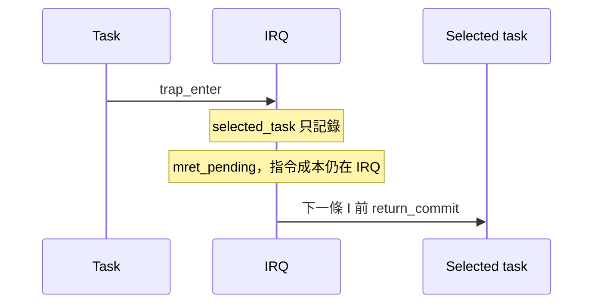

# Context sidecar v1

獨立 JSONL，不改 PSF。每筆欄位：`schema=context-event-v1`、`seq`、`event_index`、`phase`、`pc`、`kind`、`task_id`、`cause`、`depth`、`evidence`。

- `seq` 從 0 連續；數字拒絕 bool。缺 task/cause 用 null。
- `before i` 於 raw event i 前生效；`after i` 於 i+1 前生效。`end` 必須是 `before N`，N 為總 raw events。
- `begin` 提供初始 task；`trap_enter` 保存 context。timer cause `0x80000007` → `irq:7`；ECALL 11 → `scheduler_transition`。
- `selected_task` 只保存選擇，不切 context。`mret_pending` 在 mret 指令成本後；下一條指令前的 `return_commit` 才切 context。
- 同一 boundary 必須先提交 return，再處理新 trap。mret 成本仍屬 trap。
- `depth` 是該事件處理後的 stack 深度。真實 nested trap 不接受；`allow_nested=True` 只供 toy fixture。
- 缺 begin/end、未知 task、未配對 return、倒序、fault 或 incomplete capture 都拒絕 exact 結論。
- `validate_context_anchors` 另外核對 raw I row 的 PC 與 ELF opcode；只通過 interval 狀態機不代表實際 trace anchor 已通過。
- `aggregate_costs` 接受完整、無重疊 interval coverage，標記 `supplied_intervals`；runner 仍須完成 context 品質、anchor、PSF identity 與 parity 驗證。

