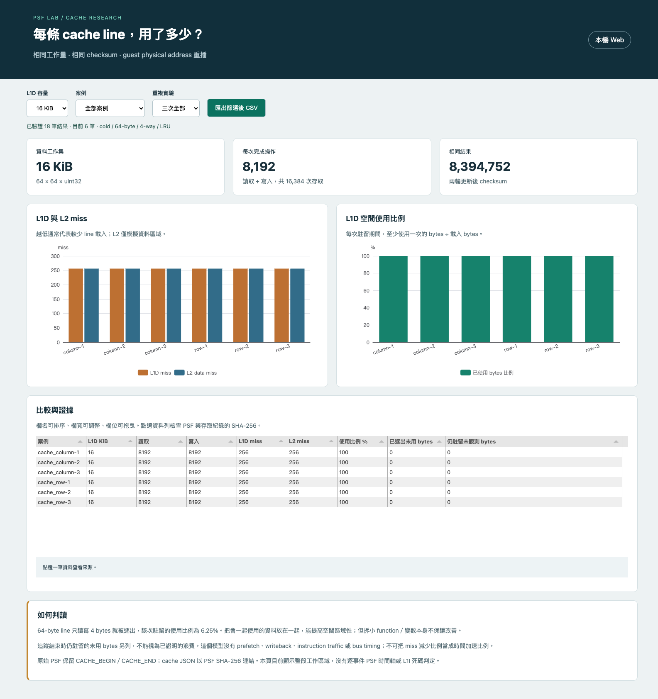
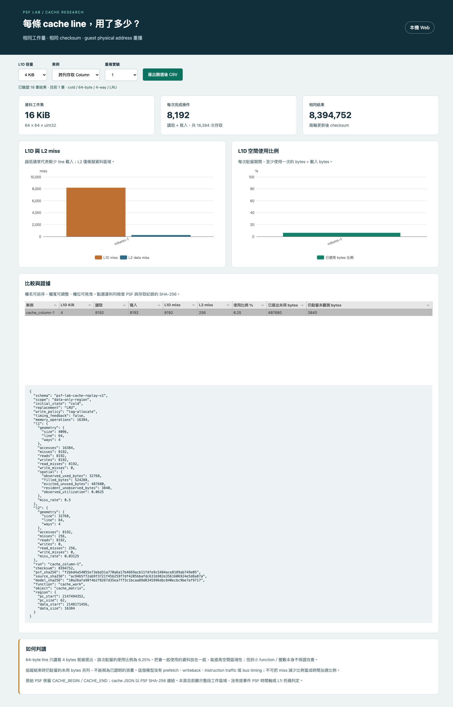

# Cache 相對最佳化：操作與內網還原

這輪已完成 data-region L1D／L2 模型、手算 unittest、六次 RV32 FreeRTOS 擷取、三組 geometry、Web 與離線 Dashboard。完整研究：[Cache 效率與 PSF 擴充](research/Cache效率與PSF擴充.md)。

## 看結果

**本機 Web**，從 `poc/` 執行：

```sh
.venv/bin/python -m psf_lab serve --port 8765
```

開啟 `http://127.0.0.1:8765/cache.html`。原 PSF timeline 在 `/`。API 是 `GET /api/cache`。

**離線 HTML**：直接開啟 [cache-comparison.html](../artifacts/offline/cache-comparison.html)，觀看不需要 Python／網路。此頁是 cache 專用工作區，PSF 來源 hash 可在資料列詳情查詢。


4 KiB L1D 下，column 有 8,192 misses、row 有 512。改選 16 KiB，兩者都成為 256。這能看出改善是否依賴工作集超出 cache 容量。






## 本輪新增檔案在哪裡？

| 路徑 | 用途 |
|---|---|
| `tools/cache/addresses.c` | QEMU guest physical data 存取擷取器，API 7 |
| `tools/cache/run.py` | 建置兩種 firmware、各跑三次、驗證並重播；可匯出 HTML |
| `tools/cache/verify.py` | 實際 curl integration、agent-browser E2E、CSV 與截圖 |
| `tools/cache/verify_restore.py` | 乾淨目錄解壓、逐檔 hash、重播與可選重新模擬 |
| `tools/cache/package.py` | 封裝 source、SDK／FreeRTOS 依賴、raw evidence 與離線 viewer |
| `src/psf_lab/cache_model.py` | LRU tag 模型與 byte-use 統計 |
| `src/psf_lab/cache_report.py` | 身分／hash／工作量驗證、Web dataset、HTML 匯出 |
| `firmware/app/cases/cache_*` | 同 checksum 的 row／column workload |
| `third_party/qemu-cache/` | 官方 cache.c、plugin API header、授權及來源 hash |
| `references/cache/PolyBenchC/` | 固定版本 GEMM 參考程式與授權；尚未移植執行 |
| `runs/cache-relative-v3/` | 六次 ELF、map、PSF、oracle、access CSV、分析、manifest |
| `artifacts/restore/` | 內網還原 source archive 與 SHA-256 |
| `artifacts/verification/cache-replay/` | 測試、curl、browser 驗收、還原檢查 |

## 只重播已收集資料：不需要 QEMU 或 GCC

把 [source archive](../artifacts/restore/cache-replay-source.tar.gz) 與 [archive hash](../artifacts/restore/cache-replay-source.json) 一起帶到內網。先核對 archive SHA-256，再解壓至新的空資料夾。包內含 FreeRTOS／SDK source snapshot，不需連線初始化 submodule。

```sh
mkdir cache-replay
cd cache-replay
tar -xzf /path/to/cache-replay-source.tar.gz
PYTHONPATH=src python3 tools/cache/run.py --output runs/cache-relative-v3 --replay-only
PYTHONPATH=src python3 -m unittest discover -s tests/unit -p test_cache_model.py
```

重播會先驗證全部 evidence 的 hash、case 身分與工作量，才更新衍生 analysis。`analysis-receipt.json` 記錄重播模型 SHA-256；原 capture `suite.json` 不改寫。

`RESTORE-SHA256.json` 列出每個封裝檔的 hash。archive 是資料與 source 還原包，未包含 QEMU／GCC host 執行檔或 Python wheels；本次驗證是同機乾淨目錄還原，不宣稱跨 OS 驗證完成。

## 重新執行模擬：需要本機工具

工具版本見 `tools/toolchain-lock.json`：QEMU 11.1.2、API 7 header、RISC-V GCC 15.2.0-1；另需 C compiler、pkg-config、GLib headers。`--toolchain` 指向內網已安裝工具目錄，不需沿用原使用者路徑。

```sh
PYTHONPATH=src python3 tools/cache/run.py \
  --toolchain /path/to/riscv-toolchain/bin \
  --qemu /path/to/qemu-system-riscv32 \
  --output runs/local/cache-replay-new
```

輸出資料夾必須尚不存在，避免覆寫歷史紀錄。指令重新建置 plugin 與兩種 firmware、各執行三次、收集 PSF／CSV、核對 checksum、產生三組 geometry 比較。完整 QEMU 命令保存在 run manifest；應用程式程式碼與模型 source hash 保存在 suite receipt。

官方原版 cache plugin 另保存在 `third_party/qemu-cache/cache.c`，本輪使用 `tools/cache/addresses.c` 收集 guest physical data，避免上輪 instruction host address 語意混用。舊 smoke 數字與新 data-only 結果涵蓋範圍不同，不能直接作 A/B。

## 匯出新版離線 HTML

source archive 已附可用的 cache Web assets，可直接重播並匯出：

```sh
PYTHONPATH=src python3 tools/cache/run.py \
  --output runs/cache-relative-v3 --replay-only \
  --export-html artifacts/offline/cache-comparison.html
```

若修改 JS／CSS，在完整 Git checkout 重新執行 `npm --prefix web ci`、`npm --prefix web run build`，再匯出。快照包附的是本輪已建置 assets；完整前端重建來源與 lock 在 Git repo 的 `web/`。

## 驗證

```sh
.venv/bin/python -m unittest discover -s tests/unit
.venv/bin/ruff check src tools/cache tests/unit/test_cache_model.py tests/unit/test_cache_report.py
# Server 在 8765 執行時：
.venv/bin/python tools/cache/verify.py
# 停止 Server 後，驗證 file://、offline 模式與網路封鎖：
CACHE_MODE=offline .venv/bin/python tools/cache/verify.py
```

## 保留的後續事項

資料拆分 AoS／SoA、GEMM tiling、instruction capture／L1I、PC→ELF→source、hot/cold function 配置、逐 task／PSF 時間同步、PMU→SDK user events、bus／writeback 等尚未完成。現有 Dashboard 能呈現本輪 data-layout 現象，不能自動定位任意產品的所有 cache 問題。

完整 checkout 可執行 `.venv/bin/python tools/cache/verify_restore.py --rebuild` 重跑本輪還原驗證；`--toolchain` 可覆寫 GCC 目錄。
