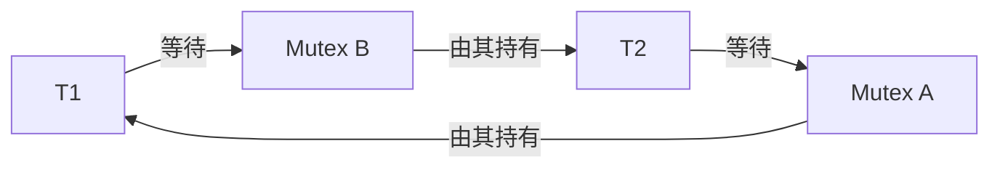

# 真實 RISC-V／FreeRTOS 對照案例

七配置各三次，21/21 完成並通過獨立 oracle／PSF assertions；每輪三組比較共9/9通過。異常案例的 pass 表示「預期重現異常」，不代表系統沒有問題。

## Queue：用 ID 核對資料有沒有遺失

Producer priority2、consumer3、queue length4，傳送0..15。PSF queue send／receive成功事件與應用SEND／RECEIVE ID、RAM oracle共同核對。Consumer可能先被喚醒，RECEIVE文字marker早於producer的SEND marker，必須看kernel操作和ID，不能只靠文字順序。

## Logger：工作量相同，排程優先權不同

8輪，worker busy2ticks、logger busy8ticks；coordinator等兩者都完成才啟動下一輪。Logger priority4時先執行，worker回應約10ms；改priority1後worker先完成，回應約2ms。要求每輪改善至少4ticks並保留全部工作量，不能少做工作換取「改善」。精確值與PSF offset見run的oracle、trace與assertions。

## Priority inversion：binary semaphore 與 mutex

L2持鎖，H4確認阻塞後放行M3及L。Binary版M先做6ticks，H等待更久；mutex版L繼承priority4，完成2ticks後釋放，H早於M完成取得鎖。PSF保存inherit／disinherit與同一owner，oracle另核對等待、恢復priority2與順序。

## Deadlock：等待環必須有證據

ABBA以barrier確保T1持A、T2持B再取另一把，kernel mutex events形成T1→B→T2→A→T1；supervisor在20ticks核對兩者blocked與持有／等待狀態，寫出deadlock outcome並正常結束capture。Host timeout不是驗收成功。

修正版兩者都A→B，開始前共同放行；取消「各持第一把後等對方」的barrier。兩個worker均完成並釋放鎖。缺hold／wait、loss或只有靜默時間均不足以證明deadlock。

## 三輪證據

| 輪次 | 配置 | 事件數 | 驗收 | 原始資料入口 |
|---|---|---:|---|---|
| 1 | queue_baseline | 281 | pass | [證據](../runs/suite-20261003T080440Z-ed4c40bb08/20261003T080442Z-queue_baseline-c8216dfb90/manifest.json) |
| 1 | logger_bad | 287 | pass | [證據](../runs/suite-20261003T080440Z-ed4c40bb08/20261003T080449Z-logger_bad-0a4693348d/manifest.json) |
| 1 | logger_fixed | 310 | pass | [證據](../runs/suite-20261003T080440Z-ed4c40bb08/20261003T080457Z-logger_fixed-3794ccc2d6/manifest.json) |
| 1 | inversion | 105 | pass | [證據](../runs/suite-20261003T080440Z-ed4c40bb08/20261003T080505Z-inversion-7558d028ca/manifest.json) |
| 1 | inheritance | 109 | pass | [證據](../runs/suite-20261003T080440Z-ed4c40bb08/20261003T080510Z-inheritance-b5b6d8e2b4/manifest.json) |
| 1 | deadlock_abba | 84 | pass | [證據](../runs/suite-20261003T080440Z-ed4c40bb08/20261003T080515Z-deadlock_abba-3f217b5e8a/manifest.json) |
| 1 | ordered_locks | 77 | pass | [證據](../runs/suite-20261003T080440Z-ed4c40bb08/20261003T080520Z-ordered_locks-9fc9913daf/manifest.json) |
| 2 | queue_baseline | 281 | pass | [證據](../runs/suite-20261003T080440Z-ed4c40bb08/20261003T080524Z-queue_baseline-f558ca69e2/manifest.json) |
| 2 | logger_bad | 287 | pass | [證據](../runs/suite-20261003T080440Z-ed4c40bb08/20261003T080529Z-logger_bad-f20995b91f/manifest.json) |
| 2 | logger_fixed | 310 | pass | [證據](../runs/suite-20261003T080440Z-ed4c40bb08/20261003T080538Z-logger_fixed-9fd1e45ea8/manifest.json) |
| 2 | inversion | 105 | pass | [證據](../runs/suite-20261003T080440Z-ed4c40bb08/20261003T080545Z-inversion-ba320cf818/manifest.json) |
| 2 | inheritance | 109 | pass | [證據](../runs/suite-20261003T080440Z-ed4c40bb08/20261003T080551Z-inheritance-415875e57e/manifest.json) |
| 2 | deadlock_abba | 84 | pass | [證據](../runs/suite-20261003T080440Z-ed4c40bb08/20261003T080600Z-deadlock_abba-b40f50d96a/manifest.json) |
| 2 | ordered_locks | 77 | pass | [證據](../runs/suite-20261003T080440Z-ed4c40bb08/20261003T080606Z-ordered_locks-c787deccab/manifest.json) |
| 3 | queue_baseline | 281 | pass | [證據](../runs/suite-20261003T080440Z-ed4c40bb08/20261003T080612Z-queue_baseline-f8d9f0b2ab/manifest.json) |
| 3 | logger_bad | 287 | pass | [證據](../runs/suite-20261003T080440Z-ed4c40bb08/20261003T080617Z-logger_bad-e90ed4a2e3/manifest.json) |
| 3 | logger_fixed | 310 | pass | [證據](../runs/suite-20261003T080440Z-ed4c40bb08/20261003T080624Z-logger_fixed-53103e02b3/manifest.json) |
| 3 | inversion | 105 | pass | [證據](../runs/suite-20261003T080440Z-ed4c40bb08/20261003T080631Z-inversion-2d215c856f/manifest.json) |
| 3 | inheritance | 109 | pass | [證據](../runs/suite-20261003T080440Z-ed4c40bb08/20261003T080637Z-inheritance-b77194feaf/manifest.json) |
| 3 | deadlock_abba | 84 | pass | [證據](../runs/suite-20261003T080440Z-ed4c40bb08/20261003T080642Z-deadlock_abba-06bf4b86f0/manifest.json) |
| 3 | ordered_locks | 77 | pass | [證據](../runs/suite-20261003T080440Z-ed4c40bb08/20261003T080647Z-ordered_locks-6eb9a38d31/manifest.json) |

[Suite index](../runs/suite-20261003T080440Z-ed4c40bb08/index.json) 保存全部attempts與9個pair結果。每個run含raw PSF、oracle、trace JSON、assertions、ELF/map、展開hooks與完整命令。CSV及Dashboard圖片由M3補上。

## 適用範圍

結果對固定工具鏈、single-core QEMU icount、明確受控工作量成立。不能換算成產品晶片的CPU loading、UART吞吐、cache stall或bus latency。新增cache相對最佳化安排在M3之後。
