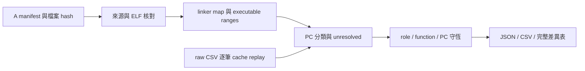
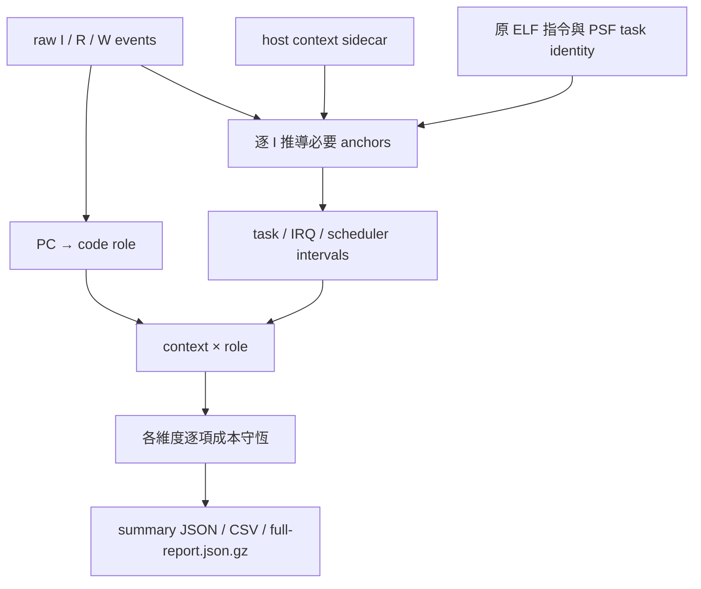

# B：程式碼與執行上下文的成本歸屬

狀態：B1 已完成 16 份重播與成本守恆核對；B2 已完成 8 次探索、24 次正式與 6 次 host overhead；UI 回歸已於 2026-10-09 通過；發佈狀態見 completion 收據。

## 如何使用 B1

在 POC 根目錄，使用現有 `.venv` 與 `.tools`：

```sh
.venv/bin/python tools/tcp/analyze_cost_attribution.py \
  --runs runs/tcp-workload-matrix-v1 \
  --output artifacts/local/my-cost-attribution
```

輸出目錄必須不存在。輸入固定為 A01～A08 的 baseline／pbuf，共 16 份 injection repeat 1；不重新編譯或執行 guest。每一筆 raw event 都會用相同 cache model 重播核對成本。



## 輸出檔案

| 檔案 | 用途 |
|---|---|
| `Axx-variant/report.json` | 各角色、函式、PC、context 與交叉表的完整成本、分母與比例 |
| `Axx-variant/report.csv` | 上述各維度的完整數值；不裁成 top-N |
| `Axx-variant/ranges.json` | 半開位址區間、symbol aliases、來源、分類規則與證據 |
| `Axx-variant/evidence.json` | 原始 capture、ELF/map/build log/tool hashes、audit 與量測 |
| `Axx-variant/{readelf,nm,addr2line}.txt` | 原始 binutils 輸出，供內網核對來源與反組譯 |
| `deltas.json`、`deltas.csv` | 每個 workload 的 pbuf − baseline，包含所有角色與函式 |
| `completion.json` | 16 份報告 hash、B1 狀態與 A02 差異；不代表 B2 完成 |

## 如何解讀

- `memory_cycles` 是五項模型成本之和。`model_service_ns = 2 × memory_cycles`。
- `accounted_model_ns = instructions + model_service_ns`。只在 `I` event 計一次指令。
- `shares` 保存 numerator、denominator、percent；分母包含 unresolved，零分母回 null。
- shared libc/newlib/libgcc 歸 `runtime_library`。不能由函式名稱推測 caller。
- `recorder` 是 SDK 程式碼及 stream adapter 的 self-cost。它不包含完整 recorder 開／關的 cache/layout 因果差異。
- B1 所有 context 都是 `unknown`，原因為 `not_observed_in_A_trace`。PSF 任務名稱不能補成缺少的逐事件 task ID。
- control 的成本是 `shadow_model`，不能當成 guest elapsed 或產品 CPU utilization。
- 各維度是同一批成本的不同分類方式；不能把 role 總量和 context 總量相加。

## A02 反例

保存資料已確認：指令差 −3,992、memory cycles 差 +4,731。因此 raw accounting 差為 `−3992 + 2×4731 = +5470 ns`。guest mtime 差為 +5500 ns，兩者的 capture 邊界差為 30 ns，沒有把這個差額擅自分攤到函式。

baseline／pbuf 的 `session_task` 分別位於 `0x8000344c`／`0x8000347a`。這是 layout 線索，尚未以固定 layout 的成對實驗證明變慢原因。完整分類結果驗收後，再以 role/function delta 說明成本增加的位置。

## 後續界線

B2 要以相同 ELF 收集 host context sidecar，通過 raw／PSF／packet／mtime parity 才能歸屬 task 與 IRQ。C 再把結果接到 Web 與離線 HTML 的熱點／時間軸。這份報告沒有新增 Dashboard 功能。

規格見 [B 設計](design/cost-attribution-b.md)，執行項目見 [B 實作計畫](plans/12-cost-attribution.md)。

## B1 驗證結果（2026-10-08）

[完整收據](../artifacts/verification/cost-attribution/b1/completion.json)保存 16 份報告 hash。每筆 raw event 都重新核對 cache model；所有角色、函式、PC、context 與交叉表成本皆守恆。B1 沒有新增 guest 模擬。

A02 的 pbuf − baseline：

| Code role | 指令差 | Memory cycles 差 | Accounted model ns 差 |
|---|---:|---:|---:|
| application_harness | −184 | +11,371 | +22,558 |
| lwip | −3,808 | −6,588 | −16,984 |
| kernel_port | 0 | −18 | −36 |
| observer_entry | 0 | −26 | −52 |
| recorder | 0 | 0 | 0 |
| runtime_library | 0 | −8 | −16 |
| **合計** | **−3,992** | **+4,731** | **+5,470** |

主要成本增加位於 application_harness，其中 L1I service cost 增加 11,315 cycles。這是成本位置；尚未證明 layout 是因果。lwIP 總成本下降，但 RAM read 成本仍增加 36 cycles，所以完整差異表保留五項 signed cost component，不能只看總量。

分類使用 `88723c3` 已驗收版本中的 map／build log／comparison pins。`timing_observer` 的編譯 object 是 wrapper；明確函式例外依 ELF DWARF 的實際定義位置匹配。一般分類仍使用實體 object 來源，inline origin 不改變 role。

## B2：已驗證的 context 成本

8 次能力探索、24 次正式擷取、6 次主機端 overhead 量測皆完成。所有 capture 使用原 A ELF；raw CSV 的完整內容與順序、封包、PSF object／switch／phase marker、guest measurement 全部通過 parity。完整 raw boundary 重驗也通過；四候選各模式的三次報告完全一致。

[正式擷取](../runs/tcp-context-v1/formal/)與 [24 份 context 報告](../artifacts/verification/cost-attribution/context/completion.json)分開保存。其他 12 個 B1 候選仍為 context unknown。

A02 baseline injection repeat 1：

| Context | 指令 | Memory cycles | Accounted model ns |
|---|---:|---:|---:|
| tcp_session | 341,934 | 1,064,720 | 2,471,374 |
| timer IRQ | 1,033 | 7,562 | 16,157 |
| tcp_observer | 3,192 | 13,875 | 30,942 |
| scheduler transition | 326 | 1,937 | 4,200 |
| **合計** | **346,485** | **1,088,094** | **2,522,673** |

IRQ 中 recorder self-cost 為 **2,326 memory cycles**，保留在 `irq:7 × recorder`。兩個維度各自加總都等於總量，不能再把它們相加。

這些是模型成本份額，不是產品 CPU utilization。guest mtime 為 2,522,900 ns，與 raw accounting 相差 227 ns；此差額保留在 capture 邊界，不分攤到 task。原有 200 ns guard 是 control/injection 的差分驗證，並非這個絕對差額的容差。



`full-report.json.gz` 保留完整 PC／function 結果，使用 Python `gzip.open(..., 'rt')` 與 `json.load()` 即可讀取。`summary.json` 保留 context／role／交叉表與證據。TCB 位址以十進位表示於 `task:<address>`；`task-identities.json` 連回 PSF 的 address、object ID 與 epoch。本輪拒絕 task address reuse 與真實 nested trap。

## Host observer 的量測代價

[六次完整紀錄](../runs/tcp-context-v1/overhead/completion.json)採 A02 baseline injection，同一 ELF，off/on 交錯三對。範圍是 QEMU process launch→exit，排除 build、重播分析與壓縮時間。

| Pair | Off 秒 | On 秒 | 相對變化 |
|---|---:|---:|---:|
| 1 | 0.811038 | 0.774501 | −4.505% |
| 2 | 0.803473 | 0.779715 | −2.957% |
| 3 | 0.764889 | 0.757377 | −0.982% |
| 中位數 | 0.803473 | 0.774501 | −3.606% |

這次短序列中 on 較快；不能據此宣稱 observer 能加速。樣本只有三對、固定 off→on 順序，未隔離主機暖機、排程與其他變異。這是本機 host wall time，不能當成 guest CPU loading，也不足以給產品 overhead 保證。

每次原始 CSV 為 **15,525,597 bytes**，gzip 後 **595,623 bytes**；on 的 sidecar 為 **2,395 bytes**。這是特定 capture 的資料量，並非 UART bandwidth。若要換算傳輸率，必須另指定 capture 時間窗、是否壓縮與傳輸 framing。

## 內網還原與重跑

使用本 POC 的 Git snapshot 與既有 toolchain restore 文件；保留 A commit `88723c3` 的 Git objects，B1 會用它核對 archived map/build log。guest source commit 與 collector source commit 分別記在 manifest。原始命令的絕對路徑保留當時 provenance；以下命令從目前 POC 根目錄產生新路徑，不需要修改舊 manifest。

```sh
# 單一候選能力探索，不重編 guest；輸出必須不存在
.venv/bin/python tools/tcp/run_context_capture.py \
  --source-runset runs/tcp-workload-matrix-v1/A02-baseline \
  --output runs/local/my-context-probe/A02-baseline --repeats 1 --context on

# 既有完整 probe gate → 24 次新的正式擷取
.venv/bin/python tools/tcp/run_context_batch.py \
  --probe runs/tcp-context-v1/probe --output runs/local/my-context-formal

# 重新產生 24 份 context 報告
.venv/bin/python tools/tcp/analyze_context_batch.py \
  --formal runs/tcp-context-v1/formal --output artifacts/local/my-context-reports
```

擷取要求 Git clean，輸出先放 ignored `runs/local/`；完成後搬入正式目錄、核對 relative file hashes，再 commit。`manifest.json` 保存來源、工具、ELF、boundary、plugin 與每份 raw/PSF 檔案 hashes。既有 A analyzer 現在同樣能以 capture commit 的 Git blob 核對歷史來源，原 hash 比對仍保留。

## 本輪驗收與剩餘事項

- Python：292 tests 通過；Node：10 tests 通過；Ruff 與 19 個本輪 Python 檔案格式檢查通過。
- B1／B2 獨立 review 的 Important 問題已修正，包括 partial overlap、完整成本分量、漏失／延後 anchors、空 probe gate、report 的 exact／provenance 檢查。
- **歷史失敗紀錄，已於 2026-10-09 重驗通過：**前回合 sandbox 拒絕 localhost port 與 agent-browser Unix/stream socket 綁定，均回報 `Operation not permitted`。curl exit 7；agent-browser exit 1。因此沒有新的 UI 截圖，README 的 A 圖片仍是先前驗收紀錄。
- **發佈狀態以 [completion 收據](../artifacts/verification/cost-attribution/completion.json) 為準。**核心程式與資料完成，不把受阻的 UI／發佈項目標成完成。
- B 不新增 Dashboard 頁面；C1 的兩種 Dashboard 熱點／filter／CSV、C2 時間軸尚未實作。event index 尚未轉成精確 ns timeline。
- B1 loader 的更多 mutation fixture、獨立 B1 CSV 的 metadata，以及 A02 固定 layout 因果實驗仍為研究／測試補強項目。

歷史阻礙（2026-10-08，2026-10-09 已解除並完成 UI 重驗）：目前發佈受阻：POC push 因 DNS 無法解析失敗；root `.git` 禁止寫入，尚未更新遠端 main 的 README／gitlink。完整結果保留在 `artifacts/verification/cost-attribution/publication.json` 與 `root-publication.json`。UI 仍待可建立 socket 的環境重跑；C 熱點／時間軸尚未開始。
