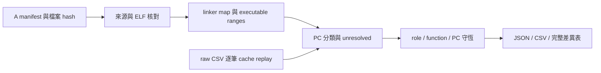

# B：程式碼與執行上下文的成本歸屬

狀態：B1 已完成 16 份重播與成本守恆核對；B2 狀態機與 opt-in observer 已實作，真實擷取尚待驗證。B 整體仍為 partial。

## 如何使用 B1

在 POC 根目錄，使用現有 `.venv` 與 `.tools`：

```sh
.venv/bin/python tools/tcp/analyze_cost_attribution.py \
  --runs runs/tcp-workload-matrix-v1 \
  --output artifacts/local/my-cost-attribution
```

輸出目錄必須不存在。輸入固定為 A01～A08 的 baseline／pbuf，共 16 份 injection repeat 1；不重新編譯或執行 guest。每一筆 raw event 都會用相同 cache model 重播核對成本。



## 輸出檔案

| 檔案 | 用途 |
|---|---|
| `Axx-variant/report.json` | 各角色、函式、PC、context 與交叉表的完整成本、分母與比例 |
| `Axx-variant/report.csv` | 上述各維度的完整數值；不裁成 top-N |
| `Axx-variant/ranges.json` | 半開位址區間、symbol aliases、來源、分類規則與證據 |
| `Axx-variant/evidence.json` | 原始 capture、ELF/map/build log/tool hashes、audit 與量測 |
| `Axx-variant/{readelf,nm,addr2line}.txt` | 原始 binutils 輸出，供內網核對來源與反組譯 |
| `deltas.json`、`deltas.csv` | 每個 workload 的 pbuf − baseline，包含所有角色與函式 |
| `completion.json` | 16 份報告 hash、B1 狀態與 A02 差異；不代表 B2 完成 |

## 如何解讀

- `memory_cycles` 是五項模型成本之和。`model_service_ns = 2 × memory_cycles`。
- `accounted_model_ns = instructions + model_service_ns`。只在 `I` event 計一次指令。
- `shares` 保存 numerator、denominator、percent；分母包含 unresolved，零分母回 null。
- shared libc/newlib/libgcc 歸 `runtime_library`。不能由函式名稱推測 caller。
- `recorder` 是 SDK 程式碼及 stream adapter 的 self-cost。它不包含完整 recorder 開／關的 cache/layout 因果差異。
- B1 所有 context 都是 `unknown`，原因為 `not_observed_in_A_trace`。PSF 任務名稱不能補成缺少的逐事件 task ID。
- control 的成本是 `shadow_model`，不能當成 guest elapsed 或產品 CPU utilization。
- 各維度是同一批成本的不同分類方式；不能把 role 總量和 context 總量相加。

## A02 反例

保存資料已確認：指令差 −3,992、memory cycles 差 +4,731。因此 raw accounting 差為 `−3992 + 2×4731 = +5470 ns`。guest mtime 差為 +5500 ns，兩者的 capture 邊界差為 30 ns，沒有把這個差額擅自分攤到函式。

baseline／pbuf 的 `session_task` 分別位於 `0x8000344c`／`0x8000347a`。這是 layout 線索，尚未以固定 layout 的成對實驗證明變慢原因。完整分類結果驗收後，再以 role/function delta 說明成本增加的位置。

## 後續界線

B2 要以相同 ELF 收集 host context sidecar，通過 raw／PSF／packet／mtime parity 才能歸屬 task 與 IRQ。C 再把結果接到 Web 與離線 HTML 的熱點／時間軸。這份報告沒有新增 Dashboard 功能。

規格見 [B 設計](design/cost-attribution-b.md)，執行項目見 [B 實作計畫](plans/12-cost-attribution.md)。

## B1 驗證結果（2026-10-08）

[完整收據](../artifacts/verification/cost-attribution/b1/completion.json)保存 16 份報告 hash。每筆 raw event 都重新核對 cache model；所有角色、函式、PC、context 與交叉表成本皆守恆。B1 沒有新增 guest 模擬。

A02 的 pbuf − baseline：

| Code role | 指令差 | Memory cycles 差 | Accounted model ns 差 |
|---|---:|---:|---:|
| application_harness | −184 | +11,371 | +22,558 |
| lwip | −3,808 | −6,588 | −16,984 |
| kernel_port | 0 | −18 | −36 |
| observer_entry | 0 | −26 | −52 |
| recorder | 0 | 0 | 0 |
| runtime_library | 0 | −8 | −16 |
| **合計** | **−3,992** | **+4,731** | **+5,470** |

主要成本增加位於 application_harness，其中 L1I service cost 增加 11,315 cycles。這是成本位置；尚未證明 layout 是因果。lwIP 總成本下降，但 RAM read 成本仍增加 36 cycles，所以完整差異表保留五項 signed cost component，不能只看總量。

分類使用 `88723c3` 已驗收版本中的 map／build log／comparison pins。`timing_observer` 的編譯 object 是 wrapper；明確函式例外依 ELF DWARF 的實際定義位置匹配。一般分類仍使用實體 object 來源，inline origin 不改變 role。
