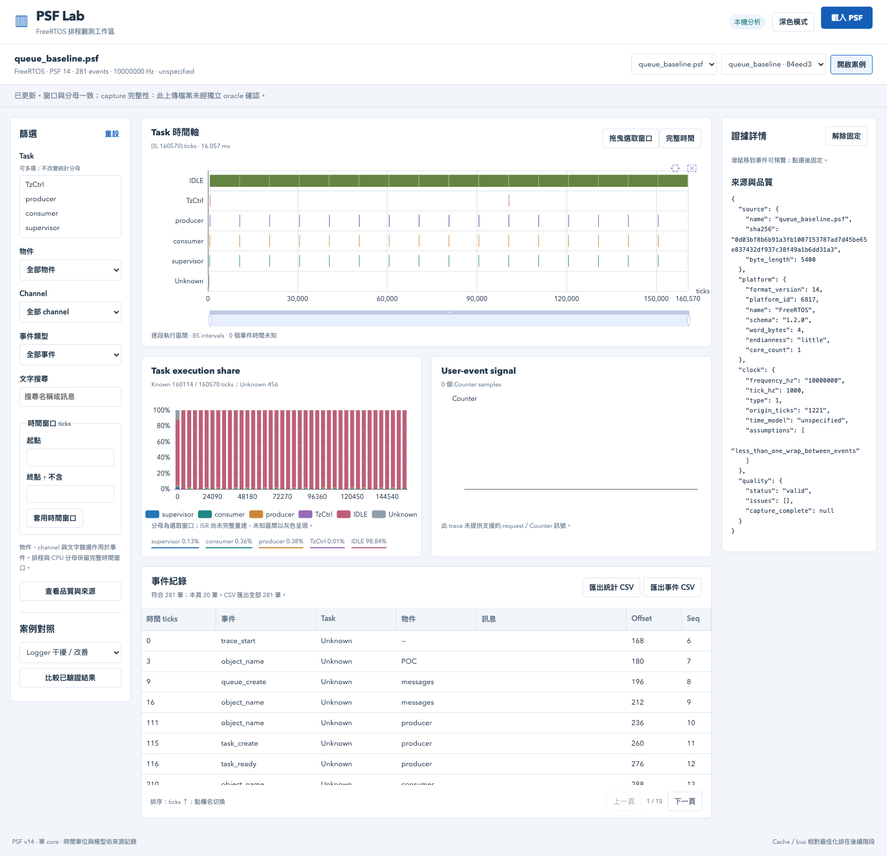
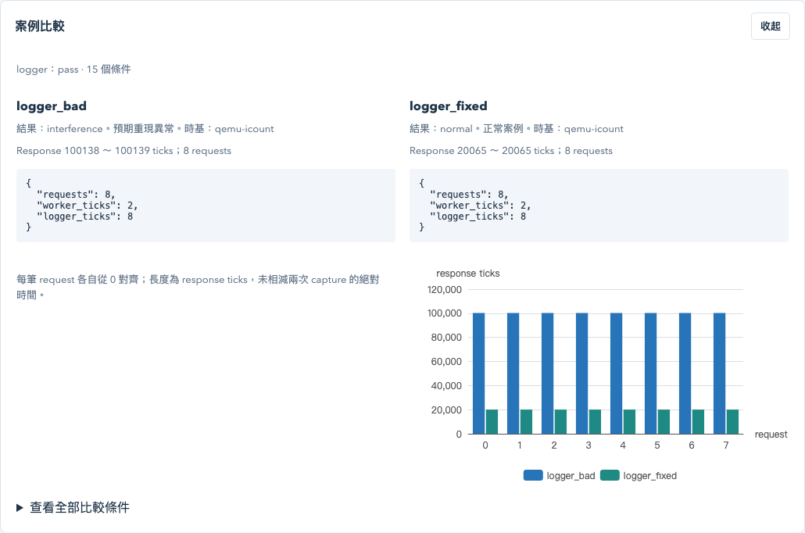
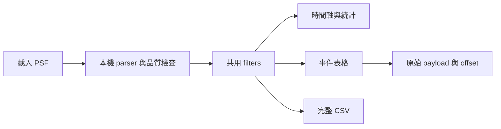

# Dashboard 使用方式

先完成 [README 的安裝](../README.md)，執行 `npm --prefix web ci`、`npm --prefix web run build`，再執行 `.venv/bin/python -m psf_lab serve`。瀏覽器開啟 http://127.0.0.1:8000 。

1. 上方載入 `.psf`，或選已驗證案例後按「開啟案例」。原始檔與解析結果只存本機 `artifacts/local/store`。
2. 左側可選 task、物件、channel、event type、文字與時間。多選 task 可用 Ctrl／Command。時間窗口採 `[start,end)`。
3. 中央 timeline 可滾輪縮放、拖動平移、拖曳選取窗口。左側起點／終點可精確輸入同一窗口，「完整時間」復原。
4. CPU 圖保留完整窗口作分母；隱藏 task 不會把其餘 task 重新縮放成 100%。Idle 是一個 task，Unknown 另列；ISR 尚未完整重建。
5. 滑鼠移到事件可預覽原始資料，點選後固定右側 details；包含 raw payload、offset、actor 與 object。品質按鈕可追查來源 SHA-256 和限制。
6. 表格欄名點選排序、欄位邊界拖曳調寬、欄名拖曳換位置。每頁 20 筆，CSV 匯出所有符合資料，排序與目前 filter 相同。
7. 左下三組案例對照使用有 manifest 與 oracle 的結果；異常案例的 pass 代表成功重現異常。Logger 圖將每筆 request 起點各自對齊 0，比較 response duration。

物件／channel／事件／文字 filter 作用於事件和 user signal；時間作用於所有 views，task 作用於 timeline lanes 與 requests。統計分母始終是完整排程窗口。視圖聚合會標示模式與原始區間數；表格與 CSV 保留完整原始事件。

單檔限制 16 MiB／200k events，本機 store 最多 20 traces。空資料、截斷與未知頻率會顯示品質，不填入假數字。PSF 重新上傳不帶獨立 oracle，因此 capture 完整性顯示未確認；比較頁會重新核對正式 run。API 見 [server-api.md](server-api.md)，統計語意見 [query-semantics.md](query-semantics.md)。

本版尚未提供離線 HTML 匯出、SMP／ISR 完整重建、所有 Tracealyzer views、cache／bus 模型。後續 cache 相對最佳化見 [M4 計畫](plans/04-cache-relative-optimization.md)。
