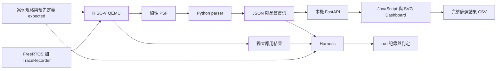

# PSF Lab 設計規格

日期：2026-10-03。狀態：**使用者閱讀規格後要求撰寫實作計畫；設計作為本輪計畫依據，尚未實作產品**。

目標：用真正的 FreeRTOS＋TraceRecorder 在 RISC-V 模擬器產生正常／異常案例 PSF，Python 解析、驗證並供本機互動 Dashboard 使用。工作位置固定為 `~/git/percepio/poc`，所有新文件與執行證據存入此 Git 專案。

## 1. 已確認與工程提案

使用者已確認 PSF 輸入、SVG＋專業 JavaScript、先本機 Python 服務、以後離線 HTML、不買 Tracealyzer、Python 加入 unittest 與 Ruff。PDF／產品圖片供研究參考。原始碼與硬體才能回答的產品問題保留至內網階段。

推薦 **FastAPI＋Uvicorn、JavaScript ES modules、ECharts SVG、Tabulator**。Python 集中解析與查詢，前端保留獨立資料介面，方便之後換成離線資料來源。Dash／Panel 能快速建立 Python 視圖，但任意新 trace 的離線運算需另外處理；純靜態第一版則不符合已選的本機 Python 服務。套件固定版本與 license 清單在實作時依實際安裝驗證。

第一版完成一條端到端流程及七個執行配置；商用工具的全部功能、SMP、ring RAM dump、任意舊版 PSF、雲端多人服務與離線 HTML 不納入第一版完成宣稱。

## 2. 架構與證據流

[架構 SVG](../research/images/psf-lab-architecture.svg) 提供 Mermaid 不支援時的備用圖。

Parser 保留原始資料、語意解碼與品質；analyzer 建立執行區間及統計；harness 比對獨立預期；service 提供查詢；frontend 管理互動。任一圖表都能回查事件 offset、schema、run 與原始 PSF hash。

## 3. 模擬環境與 SDK 接合

建議從官方 `RISC-V_RV32_QEMU_VIRT_GCC` 起步：FreeRTOS tag `202411.00`，parent commit `152cf36d6775bce6026a791845af12201aae703d`，kernel commit `dbf70559b27d39c1fdb68dfb9a32140b6a6777a0`。使用本次已下載主 SDK，與 desktop demo SDK 分開保存版本與 hash。

先在目前 macOS arm64 建置原生環境。QEMU 與 RISC-V GCC 的實際版本、下載 URL／hash、compiler flags、ABI、libc、multilib 寫入工具清單。研究中的 QEMU 8.2.2 是來源核對版本；新安裝版本需重新確認機器與 timer 行為，不能沿用未驗證參數。

從 RV32IMAC／ILP32、單 hart、M-mode 開始。先跑官方最小 demo，再加入 TraceRecorder hooks、include、設定與初始化並重編 kernel。優先使用 SDK 提供的 FreeRTOS hooks，只有實際相容性證據要求時才提出 kernel patch，並保存 diff／理由。

先校正 guest `mtime` frequency 與 FreeRTOS tick，再讓 recorder timestamp 使用同一個已驗證時基。避免直接使用範例 25 MHz／SDK 16 MHz 常數。記錄 hi-lo-hi 的 RV32 64-bit timer 讀法、wrap 策略、tick 換算及無法辨識多次 wrap 的限制。

第一個 capture 方案採專用 stream port，透過 QEMU semihosting 寫出**單一線性 binary PSF**。console／應用 oracle 分開輸出；停止前 drain、close、確認完成 marker，再退出模擬。semihosting 的 trap 成本需標示，不能視為實體 UART 成本。若建置證明不可行，記錄失敗並比較專用 UART capture，不能無聲換成 ring RAM dump。

每次 QEMU 有 host timeout；故障案例由 supervisor 在指定 guest 窗口結束。`icount` 只用於控制與重複虛擬時間，不能稱為晶片 cycles 或產品 CPU overhead。

## 4. Parser 與 JSON 契約

第一版支援已確認的 streaming PSF v14：既有 little-endian 64-bit desktop `0x1FF1 / my_krnl / 1.0.0`，以及新 RV32 FreeRTOS `0x1AA1 / FreeRTOS / 1.2.0`。兩者事件表分開派送；事件 ID 相同不代表語意相同。其他 endian／版本／封裝先回報不支援，保留來源，不能猜解。

JSON 以 `schema_version` 管理，包含 `source`、`platform`、`clock`、`objects`、`events`、`quality`、`derived`。每個事件保留 byte offset、原始 ID／payload、sequence、timestamp、core、解碼結果與警告。64-bit handle 與完整 tick 值採字串；前端相對時間必須先檢查精度範圍。

物件識別包含 address＋lifetime epoch，避免地址重用混成同一個 task。sequence gap、restart、truncation、未知事件與 clock 不確定性分別記錄。字串到 NUL 截止，padding 保留 raw；不執行來源格式字串。輸入長度、table count、symbol length 與配置上限均驗證。

Harness 採 strict：無法支持斷言時回報失敗或 indeterminate，不能通過。Dashboard 可讀取有效前段，但顯示受影響窗口與限制。沒有 gap 只能證明沒有觀察到 gap，不能保證完整性；完成 marker 與獨立應用結果仍必要。

## 5. 七個案例與判定

| 配置 | 可控制條件 | 獨立預期與 PSF 對照 |
|---|---|---|
| queue baseline | 固定數量、唯一 message ID、producer／consumer | 收送計數與 ID 一致、完成 marker、合法生命週期 |
| logger 干擾 | 固定 request 與可控制 logger 工作 | request 邊界與結果對照搶佔、response time |
| logger 改善 | 相同 request，調整 logger 排程／工作 | 結果不變；在預定虛擬窗口比較延遲，保留分母 |
| inversion | binary semaphore、H／M／L 啟動順序受控 | H 等 L、M 延後 L；不應出現 mutex 繼承語意 |
| inheritance | 改 FreeRTOS mutex，同一受控工作量 | 優先權繼承及排程變化可追查，H 最終完成 |
| ABBA deadlock | barrier 確認各持第一把鎖，再要第二把 | 兩條已知等待關係形成環；supervisor 回報超時 |
| ordered locks | 一致鎖順序，維持同一工作目的 | 工作完成、持鎖／等待事件能對照 |

預期值先寫在 `cases/`，由應用自己的 ID／計數／狀態輸出 oracle；不使用 decoder 輸出生成 expected。精確窗口及工作量在實作計畫中依校時結果設定，不能為了讓測試通過事後改 oracle。三組對照須重跑並記錄一致性；異常案例符合預期時 harness 可通過，但 UI 必須標成「預期重現異常」。

## 6. 本機服務與互動 UI

綁定 `127.0.0.1`，資料存本機，以檔案 ID 查詢；不接受任意 filesystem path。上傳 PSF 後取得 trace ID、解析狀態與品質摘要，再讀 events、intervals、metrics、objects。查詢使用一致的 filter 結構：時間窗口、task、object、channel、event type、文字搜尋及排序。

畫面以時間線為主：上方載入／case 比較／品質，左側 filters，中間 overview brush 與 task lanes，下方 event table，右側可固定的事件詳細資訊。支援 hover、區間選取、縮放／平移、reset、表格排序、欄寬與欄位移動。

ECharts 明確使用 SVG renderer。大量事件採 viewport、分 lane 與概覽聚合；畫面說明聚合尺度與資料數量，原始事件保留表格／查詢入口。實測 SVG DOM 與互動耗時後再訂顯示預算；不默默改成 Canvas。

隱藏 task 只影響顯示，不能刪除它在排程中的時間或改變 CPU 分母。窗口以半開區間 `[start, end)` 定義並裁切 interval。完整排程證據不足時顯示 unknown coverage，不能填入 0%。task execution share 與含 ISR 的整體 CPU utilization 使用不同名稱，第一版未重建 ISR 時不得聲稱後者。

CSV 使用與畫面相同的 filter／sort，匯出**所有符合的資料**，不只目前分頁。事件 CSV 與統計 CSV 分開提供，保留時間單位、schema、source hash 與品質欄位。原始字串採正確 quoting；試算表公式開頭需提供安全匯出處理並標記轉換策略。

前端由 `DataSource` 介面取資料，第一版實作 HTTP adapter；未來才加入 embedded JSON／離線 adapter。靜態套件置於本地、保留 license，執行 Dashboard 不依賴 CDN。

## 7. 驗收與完成定義

1. `unittest` 覆蓋 header／metadata／event、兩種 schema、truncation、unknown、wrap、gap、precision、lifecycle、filter／CSV 及分析窗口。語意 expected 來源可追查。
2. `ruff check .` 與 `ruff format --check .` 通過；上游來源及產生檔排除，不能用 Ruff 改寫 SDK。
3. 七個配置有真實 QEMU 執行、PSF、oracle、JSON、harness 結果、版本與 hash；依賴缺失／skip 不算完成。
4. 瀏覽器實際操作驗證 SVG、hover、filters、brush、縮放、表格三種操作、空資料／缺漏狀態及完整 CSV。Python 測試不能替代 UI 驗收。
5. 固定的小型與大量事件 fixture 記錄解析耗時、記憶體、SVG 元素及互動延遲，附 host、資料量與方法；未測量前不承諾 FPS。
6. README、研究主張與結果對照、失敗紀錄及內網接續事項同步更新。新增 Python 必須帶有測試與 Ruff 結果；文件初始化階段不宣稱這些產品測試已通過。

每個 run 的必要欄位見 [執行紀錄規範](../../runs/README.md)。成果保留原始資料與可重跑命令，任何不符預期都能從圖表追到 PSF 與 firmware commit。

## 8. 研究依據

- [PSF 欄位、probe 與解碼限制](../research/PSF格式與解析研究.md)
- [RISC-V、timer、capture 與來源版本](../research/RISC-V模擬環境研究.md)
- [UI 功能、官方圖片、套件與操作驗收](../research/Dashboard功能與設計研究.md)
- [FastAPI 上傳](https://fastapi.tiangolo.com/tutorial/request-files/)、[靜態檔案](https://fastapi.tiangolo.com/tutorial/static-files/)
- [ECharts SVG](https://echarts.apache.org/handbook/en/best-practices/canvas-vs-svg/)、[Tabulator](https://tabulator.info/docs/6.3)

使用者已要求進入實作計畫階段；見 [實作計畫入口](../plans/README.md)。Q1／Q2 與 POC 路徑不再詢問；本輪完成計畫，執行方式尚未選定。

## 補充：CPU 與 cache／bus 需求

2026-10-03 使用者確認 Dashboard 須參照 Tracealyzer 多種分析功能，不限 CPU 百分比。第一版必須呈現 task execution share、完整窗口分母、unknown coverage、request execution／response 與案例對照。ISR 尚未完整重建時，介面必須標示其限制。Cache／bus 額外資料源與研究邊界见 [補充研究](../research/Cache-Bus與CPU使用率.md)，未量到的欄位不可填 0。
