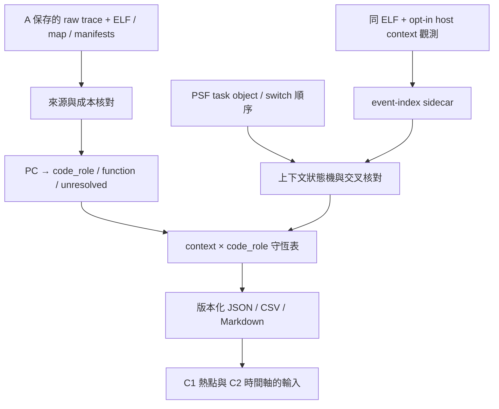
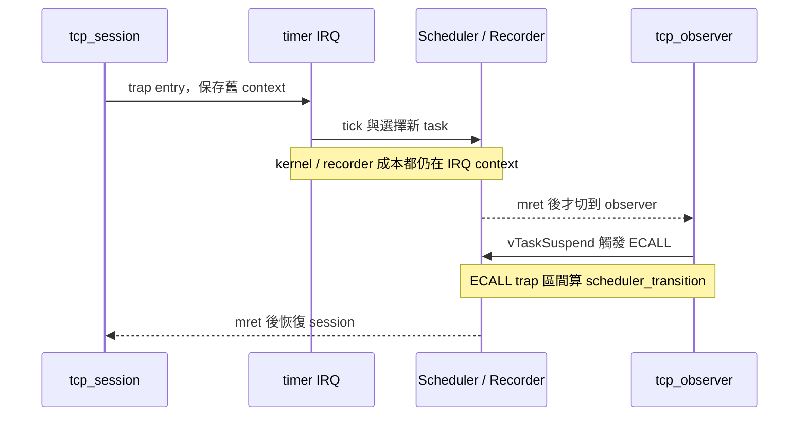

# B：成本歸屬設計規格

日期：2026-10-07。狀態：**已完成來源盤點與設計，待使用者審閱；尚未新增 B 分析器、plugin 功能或模擬結果。**

## 目的與已確認需求

接續 A → B → C。B 回答「成本花在什麼程式碼、當時誰在執行」，讓公司內網可以對照自己的原始碼；C 再做函式熱點與時間軸。A02 的變慢是第一個要解釋的反例，不能只展示改善案例。

沿用 L1I 8 KiB、L1D 8 KiB、L2 32 KiB、64-byte line、4-way、LRU、write-through/write-allocate、-Os、RV32 單核心。模型仍為 1 ns/instruction + 2 ns/memory cycle；這些值可作相同模型下的相對比較。

保留原始 capture、來源與工具 hashes、ELF/map、PSF、raw trace、失敗紀錄。Python 用 unittest／Ruff，Web／離線操作用 agent-browser，HTTP 用 curl。跨機驗證依既有決定暫緩。

目前核對的版本：root `768177a`、POC `88723c3`；兩個工作目錄開始時皆乾淨。A 完成收據記載 96 次正式執行與 251 個 Python tests；本次沒有重新執行這些測試。

## 來源盤點與具體發現

| 證據 | 已確認內容 | 對 B 的影響 |
|---|---|---|
| [raw trace producer](../../tools/tcp/live_cache.c) | 欄位為 PC、address、size、operation、五項成本，沒有 task ID／timestamp；CLINT MMIO 另記 log，未納入 RAM 成本 | 舊資料能做 PC self-cost，不能直接產生精確 task 時間 |
| [既有 replay](../../src/psf_lab/tcp_hotspots.py) | 已有 function/PC 指令數、memory cycles 與 3C counters；stack window 含搶占 | B1 可接既有結果，但不可把 stack window 當 task-exclusive |
| [IRQ/PSF 校驗](../../src/psf_lab/live_cache_irq.py) | 核對 PSF task switch 順序、observer 與 mtime，無逐 access 時間 | PSF 可交叉核對上下文，無法單獨提供 raw event 對時 |
| [FreeRTOS trap](../../third_party/FreeRTOS/FreeRTOS/Source/portable/GCC/RISC-V/portASM.S) 與 [restore macro](../../third_party/FreeRTOS/FreeRTOS/Source/portable/GCC/RISC-V/portContext.h) | trap 入口、mcause 分支、pxCurrentTCB、mret 可定位；IRQ 與 ECALL 共用入口 | 不能把所有 trap 都算 ISR；task switch 記錄早於實際 mret |
| [Recorder hook](../../references/baseline/percepio/TraceRecorder/kernelports/FreeRTOS/include/trcKernelPort.h) | traceTASK_SWITCHED_IN 呼叫 xTraceTaskSwitch(pxCurrentTCB, priority) | task handle 可以和 PSF object 對照，recorder 仍可能在 IRQ 執行 |
| [QEMU API header](../../references/qemu-time-control/include/qemu/qemu-plugin.h) 與 [實作](../../references/qemu-time-control/plugins/api.c) | 有 get_registers、read_register、read_memory_vaddr；register read 需 R_REGS，memory read 有未 flush 的注意事項 | 可先研究 host-side 觀測，必須做 runtime 能力與行為一致性測試 |

A02 保存資料的唯讀分析見 [inspection.json](../../artifacts/verification/cost-attribution-design/inspection.json)，含輸入 SHA-256：

| 項目 | baseline | pbuf | 差異 |
|---|---:|---:|---:|
| 指令 | 346,485 | 342,493 | −3,992 |
| memory cycles | 1,088,094 | 1,092,825 | +4,731 |
| 完整 guest 模型時間 ns | 2,522,900 | 2,528,400 | +5,500 |
| session_task self memory cycles | 345,288 | 357,012 | +11,724 |
| session_task 起點 | 0x8000344c | 0x8000347a | 位址不同 |
| 起點在 64-byte line 中的 offset | 12 | 58 | 對齊不同 |

`−3992 + 2 × 4731 = +5470 ns`，與量測差值相差 30 ns。此處只核算保存資料，沒有新增容差或重新通過 IRQ oracle。位址差異是 layout 線索，**尚未以固定 layout 的對照實驗證明因果**。

另發現 `memcpy + memcmp + memset` 約佔 A02 baseline 的 **45.088% self memory cycles**。這些共享函式不能全部算成 lwIP 或 recorder；設計增加 `runtime_library` 類別。`freertos_risc_v_trap_handler` 在 nm 沒有 size，現有報告把部分組語留在 unresolved；B 必須使用 ELF／map 的實際範圍，不能擅自用「到下一個 symbol」填滿空隙。

## 三種方法與建議

| 方法 | 可交付能力 | 代價與限制 |
|---|---|---|
| **建議：B1 重播既有資料；B2 加 host-side context sidecar** | 先完成 code-role 成本，再驗證 task／IRQ／ECALL 上下文，維持同一 guest ELF | 需擴充 QEMU plugin；host wall time 可能增加，必須量測；register/CSR 能力尚待實測 |
| 僅做 B1、用既有 PSF 估算上下文 | 可立即分類程式碼成本 | 舊 trace 沒逐事件時間／task，context 必須保留 unknown；無法完成 B 的 exclusive 目標 |
| 在 guest／FreeRTOS 增加 context hook | 可直接產生 task／IRQ markers | 新增指令、記憶體及 code layout 影響，須重建成對基準；本輪先不採用 |

建議方法先完成 B1。B2 以同一份 A ELF 做 opt-in host-side 觀測，**不修改 FreeRTOS source、guest firmware 或既有 PSF 格式**。若已安裝 QEMU 不能提供必要證據，交付已證明的分類與 unknown 範圍，B2 標為未完成；不自動轉成 guest hooks 或偷偷放寬驗證。

## 輸出是兩個維度

| 維度 | 互斥分類 | 語意 |
|---|---|---|
| context | task:<PSF object ID>、irq:<cause>、scheduler_transition、unknown | 此事件發生時的實際上下文 |
| code_role | recorder、observer_entry、lwip、application_harness、kernel_port、runtime_library、unresolved | 此 PC 所屬程式碼的 self-cost |

`observer_entry` 只指 observer 函式本體。它呼叫 recorder 時，交叉表會是 `task:tcp_observer × recorder`。`memcpy` 的 code_role 是 runtime_library；有了可靠 context 後仍可知道它在哪個 task/IRQ 執行，不能進一步冒稱其 caller 是 lwIP。

在 IRQ 內執行的 kernel/recorder 成本仍留在 IRQ context，透過第二維度區分。ECALL 的 trap entry 到 mret 歸 scheduler_transition；task 呼叫一般 kernel API 且未進入 trap 時仍歸該 task。



## B1：程式碼 self-cost

輸入以 A 的 16 組候選為範圍，使用每組 injection repeat 1 的完整 raw trace、ELF、map 與對應 manifest；control/repeats 的 A audit 保持原樣。不能宣稱新增了 96 次 replay。

1. 驗證必要檔案、來源／ELF／symbols／profile／raw hashes。map 與 attribution rules 另納入 B manifest；不改 A manifest。map 必須符合該 ELF 的可執行 section 地址／大小。
2. 依 ELF/map 的可執行範圍、object/CU provenance 分類。一般 C 函式用定義所在 object/source；compiler inline origin 與實際函式位置分別保留，v1 不另分攤 inline callee。
3. `timing_observer` 使用明確的 symbol + object 例外規則；TraceRecorder、lwIP、FreeRTOS 依已釘選來源路徑；newlib/libgcc archive 用 map 證據歸 runtime_library。`firmware/port/trcStreamPort.c` 是 recorder adapter，需明確列入 recorder 規則；`poc_mark` 等 harness 包裝留 application_harness，不冒稱為 SDK 本體。
4. 相同範圍的 symbol aliases 合併並保留 aliases。衝突角色、重疊不同範圍、零 size 又缺有效 section 邊界時歸 unresolved，附原因；禁止丟棄事件或任意猜測長度。已知 object/section、未知 function 時可解析 role 並保留 function unresolved；丟棄區段與非可執行 section 不得加入 PC 索引。
5. 每個事件只入一個 role／function。所有函式和 role 總和都要等於全域指令與 memory cycles。`I` 才算一條指令；跨 cache line 的 access 次數不能冒充指令數。
6. B1 的 context 標 `unknown`，reason=`not_observed_in_A_trace`。有 PSF 任務名稱仍不能填造逐 access 上下文。

B1 至少保存：每個 role 的 instructions、五項 cost cycles、memory cycles、model service ns、原始分母與百分比、function/PC 證據、unresolved 原因；輸出 A02 全部 role/function delta，不能只留下 top-N 或改善項。

## B2：host-side 上下文觀測

### 新增資料，維持原始成本 stream

沿用既有 raw CSV 欄位與成本計算，新增獨立 `context-events.jsonl`。每筆有 schema、sequence、raw event boundary index、before/after 語意、PC、事件種類、task handle、trap cause／nesting 資訊與 evidence reference。名稱是設計中的介面，尚未實作。

使用同一個 host callback 明確安排 context 更新與 charge 順序，不依賴多個 callback 的未驗證執行順序。sidecar 必須綁定 raw stream digest、ELF hash、boundary config hash、plugin hash、工具版本。

可用的 QEMU API 以 repository header 為準。只在需要的 boundary 讀 register／memory，記錄 read 失敗。不得把缺 register／CSR／task pointer 的結果轉成 0 或猜 task。

### 邊界與狀態機

| 邊界 | 更新規則 |
|---|---|
| capture begin | 在第一個被計費事件前，確認 pxCurrentTCB 與 PSF object。失敗則 context=unknown |
| trap entry | 入口指令前記錄 cause，保存被中斷狀態；timer interrupt 進 IRQ，ECALL 進 scheduler_transition；其他 cause 要有明確分類或 unknown |
| vTaskSwitchContext / xTraceTaskSwitch | 記錄 selected task 作交叉核對；此時仍在 trap，不立刻把後續 restore 成本算給新 task |
| mret | 此指令成本屬退出中的 trap；先保存 pending return。下一條 instruction callback 先提交 return，再處理可能的新 trap entry，最後計費。最外層 return 才套用已驗證 TCB；nested return 恢復 context stack 的外層 trap，不能直接切成 task |
| capture end | 檢查 context intervals 無重疊／缺口、open trap／未完成 restore；不完整時拒絕 exact-context 結論 |



Nested trap 的狀態機用 stack，fixture 要覆蓋返回外層 IRQ 與 mret 後立即 retrap；目前真實 POC 沒有 nested IRQ 的量測證據。B2 v1 真實擷取若偵測到 nested trap，標 unknown 並拒絕 exact-context acceptance；只驗證 fixture 不代表支援真實 nested IRQ。若 context state／cause／恢復 target 無法匹配，保留 unknown 或讓 acceptance 失敗，不宣稱「已驗證任意巢狀中斷」。

sidecar 的 event index 只定義 raw stream 順序。這輪不把它插值成精確 nanosecond timeline；mtime 量測與 PSF timestamp 可作獨立交叉核對，完整時間映射留 C2。

### 擷取範圍與 gate

先對 A02 baseline/pbuf 與 A08 baseline/pbuf 的**既有 ELF**做 control/injection 探索，每個候選執行 control 與 injection 各一次，總共 8 次探索。A02 是反例，A08 覆蓋三個 tick 與較大 request。

通過才做四個候選 × control/injection × 三次重跑，共 **24 次 B2 正式執行**。其他 A workload 先保留 B1 分類，不標成已測到 context；不自動擴成全矩陣 96 次 B2。

Gate：

- 比較對象固定為同 candidate、同 control/injection 模式的 A `enabled-{mode}-1`。解壓後 raw CSV 每一列的 PC/address/size/operation/五項成本及順序必須完全一致；wire packet bytes/方向/順序完全一致。PSF 核對 task object ID/name、switch 順序及 timestamp_raw、phase markers；guest measurement 的 before/after、before_tick/ticks、work、woke、observer_tick/observer_mtime 逐欄一致。若啟用觀測改變 trace／模型時間，記錄差異並停止正式擷取，不修改 A 基準。
- 初次探索驗證可用的 register/CSR/task-memory read、pre/post 邊界順序；從 ELF 實際指令建立 boundary config，不能硬寫 A02 地址給其他 ELF。
- 同一份固定 ELF，在 A02-baseline injection 下做 context 關／開交錯執行三對，另外計 6 次 host-overhead 執行。量測 QEMU process launch→exit 的 monotonic wall time，events/sec 分母用該 wall time、分子用 raw rows；raw 與 sidecar 分別保存未壓縮 bytes 和磁碟 bytes。報每次值、中位數及 `(on-off)/off`，不預填百分比；這是 host instrumentation overhead，不等同 guest CPU loading。
- 24 次保留完整失敗／成功紀錄；原有 `control ticks == 0`、PSF observer/resumption 與 200 ns 校驗不放寬。

## 指標與守恆

```text
memory_cycles(event) = l1i + l1d + l2 + ram_read + ram_write
model_service_ns(event) = memory_cycles(event) × 2
instruction_base_ns(event) = 1 if operation == I else 0
accounted_model_ns(event) = model_service_ns + instruction_base_ns
```

報告必須保存 timing mode。control 的 memory cost 是 shadow model 計算，沒有注入 guest；control 的 accounted_model_ns 只是模型估值，不能當 guest elapsed prediction。injection 才注入 memory service ns；兩種模式不能混用分母。

對每種加總指標：`sum(context × role) = sum(context) = sum(role) = 全部事件總量`。每個百分比必須包含 metric 名稱、分母、capture window；保留未分類成本，分母不能隨 top-N／filter 改變。

`instructions_share`、`memory_cycles_share`、`accounted_model_ns_share` 分開命名。這些不能直接命名成產品 CPU utilization。guest mtime 與 accounted_model_ns 的邊界差值另外列出，不暗中分攤到 task。

Recorder self-cost 只是執行 recorder 程式碼的成本；完整觀測負擔還有 cache pollution、layout、額外 kernel 路徑與 host tracing。**B 不以這個數字冒充 recorder 開／關的完整 CPU overhead**；如需因果量測，後續另做 paired instrumentation on/off 設計。

## 交付與介面邊界

| 預計位置 | 責任 |
|---|---|
| `src/psf_lab/cost_attribution.py` | code-role 對映、self-cost 彙整、unknown 與守恆 |
| `src/psf_lab/execution_context.py` | sidecar boundary 狀態機與 PSF identity 校驗 |
| `tools/tcp/analyze_cost_attribution.py` | 批次 input/hash 核對，輸出 JSON/CSV/Markdown |
| `tools/tcp/run_context_capture.py` | 消費 A 的已驗證 ELF/manifest，分開記錄 guest source commit 與新 collector source/plugin hashes，不重新編譯 guest |
| `tools/tcp/live_cache.c` 或同目錄獨立 context 模組 | opt-in host-side context evidence；原介面不變 |
| `cases/timing/attribution-rules-v1.json` | 可版本化分類規則及適用 ABI／來源 |
| `tests/unit/test_cost_attribution.py`、`test_execution_context.py` | 手算 fixture、錯誤輸入、邊界與守恆 |
| `runs/tcp-context-v1/` | 8 次探索與 24 次正式 capture 分子目錄保存 |
| `artifacts/verification/cost-attribution/` | reports、review、tests、hashes、completion |
| `docs/cost-attribution.md` | B 結果、操作、限制、A02 解釋與剩餘未知 |

以上是預計新增介面，尚不存在。正式 implementation plan 在設計核准後列出 exact signatures、schema 欄位、步驟及測試命令。

B 主交付是 JSON、CSV、Markdown 和可複查證據，不增加獨立 Dashboard 頁面；既有 A Web／離線頁面保持可用。C1 會在兩種 Dashboard 接入這份結果，呈現 role/context filters、hotspots 與 CSV；C2 再接時間軸。這符合原本 B 分類報告、C 定位視圖的分工。

## 驗收與失敗條件

- [ ] B1 全 16 組 code-role 報告，總量等於既有 audit；unresolved 有明確數量與原因。
- [ ] 名稱 aliases／重疊 range／零 size／PC 邊界／inline／shared libc 的 fixture 通過。
- [ ] 重複、遺漏、亂序、越界 sidecar，未知 task ID、未配對 mret、nested mismatch、immediate retrap 必須拒絕或 unknown。
- [ ] task → IRQ → recorder → mret → observer → ECALL → worker 的手算例子，兩個維度都守恆。
- [ ] B2 能力探索通過，再跑 24 次正式執行；保存原始 raw/PSF parity 與 host overhead。
- [ ] A02 報告分清成本位置、layout 線索與尚未證明的因果；不把 profiler 的 self-cost 當完整 call-tree。
- [ ] unittest、Ruff、乾淨 commit 全回歸；依序執行會寫 tracked artifacts 的舊 UI 驗收，避免再次觸發 clean-source gate。
- [ ] 文件、Mermaid、來源 links、completion 收據及獨立 review；POC Git commit 後更新 root gitlink。

若只完成 B1，整個 B 必須標 partial；C2 不能以缺失的 B2 context 證據製造精確時間軸。

## 設計自我檢查

- 已區分 context 與 code role，不把 ISR、task、recorder 當同一套互斥分類。
- 已補 shared runtime 與無 size assembly 的分類問題。
- 已區分原始 96 次 A capture、本次唯讀分析、未執行的 B2 探索／正式工作。
- 已把「PC 可分類」與「task 邊界可驗證」分成兩個完成 gate。
- 已列出 guest 行為可能受 observer 影響時的停止條件；未自動授權修改 FreeRTOS 或重寫歷史結果。
- 已保留 B/C 原有分工；這份是待審閱設計，尚未把待做事項勾成完成。

## 設計 review 紀錄

獨立 reviewer 核對保存資料的7個SHA-256、function totals及runtime比例，未發現數值或layout因果誤稱。已修正1項Important：mret先提交pending return、再處理新trap，nested return回外層trap，真實nested未驗證時拒絕exact-context。另補完整raw/PSF parity欄位、host overhead分母與control shadow-cost語意。此次review未執行新模擬或產品程式碼測試。
