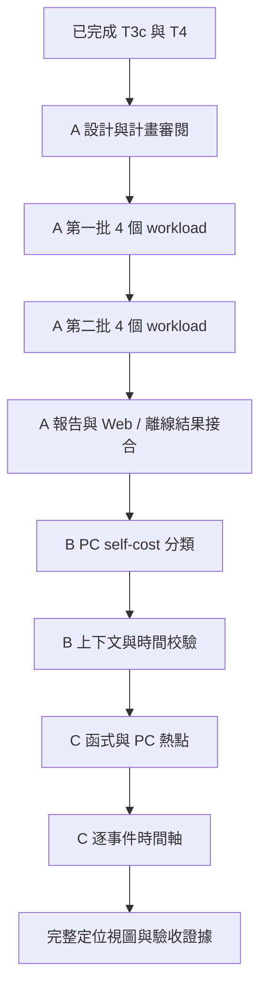

# 下一輪 Cache／TCP 研究設計提案

日期：2026-10-06。狀態：**優先順序已確認為 A → B → C；A 已核准並完成 96 次 capture 與 Dashboard 驗收，251 tests 與最終驗收通過；B/C 尚未實作。**

## 已確認的需求與基準

目的：用可重現的 RISC-V／FreeRTOS 實際 C 案例，判斷軟體修改為何改善或惡化 Cache 使用與執行成本，並可在公司內網用原始碼繼續研究。

- L1I 8 KiB、L1D 8 KiB、L2 32 KiB；沿用已驗證 small profile、-Os、目前固定工具與模型。
- 保留 PSF、ELF、map、反組譯、原始 access trace、封包、oracle、來源及工具 hashes。
- 本機 Python Web 與離線 HTML；SVG、hover、filter、sortable/resizable/movable table、CSV。
- Python unittest、Ruff；HTTP 用 curl，Web／離線 E2E 用 agent-browser；README 需截圖及說明。
- 不購買 Tracealyzer；不把模型值當產品效能，但可作相同條件的最佳化參考。
- 不改寫歷史 captures 或研究快照；跨機驗證目前暫緩。

目前 root `bae32ae`、POC `af41e42`；T4 的程式驗證 commit 為 `5955ce6`，230/230 tests。這些是規劃時基準，執行前重新核對 Git。

## 三條工作線與目的

| 選項 | 想回答的問題 | 交付 | 依賴／限制 |
|---|---|---|---|
| A：擴充 TCP workload | pbuf 單次走訪的改善是否只對單一 64-byte 案例成立？ | 參數化案例、成對結果、更新 Web／HTML | runner、guest receipt、protocol oracle 目前硬編碼，需一起擴充 |
| B：成本歸屬 | 工作量中多少屬 ISR、observer、recorder 或目標 task？ | 有守恆的分類報告、未解析量、排程上下文驗證 | PC self attribution 與執行上下文是不同維度；不能按函式名稱猜 task |
| C：定位視圖 | 哪些函式/PC 有成本，何時發生？ | C1 函式 self-cost 熱點；C2 逐事件時間軸 | C1 可用既有 trace；C2 要先校驗時間映射與上下文，不能線性插值冒充實際時間 |

**使用者已決定 A → B → C。** A 完成案例、報告與既有 Dashboard 接合後，再進入 B；B 完成成本歸屬與邊界驗證後，再進入 C。C 內先做函式熱點 C1，再做時間對齊要求較高的 C2。各階段有可複查的 completion 收據，不將僅有部分成果視為整階段完成。

## A 的候選矩陣，尚未定案

固定兩個 request、每回合四個 1460-byte response；只改 request 大小與記憶體 chain。Baseline/pbuf 各用相同輸入、seed、連線流程及 compiler flags；不疊加 checksum/layout 最佳化。

| ID | request bytes | callback 觀察到的 chain | 目的 |
|---|---:|---|---|
| A01 | 64 | 單段 | 保留既有基準 |
| A02 | 64 | 13 + 0 + 51 | 保留 T3c 空段案例 |
| A03 | 63 | 單段 | 64-byte 邊界前 |
| A04 | 65 | 單段 | 64-byte 邊界後 |
| A05 | 256 | 單段 | 放大逐 byte 重複走訪成本 |
| A06 | 256 | 63 + 0 + 64 + 129 | 不均勻多段與空段 |
| A07 | 64 | 1 + 1 + 1 + 1 + 1 + 1 + 1 + 57 | 短節點與較長 chain |
| A08 | 1460 | 單段 | 一個 MSS 級 request，保持單 TCP segment |

矩陣值為研究候選，**不代表使用者產品的真實 workload**。第一批 A01～A04；第二批 A05～A08。每組 2 variants × 2 timing modes × 3 repeats = 12 executions；共 96 次，分兩批各 48。先用一組、每 variant 各 control/injection 的 4 次探索執行量測耗時與磁碟，避免未量測就預估可負擔時間。探索與正式結果分目錄；沒有事先填入效能期待值。

協定 headers 留在首段；這輪不測 IP fragmentation、TCP segmentation/out-of-order、跨 pbuf headers、多連線或 NIC/DMA。不同 request 長度不可要求 wire hashes 全相同；只在同一 workload 的 baseline/pbuf、重跑間要求一致。

## B 的分類設計

分類採兩個獨立維度，避免重複相加：

1. **執行上下文**：task、ISR、scheduler transition、unknown。必須有可驗證的切換/中斷邊界；缺證據就保留 unknown。
2. **執行程式碼**：recorder、observer、lwIP、application/harness、kernel/port、assembly/unresolved。用該 ELF 的符號範圍與 source provenance；不把 callee 算進 caller 的 self-cost。

recorder 可在 task 或 ISR 內執行；因此 `ISR + recorder + task` 不能當互斥三類。輸出二維表，沿任一維度加總皆等於總指令數與總 memory cycles。先交付可核對的 PC self-cost，另驗證上下文後才提供 exclusive task/ISR。

## C 的資料語意

- C1：function/PC self instructions、memory cycles、misses；按 metric 排序、filter、CSV。顯示 unresolved 與 inline/symbol 邊界，不能把 code size 當 execution heat。
- C2：保存 event index、PC、memory service cost、PSF timestamp、對齊依據與誤差；展示 capture 範圍內可證明的關係。
- 目前不能只用 `1 ns/instruction + 累計 memory cost` 宣稱精確對時；MMIO bypass、marker 邊界、未注入事件、IRQ 與時間粒度必須核對。
- 精度未達標時保留 event-index 視圖，清楚標示沒有 PSF 時間對齊；不得默默產生看似精確的軸。

## 已確認與待審閱事項

- 已確認：2026-10-06 使用者指定「A, then B, then C」，依序執行。
- 已核准並執行：A 的8個 workload、兩批正式量測、baseline/pbuf 成對比較及驗收。
- 執行方式沿用本 session 主代理逐項實作，最後獨立 review；不另外增加平行實作流程。
- 尚未取得內網真實流量，因此矩陣代表受控實驗；沒有把它當成產品流量模型。

## A 的有效性與停止條件

- 63/65 bytes 用來探索長度邊界，**不保證** payload 起始位置 64-byte aligned；保存實際位址及 cache line 觸及情況，將 allocation/layout 影響列入解釋。
- 所有候選維持相同兩回合及總 response 11,680 bytes；request 累計應為 `2 × request_bytes`，不能再硬編碼128。
- 新 registry 設定必須保持每個 request 大小1～1460、首段非空、總段數1～8、各段為非負整數、加總吻合；零長段只能出現在首段之後。
- 4次探索使用 A08 的 baseline/pbuf control/injection，先檢查最大 request 的記憶體、時間與artifact成本。探索目錄獨立保存；正式三次重跑不重用探索結果。
- 任一原本的 IRQ oracle 假設不成立時，記錄失敗與證據並停止該案例；其餘已通過案例可繼續，但 A 完成狀態必須維持 partial，直到另行修正並驗證測試設計。
- 舊64-byte linear/fragmented CLI 路徑保留，新增 workload 路徑與 receipt schema 分開版本化。舊結果 hash 不變不等於新編譯必須 byte-identical；需要分別核對協定行為、ELF layout 與模型結果。
