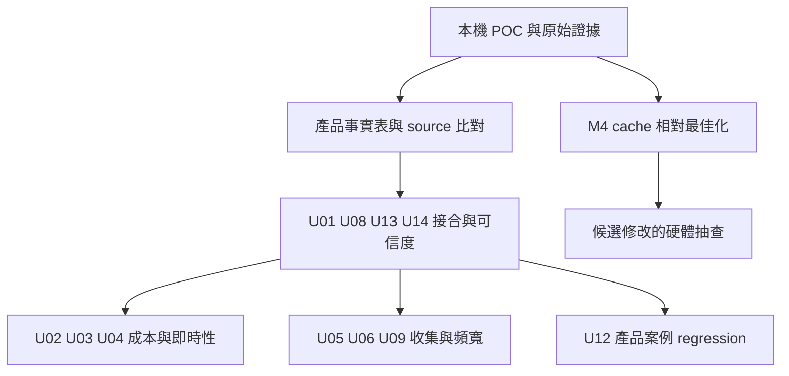

# 內網 AI 接續入口

這個 POC 能重跑 RISC-V／FreeRTOS 控制實驗、收集真正 PSF、獨立驗證行為，再用本機 SVG Dashboard 分析。它沒有取得產品原始碼與實體平台量測，因此不能把模擬結果當成產品的 CPU overhead、UART 吞吐或 cache miss penalty。

## 先重現，再比較產品

1. 讀 [需求](requirements.md)、[格式支援](format-support.md)、[接合方式](integration.md) 與 [案例結果](case-results.md)。原始研究快照不改寫，422 個檔案由 manifest 保護。
2. 用 [README](../README.md) 指令驗證 parser／API／UI。正式 firmware run 要求乾淨 Git、固定 submodule／toolchain 與 source hash；修改後先 commit，再產生新 run。
3. 建立產品事實表：core／SoC、FreeRTOS commit／port、compiler／flags、timer、cache、IRQ、memory map、UART／DMA 與預期工作量。未知欄位保留未知。
4. 在研究分支比對 `FreeRTOSConfig.h`、build includes、hardware port、stream port。此 POC 沒修改 kernel 的 `tasks.c`／`queue.c`，透過既有 trace macros 接 SDK；產品仍須驗預處理輸出與實際事件。
5. 保留正常／異常 oracle，移植有實際意義的案例。更換 timing model 後重新建立相對比較基準，不延用 QEMU 的毫秒結果當硬體預期。

## U01～U16：目的與產品完成條件

| ID | 接續工作 | 此 POC 提供什麼 | 仍需內網／硬體完成 |
|---|---|---|---|
| U01 | 最小 SDK 接入 | 可編譯 hooks、task／queue trace、預處理證據 | 產品 config／port／SDK 相容性、最小修改 diff |
| U02 | Flash／RAM 增量 | 每 run 的 ELF／map | 相同 flags 的 off／RAM-only／transport 三組，含 stack／TCB／buffer |
| U03 | 每事件成本與 CPU loading | task share 公式與受控 workload | cycle 分布、事件率、recorder／transport 分拆、CPU 百分點 |
| U04 | 最差即時性 | logger／inversion 的 response 對照 | IRQ masking、critical section、deadline、尖峰與尾延遲 |
| U05 | UART／collector | bounded transport adapter 與 partial-write tests | DMA／UART driver、有效 bytes/s、主機停頓／loss／重連 |
| U06 | 捕捉完整性 | sequence gap／truncation／oracle／hash 判定 | 產品 buffer、ring snapshot、trigger 前後史與實際 drop counter |
| U07 | RISC-V crash 保存 | 故障控制案例，不含 crash persistence | trap／register／stack、retained RAM／storage、reset／斷電測試 |
| U08 | Timestamp／SMP | RV32 mtime 10 MHz 校正、IRQ restore、單 core | 產品 sleep／DVFS／wrap、privilege、跨 core clock／locks |
| U09 | 裁剪與 trigger | Dashboard filter 與原始資料分離 | SDK 記錄前裁剪、限流、異常漏報與 CPU／頻寬比較 |
| U10 | 可靠後端 | bounded 本機 store 與 API | gateway／cloud 確認、retry／去重、retention、存取控制 |
| U11 | 金額與維護成本 | 自製 parser／viewer 的已知範圍 | 以同等能力計算授權、整合、維護、硬體與儲存 TCO |
| U12 | 產品案例 regression | 七配置、三組 A/B、獨立 oracle | 產品問題→trace→source 原因→修改→相同條件重測 |
| U13 | Decode／分析 | 兩個 PSF v14 schema、自製 parser／UI | 產品 SDK schema、未支援 events／ISR、symbols 與業務語意 |
| U14 | 證據版本 | commit／hash／PSF／ELF／oracle／run manifest | 內網 artifact policy、device／session／build linkage |
| U15 | 收集生命週期 | 固定單次 capture、停止後 oracle | boot／start／stop／rearm／遠端配置與錯誤狀態 |
| U16 | 條件式電量 | 未量測 | 若有省電需求，trace off／RAM-only／transport 電流、sleep residency |

詳盡原驗收保留在 [內部 AI 任務](../references/baseline/research/內部AI-接續研究任務.md)。不能以本機 unit tests 取代 U01～U16 的產品證據。

## 現況與後續順序 · 2026-10-06

M4 已完成多輪相對比較，進度到 [T3b 小 Cache -Os](tcp-os-small-cache.md) 與 [T3c pbuf chain](tcp-pbuf-holdout.md)。最新實驗設定為 L1I 8 KiB、L1D 8 KiB、L2 32 KiB；原 16/16/64 預設與歷史結果保留。

修改版 QEMU 已把 cache/sysram 模型成本接入 guest 時間，並驗證 IRQ/task 搶占與完整 TCP，見 [T2g](live-tcp-irq-t2g.md)。原版 QEMU 或單純 sidecar 統計不會自動做到這件事。500 MHz 僅用於 memory cycle→2 ns 換算，另有 1 ns/instruction 基底；不是完整 CPU pipeline。

[新 Dashboard](small-cache-dashboard.md) 呈現 T3b/T3c；舊 TCP TX 頁仍保留。接續工作為更多 workload、成本歸因分離與逐事件/函式執行熱點；不要重做已通過的 T2/T3。

單 trace 離線 HTML 已提供，見 [離線指南](offline-guide.md)：產生時需要 Python 與建好的 Web assets，觀看時不需要 Server／網路。跨機重現與內網安裝材料依使用者 2B 暫緩；產品部署仍是後續任務。

## 尚未等價的 Tracealyzer 功能

目前有 task timeline、execution share、request response／execution、事件、部分 user signal、filters／CSV 與三組對照。完整 ISR、SMP、所有同步物件分析、memory allocation／heap、state machine、自動根因、任意 user plot、所有 PSF 版本尚未支援。功能矩陣見 [Cache／CPU 與 Tracealyzer 對照](research/Cache-Bus與CPU使用率.md) 與 [Dashboard 研究](research/Dashboard功能與設計研究.md)。

## Cache 子階段已完成的交接材料

[還原指南](cache-replay.md) 提供 source archive、六次 PSF／ELF／map／CSV、模型版本與乾淨還原驗證。早期 Web 與 HTML 提供 data-region 比較；後續 T3 已增加 L1I/L1D/L2、miss 分類、symbol/code size 與最佳化驗證。hot/cold、AoS／SoA、tiling、PMU 與更細同步仍需另訂案例。歷史研究項目保留於 [研究表](research/Cache效率與PSF擴充.md)。
