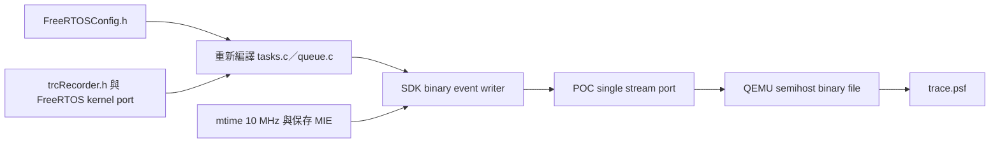

# FreeRTOS 與 TraceRecorder 實際接合

**不修改 FreeRTOS kernel source。** 本實驗重新編譯固定 kernel，使用 POC 的 `FreeRTOSConfig.h`，啟用 `configUSE_TRACE_FACILITY`，在 config 尾端 include `trcRecorder.h`。SDK 的 FreeRTOS kernel port 定義既有 `traceTASK_SWITCHED_IN`／queue 等 hook macros。SDK source 與 kernel port 一起連結。



`main` 先 initialize／enable recorder，再建立應用 objects／tasks。應用另以 POC channel 寫 SEND／RECEIVE／COMPLETE user events；Queue 成功後才記成功訊息。高優先權 consumer 可能在 producer 的 SEND marker 前執行 RECEIVE，這是搶占的合法結果，不能用文字 marker 順序冒充 queue API 因果順序。

## 建置與證據

```sh
make -C firmware CASE=queue_baseline
make -C firmware CASE=clock_probe
.venv/bin/python -m unittest tests.integration.test_clock_capture -v
clang -Wall -Wextra -Werror -Ifirmware/port tests/native/test_stream_port.c firmware/port/stream_io.c -o artifacts/local/test-stream
artifacts/local/test-stream
```

`build/<case>/firmware.elf`、`.map`、`tasks.i`、`queue.i` 保存連結與展開後 hooks。Startup／linker script 直接取固定官方 demo；使用 direct trap handler，無須 vector.S。Kernel 與 SDK 無修改。

## 實測結果

- Queue：281 events；PSF SEND／RECEIVE 各 0..15，與獨立 RAM oracle 一致，無 parser issues。
- Clock probe：100 RTOS ticks = 1,000,008 mtime counts；DTB 獨立宣告 10,000,000 Hz，1000 Hz tick 預期 1,000,000 counts，容許 2 ticks。
- 關中斷後再次進出 recorder critical section，MIE 保持關閉；外層再還原原狀。
- 正式 run manifest、獨立 oracle 與 harness 已產生，見 [案例結果](case-results.md)。

## 明確限制與實作決定

- 單 core、single linear stream、32-bit counter，QEMU `icount` 虛擬時間。Semihost 是模擬驗證輸出，不能推估 UART 速度、實體 CPU loading 或中斷延遲。
- SDK `trcEvent.c` 的直接事件提交不處理短寫，raw header 提交遇失敗會重試。POC callback 必須完整寫完才回成功；最多 64 次進度重試，零進展／錯誤直接輸出 console 並用 finisher 回非零。這種失敗可能無 oracle，必須保留 partial PSF 並判 capture failed。
- SDK 此版的 `xTraceKernelPortEnable` 固定建立 `TzCtrl`，即使關閉 stack monitor。保留其 priority 1／delay 10 ticks；它會出現在排程，不可當成不存在。
- Newlib 使用獨立 8 KiB bounded arena，FreeRTOS 使用自己的 128 KiB heap；ELF 的總 RAM／text 不能直接當 SDK overhead。
- trace 關閉成功後才輸出 oracle；oracle 只記應用結果，不使用 parser 解碼結果決定成功。


## SDK API 與本機原始碼入口

- [POC FreeRTOSConfig.h](../firmware/config/FreeRTOSConfig.h)：trace facility 與 recorder include。
- [firmware main](../firmware/app/main.c)：initialize／enable／disable 與 user event 使用。
- [Recorder public header](../references/baseline/percepio/TraceRecorder/include/trcRecorder.h)：SDK API 定義。
- [官方 TraceRecorder repository](https://github.com/percepio/TraceRecorderSource)：版本與整合參考。

先以本機固定版本 header／預處理輸出核對，官方最新版本的 API 不能自動套到此 POC。
