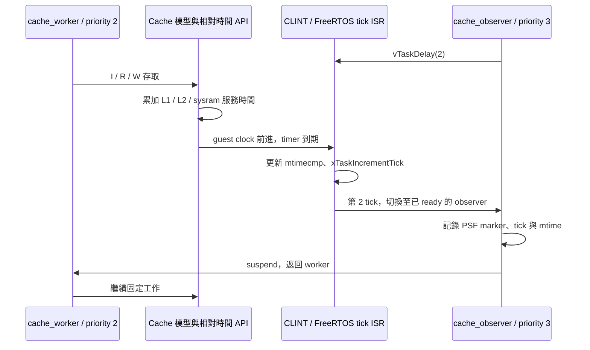

# T2f：逐筆 cache 成本已影響 FreeRTOS timer 與 task 排程

**後續更新：**[T2g](live-tcp-irq-t2g.md) 已完成完整 zero-copy TCP 的 IRQ 開啟驗證；本文保留 T2f 的小案例結果。

**IRQ 開啟的案例通過。** 同一段固定記憶體工作，control 尚未到 observer deadline；啟用 500 MHz 成本換算後，timer 前進 3 ticks，高優先序 observer 在第 2 tick 執行，接著返回 worker。三次配對結果一致。

這完成 [T2e](live-cache-t2e.md) 留下的「IRQ 開啟時是否真的影響 scheduler」驗收；仍未驗證真實 CPU 每筆 load/store 的 cycle-accurate 完成順序。

## 實驗設計

- `cache_worker` priority 2，40 KiB 陣列，每 64 bytes 讀／寫一次，重複 64 輪。固定 checksum `210677760`。
- `cache_observer` priority 3，先呼叫 `vTaskDelay(2)`，醒來記錄 tick／mtime／PSF marker，然後 suspend。
- window 開頭從冷 cache 開始，worker 主迴圈開啟 IRQ；ISR、observer、scheduler 與 recorder 的 RAM 存取都留在同一份連續模型中。
- window 結尾先關 IRQ，再關閉計價，等待 pending async work 排空並讀 clock；完成量測後恢復原 IRQ 狀態。這段量測邊界不是整段關 IRQ。
- 固定 L1I／L1D 16 KiB、L2 64 KiB，sysram read／write startup 各 10 cycles；每 memory-model cycle = 2 ns。
- QEMU 基礎指令時間仍是 `-icount shift=0`，1 ns／instruction。報告將這個對照座標與 memory service 分開，不宣稱是完整 500 MHz CPU 模型。



## 三次正式配對結果

來源：[六次執行與差分](../runs/live-cache-irq-v2/results.json)。每一個模式內，三份完整存取串流 SHA-256 相同。

| 項目 | control：不注入 | 注入服務時間 |
|---|---:|---:|
| guest interval | 328,100 ns | 3,437,200 ns |
| instruction events | 327,882 | 332,428 |
| data reads | 40,960 | 41,998 |
| data writes | 40,960 | 41,729 |
| 模型 memory service | 1,527,320 cycles | 1,552,272 cycles |
| 實際注入的 memory service | 0 ns | 3,104,544 ns |
| window ticks | 0 | 3 |
| observer 在 window 內醒來 | 否 | 是，第 2 tick |
| timer 例外入口／tick handler 次數 | 0／0 | 3／3 |
| 排除計價但有記錄的 CLINT 存取 | 0 | 39 |

control 仍計算 cache 成本供分析，但不傳給時間 API。注入後新增 ISR／observer 路徑，**兩個模式的事件串流本來就會不同**；不能沿用 T2e 的跨模式串流相等要求。這輪改驗同模式三次可重現、相同工作 checksum、逐事件 C/Python 成本一致，以及下列時間守恆式。

```text
額外 instruction 時間 = (332,428 − 327,882) × 1 ns = 4,546 ns
預期 guest 增量 = 3,104,544 + 4,546 = 3,109,090 ns
觀察 guest 增量 = 3,437,200 − 328,100 = 3,109,100 ns
誤差 = +10 ns；允許 ±200 ns 的四端點量化誤差
```

IRQ／observer 也增加了 memory service：相對 control 模型多 24,952 cycles，也就是 49,904 ns。這說明只把未注入 trace 的成本一次加到總時間，會漏掉排程改變後新增的工作；本輪使用執行中的存取持續計價。

## PSF 與 timer 交叉證據

注入模式的 PSF 記錄：

| 事件 | mtime 原始值，100 ns／單位 |
|---|---:|
| 測量開始 | 2,860 |
| switch → cache_observer | 22,395 |
| observer 自行讀取 mtime | 22,414 |
| switch → cache_worker | 22,733 |
| 測量結束 | 37,232 |

Verifier 要求 observer 的 clock 值落在對應 PSF task interval 內，且 marker 順序與 guest window 一致。另從指令 trace 比對 ELF symbols，確認 `test_if_mtimer` 與 `xTaskIncrementTick` 各執行 3 次。共用 `freertos_risc_v_trap_handler` 實際執行 4 次，另外一次進入 `synchronous_exception`／`handle_exception`，未進入 `application_exception_handler`；依 `portASM.S` 的分支對應 machine-mode ECALL，用來切換 task。control 這些入口皆為 0；核對紀錄見 [receipt](../artifacts/verification/live-cache-irq/receipt.json)。

這些證據支持「模型延遲已影響此 guest 的 timer 和排程」，不支持真實 NIC／DMA／RTT、硬體中斷 latency 或產品 CPU loading 的推論。

## CLINT 如何處理

原 T2e plugin 會拒絕所有 MMIO。本輪只在 `--case irq` 編譯 `POC_LIVE_IRQ`，開放四個 32-bit 存取：

| 地址 | 方向 | 用途 |
|---|---|---|
| `0x0200bff8`、`0x0200bffc` | read | mtime low／high |
| `0x02004000`、`0x02004004` | write | hart 0 的 mtimecmp low／high |

這些存取不進 RAM cache model、不添加 memory-service 成本；每筆 PC、address、size、R/W 都寫入 `qemu.log`，結尾保存 count。其他 MMIO、反方向或錯誤寬度一律失敗。Timer 寄存器的真實 bus latency 尚未建模。

原本 synthetic／TCP mode 仍拒絕 MMIO；兩者各重跑一組配對，原來的 -74 ns／+32 ns 差分結果維持一致。

## 檔案與重跑方式

| 檔案 | 用途 |
|---|---|
| [live_cache_irq.c](../firmware/app/cases/live_cache_irq.c) | worker／observer、clock 測量與 oracle |
| [live_cache.c](../tools/tcp/live_cache.c) | 單一 capture window，IRQ 模式的 CLINT 白名單與紀錄 |
| [run_live_cache.py](../tools/tcp/run_live_cache.py) | 新增 `--case irq`；build、六次執行、PSF／時間驗收 |
| [live_cache_irq.py](../src/psf_lab/live_cache_irq.py) | 時間守恆、observer deadline、PSF switch 與 MMIO 檢查 |
| [test_live_cache_irq.py](../tests/unit/test_live_cache_irq.py) | 8 個正常／反例測試，包含成本流失、未醒來、錯誤 MMIO、缺少返回 task |
| [正式 run](../runs/live-cache-irq-v2/) | ELF、PSF、CSV gzip、symbols、manifest 與 JSON 結果 |
| [驗證目錄](../artifacts/verification/live-cache-irq/) | TDD、回歸 log、雜湊／ISR 入口核對與完成紀錄 |

在 POC 根目錄執行；環境與 QEMU 的三個 patch 沿用 [T2e 重跑前提](live-cache-t2e.md)。

```sh
.venv/bin/python tools/tcp/run_live_cache.py --case irq \
  --qemu .tools/qemu-time-control/qemu-system-riscv32-relative \
  --output runs/local/live-cache-irq

.venv/bin/python -m unittest tests.unit.test_live_cache_irq
```

預設 control／注入各三次；output 必須是新目錄。`runs/live-cache-irq-v1` 為初次探針，正式結論以 v2 為準。所有來源與產物雜湊都保存於 manifests；原始 PSF 可供後續 Dashboard 分析。

## 完成範圍與後續

- [x] 開 IRQ 的記憶體工作，tick、preemption、observer 醒來及 worker 返回。
- [x] 三次重複、C/Python 逐筆一致、PSF clock、ISR PC、時間差分核對。
- [x] 舊 synthetic／TCP 各一組回歸，共 4 次執行。
- [ ] 真正逐筆 load/store 完成與 IRQ 插入順序；目前仍在 async CPU 邊界注入。
- [ ] 量測 observer effect：host CPU／記憶體／callback throughput；不把 wall time 換成 SDK loading。
- [ ] 完整 TCP 的 IRQ 開啟版本，以及真實程式碼最佳化 A/B。
- [ ] Web／離線 HTML 的 memory service、ISR／task 分項與時間軸。現有 UI 本輪未改，未宣稱瀏覽器驗收。
- [ ] MMIO bus latency、其他 memory regions、SMP 與目標產品校準。

完整回歸 **200／200 通過**，Ruff 與本輪 Python 格式檢查通過。

自行檢查時曾把共用 trap 次數預期為 3，因實際為 4 而失敗；已分開驗證 timer 與 ECALL 路徑，保留 [原始錯誤說明](../artifacts/verification/live-cache-irq/trap-audit-initial-failure.txt)。可執行 `.venv/bin/python artifacts/verification/live-cache-irq/verify.py` 重驗 hash、模型、PSF、時間差分與入口次數；需在本輪來源版本的 POC 根目錄執行。

Review 為自行檢查，沒有獨立 reviewer。最終測試數與 tested commit 見 [completion](../artifacts/verification/live-cache-irq/completion.json)。
