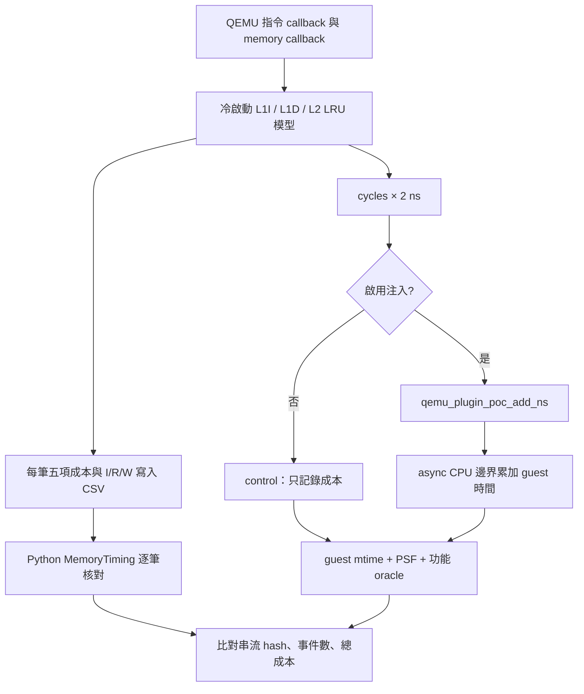

# T2e：500 MHz 記憶體成本已接進 QEMU guest 時間

**後續更新：**[T2f](live-cache-irq-t2f.md) 已完成小案例 IRQ 開啟的 timer／scheduler 驗證；本文保留 T2e 當時的完成邊界。

本輪完成兩種案例的逐筆 I／R／W 成本注入：固定小案例，以及既有 lwIP zero-copy request／response 流程。各跑 control／注入三次，共 12 次，全部通過。

**這是串行成本研究模型。** 500 MHz 用於 memory-service cycles → ns；QEMU 基礎時間仍為 `-icount shift=0` 的 1 ns／instruction。不能把合計時間解讀成真實 500 MHz CPU 的執行時間。

## 結果與證據

三組配對的 guest 結果完全相同；每種案例的六份存取串流 SHA-256 也完全相同。

| 案例 | I／R／W 事件數 | 模型 cycles | 預期增加 ns | guest 增加 ns | 誤差 ns |
|---|---|---:|---:|---:|---:|
| 40 KiB 陣列，四輪每 64 bytes 讀／寫 | 20,499／2,560／2,560 | 106,337 | 212,674 | 212,600 | -74 |
| 完整 zero-copy TCP 流程 | 325,247／48,725／31,952 | 1,028,434 | 2,056,868 | 2,056,900 | +32 |

來源：[小案例結果](../runs/live-cache-v2/results.json)、[TCP 結果](../runs/live-tcp-v2/results.json)。`mtime` 為 10 MHz、100 ns 粒度，四個端點差分允許 200 ns 誤差。

小案例 control 20,800 ns、注入後 233,400 ns；TCP control 325,400 ns、注入後 2,382,300 ns。這些是同一個 ELF、同一個 QEMU binary 下的對照，**沒有實施 TCP 演算法最佳化**，不能拿它與不同 QEMU／ELF 的舊 Z0 成本直接相減。

TCP 驗收包含握手、兩次 64-byte request、八段各 1,460-byte 的 response、ACK、FIN、payload／checksum／序號與方向核對、buffer 保留到 ACK、資源歸零。每次 25 個封包、128 request bytes、11,680 response bytes。

## 原理與時間定義



- 模型沿用 [sysram-10](../cases/timing/sysram-10.json)：L1I／L1D 各 16 KiB、L2 64 KiB、64-byte line、4-way LRU、非 inclusive。
- L1 lookup 1 cycle、L2 lookup 8 cycles；sysram read／write startup 各 10 cycles，8 bytes／cycle。
- 兩層 write-through + write-allocate，每次 write 都計 RAM 寫入。無 store buffer、dirty writeback、prefetch、DMA、coherence 或重疊。
- `extra_ns = 2 × (L1I + L1D + L2 + RAM read + RAM write cycles)`。包含 L1 hit lookup 的**完整服務成本**，並非只加 miss penalty。
- 基礎指令時間只是 QEMU 對照座標，沒有宣稱它已包含真實 pipeline 或 L1 服務。因此報表將 base 與額外服務分開；未來若引入 CPU CPI，需重新定義是否扣除已包含的 L1 成本。
- 單一 capture window 從冷 cache 開始，內部狀態連續。TCP 同時包含 peer construction、payload 生成與 RAM snapshot，不能將總成本全部歸給 TCP stack。
- code VA 假設為 identity-mapped RAM；data 使用 QEMU 回報的 physical address。只接受 `[0x80000000,0x88000000)` RAM；window 內 MMIO／未映射位址會明確失敗。

## 實作檔案

| 檔案 | 用途 |
|---|---|
| [live_timing.c](../tools/qemu/live_timing.c)／[header](../tools/qemu/live_timing.h) | 固定 sysram-10 的 C cache 核心；跨 line 與 LRU |
| [live_cache.c plugin](../tools/tcp/live_cache.c) | QEMU 9.2 plugin API4，逐事件計價／注入／CSV |
| [run_live_cache.py](../tools/tcp/run_live_cache.py) | build、開關配對、timeout、PSF／封包驗收、hash manifest |
| [live_cache.py](../src/psf_lab/live_cache.py) | Python oracle 逐筆核對、gzip 重驗、guest 時間差分 |
| [小案例 firmware](../firmware/app/cases/live_cache.c) | 固定 2,560 reads／2,560 writes，校驗總和 |
| [TCP wrapper](../firmware/app/cases/tcp_request_response_live.c) | 開啟額外 mtime 測量；原 TCP case 無 define 時不啟用 |
| [TCP firmware](../firmware/app/cases/tcp_request_response.c) | 既有完整 session，加條件式測量點 |
| [模型測試](../tests/unit/test_live_timing.py)／[報表測試](../tests/unit/test_live_cache_report.py) | C/Python 差分、跨 line、LRU、5,000 筆固定 seed、錯誤輸入／成本／時間拒收 |

Plugin 單次最多 3,000,000 事件，單 vCPU、RV32、單 capture window。profile 與 500 MHz 目前固定；runner 偵測 profile hash 或頻率改動就拒絕，不能只改 JSON 就宣稱 native 模型跟著改變。

## 如何重跑與複查

在 POC 根目錄，先依 [QEMU 重建文件](qemu-clock-nano-t2d.md) 取得三個 patch 的 `qemu-system-riscv32-relative`。需既有 RISC-V GCC、Python 環境、host C compiler、pkg-config／GLib。原版 QEMU 不提供本 POC 的 relative API。

```sh
.venv/bin/python tools/tcp/run_live_cache.py \
  --qemu .tools/qemu-time-control/qemu-system-riscv32-relative \
  --output runs/local/live-cache

.venv/bin/python tools/tcp/run_live_cache.py --case tcp \
  --qemu .tools/qemu-time-control/qemu-system-riscv32-relative \
  --output runs/local/live-tcp

.venv/bin/python -m unittest tests.unit.test_live_timing tests.unit.test_live_cache_report
```

output 必須不存在；預設各組三次，`--repeats 1` 可做開發檢查。exit 0 必須同時通過事件成本、配對序列一致、跨三次重複性、guest 差分與功能驗收。

每個 run 保存 `trace.psf`、`live-cache.json`、`accesses.csv.gz`、ELF、symbols、oracle、QEMU log 與 manifest。TCP 另有 25 個 packet binary、`session.json`。最外層 manifest 記錄來源檔、QEMU、GCC、plugin SHA-256 與實際 build/run command。

重驗已壓縮的成本紀錄：

```python
from pathlib import Path
from psf_lab.live_cache import audit_accesses
print(audit_accesses(Path("runs/live-tcp-v2/enabled-1-1/accesses.csv.gz")))
```

需在安裝本專案的 Python 環境執行。每筆 cache 成本目前存在 **sidecar CSV**；PSF 保存原有事件與改變後的 guest timestamp，沒有加入自訂 cache event schema。

`runs/live-cache-v1`、`runs/live-tcp-v1` 為開發階段證據；正式結論以 v2 為準。程式碼、設定、實驗資料都由 POC Git 管理；host 工具與 `.tools` 不在 Git，尚未宣稱全離線安裝套件齊全。

## 代價與限制

本機 wall time 小案例 control 範圍 0.036～1.361 s、注入 0.073～0.076 s；TCP control 0.180～0.452 s、注入 0.450～0.556 s。每次包含 QEMU 啟動與 CSV 寫檔，樣本少且變動大，**不是 SDK CPU loading 或硬體效能百分比**。目前每個事件都建立 async 工作，TCP 每次 405,924 次 API 呼叫；吞吐與記憶體高水位仍需獨立 benchmark。

小案例在 scheduler 啟動前執行；TCP window 內 IRQ masked，兩者測量 ticks 都是 0。原有 T2c 的 IRQ／WFI 證據只適用既有探針。本輪不能證明每筆 load/store 的完成順序、timer 到期與 task 切換已等同真實 pipeline stall。

## 完成與下一步

- [x] C 與 Python 模型逐筆一致，正常及反例測試。
- [x] 500 MHz 每筆相對成本接合，control／注入、兩種案例各三次。
- [x] PSF、guest mtime、TCP 功能、原始紀錄與 manifests。
- [ ] IRQ 開啟的混合 cache／timer／scheduler 實驗。
- [ ] host CPU／記憶體／trace throughput，以及批次注入的精度折衷。
- [ ] 同基準的實際 TCP 程式碼最佳化 A/B；stack 與 harness 分項歸因。
- [ ] Web 與離線 HTML timing views、互動篩選與 CSV 匯出。
- [ ] 多 memory region／uncached SRAM／可變 sysram 延遲、SMP 與產品校準。

完整回歸 **192／192 通過**，Ruff 與四個新增 Python 檔案格式檢查通過。測試 log 與 tested commit 均保存在下方完成紀錄。

TCP 使用 `NO_SYS=1` raw API 與程式內 peer；沒有實體 NIC、DMA 或真實 RTT。

本輪沒有修改 UI，因此未執行瀏覽器驗收或新增畫面截圖。最終測試與來源完整性見 [完成紀錄](../artifacts/verification/live-cache/completion.json)。Review 為作者自行檢查，沒有獨立 reviewer。
