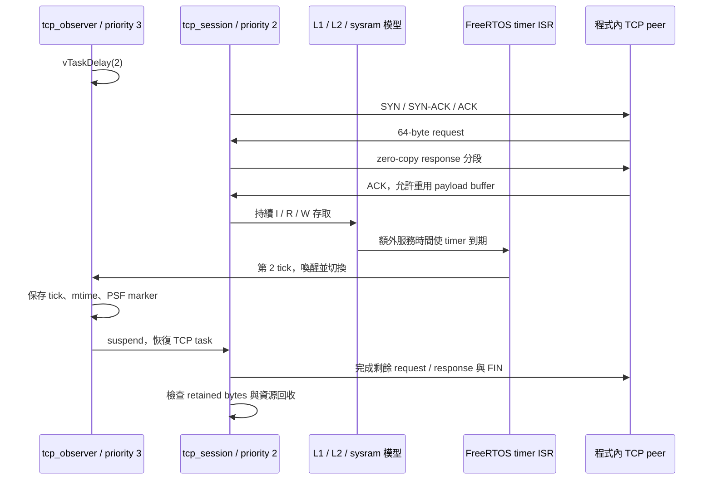

# T2g：完整 zero-copy TCP 流程在 IRQ 開啟下通過

**完整 TCP request／response 流程已在 cache 延遲注入及 IRQ 開啟下通過。** 三組 control／注入配對全部完成握手、25 個封包、11,680 bytes 回應、ACK、FIN 與資源回收。注入模式的高優先序 observer 在第 2 tick 搶占 TCP task，之後 TCP task 恢復並完成流程。

這輪完成的是 timing harness 的功能驗證；尚未修改 TCP 演算法，也沒有把模型時間當成產品效能。

## 實驗邊界與設定

- 沿用 [T2e 的 500 MHz 換算與 cache 模型](live-cache-t2e.md)：L1I／L1D 各 16 KiB、L2 64 KiB、sysram startup read／write 各 10 cycles。
- 每個 memory-service cycle 換成 2 ns。QEMU `icount shift=0` 的基礎時間仍是 1 ns／instruction，分開列帳。
- `tcp_session` priority 2 是唯一操作 lwIP 的 task；新增的 `tcp_observer` priority 3 只等待 2 ticks、記錄 PSF／clock，再 suspend，完全不操作 lwIP。
- worker 開始與結束量測時短暫關 IRQ；**完整 capture 主體開 IRQ**。ISR、observer、scheduler、recorder 及 TCP harness 的 RAM 存取共用連續 cache 狀態。
- 仍是 `NO_SYS=1` raw API，`LWIP_TIMERS=0`；`tcp_fasttmr()`／`tcp_slowtmr()` 由案例手動呼叫。本輪驗證的是 FreeRTOS timer／排程，不是 lwIP timeout 已接上真實流逝時間。
- 沒有 NIC、DMA、線路 RTT、封包遺失或多 task 同時操作 stack；不宣稱證明 lwIP 的多執行緒安全性。



圖示呈現交互關係，沒有宣稱 observer 恰好在指定封包或 ACK 之間執行。精確 task 時間區間由 PSF 核對。

## 三次配對的實測結果

來源：[正式六次執行](../runs/live-tcp-irq-v2/results.json)。同一模式三次的完整存取串流 hash 相同，時間差分也相同。

| 項目 | control：不注入 | 啟用注入 |
|---|---:|---:|
| guest interval | 325,500 ns | 2,433,600 ns |
| instruction events | 325,254 | 329,805 |
| data reads | 48,726 | 49,741 |
| data writes | 31,953 | 32,671 |
| 模型 memory-service cycles | 1,028,309 | 1,051,746 |
| 實際加入的 memory-service ns | 0 | 2,103,492 |
| window ticks | 0 | 2 |
| observer 在 window 內執行 | 否 | 是，第 2 tick |
| timer IRQ／ECALL | 0／0 | 2／1 |
| 排除 RAM 計價的 CLINT 存取 | 0 | 33 |

```text
額外 instruction 時間 = (329,805 − 325,254) × 1 ns = 4,551 ns
預期 guest 增量 = 2,103,492 + 4,551 = 2,108,043 ns
觀察 guest 增量 = 2,433,600 − 325,500 = 2,108,100 ns
誤差 = +57 ns，低於四個 mtime 端點的 ±200 ns 容許誤差
```

注入模式比 control 的模型多出 23,437 cycles，即 46,874 ns 的 memory service，來源包含 ISR／observer／scheduler 的新路徑與 cache 狀態改變。不能把 control 的成本一次加回總時間，就假設已涵蓋這些新增工作。

**這裡的 instruction 數包含整個 capture 的工作。** 原 `session.json` phase 內的 `rdinstret` 差值在 IRQ 開啟後，也可能包含被搶占期間的 ISR／其他 task；不可當作 TCP 函式的 exclusive CPU usage。

## 封包、buffer 與 PSF 證據

每次流程都驗證：

1. SYN／SYN-ACK／ACK、兩次各 64-byte request、八段各 1,460-byte response。
2. 封包 checksum、IP／port、方向、sequence、ACK、flags 與 payload。
3. payload buffer 保留至 ACK，`retained_bytes` 最後為 0，peak 為 1,460。
4. FIN／final ACK、PCB 狀態，以及六項 lwIP resource counters 回到原值。
5. 同一實驗的六次捕捉，25 個 packet binary 逐檔 SHA-256 與 control 完全相同。

注入模式 PSF 顯示 `tcp_observer` 的 switch-in 為 mtime `23050`，observer 自讀為 `23068`，返回 `tcp_session` 為 `23403`。每單位 100 ns，自讀 clock 落在 PSF task interval 內。測量區間是 `3014` 到 `27350`。

另以 ELF symbols 對照指令 trace：共用 trap handler 3 次，timer 路徑／`xTaskIncrementTick` 各 2 次，同步例外／ECALL 路徑 1 次。避免把 ECALL 誤算成 timer IRQ。

[完整雜湊、packet、PSF、timer／ECALL 核對 receipt](../artifacts/verification/live-tcp-irq/receipt.json)。

## 使用與檔案位置

在 POC 根目錄、既有 Python／RISC-V GCC／patched QEMU 環境中執行：

```sh
.venv/bin/python tools/tcp/run_live_cache.py --case tcp-irq \
  --qemu .tools/qemu-time-control/qemu-system-riscv32-relative \
  --output runs/local/live-tcp-irq

.venv/bin/python -m unittest tests.unit.test_live_tcp_irq

# 在本輪來源版本重驗已保存的正式資料
.venv/bin/python artifacts/verification/live-tcp-irq/verify.py
```

output 必須是新目錄；預設 control／注入各三次。完整安裝與 QEMU patch 前提沿用 [T2e](live-cache-t2e.md)。沒有改動系統安裝的 QEMU。

| 位置 | 內容 |
|---|---|
| [tcp_request_response_irq.c](../firmware/app/cases/tcp_request_response_irq.c) | 開啟 live timing 與 IRQ 的 wrapper |
| [tcp_request_response.c](../firmware/app/cases/tcp_request_response.c) | 共用 TCP 流程、條件式 observer 與 clock 測量；原遮蔽 IRQ case 保留 |
| [run_live_cache.py](../tools/tcp/run_live_cache.py) | 新增 `--case tcp-irq`，沿用封包與時間驗收 |
| [live_cache_irq.py](../src/psf_lab/live_cache_irq.py) | 明確區分 memory／TCP 的 work、task 名稱與 PSF markers |
| [test_live_tcp_irq.py](../tests/unit/test_live_tcp_irq.py) | TCP scenario、錯誤 byte 數、返回 task、未知 scenario 的測試 |
| [runs/live-tcp-irq-v2](../runs/live-tcp-irq-v2/) | 六份 ELF、PSF、CSV gzip、25 個 packet binary、oracle、symbols、manifest |
| [artifacts/verification/live-tcp-irq](../artifacts/verification/live-tcp-irq/) | TDD／正式執行／回歸 logs、重驗腳本、receipt、完成紀錄 |

每筆 cache 成本仍在 sidecar CSV；PSF 保存事件及受模型影響的 timestamp，未新增自訂 cache event schema。`live-tcp-irq-v1` 為開發探針，正式結果以 v2 為準。

## 回歸、review 與下一步

記憶體 IRQ case 重跑一組，原 +10 ns 結果維持；IRQ 遮蔽 TCP 重跑一組，原 +32 ns 結果維持。正式六次加回歸四次，共 10 次 QEMU 執行通過。

完整回歸 **204／204 通過**，Ruff 與本輪 Python 格式檢查通過。

後處理 audit 初稿忘記傳 `scenario="tcp"`，被既有 work checksum 檢查拒絕；已修正並重驗，guest 與捕捉資料未改動。[錯誤紀錄](../artifacts/verification/live-tcp-irq/audit-initial-failure.txt)。Review 為作者自行檢查，沒有獨立 reviewer。完整回歸數與 tested commit 見 [completion](../artifacts/verification/live-tcp-irq/completion.json)。

- [x] 完整 TCP IRQ／cache timing／observer／資源生命週期。
- [x] 同模式三次可重現、packet bytes 相同、PSF／timer／ECALL／clock 核對。
- [ ] 從同一基準找出 TCP 熱點，實作真正的程式碼或資料布局最佳化 A/B。
- [ ] 分離 stack、peer harness、ISR／observer／recorder 的成本歸因。
- [ ] Web 與離線 HTML 的 timing 圖表、互動篩選與 CSV 匯出。本輪沒有 UI 變更或瀏覽器驗收。
- [ ] lwIP timers 與 guest 時鐘接合、RTO／重傳與有 RTT 的 peer。
- [ ] host overhead benchmark、MMIO bus latency、真實硬體校準與逐筆 stall 順序。
