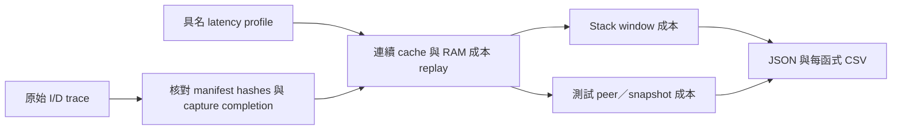

# T1：L1／L2／RAM 的可設定成本估算

2026-10-04。**已實作並使用 Z0 真實 I/D trace 重播。** 可設定 cache 容量／line／ways／lookup cycles，並依 guest physical address 選擇 RAM 的 read／write latency、bandwidth 與 cacheable 屬性。

這是 **serialized memory-service 成本**，不是 CPU 總執行週期，也沒有改變 QEMU virtual time。結果欄位保留 `cpu_cycles: null`、`guest_time_changed: false`。T2 的 guest timer／IRQ／排程影響仍未實作。

## 本版的精確假設

| 項目 | 行為 |
|---|---|
| 初始狀態 | Cold start，整份 session 連續 replay；不在 stack／harness 邊界重設 |
| Cache | Split L1I／L1D、unified L2；LRU、non-inclusive；三層 line size 必須一致 |
| Read／取指 | 先支付 L1 lookup；L1 miss 才查 L2；L2 miss 才從 RAM 讀取完整 line |
| Write | **兩層 write-through＋write-allocate**；每筆寫入都查 L2 並同步寫入 RAM，即使 L1 hit |
| Write miss | L2 沒有該 line 時先讀取完整 line，再寫入實際修改的 bytes；此版沒有 full-line store 特例 |
| RAM service | `latency_cycles + ceil(bytes / bus_bytes_per_cycle)`；latency 是資料 beats 開始前的等待 |
| Uncached | 繞過 L1／L2，直接支付 RAM 存取成本；跨 line／region 拆成 transaction |
| 地址範圍 | 半開區間 `[start, end)`，line-aligned、不得重疊；未配置區域拒絕分析 |
| 計數單位 | Cache lookup 以 line transaction 計算，跨 line 的一條指令可能有兩次 lookup |
| 不支援 | Write-back／dirty eviction、pipeline overlap、store buffer、DMA、bus queue contention、coherence、自修改程式碼 |

Write-through 是本版明確選定的可驗證情境，**不是已確認的產品策略**。例如真實產品有 write-back 或 store buffer，寫入成本與函式排名可能明顯不同。輸入 `write-back` profile 會拒絕，避免默默套錯模型。



Stack window 只分開成本歸因，**cache 狀態仍受到同一 guest 的 peer／snapshot 影響**。例如 peer 預先寫入 payload 會使其 warm；不能將這份結果宣稱為沒有測試工具影響的產品 cache profile。

## 示範結果：只改 RAM read latency

重播來源：[Z0 第一次 run](../runs/tcp-session-z0-v2/z0-1/)。固定 L1I／L1D／L2 = 16／16／64 KiB，line 64 bytes，4-way，lookup 1／1／8 cycles；RAM write latency 固定 20 cycles，bandwidth 固定 8 bytes/cycle。下列三組 **全部是假設參數，未以產品硬體校準**。

| RAM read latency | 全 trace service cycles | Stack window service cycles | Harness service cycles |
|---:|---:|---:|---:|
| 80 | 1,362,401 | 230,823 | 1,131,578 |
| 160 | 1,407,201 | 248,983 | 1,158,218 |
| 320 | 1,496,801 | 285,303 | 1,211,498 |

每組都產生 560 次 RAM read transactions、31,952 次 RAM write transactions。Read latency 80 → 160 增加 `560 × 80 = 44,800` service cycles，其他成本完全不變。這是參數敏感度驗證，不是軟體 A/B 改善。

80-cycle 情境的 stack-window 成本前幾名：

| 函式 | Self memory-service cycles |
|---|---:|
| `tcp_input` | 29,141 |
| `lwip_standard_chksum` | 23,753 |
| `tcp_output` | 22,897 |
| `tcp_receive` | 12,225 |
| `ip4_output_if_src` | 12,192 |

純指令 profile 中 checksum 排第一，加入這組同步 write-through 成本後，`tcp_input` 排到前面。**這證明模型假設會改變研究優先順序，不能直接斷言產品的瓶頸已經改變。** 先取得 cache write policy／memory latency，再以多組合理情境檢查排名是否穩定。

## 如何執行

```sh
# 在 poc/ 執行，output 目錄必須不存在
.venv/bin/python -m psf_lab.timing_report \
  --run runs/tcp-session-z0-v2/z0-1 \
  --profile cases/timing/illustrative-ram.json \
  --profile cases/timing/illustrative-ram-160.json \
  --profile cases/timing/illustrative-ram-320.json \
  --output runs/local/my-timing
```

不需要重跑 QEMU；先驗證 run manifest 所列檔案，再用不同 profile 重播。輸出：

- `timing.json`：原始 profile、profile hash、trace／symbols／manifest hashes、各層成本、分 scope 與函式成本。
- `functions.csv`：profile、scope、function、L1I／L1D／L2／RAM read／RAM write 及 total。
- `manifest.json`：分析工具 source hashes 與輸出檔案 hashes。

Profile JSON 的位址使用十進位整數。`cases/timing/illustrative-ram.json` 是可修改範本；正式數值未知時保留 `assumptions` 說明，不用示例冒充平台設定。CLI 目前只接受具有 Z0 stack marker、單一連續 capture 的 trace，遇到中斷／巢狀／不完整窗口會拒絕。

## 程式與證據

| 路徑 | 內容 |
|---|---|
| [memory_timing.py](../src/psf_lab/memory_timing.py) | Region 驗證、cache hierarchy 與分層成本模型 |
| [timing_report.py](../src/psf_lab/timing_report.py) | Hash／capture 驗證、函式歸因與 JSON／CSV CLI |
| [test_memory_timing.py](../tests/unit/test_memory_timing.py) | 手算期望值的 10 個模型測試 |
| [test_timing_report.py](../tests/unit/test_timing_report.py) | 真實 gzip／manifest 格式的 4 個報告與錯誤測試 |
| [正式結果](../runs/timing-z0-v2/timing.json) | 三組 profile 的完整結果 |
| [函式 CSV](../runs/timing-z0-v2/functions.csv) | 可供後續 Dashboard 使用的比較資料 |
| [驗證目錄](../artifacts/verification/memory-timing/) | Unit tests、Ruff 與結果完整性／敏感度證據 |

`runs/timing-z0-v1` 為格式修正前的探索輸出；正式引用以 v2 為準。原 PSF／packet／trace 未修改，也未把估算 cycles 寫成 PSF 的真實時間。

## 尚未完成

目前 147 個 unit tests、全庫 Ruff lint、本次四個 Python 檔案格式檢查通過；三份 Z0 capture 重播、560 次 RAM read 的延遲敏感度、300 列 CSV 與 JSON 加總一致性也已驗證。原有全庫格式問題仍維持紀錄。

- T2：真正讓 guest time 反映 latency，驗證 `mtime`、IRQ、tick 與 task scheduling。
- 確認產品 write policy；有必要時新增 write-back／dirty eviction／store buffer，不能沿用本版寫入數字。
- Web／離線 Dashboard 的 profile selector、分層圖與互動 CSV 篩選。本輪提供 JSON／CSV，未修改 UI。
- 真實 TCP 軟體 A/B 最佳化；本輪只比較相同 trace 在不同 RAM 延遲下的敏感度。
