# 離線 HTML 操作與模式比較

**先用 Python 把 PSF 轉成 HTML，之後雙擊 HTML 即可操作。** 觀看端不需要 Python、Web Server、npm 或網路。新 PSF 需再次匯出；瀏覽器不直接解碼新 PSF。

## 產生報告

在 POC 根目錄完成原有 Python 安裝後：

```sh
npm --prefix web ci
npm --prefix web run build
.venv/bin/python -m psf_lab export-html fixtures/desktop/trace.psf --output artifacts/local/report.html
```

將 `report.html` 複製到希望閱讀的位置並雙擊。JS、CSS、資料與 notices 都在同一檔案，沒有 CDN 或第一次需先連線的要求。範例：[Queue 離線 HTML](../artifacts/offline/queue-baseline.html)。在 GitHub 請下載原始檔後開啟；GitHub 的程式碼檢視頁不會執行它。

| 能力 | 本機 Python Server | 單檔離線 HTML |
|---|---|---|
| 新原始 PSF | 上傳後解析 | 在匯出機重新執行 export-html |
| 已載入 trace 的排程、CPU share、request／signal | 支援 | 支援 |
| filters、hover、時間軸拖曳、表格排序／欄寬 | 支援 | 支援 |
| 完整事件／統計 CSV | 支援 | 支援，不只目前頁面 |
| 七案例 registry、三組 oracle 比較 | 支援 | 不內嵌 registry，改在 Server 使用 |
| 觀看端 Python 或連線 | 本機服務必須執行 | 不需要，file:// 可開啟 |
| 品質與限制 | 顯示 source、clock、unknown、loss | 保留相同資訊 |

CPU share 是該時間窗的排程占比；不能拿它當 SDK 本身 overhead。畫面不支援完整 ISR／SMP，也不表示產品 UART 或 cache 已實測。輸入上限 16 MiB；超大單檔的瀏覽器容量仍需量測，不宣稱支援無限資料。

## 實際畫面與操作

### 1. Server：上傳或選取 trace

啟動 `.venv/bin/python -m psf_lab serve`，開啟 http://127.0.0.1:8000 。可上傳 PSF，或選已驗證案例；這張是尚未載入資料的畫面。

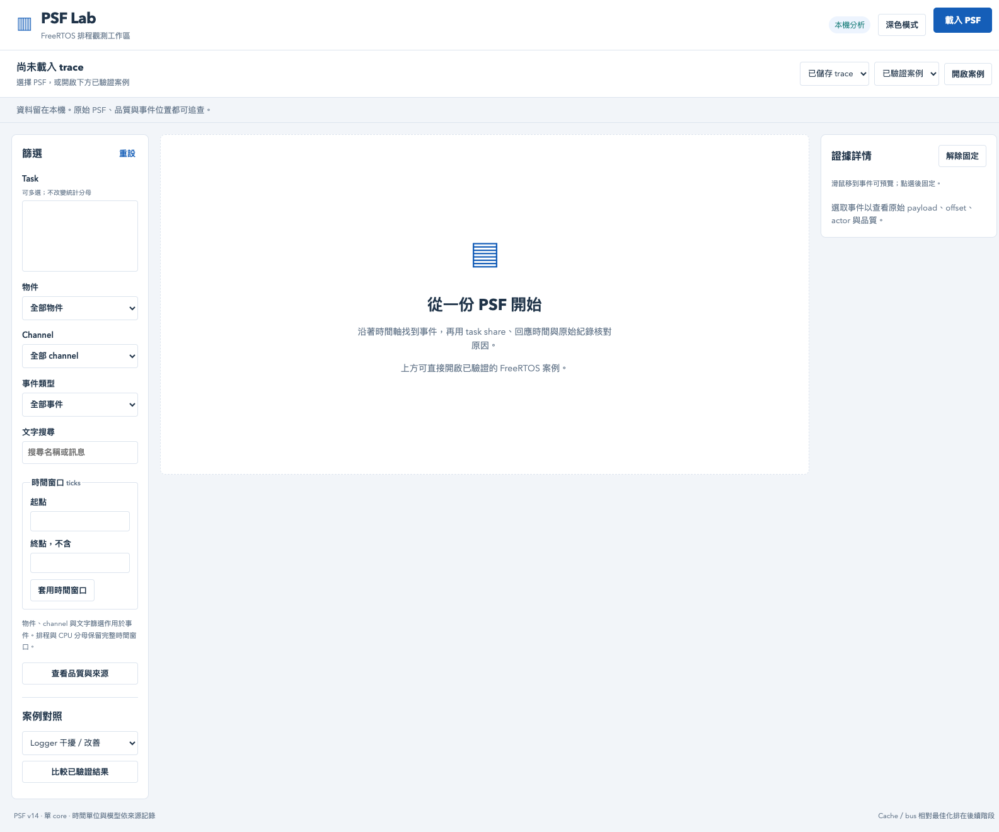

### 2. Server 與離線版：同一份 Queue trace

兩圖都使用 281 events 的真實 RV32 Queue PSF。左側 filters，中間時間軸／execution share／事件表，右側來源與品質。離線頁右上角有模式標示，沒有不可用的上傳／案例比較控制。


### 3. 選 task 與時間窗

選 consumer，再輸入 `[500,50000)` ticks。Task 選取影響 lanes／events，CPU 分母仍保留完整排程。用「重設」恢復；空搜尋結果不代表 CPU 沒執行。

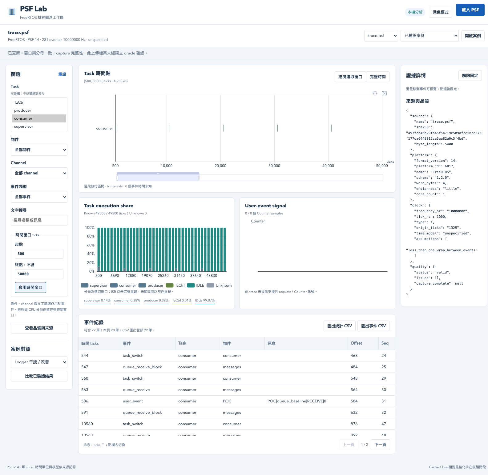


### 4. 用滑鼠拖曳時間軸

點「拖曳選取窗口」後，在圖上拖一段區域。窗口、統計、事件表同步更新；「完整時間」或「重設」可還原。

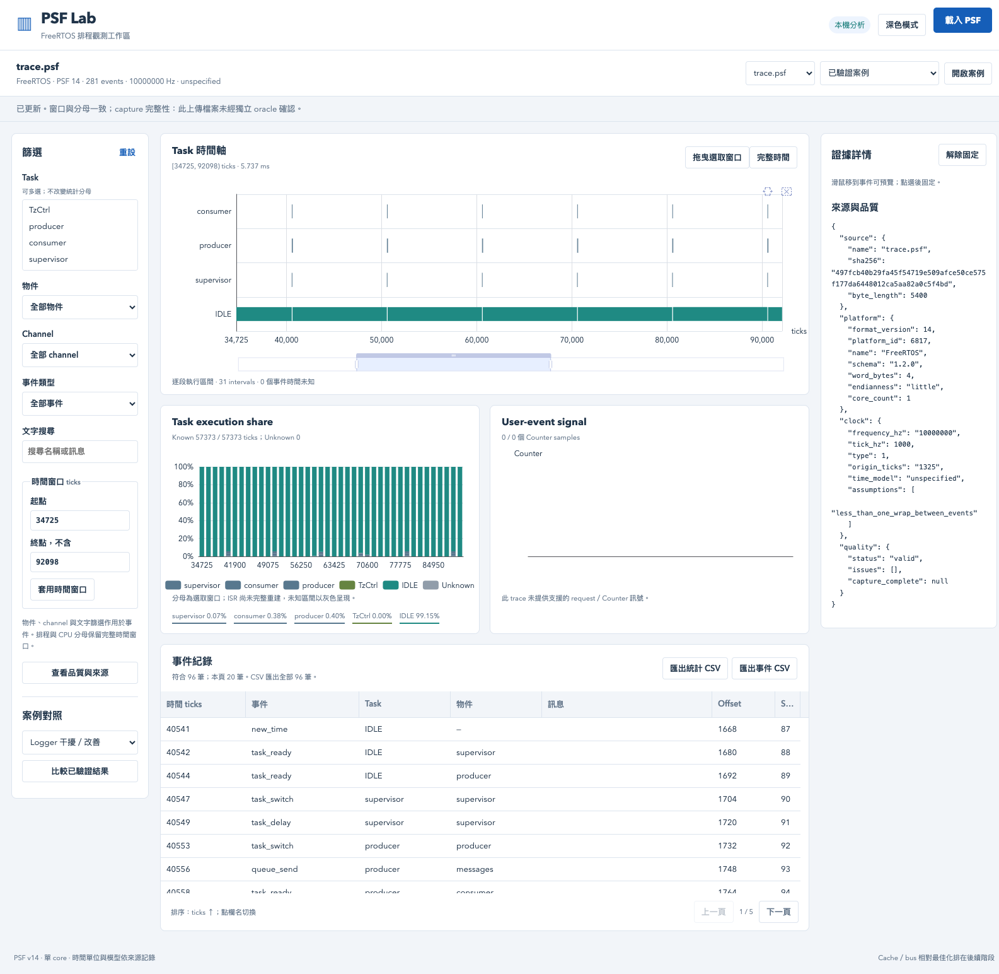


### 5. Hover／點選事件查來源

滑過事件會預覽細節，點擊會固定右側的原始欄位與 offset；用「解除固定」回到 hover。這些欄位用來對照 PSF／JSON，不是自動根因判斷。


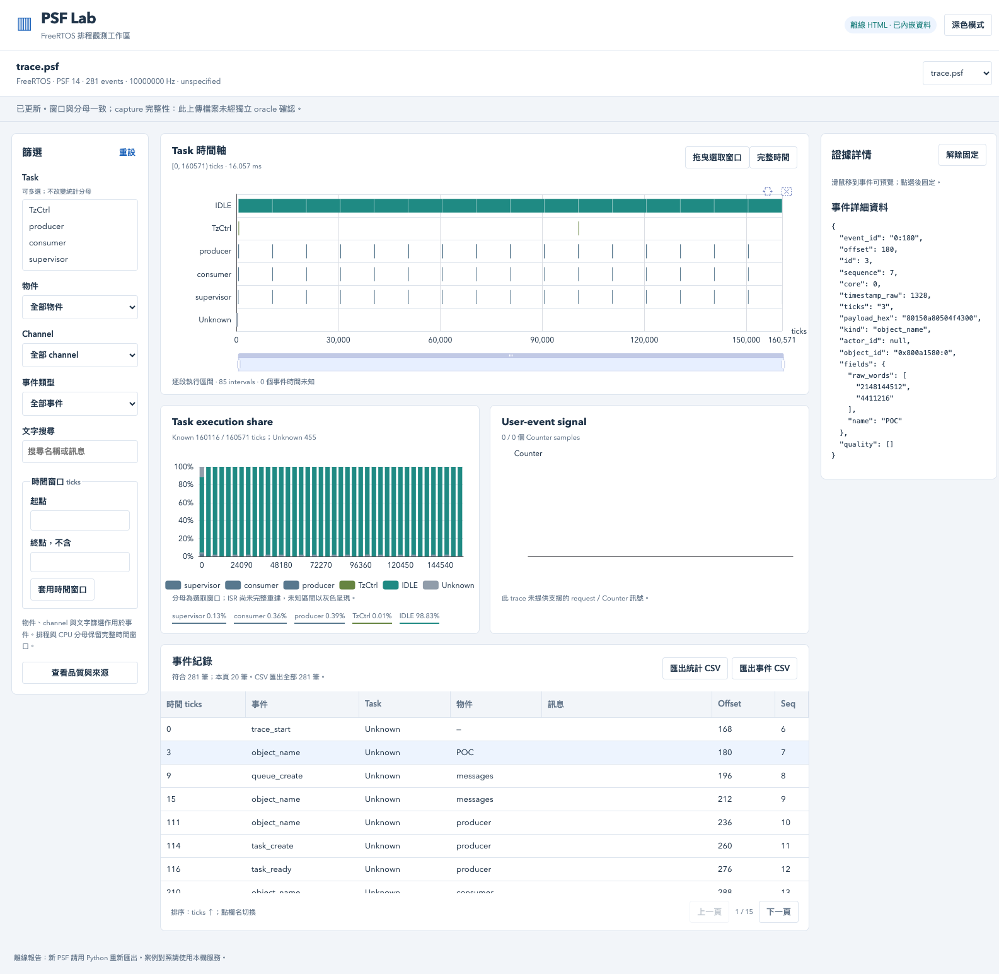

### 6. 排序與調整欄寬

點「時間 ticks」切成倒序，拖曳欄位右緣擴大欄寬。時間以整數語意排序，不能以字串排序。

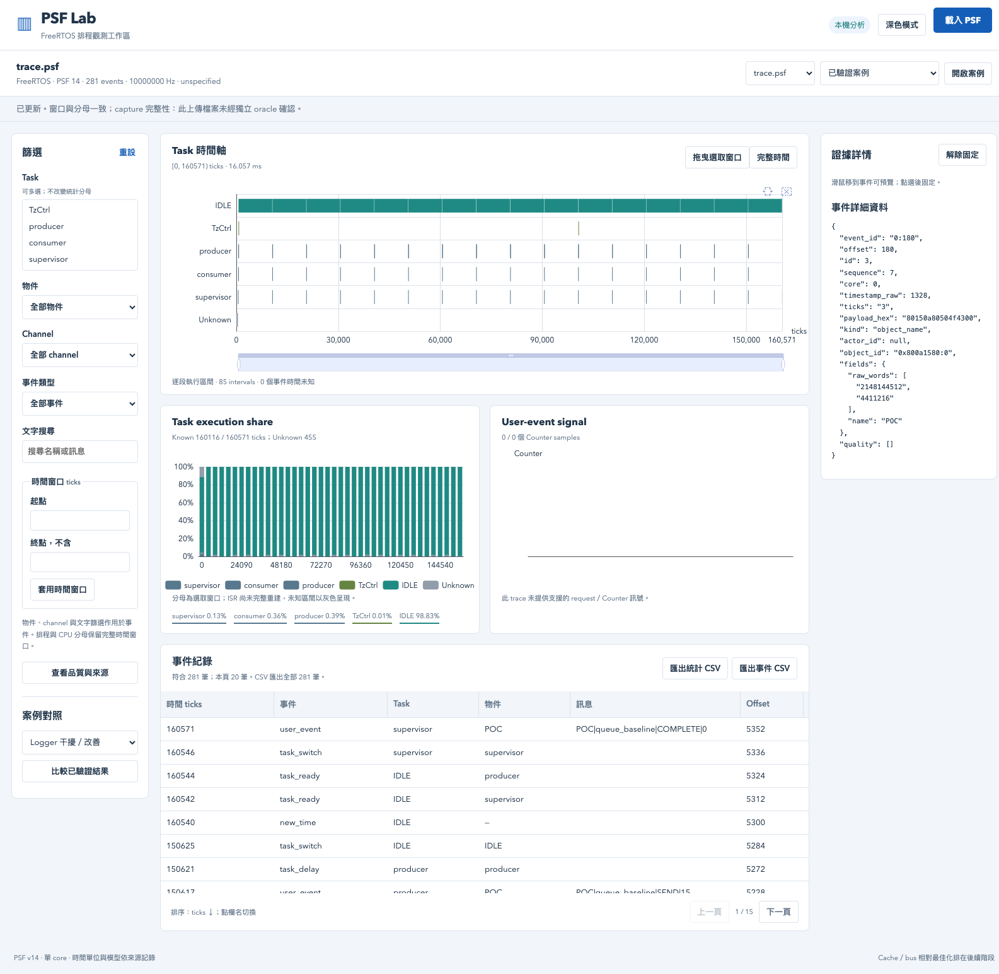


### 7. 匯出完整 CSV

點「匯出事件 CSV」或「匯出統計 CSV」。畫面每頁 20 筆，這份 Queue trace 的完整事件匯出是 281 筆。截圖只表示操作位置；下載列數、排序與數值由 assertions／CSV 檔驗證。


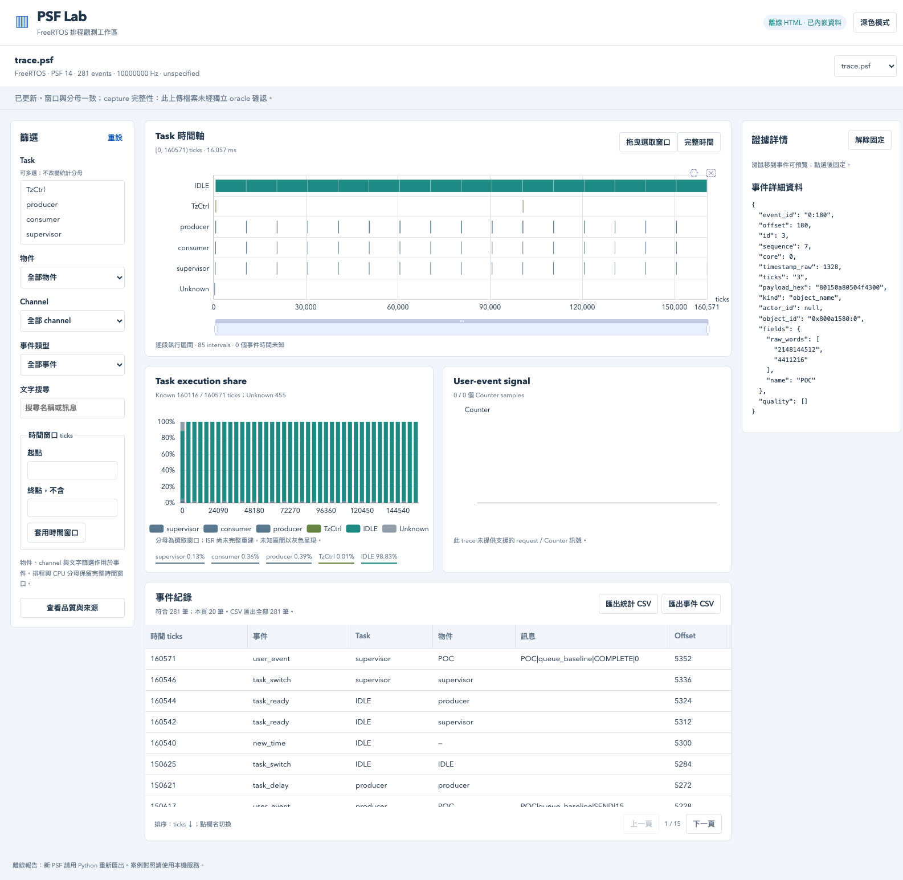

### 8. 空結果與品質

搜尋不存在的文字，事件表應清楚顯示 0 筆，排程與 CPU 分母不應一起消失。「查看品質與來源」可查 SHA、時基與完整性限制。PSF 單檔上傳／匯出沒有附獨立 oracle，因此 capture completeness 不冒充已驗證。


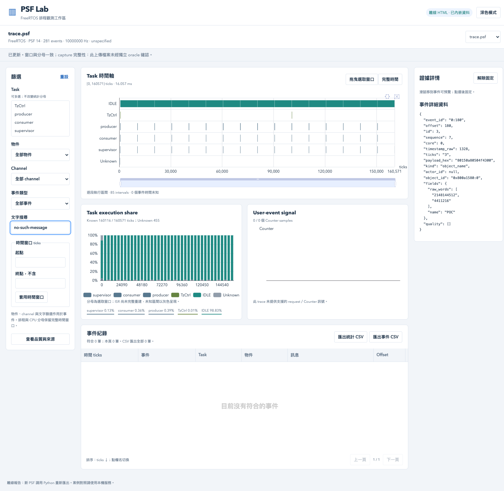

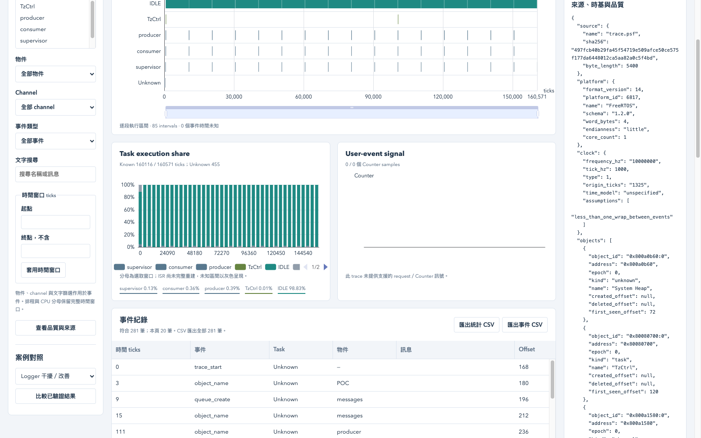

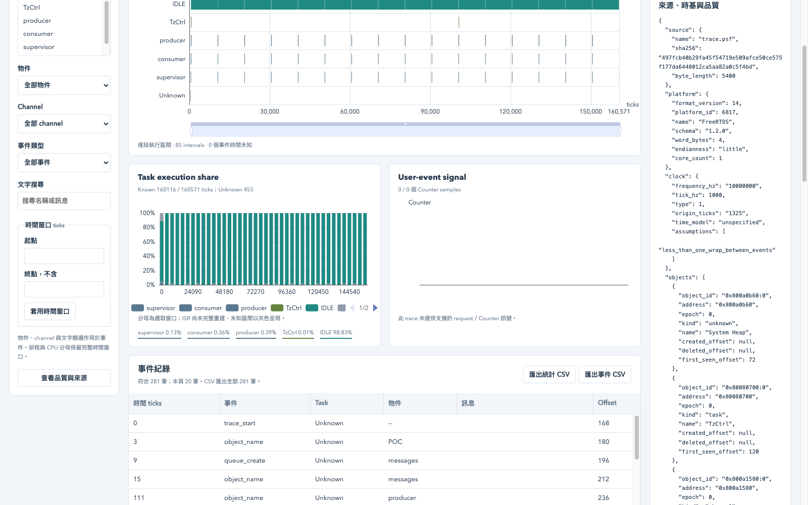

### 9. Server 的案例比較

選 Logger 干擾／改善，再點「比較已驗證結果」。`pass` 表示案例符合各自預期；異常案例的 pass 不表示異常不存在。離線單 trace 報告不提供此 registry 比較。


### 10. 離線品質警示與較大資料

以下截斷案例由 desktop PSF 移除末尾 8 bytes 產生，應顯示 `truncated_payload` 警示，不能當完整 trace。

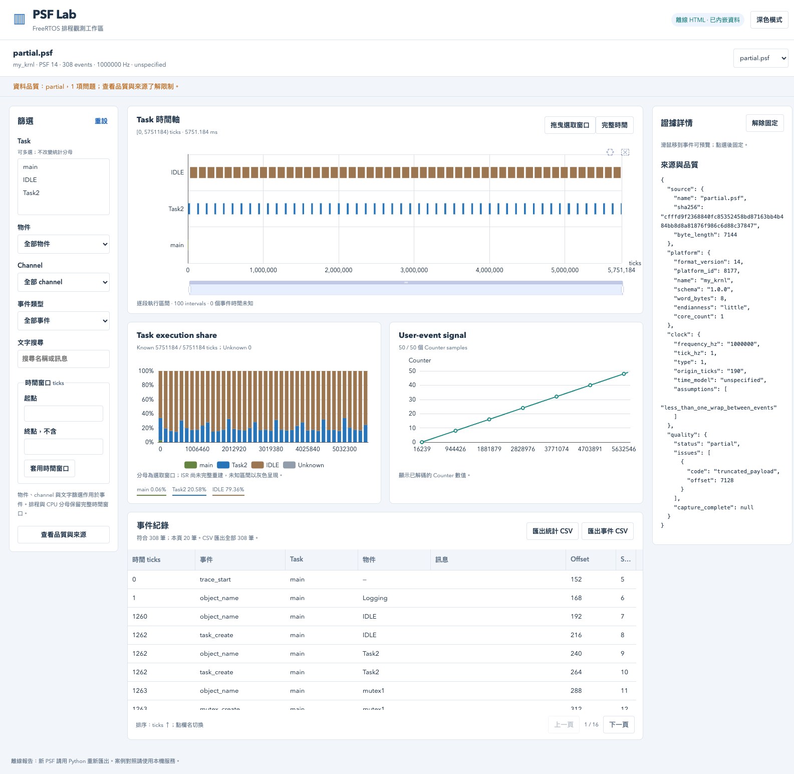

以下是明確標為 synthetic 的 10,000-event 容量案例，不是實體效能量測。E2E 另外核對完整下載列數與 SVG marks 數量。

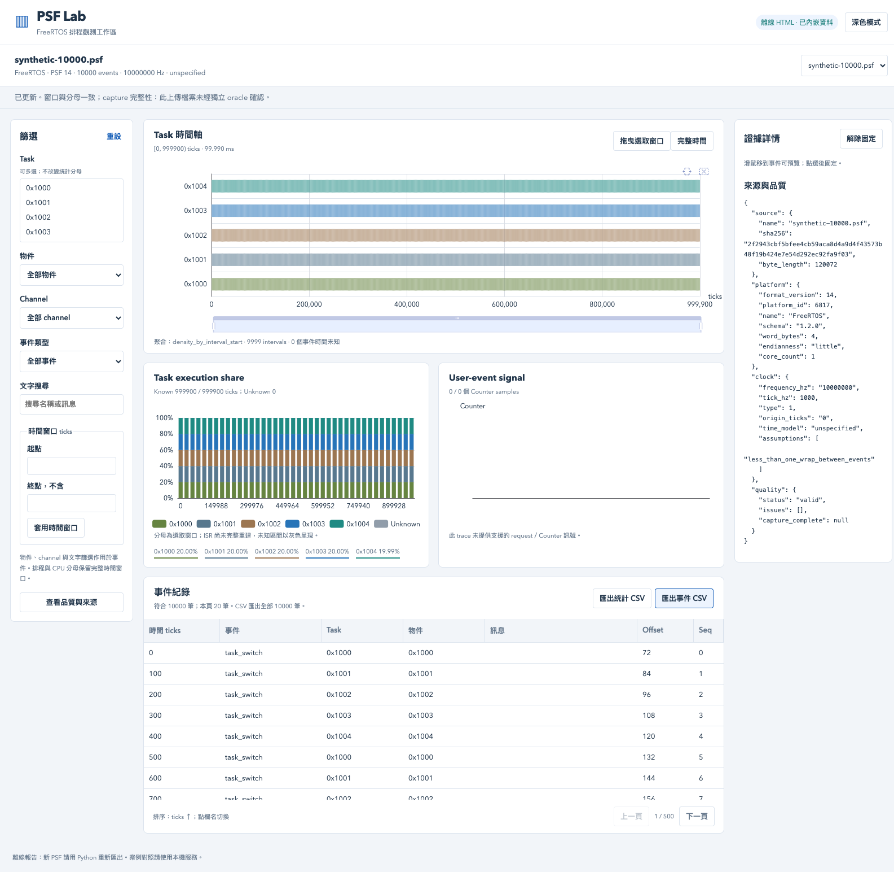

## 驗證方法與證據

- [Python 跨語言查詢／CSV 測試](../tests/unit/test_offline.py)：七個真實案例與大 ticks、Unicode、unknown、負 Counter、空資料、density／truncation。
- [curl integration](../tools/verify_http.py)：真實 HTTP，上傳／metadata／filters／view／CSV／compare／錯誤回應；[結果](../artifacts/verification/offline/http-tests.log)。
- [agent-browser E2E](../tools/verify_browser.py)：兩種模式均實際點選、拖曳、排序、調欄寬與下載；[Server](../artifacts/verification/offline/browser-server.log)、[離線](../artifacts/verification/offline/browser-offline.log)。
- 離線驗收先停止測試 Server，curl 確認無服務；再使用獨立 browser session、offline on、阻擋 HTTP／HTTPS，核對無網路請求與 console errors。
- [Server 圖片 manifest](../artifacts/verification/offline/agent-browser/server/screenshots.json)、[離線圖片 manifest](../artifacts/verification/offline/agent-browser/offline/screenshots.json) 保存 filters、viewport、PNG hash 與程式 commit；同目錄 commands.json 保存每次 agent-browser 操作。

目前測試只代表本機環境。跨機重現依使用者 2B 整項暫緩；不要把離線 HTML 可開啟解讀成其他 OS 已驗證。

## 重跑指定的 integration／E2E

在 POC 根目錄先開啟測試服務：

```sh
.venv/bin/python -m psf_lab serve --port 8767 --store artifacts/local/offline-http/store
```

另一個 shell 執行 `.venv/bin/python tools/verify_http.py`，它以真正 curl 請求建立 trace 並留下 upload.body，再執行 `.venv/bin/python tools/verify_browser.py` 驗 Server。agent-browser 版本與指令以 `agent-browser skills get core` 為準。

停止該測試服務後，執行 `POC_MODE=offline .venv/bin/python tools/verify_browser.py`。該腳本要求下列預先匯出的 fixtures 位於 `artifacts/local/offline-reports/`：

```sh
.venv/bin/python - <<'PYCODE'
from pathlib import Path
from psf_lab.offline import export_html
out = Path("artifacts/local/offline-reports")
out.mkdir(parents=True, exist_ok=True)
source = next(Path("runs/suite-20261003T085652Z-2732b56355").glob("*-queue_baseline-*/trace.psf"))
export_html(source, out / "queue_baseline.html")
partial = out / "partial.psf"
partial.write_bytes(Path("fixtures/desktop/trace.psf").read_bytes()[:-8])
export_html(partial, out / "partial.html")
export_html(Path("artifacts/benchmarks/synthetic-10000.psf"), out / "synthetic-10000.html")
PYCODE
```

這些驗收命令會更新同名本輪 evidence／screenshots；正式歷史 `runs/` 不修改。要保存另一輪完整驗收，先保留原 commit，再提交新證據。若本機服務未停止，offline test 會明確失敗；不會把仍靠服務運作的頁面當成離線成功。
