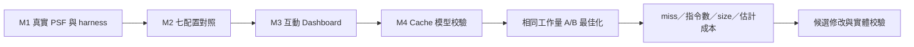

# 後續階段：Cache 相對效能最佳化

狀態：已確認研究方向，排在 M1～M3 完成之後；尚未實作。

使用者明確目的：最佳化軟體 data 與程式碼，使執行更快。接受非 cycle-accurate 模型，要求在可取得資訊下儘量接近平台，主要比較同一模型下修改前後的相對差異。此需求不阻塞目前 PSF／案例／Dashboard。

## 預定順序

1. 固定 QEMU／cache plugin 版本，確認 RISC-V system emulation 可載入並輸出 L1I、L1D、L2 統計；保存 source、參數與 hash。
2. 依產品已知規格設定 cache；未知參數列為假設，使用多組合理配置做敏感度分析，避免單一假設決定結論。
3. 建立獨立可手算案例：冷／暖 cache、working set 跨容量、stride、衝突、讀寫比例。確認 miss 統計、write policy、MMIO／DMA 涵蓋範圍。
4. 建立相同工作量、相同輸出 oracle 的 A/B 案例，測試資料布局、loop traversal／blocking、alignment 與程式碼布局。固定編譯器與最佳化選項，每次只改待比較因子。
5. 增加分時間窗、task、PC／symbol、地址範圍的統計與 Dashboard 視圖；與 PSF 用明確同步點對齊。保留原始結果與 CSV。
6. 比較 L1I／L1D／L2 miss count／rate、load/store count、指令數、code size／working-set size；若加入 penalty 權重，另外呈現模型估計，保存假設與敏感度範圍。
7. 對候選修改用實際硬體或更詳細模型抽查，確認相對排名與改善方向。缺硬體時，結果標示模型內改善，保留待校驗事項。

## 判讀規則

- 相對比較優先；不要求以 QEMU 證明精確 cycle 數。
- 相同輸入、相同完成工作量、相同 cache cold/warm 條件，才能比較。
- Cache miss 減少可能伴隨更多指令或更大程式；同時列出 tradeoff，不能單看 miss rate。
- Cache plugin 若未把 penalty 回灌到 guest，不能期待 PSF response time 自動反映 cache 改善；分別呈現排程時間與 cache 模型結果。
- Miss penalty 可作參數化相對成本估計；不同層級的 hit/miss 分母、是否重複計數、重疊請求與 writeback 必須定義。
- 詳細 bus arbitration／contention 模擬屬後續可選研究，先確認它是否會影響候選修改的相對排名。

本文件先固定需求、邊界、依賴與驗收方向；具體 plugin port 與逐步實作任務在 M3 結束後依查核結果展開。
