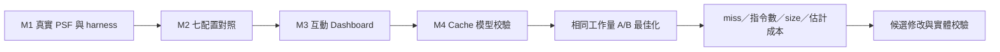
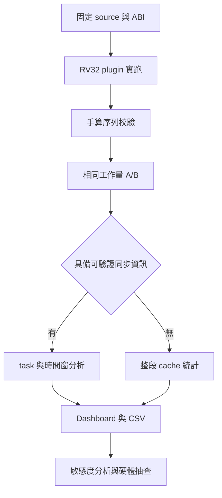

# 後續階段：Cache 相對效能最佳化

狀態：M4.1 與 data-only M4.2／M4.3 已完成，M4.4／M4.5 已有區域整段分析與雙模式 Dashboard；L1I、逐 task 對時及完整 M4.6 尚未完成。

使用者明確目的：最佳化軟體 data 與程式碼，使執行更快。接受非 cycle-accurate 模型，要求在可取得資訊下儘量接近平台，主要比較同一模型下修改前後的相對差異。此需求不阻塞目前 PSF／案例／Dashboard。

## 預定順序

1. 固定 QEMU／cache plugin 版本，確認 RISC-V system emulation 可載入並輸出 L1I、L1D、L2 統計；保存 source、參數與 hash。
2. 依產品已知規格設定 cache；未知參數列為假設，使用多組合理配置做敏感度分析，避免單一假設決定結論。
3. 建立獨立可手算案例：冷／暖 cache、working set 跨容量、stride、衝突、讀寫比例。確認 miss 統計、write policy、MMIO／DMA 涵蓋範圍。
4. 建立相同工作量、相同輸出 oracle 的 A/B 案例，測試資料布局、loop traversal／blocking、alignment 與程式碼布局。固定編譯器與最佳化選項，每次只改待比較因子。
5. 增加分時間窗、task、PC／symbol、地址範圍的統計與 Dashboard 視圖；與 PSF 用明確同步點對齊。保留原始結果與 CSV。
6. 比較 L1I／L1D／L2 miss count／rate、load/store count、指令數、code size／working-set size；若加入 penalty 權重，另外呈現模型估計，保存假設與敏感度範圍。
7. 對候選修改用實際硬體或更詳細模型抽查，確認相對排名與改善方向。缺硬體時，結果標示模型內改善，保留待校驗事項。

## 判讀規則

- 相對比較優先；不要求以 QEMU 證明精確 cycle 數。
- 相同輸入、相同完成工作量、相同 cache cold/warm 條件，才能比較。
- Cache miss 減少可能伴隨更多指令或更大程式；同時列出 tradeoff，不能單看 miss rate。
- Cache plugin 若未把 penalty 回灌到 guest，不能期待 PSF response time 自動反映 cache 改善；分別呈現排程時間與 cache 模型結果。
- Miss penalty 可作參數化相對成本估計；不同層級的 hit/miss 分母、是否重複計數、重疊請求與 writeback 必須定義。
- 詳細 bus arbitration／contention 模擬屬後續可選研究，先確認它是否會影響候選修改的相對排名。

本文件先固定需求、邊界、依賴與驗收方向；具體 plugin port 與逐步實作任務在 M3 結束後依查核結果展開。

## 2026-10-04 接續順序與驗收

本輪已完成前置查核、工作拆分與 M4.1 plugin 載入 smoke；模型校驗與 A/B 尚未完成。現有 M1～M3 與離線功能不需重做。

### 已查核條件

- 本機 `qemu-system-riscv32 --version` 回報 11.1.2。
- `qemu-system-riscv32 -help` 列出 `-plugin`。
- Homebrew 安裝目錄含 `include/qemu-plugin.h`；檔案清單未找到預建 cache plugin。這不等於 plugin 已成功載入。
- [官方 cache plugin 文件](https://www.qemu.org/docs/master/about/emulation.html)列出 L1I／L1D 與 unified L2 設定；master 文件不能取代固定版本 source 的行為查核。
- 真實平台 cache 容量、line size、associativity、write policy、miss penalty 仍未提供。第一階段使用明確標示的模型參數；不得宣稱代表產品。

### 執行階段

| 階段 | 檔案與工作 | 可複查的完成條件 |
|---|---|---|
| M4.1 載入驗證 | 在 `artifacts/local/cache/` 建置固定來源版本的官方 plugin；記錄於 `artifacts/verification/cache/plugin-smoke.json` | source revision、compiler、QEMU／plugin hash、建置命令與 log；RV32 system guest 正常結束並輸出 cache 統計。若 ABI 不合，保存錯誤後採配對版本，不能以 help 輸出當成功 |
| M4.2 模型校驗 | 在 `cases/cache/` 定義 cold／warm、容量邊界、stride、set conflict 與 read/write 案例；新增 `tests/test_cache_analysis.py` | 小型存取序列有獨立手算 oracle；明定 instruction／data、L2 分母、跨 cache line、MMIO、write allocation 與 writeback 行為。無法觀測的欄位標示 unsupported |
| M4.3 同工作量比較 | 在 `firmware/` 加入資料遍歷與 layout A/B；在 `runs/` 保存 manifest／ELF／map／oracle／PSF／cache raw output | A/B 輸入與 checksum 相同；固定 compiler flags、初始化及 cold/warm 條件；每組至少三次，保留不一致結果 |
| M4.4 分析與對時 | 新增 `src/psf_lab/cache_analysis.py` 與對應 unittest；定義版本化 cache JSON | 每個 counter 有來源與單位；task／時間窗口歸屬必須由共同 marker 校驗。沒有時序資料的官方 aggregate 輸出只做整段統計，不能事後編造 task 分攤 |
| M4.5 Dashboard | 延伸既有 server 與 offline 資料契約，加入 cache A/B view、參數說明、CSV 與 tooltip | curl 驗證 API；agent-browser 驗證 server／offline 互動與 CSV；保存截圖並更新 README。缺少 cache 資料的舊 PSF 仍能使用 |
| M4.6 相對成本與硬體校驗 | 文件列出各層級額外 penalty 假設、敏感度分析與候選修改 | 分開呈現 miss、指令數、code size、估計成本與 PSF 時間；硬體尚未校驗時明示模型內比較。bus contention 留作獨立模型需求 |

### 實作規則

- [x] M4.1：取得 v11.1.2 source，配本機 API 7 header 建置並實跑 Queue baseline；exit 0、oracle 與原 run 相同、L1／L2 統計已保存。見 [實驗證據](../../artifacts/verification/cache/README.md)。
- [ ] M4.2：先固定 oracle 與模型語意，再撰寫分析程式。測試必含空資料、缺少 L2、不合法參數與計數不一致。
- [ ] M4.3：確認 guest work checksum 相同，才能比較 cache 結果。
- [ ] M4.4：Python 使用 unittest 與 Ruff；無同步資訊時禁止輸出 task 級 cache 數字。保留原始統計以便重新解析。
- [ ] M4.5：保留既有回歸，新增 curl integration 與 agent-browser E2E；截圖以真實案例產生。
- [ ] M4.6：確認同一筆 miss 不被不同層級重複加總；penalty 為額外成本還是全程延遲須寫明。硬體結果另列，不能以 QEMU 通過結清。

先完成 M4.1 的實測，再依固定版本輸出制定 parser 欄位與逐步實作計畫；目前不預設上游輸出具備 load/store miss 分流或 PSF 同步功能。

實跑發現 system mode instruction address 使用 `qemu_plugin_insn_haddr()`，而 data 使用 guest physical address。M4.2 必須先驗證地址語意與 L2 一致性；未完成前只宣稱 plugin 可執行。

## 2026-10-04 data-region 實作更新

[實作與還原指南](../cache-replay.md)、[實際研究](../research/Cache效率與PSF擴充.md)、[執行計畫](06-cache-replay.md)。

- 已完成：guest physical data capture、十個 cache model tests、六次同 checksum row/column 實跑、三組 geometry、L1D per-residency byte-use、manifest/hash 驗證、Web 與 HTML cache 頁面、來源與 evidence 還原包。
- M4.2／M4.3 的 data-region 子範圍已驗收；官方原版 unified instruction/data 模型仍未校驗完成。
- M4.4／M4.5 只對應整段 workload 與 PSF hash，沒有逐事件 timestamp 或一般 task cache attribution。
- M4.6、L1I hot/cold 拆分、AoS／SoA、tiling、硬體抽查繼續保留未完成，不以目前 data-only 結果結清。
