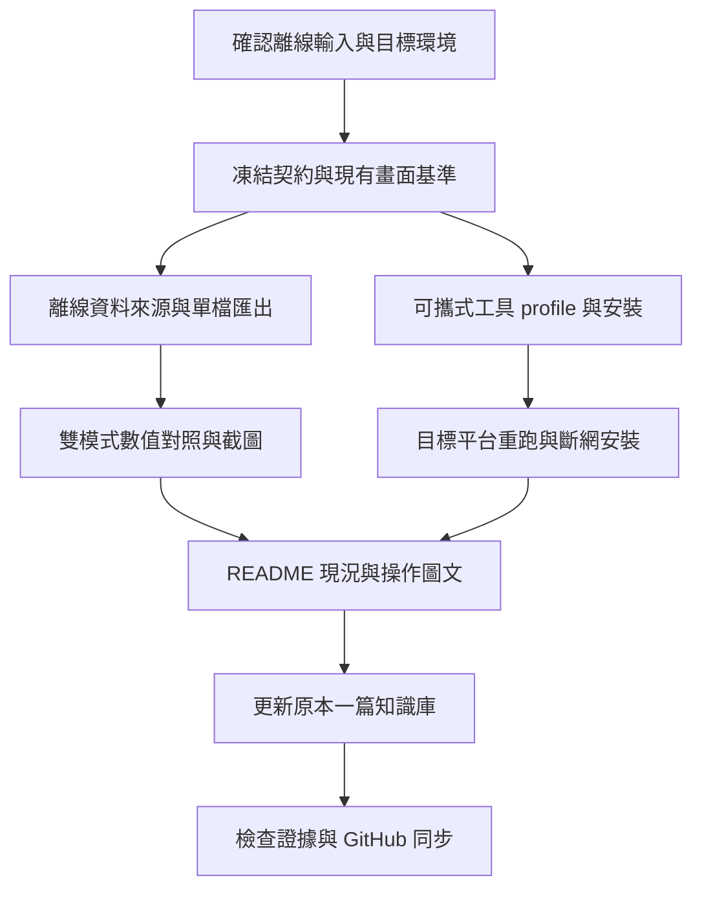

# 離線 HTML、跨機重現與圖文交接計畫草案

> 執行時使用 `superpowers:executing-plans`，延續既有主代理依序實作方式。此輪先做計畫，未開始產品實作。勾選只代表已取得該項驗收證據。

**Goal:** 讓讀者看得懂 Web Server／離線 Dashboard、能在目標環境重現 POC，並從同一篇知識庫找到最新結果。

**Architecture:** 沿用 PSF parser、Python 分析與 SVG Dashboard，增加離線資料來源；將工具鏈身分與本機安裝位置分開。研究 repo、POC repo 與既有知識庫分別保存版本與驗證紀錄。

**Tech Stack:** 現有 Python 3.13、unittest／Ruff、ECharts／Tabulator、esbuild、Node tests／Playwright。新增依賴需先驗證用途與離線封裝能力。

**Spec:** 本文件的「範圍與設計決策」及既有 [資料契約](data-contract.md)、[query semantics](../query-semantics.md)、[Dashboard 設計](../design/PSF-Lab-設計規格.md)。

狀態：2026-10-03 計畫草案。兩項選擇已詢問使用者，尚未收到答案；不得將建議方案視為已確認。確認後補齊選定路徑的函式契約與 RED 測試，再進入實作。

## 範圍與設計決策

使用者指定四項：離線 HTML、跨機重現環境、同步既有一篇知識庫、文件現況整理。新增明確要求：多截圖，讓讀者知道 HTML 與 Web Server 實際畫面，將操作說明放進 README。

本輪不加入 M4 cache、產品 U01～U16 或硬體效能實測。這些保留後續狀態。

### D1：離線 HTML 的輸入

| 路徑 | 做法 | 取捨 |
|---|---|---|
| A，建議首版 | Python 預先解析 PSF，匯出單一 HTML，內嵌完整分析所需資料、JS、CSS | 觀看／篩選／匯出時完全不需要 Python 或網路；新 PSF 需重新匯出 |
| B | 單一 HTML 直接載入任意受支援的原始 PSF，在瀏覽器解碼／分析 | 使用更獨立，但需新增瀏覽器 decoder／分析或封裝 Python runtime，增加容量與一致性驗證 |

A 不能宣稱支援「瀏覽器直接讀新 PSF」。B 不能以只內嵌既有 JSON 冒充完成。若選 B，先比較 JS 移植與內嵌 WASM Python：套件可用性、單檔 file:// 啟動、大小、worker／CSP 限制；保存探測結果後固定方案。

共同要求：真正 `file://` 開啟、斷網且無本機服務；不依賴 CDN、外部字型、API、首次線上快取。圖表使用 SVG；時間窗／filters、hover、表格排序／欄寬、CSV 全部保留。匯出是完整篩選結果，不能只有目前頁面或圖表截取點。

### D2：跨機的目標

待選 Linux x86_64 容器／CI、另一台 macOS arm64，或使用者指定內網平台。現況：本機有 Docker CLI，但 daemon 無法連線。尚無第二台實體機驗證證據。

容器／CI、第二台實體機、斷網安裝分別列結果，不能彼此冒充。缺少執行環境時先完成可驗證的打包／安裝流程，該平台驗收保留未完成；不以同機換目錄聲稱跨機完成。

## 已查核的程式邊界

- `web/src/main.js` 直接建立 `HTTPDataSource`；`web/src/data-source.js` 目前只有 HTTP。
- Python `query.py`、`analysis.py`、`export.py` 負責目前資料查詢、時間窗統計與 CSV，不能只移除 fetch 就得到離線版。
- `web/build.mjs` 產生多檔 `dist`；離線單檔需新增封裝流程並保留第三方 notices。
- `runner.verify_environment(root)` 讀單一 `tools/toolchain-lock.json`，核對絕對路徑、binary hash 與 `.tools/xpack.tar.gz`。
- 不改寫既有 `runs/`、422 個 baseline 或原工具鏈證據；新增環境用新的 profile 與新 run。
- 知識庫目標已找到：`Research/2026-10-03-FREERTOS-RISCV-OBSERVABILITY-RESEARCH.md`，更新同一篇，不另建第二篇。

## 共通驗收與 review 重點

1. ticks 大於 2^53 仍精確；null／unknown、負 Counter、物件 epoch、loss 均維持原語意。
2. 時間窗裁切與 task filter 不得改錯 CPU 分母；CSV 順序、引號、換行與公式字串保護對齊現行行為。
3. 單檔嵌入資料不能讓 `</script>` 或惡意名稱變成可執行程式；不將輸入放入 innerHTML。
4. HTML 大檔、空資料、截斷資料、格式不支援、快速切換 filters，都有可見結果或錯誤，不靜默顯示成功。
5. 工具 binary／archive 被替換、profile 不符、缺套件或沒有網路時要明確失敗；不只檢查工具名稱存在。
6. 每張截圖須有來源 commit、fixture／run hash、模式、瀏覽器版本、viewport、filters 與操作步驟；不能以示意圖冒充實際截圖。

## 順序與交付

以順序實作為預設；圖中獨立依賴不表示自動啟動平行代理。

### P5-T1：基準、資料契約與現有 Web 畫面

檔案：新增 `docs/design/offline-data-contract.md`、`docs/screenshot-guide.md`；擴充 `web/tests/e2e/dashboard.spec.mjs`，截圖存 `artifacts/screenshots/server/`。

- [ ] 確認 D1／D2，記錄確定支援與明確不支援的流程。
- [ ] 列出 DataSource 方法：metadata、events、view、export、traces、compare、runs、runPSF、upload、latest；每項寫明離線能力及 UI 行為，不留下點了才失敗的按鈕。
- [ ] 從現有正式 PSF 選 Queue、logger bad/fixed、inversion/inheritance、deadlock/ordered locks 作為固定案例，不重新合成成功證據。
- [ ] 保存 query／metrics／CSV 對照 fixtures：半開區間、2^53 ticks、unknown、Unicode、負值、loss、超過 2,000 點及全量匯出。
- [ ] 啟動現有 Web Server，執行既有瀏覽器測試並擷取基準畫面；保存 manifest 與實際 PNG。

驗收：契約能指出每個畫面的資料來源、Python 計算點與離線責任；現有功能與截圖來源可重跑。

### P5-T2：離線資料與封裝

預計修改：`web/src/main.js`、`web/build.mjs`、`src/psf_lab/cli.py`。
預計新增：`web/src/offline-data-source.js`、`web/src/offline-query.js`、`src/psf_lab/offline.py`、`tests/unit/test_offline.py`、`web/tests/offline.test.mjs`。若選 B，另外拆 decoder 與分析任務，不能沿用 A 的工期或驗收代替。

A 路徑的提議介面：`psf_lab export-html INPUT.psf --output OUTPUT.html`；`export_html(input_path: Path, output_path: Path) -> dict` 回傳輸入 hash、schema、event_count、輸出 bytes 及 issues。多 trace／成對比較的參數在 T1 依現有 compare 契約固定，不能只保留單一 trace 卻展示可用比較按鈕。

- [ ] 先寫 unittest／Node RED：輸出不存在時正常建立、拒絕覆寫輸入、非法資料不生成假成功、嵌入字串安全。
- [ ] 抽出資料來源選擇，HTTP 模式保留原 API；離線模式不建立 fetch 依賴。
- [ ] 實作離線 filters／排序／時間窗統計／CSV，逐筆對照 T1 的 Python golden 結果；搜尋 casefold 差異、整數精度與 null 排序須有測試。
- [ ] 封裝 CSS／JS／資料／notices 到單檔 HTML，file:// 不做網路 fetch 或載入外部 module。
- [ ] 跑 Python unittest、Ruff、Node tests 與原 Server regression；只有選定路徑通過才能標為完成。

驗收：離線運作保留完整資料分析與 CSV 能力；匯出大小與載入時間實測記錄，不先宣稱效能門檻已通過。

### P5-T3：雙模式瀏覽器驗收與截圖

新增 `web/tests/e2e/offline.spec.mjs`；使用既有 Playwright 設定增加隔離的 file:// 測試，不讓自動啟動的 Server 掩蓋 API 依賴。

- [ ] 關閉 Python Server，以新 browser context 開啟離線 HTML，攔截 HTTP／HTTPS／WebSocket；任何必要網路請求視為失敗。
- [ ] 驗 filters、hover、timeline 拖曳縮放、表格排序／欄寬與 CSV download；對照 Python 結果和同條件 Server 畫面。
- [ ] 測時間窗／搜尋／unknown／大量資料／損壞輸入；保留舊的 2,000 點截取提示與全量匯出語意。
- [ ] 同一案例在 server 與 offline 各截同一畫面；加入 renderer=SVG 的 DOM 斷言，不只看 PNG。
- [ ] 每張圖片實際檢視，修掉被遮住的 tooltip、空白圖、截斷文字、console error；保存正式結果後再更新 README。

### P5-T4：可攜式工具身分與安裝

預計新增 `src/psf_lab/toolchain.py`、`tools/profiles/`、`tests/unit/test_toolchain.py`；修改 `runner.py`、`doctor.py`、CLI 與 `docs/setup.md`。

- [ ] 以 unittest 先驗安裝到不同路徑仍能解析同一工具身分、hash 不符拒絕、host／arch 不符拒絕、未知 profile 拒絕。
- [ ] 將版本／下載來源／archive hash／binary 驗證資訊置於 committed profile；本機路徑解析另存 ignored resolved manifest。
- [ ] 保留舊 lock 與舊 run 的可讀／check 能力，source clean gate 不因本機路徑產物而失敗。
- [ ] 修改 runner 明確選 profile，將 resolved tools、host、profile hash 與來源 commit 寫入新 run manifest。
- [ ] 安裝流程處理 GCC／QEMU／dtc／Python／Node／瀏覽器與 FreeRTOS submodules；針對每個平台固定來源與驗證策略，不複製 macOS binary hash 到 Linux。

驗收：相同 profile 在不同安裝根目錄可用，版本／完整性 gate 仍有效；工具來源尚未查證的 profile 不標為支援。

### P5-T5：目標平台重現與內網材料

預計新增 `tools/reproduction/`、`docs/reproduction.md`、`artifacts/reproduction/`；目標確定後才選 Containerfile、CI workflow 或實體機腳本。

- [ ] 全新 checkout，記錄 OS／arch／容器或實體機、來源 commit、依賴與安裝命令，不能共用原主機 .venv／.tools。
- [ ] 執行單元測試、Ruff、Web build／瀏覽器測試、clock probe 與七案例三輪 suite；核對 oracle／品質和 9 組 pair，而非要求不同平台 PSF 位元完全相同。
- [ ] 準備平台專用 wheels、npm cache／lock、browser、compiler、QEMU runtime dependencies、git submodule 所需物件與 license manifest。
- [ ] 在停用網路的新環境從材料安裝，啟動 Dashboard 並完成至少 Queue capture；保存命令 log、hash、exit code 與缺件清單。
- [ ] 結果區分已驗證／受阻／未執行；Docker daemon 未啟動不算平台驗證成功。

大型套件放本機 delivery 目錄並排除 Git，只提交清單、腳本、hash、說明與必要證據。使用者指定排除的研究 ZIP 不重建上傳。

### P5-T6：README 現況與截圖導覽

修改 POC README、`docs/dashboard-guide.md`、`docs/requirements.md`、`docs/handoff.md`、root README 與相關研究稽核。

- [ ] 將目前狀態置頂，舊 N03／N05／N06／N07／N10／N12 等表格標為歷史快照並指向目前成果；不改寫 baseline。
- [ ] README 加上雙模式快速入口、準備資料、啟動或雙擊 HTML、篩選、定位事件、匯出 CSV 的逐步圖文。
- [ ] 每張圖說包含「正在看什麼、怎麼操作、觀察到什麼、不能據此推論什麼」；只展示該版本真正完成的功能。
- [ ] 更新模式能力表：讀新 PSF、離線互動、多 trace／比較、CSV、需要的 runtime；與 D1 一致。
- [ ] 檢查 POC 相對圖片連結、root README 跨 submodule 的固定 commit 連結、Markdown／Mermaid 與圖片 manifest。

### P5-T7：同步原知識庫與完成稽核

依 `kb-create` 更新既有一篇筆記及其 assets、Research/INDEX.md、LOG.md、README.md；不是建立多篇平行研究。

- [ ] 先檢查 KB 工作樹與遠端，保留既有正文、來源、雙向連結與歷史；有衝突變更時不覆蓋。
- [ ] 加入新版 POC 架構、server／offline 操作圖、重現環境矩陣、測試證據與仍未完成事項。
- [ ] 複用正式截圖，保存圖片來源與 hash；表格型資訊另以 Markdown 呈現，互動畫面保留原截圖以符合使用者要求。
- [ ] 檢查 wikilinks、圖片、索引與 append-only LOG，明確 stage 本次檔案、commit、push，核對遠端 commit。
- [ ] 先保存／push POC 分支，再更新 root submodule pointer；KB 連結指向穩定 commit。保存三處 repo 的發布紀錄。
- [ ] 最後以需求→task→log／PNG／JSON／commit 表逐項結清；未實跑跨機／斷網測試不得勾選完成。

## 截圖清單：至少 14 張實際畫面

| 圖號 | 模式與畫面 | 說明／佐證 |
|---|---|---|
| S01 | Server 初始頁 | 如何上傳／選取資料；顯示模式 |
| S02／O02 | Server／offline：Queue 全覽 | task timeline、CPU share、事件與來源 |
| S03／O03 | Server／offline：同一時間窗＋task filter | CPU 分母與已選條件、篩選結果一致 |
| S04／O04 | Server／offline：timeline hover／局部縮放 | tooltip 的 task／時間／事件細節 |
| S05／O05 | Server／offline：排序表格與欄寬 | 定位事件、選取與細節；非只有表格截圖 |
| S06／O06 | Server／offline：CSV 匯出後狀態 | 附 CSV hash／列數測試；PNG 本身不證明匯出正確 |
| S07 | Server：logger bad/fixed 比較 | 問題與改善；離線比較若納入則加 O07 |
| O01 | 離線 HTML 初始／載入完成 | 無 Server、斷網開啟；網路紀錄另外驗證 |
| O08 | 離線品質警示或受支援錯誤案例 | unknown／loss／截取限制不可隱藏 |

上述合計至少 14 張；需要 tooltip 可讀性時增加局部圖。主 README 精選 6～8 張，其餘放 Dashboard 指南，避免首頁過長。每張附 alt 與圖說；manifest 記錄 PNG SHA-256、source commit、輸入 hash、query、viewport、browser 與 capture command。

## 自我檢查

- 四項使用者需求對應 T2/T3、T4/T5、T7、T6；截圖要求對應 T1/T3/T6。
- D1／D2 尚未確認，因此這份是設計與交付計畫草案，不是可直接執行的完整實作規格。
- 新 Python 功能均需 unittest 與 Ruff；新 JS 語意需 Node 測試；實際 UI 需 Playwright 與圖片人工檢視。
- 目前 96 Python／5 Node／11 browser 是既有基準，不是新增功能已通過的證據。
- 本輪不建立功能完成宣稱、不部署內網、不以容器冒充實體機。
