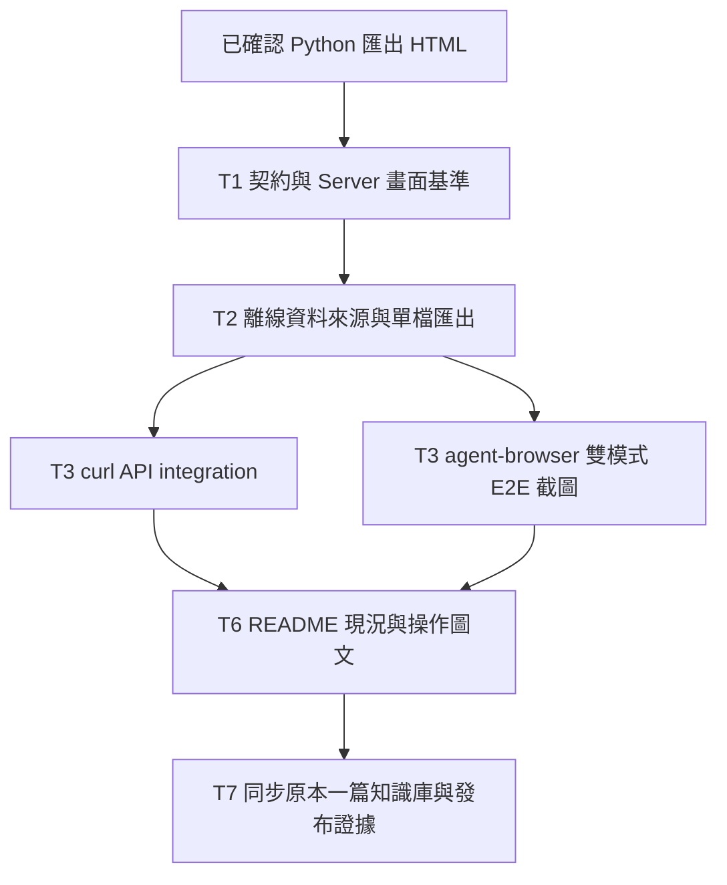

# 離線 HTML、圖文交接與知識庫同步計畫

> 執行時使用 `superpowers:executing-plans`，延續既有主代理依序實作方式。本輪已依使用者 1A／2B 完成實作與指定驗收，跨機整項暫緩。勾選只代表已取得該項驗收證據。

**Goal:** 讓讀者看得懂 Web Server／離線 Dashboard、能離線分析已匯出的 PSF 資料，並從同一篇知識庫找到最新結果。

**Architecture:** 沿用 PSF parser、Python 分析與 SVG Dashboard，增加離線資料來源；跨機重現整項暫緩，本輪不修改工具鏈。研究 repo、POC repo 與既有知識庫分別保存版本與驗證紀錄。

**Tech Stack:** 現有 Python 3.13、unittest／Ruff、ECharts／Tabulator、esbuild、Node tests、agent-browser E2E 與 curl API integration；既有 Playwright 保留回歸用途。新增依賴需先驗證用途與離線封裝能力。

**Spec:** 本文件的「範圍與設計決策」及既有 [資料契約](data-contract.md)、[query semantics](../query-semantics.md)、[Dashboard 設計](../design/PSF-Lab-設計規格.md)。

狀態：2026-10-03 使用者已選 1A、2B：Python 預先產生離線 HTML；跨機重現整項暫緩。追加指定 agent-browser 做 E2E、curl 做 integration。本文件已依選擇收斂範圍；離線功能與指定工具驗證已完成；知識庫發布以本輪 completion.json 記錄為準。

## 範圍與設計決策

本輪執行三項：離線 HTML、同步既有一篇知識庫、文件現況整理。原跨機重現依使用者 2B 整項暫緩，包含移除寫死路徑、安裝材料與跨平台測試。新增明確要求：多截圖，讓讀者知道 HTML 與 Web Server 實際畫面，將操作說明放進 README。

本輪不加入 M4 cache、產品 U01～U16 或硬體效能實測。這些保留後續狀態。

### D1：離線 HTML 的輸入

已選 A：Python 預先解析 PSF，匯出單一 HTML，內嵌完整分析所需資料、JS、CSS。觀看／篩選／匯出時不需要 Python 或網路；要換新 PSF 時重新執行匯出命令。

瀏覽器直接解碼新的原始 PSF 不在本輪範圍。離線頁面明示資料為已內嵌的 trace，不保留不可用的 PSF upload 控制。

共同要求：真正 `file://` 開啟、斷網且無本機服務；不依賴 CDN、外部字型、API、首次線上快取。圖表使用 SVG；時間窗／filters、hover、表格排序／欄寬、CSV 全部保留。匯出是完整篩選結果，不能只有目前頁面或圖表截取點。

### D2：跨機重現整項暫緩

不詢問目標平台、不建容器／CI、不修改工具鏈、不準備跨機安裝包。本輪只驗目前本機 Server 與無 Server 的 file:// 離線 HTML。跨機重現保留後續未完成事項，不是此輪阻塞。

## 已查核的程式邊界

- `web/src/main.js` 直接建立 `HTTPDataSource`；`web/src/data-source.js` 目前只有 HTTP。
- Python `query.py`、`analysis.py`、`export.py` 負責目前資料查詢、時間窗統計與 CSV，不能只移除 fetch 就得到離線版。
- `web/build.mjs` 產生多檔 `dist`；離線單檔需新增封裝流程並保留第三方 notices。
- `runner.verify_environment(root)` 讀單一 `tools/toolchain-lock.json`，核對絕對路徑、binary hash 與 `.tools/xpack.tar.gz`。
- 不改寫既有 `runs/`、422 個 baseline 或原工具鏈證據。
- 知識庫目標已找到：`Research/2026-10-03-FREERTOS-RISCV-OBSERVABILITY-RESEARCH.md`，更新同一篇，不另建第二篇。

## 共通驗收與 review 重點

1. ticks 大於 2^53 仍精確；null／unknown、負 Counter、物件 epoch、loss 均維持原語意。
2. 時間窗裁切與 task filter 不得改錯 CPU 分母；CSV 順序、引號、換行與公式字串保護對齊現行行為。
3. 單檔嵌入資料不能讓 `</script>` 或惡意名稱變成可執行程式；不將輸入放入 innerHTML。
4. HTML 大檔、空資料、截斷資料、格式不支援、快速切換 filters，都有可見結果或錯誤，不靜默顯示成功。
5. curl 驗證真實 HTTP 狀態、回應 schema／內容與 CSV，不以 mock 或單純 200 取代 integration；agent-browser 真正操作兩種模式，不以 API 通過代替 E2E。
6. 每張截圖須有來源 commit、fixture／run hash、模式、瀏覽器版本、viewport、filters 與操作步驟；不能以示意圖冒充實際截圖。

## 順序與交付



以順序實作為預設；圖中獨立依賴不表示自動啟動平行代理。

### P5-T1：基準、資料契約與現有 Web 畫面

檔案：新增 `docs/design/offline-data-contract.md`、`docs/screenshot-guide.md`；擴充 `web/tests/e2e/dashboard.spec.mjs`，截圖存 `artifacts/screenshots/server/`。

- [x] 依已確認 1A／2B 固定支援流程、資料契約與本輪排除項目。
- [x] 列出 DataSource 方法：metadata、events、view、export、traces、compare、runs、runPSF、upload、latest；每項寫明離線能力及 UI 行為，不留下點了才失敗的按鈕。
- [x] 從現有正式 PSF 選 Queue、logger bad/fixed、inversion/inheritance、deadlock/ordered locks 作為固定案例，不重新合成成功證據。
- [x] 保存 query／metrics／CSV 對照 fixtures：半開區間、2^53 ticks、unknown、Unicode、負值、loss、超過 2,000 點及全量匯出。
- [x] 啟動現有 Web Server，執行既有瀏覽器測試並擷取基準畫面；保存 manifest 與實際 PNG。

驗收：契約能指出每個畫面的資料來源、Python 計算點與離線責任；現有功能與截圖來源可重跑。

### P5-T2：離線資料與封裝

預計修改：`web/src/main.js`、`web/build.mjs`、`src/psf_lab/cli.py`。
預計新增：`web/src/offline-data-source.js`、`web/src/offline-query.js`、`src/psf_lab/offline.py`、`tests/unit/test_offline.py`、`web/tests/offline.test.mjs`。本輪不增加瀏覽器 PSF decoder 或 WASM runtime。

已選 A 的規劃介面：`psf_lab export-html INPUT.psf --output OUTPUT.html`；`export_html(input_path: Path, output_path: Path) -> dict` 回傳輸入 hash、schema、event_count、輸出 bytes 及 issues。多 trace／成對比較的參數在 T1 依現有 compare 契約固定，不能只保留單一 trace 卻展示可用比較按鈕。

- [x] 先寫 unittest／Node RED：輸出不存在時正常建立、拒絕覆寫輸入、非法資料不生成假成功、嵌入字串安全。
- [x] 抽出資料來源選擇，HTTP 模式保留原 API；離線模式不建立 fetch 依賴。
- [x] 實作離線 filters／排序／時間窗統計／CSV，逐筆對照 T1 的 Python golden 結果；搜尋 casefold 差異、整數精度與 null 排序須有測試。
- [x] 封裝 CSS／JS／資料／notices 到單檔 HTML，file:// 不做網路 fetch 或載入外部 module。
- [x] 跑 Python unittest、Ruff、Node tests 與原 Server regression；只有選定路徑通過才能標為完成。

驗收：離線運作保留完整資料分析與 CSV 能力；匯出大小與載入時間實測記錄，不先宣稱效能門檻已通過。

### P5-T3：curl integration、agent-browser E2E 與截圖

新增 `tools/verify_http.sh`、`docs/agent-browser-e2e.md`；驗收 log 保存於 `artifacts/verification/offline/`。使用 agent-browser 隔離 session 實際操作 HTTP 與 file://；既有 Playwright 只作額外回歸，不能取代指定的 agent-browser。

- [x] 用 curl 呼叫真實服務，保存 status、headers、body；驗 PSF 上傳、metadata、分頁／filters、view／metrics、完整 CSV、comparison 與非法輸入。
- [x] 關閉 Python Server，以 agent-browser 新 session 開啟離線 HTML，攔截 HTTP／HTTPS／WebSocket；任何必要網路請求視為失敗。
- [x] 驗 filters、hover、timeline 拖曳縮放、表格排序／欄寬與 CSV download；對照 Python 結果和同條件 Server 畫面。
- [x] 測時間窗／搜尋／unknown／大量資料／損壞輸入；保留舊的 2,000 點截取提示與全量匯出語意。
- [x] 同一案例在 server 與 offline 各截同一畫面；加入 renderer=SVG 的 DOM 斷言，不只看 PNG。
- [x] 每張圖片實際檢視，修掉被遮住的 tooltip、空白圖、截斷文字、console error；保存正式結果後再更新 README。

### P5-T4／T5：跨機重現，依 2B 暫緩

保留任務 ID 供追查。工具 profile、路徑改造、跨機安裝／重跑、容器／CI、內網離線安裝材料均不在本輪實作或驗收範圍，不勾為完成。

### P5-T6：README 現況與截圖導覽

修改 POC README、`docs/dashboard-guide.md`、`docs/requirements.md`、`docs/handoff.md`、root README 與相關研究稽核。

- [x] 將目前狀態置頂，舊 N03／N05／N06／N07／N10／N12 等表格標為歷史快照並指向目前成果；不改寫 baseline。
- [x] README 加上雙模式快速入口、準備資料、啟動或雙擊 HTML、篩選、定位事件、匯出 CSV 的逐步圖文。
- [x] 每張圖說包含「正在看什麼、怎麼操作、觀察到什麼、不能據此推論什麼」；只展示該版本真正完成的功能。
- [x] 更新模式能力表：讀新 PSF、離線互動、多 trace／比較、CSV、需要的 runtime；與 D1 一致。
- [x] 檢查 POC 相對圖片連結、root README 跨 submodule 的固定 commit 連結、Markdown／Mermaid 與圖片 manifest。

### P5-T7：同步原知識庫與完成稽核

依 `kb-create` 更新既有一篇筆記及其 assets、Research/INDEX.md、LOG.md、README.md；不是建立多篇平行研究。

- [x] 先檢查 KB 工作樹與遠端，保留既有正文、來源、雙向連結與歷史；有衝突變更時不覆蓋。
- [x] 加入新版 POC 架構、server／offline 操作圖、本機驗證範圍與跨機暫緩狀態、測試證據與仍未完成事項。
- [x] 複用正式截圖，保存圖片來源與 hash；表格型資訊另以 Markdown 呈現，互動畫面保留原截圖以符合使用者要求。
- [x] 檢查 wikilinks、圖片、索引與 append-only LOG，明確 stage 本次檔案、commit、push，核對遠端 commit。
- [x] 先保存／push POC 分支，再更新 root submodule pointer；KB 連結指向穩定 commit。保存三處 repo 的發布紀錄。
- [x] 最後以需求→task→log／PNG／JSON／commit 表逐項結清；未實跑跨機／斷網測試不得勾選完成。

## 指定工具的驗收方式

### curl：真實 API integration

在獨立暫存 store 啟動本機服務，保存 server PID，測後只關閉本次服務。以下從 POC 根目錄執行；commands 是未執行的驗收範本。

```sh
mkdir -p artifacts/local/offline-http
.venv/bin/python -m psf_lab serve --port 8767 --store artifacts/local/offline-http/store
# 另一個 shell：
curl --fail-with-body --silent --show-error \
  -D artifacts/local/offline-http/upload.headers \
  -F file=@fixtures/desktop/trace.psf \
  http://127.0.0.1:8767/api/traces \
  -o artifacts/local/offline-http/upload.json
```

驗證器從回應讀取 trace ID，不寫死 ID；向 `/api/traces/{id}/events`、`view`、`export` 傳相同 filters。events body 固定 `{"filters":{},"sort":[{"field":"ticks","direction":"asc"}],"offset":0,"limit":2}`，CSV body 使用相同 filters／sort 並加 `"kind":"events"`。必須證明 CSV 含全部符合列，不只 events 的兩列。

負向案例：不存在 trace、非法時間窗、非法排序、格式錯誤 PSF。保存預期 HTTP status 與結構化 error；負向 curl 不用 `--fail` 掩蓋 body。比較 view／CSV 與 Python 直接計算結果，正確性 assertions 有 unittest；shell 任何非預期狀態要非零退出。

### agent-browser：完整操作與圖片證據

執行前使用 `agent-browser skills get core` 取得與版本一致的指令。使用獨立 session、先 snapshot 取得 refs，每次畫面變更重新 snapshot，不硬編過期 refs。

```sh
agent-browser --session poc-server open http://127.0.0.1:8767
agent-browser --session poc-server snapshot -i
agent-browser --session poc-server screenshot artifacts/screenshots/server/overview.png
# 實際 click／fill／select／hover／drag／download 操作與每步 assertions 另存 E2E 操作 log。
agent-browser --session poc-server close
```

離線測試在匯出後關閉本次 Python process，用 curl 確認該 port 連線失敗，再以 agent-browser 新 session 載入該 HTML 的絕對 `file://` URL。啟用瀏覽器離線／攔截網路並保存證據；正確判斷應為不存在必要的 HTTP／HTTPS／WebSocket 請求，而非只證明原 port 關閉。

E2E 必須實際完成選資料、filters、timeline 操作、hover、排序／欄寬、下載 CSV；核對下載檔內容和 hash。PNG 不取代 DOM／數值／網路 assertions。若某 agent-browser 指令受版本限制，先核對完整 CLI reference；不能靜默改成只有 Playwright 通過就結案。

正式保存 `artifacts/verification/offline/http/` 與 `artifacts/verification/offline/agent-browser/` 的命令、stdout／stderr、assertions、來源 commit、PSF／HTML／CSV hashes；截圖維持獨立 manifest。所有測試證據去除與案例無關的本機敏感資料，不保存 credentials。

## 截圖清單：至少 14 張（本輪已保存 20 張）實際畫面

| 圖號 | 模式與畫面 | 說明／佐證 |
|---|---|---|
| S01 | Server 初始頁 | 如何上傳／選取資料；顯示模式 |
| S02／O02 | Server／offline：Queue 全覽 | task timeline、CPU share、事件與來源 |
| S03／O03 | Server／offline：同一時間窗＋task filter | CPU 分母與已選條件、篩選結果一致 |
| S04／O04 | Server／offline：timeline hover／局部縮放 | tooltip 的 task／時間／事件細節 |
| S05／O05 | Server／offline：排序表格與欄寬 | 定位事件、選取與細節；非只有表格截圖 |
| S06／O06 | Server／offline：CSV 匯出後狀態 | 附 CSV hash／列數測試；PNG 本身不證明匯出正確 |
| S07 | Server：logger bad/fixed 比較 | 問題與改善；離線比較若納入則加 O07 |
| O01 | 離線 HTML 初始／載入完成 | 無 Server、斷網開啟；網路紀錄另外驗證 |
| O08 | 離線品質警示或受支援錯誤案例 | unknown／loss／截取限制不可隱藏 |

上述合計至少 14 張（本輪已保存 20 張）；需要 tooltip 可讀性時增加局部圖。主 README 精選 6～8 張，其餘放 Dashboard 指南，避免首頁過長。每張附 alt 與圖說；manifest 記錄 PNG SHA-256、source commit、輸入 hash、query、viewport、browser 與 capture command。

## 執行補充

採用單 trace 匯出；無離線 registry／oracle compare，UI 清楚標示 Server 能力。curl runner 使用 Python unittest 呼叫實際 curl，取代草案中的 shell 檔名，以便直接核對 status／JSON／CSV。agent-browser 用穩定 CSS selector 配合 snapshot；操作前先 scrollIntoView，避免目前 CLI 對畫面外控制項回報成功卻未操作。

## 自我檢查

- 本輪三項需求對應 T2/T3、T7、T6；截圖要求對應 T1/T3/T6。T4/T5 依 2B 暫緩。
- D1／D2 已確認，沒有尚待使用者選擇的輸入或平台問題。
- 新 Python 功能均需 unittest 與 Ruff；新 JS 語意需 Node 測試；實際 UI 需 agent-browser E2E 與圖片人工檢視；真實 API integration 使用 curl，既有 Playwright 另做回歸。
- 目前 96 Python／5 Node／11 browser 是既有基準，不是新增功能已通過的證據。
- 本輪不建立功能完成宣稱、不部署內網、不以容器冒充實體機。
