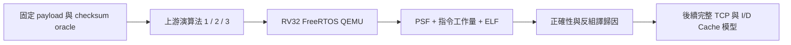

# TCP/IP 真實元件與 cache 研究計畫

使用者要求：找適合 FreeRTOS/RISC-V 的 TCP/IP stack、搜尋真實最佳化案例、先跑測試並分析瓶頸。完整 stack 選擇與「100–200 K」定義已詢問，尚未定案。先用 lwIP 原版 checksum 建立兩個候選都適用的元件比較方法；不代表替使用者選定正式 stack。

- [x] 整理 FreeRTOS+TCP / lwIP、實際案例與來源。
- [x] 固定 lwIP 2.2.1 原始碼、授權、SHA256。
- [x] Python unittest 獨立 checksum oracle，檢查奇偶長度及對齊。
- [x] RV32 + FreeRTOS 實跑上游 checksum 三種演算法，保存 PSF、ELF、反組譯、oracle、重跑結果。
- [x] 分析 instruction work、code size；不可宣稱硬體 cycles / Mbps / cache miss。
- [x] 後續於 plan 09 完成：確定 stack 後做 TCP handshake / data / ACK / retransmit workload。
- [x] 後續於 plan 09 完成：擴充 instruction + data trace、共用 L2 模型，再比較 cache。
- [x] 後續於 plan 09 完成：Web 與離線 HTML 同步新增 TCP 視圖，curl integration、agent-browser E2E、截圖。

Cache 目標：L1I = 16 KiB、L1D = 16 KiB、L2 = 64 KiB。Line size、ways、replacement、write policy、inclusive policy 尚未由平台規格確認。先記成待確認欄位，不能把舊 data-only L2 32 KiB 的結果冒充新設定。

AoS/SoA/Hot-cold 的 plan 07 與未完成檔案保留，優先順序移至 TCP 研究之後。

驗證證據：`runs/tcp-checksum-v2/manifest.json`、`results.json` 與 9 個 captures；詳細分析見 [TCP/IP 研究報告](../research/TCP-IP與Cache最佳化案例.md)。獨立 review 發現的增量 build / provenance 問題已修正並重跑。

本輪延伸結果：[真 TCP 最佳化驗證](../tcp-optimization.md)。此完成範圍為 bounded raw-API testcase，不含 NIC/DMA 或產品 socket port。
