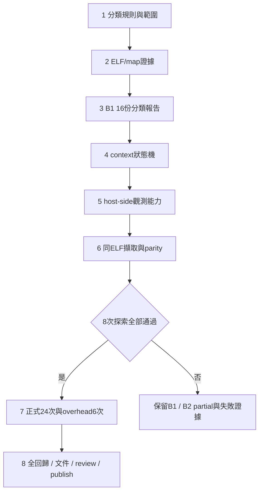

# B 成本歸屬 Implementation Plan

> **For agentic workers:** REQUIRED SUB-SKILL: 使用 `superpowers:executing-plans` 逐項執行。沿用本 session 主代理實作、最後獨立 review；不另詢問執行方式。

**Goal:** 交付可守恆、可追溯的 code-role／context 成本報告，核對 A02 反例並為 C 的定位視圖提供資料。

**Architecture:** B1 讀取 A 的16份 injection representative trace，以 ELF/map/source provenance 分類；B2 對同一 ELF 加 opt-in QEMU context sidecar，經 parity gate 後才承認 task/IRQ 歸屬。所有輸出獨立保存，維持 A 的資料與既有介面。

**Tech Stack:** 既有 Python 3.13、unittest、Ruff、GCC/binutils、RV32 patched QEMU、C/GLib plugin；不新增 Python／Node dependency。

**Spec:** [已核准 B 設計](../design/cost-attribution-b.md)。使用者於2026-10-08回覆 OK 核准設計；使用者隨後以 go 核准執行。Task 1–7 已完成；Task 8 的 UI 回歸與發佈受環境限制，詳見 ../../artifacts/verification/cost-attribution/completion.json。

## Global Constraints

- 固定 L1I 8192、L1D 8192、L2 32768 bytes，64-byte line、4-way、LRU、write-through/write-allocate、-Os、RV32單核心。
- 模型為1 ns/instruction + 2 ns/memory cycle；control僅算shadow cost，injection才注入memory service。
- 不修改FreeRTOS、guest firmware、PSF格式；不重新編譯B2的guest ELF，不覆寫A manifests／captures／frozen HTML。
- Context和code-role是兩個維度；unknown與unresolved不丟棄，不依callee名稱推測task或caller。
- 既有control ticks==0、observer切換與200 ns guard不變。缺CSR/task pointer、parity不同、真實nested trap一律拒絕exact-context acceptance。
- B1重播16份；B2能力探索8次、正式24次、host overhead6次，三類目錄分開，失敗也保留。
- Python變更新增unittest、先red再green；正式capture前clean commit。會寫tracked artifacts的UI驗收與clean-source integration依序執行。
- 文件與中間檔放poc/；沿用現有feature checkout。資料輸出期間用runs/local/或明確的.git/info/exclude保護clean gate，完成後force-add證據。
- B不新增Dashboard頁面；C1/C2接入Web/離線。跨機驗證仍暫緩。

## Review Focus

1. ELF/map不配對、hash清單少key或path traversal：Task 2/5必須拒絕，不能只驗證清單已列出的項目。
2. aliases、重疊／零size／discarded sections和shared libc：Task 1/2保留unresolved與來源，不猜symbol長度。
3. mret後立即retrap、缺初始task、nested return：Task 4/5用明確順序測試；不能用selected TCB冒充外層IRQ。
4. control shadow cost被當guest elapsed、成本被重複加總：Task 3/4核對兩維度與mode標籤；零分母回null。
5. 插入host觀測後改變raw size/order、PSF identity/time或guest結果：Task 6/7保存完整parity差異並停止，不能只比總cycles。

## 執行順序與檔案邊界



所有新增Python模組的public API在所屬Task定義；code blocks保留原始實作指引及測試契約；目前實作以對應來源檔與驗證收據為準。每個Task先確認前置Task測試通過再開始；不得平行修改collector與正在擷取的來源。

## Task 1：互斥的code-role規則與PC範圍

**Files:** 新增 `src/psf_lab/cost_attribution.py`、`cases/timing/attribution-rules-v1.json`、`tests/unit/test_cost_attribution.py`。

**Interfaces:**

```python
# 公開介面。records經Task 2解析；start/end為整數、半開區間。
def normalize_ranges(records: list[dict]) -> list[dict]: ...
def resolve_pc(ranges: list[dict], pc: int) -> dict: ...
# records與回傳owner欄位：start, end, role, function, aliases,
# object, source, evidence, reason。unknown owner的start/end為None。
```

`...` 僅為Python signature表示法，實作規則如下：數值用strict int，拒絕bool／負值／end<=start；先合併同range、同role且同object的aliases。部分重疊或角色／object衝突，交集查詢回unresolved和`overlap_conflict`，不讓排序決定贏家。PC不在任何range回`no_executable_owner`。function未知但object已知時保留role，function用`unresolved@<object>:<start>`；禁止與其他不相干unknown函式合併。

規則JSON使用 `schema=code-role-rules-v1`、`abi=rv32`、`rules`；每條保存id、match_kind、value、role。exact source/object/function override優先於source-root；同優先層多個角色命中回unresolved。

- TraceRecorder與firmware/port/trcStreamPort.c → recorder。
- timing_observer且定義來自tcp_request_response.c → observer_entry。
- references/tcp/lwip/ → lwip；third_party/FreeRTOS/ → kernel_port。
- firmware/其餘 → application_harness；libg_nano.a/libc.a/libgcc.a的可驗證archive成員 → runtime_library。
- 其他來源 → unresolved；不以`mem`／`tcp`函式名稱prefix猜分類。

- [x] **先寫手算range測試**。測試方法放進unittest.TestCase；以下是核心斷言：

```python
records = [dict(start=100, end=110, role="lwip", function="f",
                aliases=["f"], object="ip.o", source="ip.c",
                evidence=["map:20"], reason=None)]
ranges = normalize_ranges(records)
self.assertEqual(resolve_pc(ranges, 109)["role"], "lwip")
self.assertEqual(resolve_pc(ranges, 110)["role"], "unresolved")
self.assertEqual(resolve_pc(ranges, 99)["reason"], "no_executable_owner")
```

同檔另測duplicate aliases不重複計數、100..110與108..120衝突、同範圍不同role、zero-size拒絕、bool拒絕、runtime_library與recorder adapter明確規則。

- [x] **執行red**：`.venv/bin/python -m unittest tests.unit.test_cost_attribution -v`，保存缺介面或未通過行為的log。
- [x] **實作interval查詢**：依start建立sorted索引，但查詢必須檢查所有涵蓋PC的有效區間，不能只取bisect最後一個；以規則ID及evidence保留分類理由。
- [x] **驗證green與Ruff**：同一unittest；`ruff check`與`ruff format --check`涵蓋新增檔。
- [x] **Commit**：只加入本Task三個檔案，訊息 `Add provenance-based code role ranges`。

## Task 2：擷取ELF/map/source ownership並驗證來源

**Files:** 新增 `src/psf_lab/attribution_evidence.py`、`tests/unit/test_attribution_evidence.py`。

**Interfaces:**

```python
def load_capture_evidence(root: Path, runset: Path, mode: int,
                          repeat: int = 1) -> dict: ...
def verify_file_hashes(base: Path, hashes: dict, required: set[str]) -> None: ...
def parse_link_map(text: str) -> list[dict]: ...
def build_role_ranges(evidence: dict, rules: dict) -> list[dict]: ...
# evidence含run_path, workload, mode, source_commit, elf_path,
# files_sha256, raw_stream_sha256, audit, measurement, packets, psf,
# executable_sections, symbols, map_records, tool_hashes。
```

`load_capture_evidence`沿用A manifest→run manifest→files hash鏈，並核對A comparison的既有pin。必要keys為firmware.elf、symbols.txt、accesses.csv.gz、trace.psf、session.json、oracle.json、live-cache.json及session列出的每個packet。來源要求A workload registry、firmware與collector/model/oracle核心檔；拒絕絕對artifact path與`..`。舊source hash與目前不同時，以該capture記載commit的Git blob核對，不把目前source當歷史原文。

使用既有toolchain的 `readelf -WS`、`nm -S -n`、`addr2line -a -f -i` 和保存的firmware.map。命令使用subprocess argument list；將工具版本/hash與stdout保存。map的discarded區段、0地址區段、非SHF_EXECINSTR範圍不進PC索引；input section必須落在ELF executable section內，符號size與section限制一致。map不匹配則失敗，不能僅替map補新hash。archive provenance缺失的PC維持unresolved。

- [x] **先寫parser／hash負向測試**，tmpdir保存最小map文字，並使用mock tool stdout測試GNU map換行形式與discarded標頭；以下hash測試直接用真實A fixture的複製檔：

```python
import hashlib
from pathlib import Path
from tempfile import TemporaryDirectory

with TemporaryDirectory() as tmp:
    base = Path(tmp)
    (base / "firmware.elf").write_bytes(b"elf")
    (base / "packet-0.bin").write_bytes(b"packet")
    hashes = {name: hashlib.sha256((base / name).read_bytes()).hexdigest()
              for name in ("firmware.elf", "packet-0.bin")}
    required = set(hashes)
    verify_file_hashes(base, hashes, required)
    with self.assertRaises(ValueError):
        verify_file_hashes(base, {"packet-0.bin": hashes["packet-0.bin"]}, required)
    with self.assertRaises(ValueError):
        verify_file_hashes(base, {**hashes, "../outside": "0" * 64}, required)
    (base / "packet-0.bin").write_bytes(b"Packet")
    with self.assertRaises(ValueError):
        verify_file_hashes(base, hashes, required)
```

`verify_file_hashes`先檢查required subset、relative path與resolved path containment，再讀檔核對SHA-256；symlink若指向base外也拒絕。`load_capture_evidence`必須呼叫此介面。map錯配另用mock readelf可執行範圍[0x80000000,0x80000100)，提供map input section [0x80000200,0x80000220)；`build_role_ranges`必須ValueError。

另外以獨立toy ELF/map text fixture測role解析：`memcpy`無DWARF但map指向newlib、portASM無symbol size但有有效input section、inline來源不同但role依實體object、同名static function分屬不同object。fixture不得呼叫production產生expected。

- [x] **執行red**：`.venv/bin/python -m unittest tests.unit.test_attribution_evidence -v`。
- [x] **實作讀取及正規化**：將`/poc/` debug prefix映射到manifest相對來源；未認得的外部路徑不讀任意host檔，保留為來源label。每個owner保存原始map line／symbol／debug evidence。
- [x] **驗證green**：同一unittest、Ruff；用A02兩版ELF讀取，應保留不同session_task起點，不以baseline地址套pbuf。
- [x] **Commit**：`Validate capture evidence and executable ownership`。

## Task 3：B1守恆分類與16份報告

**Files:** 延伸 `cost_attribution.py`；新增 `tools/tcp/analyze_cost_attribution.py`、`tests/unit/test_attribution_report.py`、`docs/cost-attribution.md`。

**Interfaces:** `aggregate_costs` 放cost_attribution.py，`analyze_cost_batch` 放tools/tcp/analyze_cost_attribution.py，後者只有main guard啟動CLI。

```python
def aggregate_costs(rows, ranges: list[dict], *, mode: int,
                    contexts: list[dict] | None = None) -> dict: ...
def analyze_cost_batch(root: Path, runs: Path, output: Path) -> dict: ...
# contexts為Task 4的[start,end) event-index區間；None表示全unknown。
```

輸出 `cost-attribution-v1`：`mode, events, totals, by_role, by_function, by_pc, by_context, matrix, unresolved, evidence, context_quality`。每個metric record包含 `instructions, cost_cycles{l1i,l1d,l2,ram_read,ram_write}, memory_cycles, model_service_ns, accounted_model_ns`。百分比另存 `shares{metric:{numerator,denominator,percent}}`，零分母percent=null。`by_function` key由object/range構成，不只用函式名稱；by_pc保留數字PC。所有總量保留integer。

```python
# 每個row的核心累加規則；五項成本需非負整數，CSV十進位字串先嚴格解析。
delta = {name: int(row[name]) for name in
         ("l1i", "l1d", "l2", "ram_read", "ram_write")}
cycles = sum(delta.values())
instructions = int(row["operation"] == "I")
accounted_model_ns = 2 * cycles + instructions
```

- [x] **先寫手算測試**：PC100的I成本27、PC102的W成本20、PC110的I成本1；前兩筆role lwip，最後一筆runtime_library。總memory_cycles=48、instructions=2、accounted_model_ns=98；lwip=47cycles／1instruction；data address即使落另一role仍按PC歸屬。未知PC加7cycles後分母必須變55而非丟棄。
- [x] **執行red**：`.venv/bin/python -m unittest tests.unit.test_attribution_report -v`。
- [x] **實作彙整和批次**：輸入固定16組A01..A08 baseline/pbuf各injection repeat1。逐筆audit成本與既有模型一致，再分類；核對role/function/PC/context/matrix的每個指標加總。control單元測試保留mode=0及shadow標記，不能輸出`guest_elapsed_ns`作假量測。
- [x] **驗證green、Ruff並commit code**，再執行下面的新CLI。output必須新目錄；每組保存ranges、tool evidence、完整JSON、完整CSV與unresolved理由。

```sh
.venv/bin/python tools/tcp/analyze_cost_attribution.py \
  --runs runs/tcp-workload-matrix-v1 \
  --output artifacts/verification/cost-attribution/b1
```

- [x] **核對16份與A02**：所有成本相加符合原audit；產生同workload的完整function/role delta，列明raw accounting +5470 ns與mtime +5500 ns之差。只寫有證據的成本位置，不宣稱layout因果。
- [x] **Commit結果與B1報告**：B整體仍標partial，直到Task 7/8通過。

## Task 4：context sidecar契約與上下文狀態機

**Files:** 新增 `src/psf_lab/execution_context.py`、`tests/unit/test_execution_context.py`、`cases/timing/context-sidecar-v1.md`；在Task 3彙整器接入intervals。

**Interfaces:**

```python
def context_intervals(events: list[dict], *, raw_events: int,
                      task_ids: set[int], allow_nested: bool = False) -> dict: ...
def validate_context_anchors(events: list[dict], rows, boundaries: dict) -> None: ...
# 回傳intervals[{start,end,context,reason}], quality, transitions。
# context為task:<decimal-id>、irq:<decimal-cause>、scheduler_transition或unknown。
```

JSONL每筆完整欄位：`schema="context-event-v1", seq, event_index, phase, pc, kind, task_id, cause, depth, evidence`。數字strict int；沒有的task_id/cause用null，不用0。`seq`從0連續；`phase`只接受before/after；event_index為raw CSV零起算列號，before的effective boundary=index，after=index+1；end事件為before N。kind為 `begin, trap_enter, selected_task, mret_pending, return_commit, end, fault`。evidence含boundary config的rule ID；validate_context_anchors逐列核對raw該列operation/PC與ELF opcode，不能只給context_intervals一個總列數就宣稱anchor通過。depth定義為套用該事件後的stack深度；mret_pending尚未pop。所有事件必須在0..N的合法邊界，after不可指向N。

狀態：current、trap_stack、pending_return、selected_task。trap_enter前保存current；cause=0x80000007→irq:7，cause=11→scheduler_transition，其餘fault/unknown。selected_task只記錄，不切換current。mret_pending在mret的I列after設pending；return_commit在下一條I前套用最外層task或outer trap；同boundary先return_commit再trap_enter，最後歸屬新的I/R/W。end若有open trap或pending則品質不完整；正式acceptance拒絕。

- [x] **先寫可手算fixture**，每筆I成本1；10列，以下interval期待由人手定義：

```python
def event(seq, index, kind, *, task=None, cause=None, phase="before", depth=0):
    return dict(schema="context-event-v1", seq=seq, event_index=index,
                phase=phase, pc=100 + 4 * index, kind=kind,
                task_id=task, cause=cause, depth=depth, evidence="fixture")

events = [event(0, 0, "begin", task=1),
          event(1, 2, "trap_enter", cause=0x80000007, depth=1),
          event(2, 3, "selected_task", task=2, depth=1),
          event(3, 4, "mret_pending", task=2, phase="after", depth=1),
          event(4, 5, "return_commit", task=2),
          event(5, 7, "trap_enter", cause=11, depth=1),
          event(6, 8, "selected_task", task=1, depth=1),
          event(7, 8, "mret_pending", task=1, phase="after", depth=1),
          event(8, 9, "return_commit", task=1),
          event(9, 10, "end")]
expected = [(0, 2, "task:1"), (2, 5, "irq:7"),
            (5, 7, "task:2"), (7, 9, "scheduler_transition"),
            (9, 10, "task:1")]
result = context_intervals(events, raw_events=10, task_ids={1, 2})
self.assertEqual([(r['start'], r['end'], r['context'])
                 for r in result['intervals']], expected)
```

這個fixture只測state semantics；anchor另建raw I列與boundary config，測PC不符、R/W列冒充mret、missing opcode都拒絕。end的PC為capture_end marker，沒有raw第N列可讀；只能以config與final receipt核對，不能越界。

- [x] **補負向fixture**：序號重複、少begin/end、邊界倒退、未知task、沒有trap的mret、selected_task卻無return、after N，均ValueError或quality非exact且無法正式通過。immediate retrap在同boundary5提交return再enter IRQ，task2區間長度0、不重複計費。allow_nested=True的toy例子回outer IRQ；真實runner固定False，偵測nested拒絕。
- [x] **執行red**：`.venv/bin/python -m unittest tests.unit.test_execution_context -v`。
- [x] **實作並整合**：產生無重疊、完整覆蓋[0,N)的intervals；缺證據段以unknown補上但quality不exact。彙整時recorder在IRQ只進`irq:7 × recorder`一格；兩維總量都10指令／10cycles，不能算20。
- [x] **驗證green、Ruff、Commit**：`Define context boundary semantics and conservation`。

## Task 5：不改guest的host context observer

**Files:** 新增 `tools/tcp/live_context.c`、`tools/tcp/live_context.h`、`src/psf_lab/context_boundaries.py`、`tests/unit/test_context_boundaries.py`、`tests/unit/test_live_context.py`；在 `tools/tcp/live_cache.c` 以compile-time opt-in接合。

**Interfaces:**

```python
def build_boundaries(evidence: dict) -> dict: ...
# boundary config: schema=context-boundaries-v1, elf_sha256,
# capture_begin_pc, capture_end_pc, trap_entry_pc, mret_pcs,
# selected_task_pc, current_tcb_address, xlen=32, endian=little,
# evidence[{pc, opcode, symbol, source_ref}]。
```

Boundary從每份ELF解析：capture markers、freertos_risc_v_trap_handler、xTraceTaskSwitch、pxCurrentTCB；mret只接受該trap executable section中實際opcode 0x30200073，不用反組譯顯示名稱猜。零個／多個無法區分的trap入口拒絕。config保存為key=value的ASCII數字檔供C讀取，對應完整JSON保留provenance；兩者hash均進manifest。ASCII檔用mret_count及mret_0..mret_n表示清單，其餘key對應JSON純量欄位；版本、未知key、重複key、溢位、未對齊入口與ELF不一致拒絕。

C接合契約如下，實作者依此分模組，不改legacy argc=4路徑。opt-in新增`context-config=...`與`context-out=...`兩個參數，必須成對提供。capture begin先設active並reset模型，再emit begin及charge；capture end先emit end，再清active，end marker不charge：

```c
/* 僅POC_CONTEXT編譯時啟用；optional context config/output由新runner傳入。 */
int context_init(const char *config, const char *output);
void context_before_instruction(uint64_t raw_index, uint64_t pc);
void context_after_instruction(uint64_t raw_index, uint64_t pc);
int context_finish(uint64_t raw_events);
/* execute callback: before_instruction(events, pc), charge(...),
 * after_instruction(events - 1, pc)。capture end before最後finish。
 * memory callback只沿用charge，不額外增加context事件。 */
```

get_registers在vCPU init呼叫，按名稱建立register handle；僅context-enabled的boundary callback需要R_REGS。若不能可靠取得mcause／必要register，就輸出fault與capabilities，停止探索，不假設GDB CSR一定存在。pxCurrentTCB用read_memory_vaddr讀4bytes little-endian，檢查長度、RAM範圍，並與PSF object cross-check。同一execute callback明確執行pending return→new trap→charge；不得依賴兩個獨立callback的registration order。

- [x] **先寫red**：boundary test以兩個不同ELF的toy symbols/opcodes驗證地址獨立；改mret opcode、移除TCB、同名多入口、big-endian不符均拒絕。C test用stub QEMU API提供CSR/TCB，逐步呼叫before/after，對照Task4的手寫fixture；缺register、read回傳-1、memory read失敗產生fault且finish非0。
- [x] **實作config parser與C observer**，輸出Task4 JSONL。輸出開啟使用exclusive create；write/fclose失敗非0；fault不得寫成task0。限制sidecar最多100000筆，超限失敗並保留資料。
- [x] **執行green**：兩個unittest、C `-Wall -Wextra -Werror`、Python Ruff。legacy plugin仍以原編譯flags成功，不需要新檔案。
- [x] **Commit**：`Add opt-in host context observation without guest hooks`。是否實際可讀CSR留Task6探索判定，不能只以stub通過宣稱可用。

## Task 6：同ELF runner、parity與8次能力探索

**Files:** 新增 `tools/tcp/run_context_capture.py`、`src/psf_lab/context_capture.py`、`tests/unit/test_context_capture.py`。

**Interfaces:**

```python
def compare_context_capture(reference: dict, observed: dict) -> dict: ...
def run_context_case(root: Path, source_runset: Path, output: Path, *,
                     repeats: int, context_enabled: bool,
                     timing_modes: tuple[int, ...] = (0, 1)) -> dict: ...
# reference/observed來自load_capture_evidence與新runner的等價dict；
# 比較raw_stream_sha256、packets、psf、measurement並回passed/mismatches。
```

CLI定義：`--source-runset PATH --output PATH --repeats N --context {on,off}`，四個選項皆必要；context on/off與guest timing enabled=0/1不同維度。一次run_context_case跑control/injection各N次，不make guest。Task7 overhead使用另選 `--timing-mode injection`，明確只跑一個mode；CLI接受both/control/injection，預設both，分別轉成(0,1)/(0,)/(1,)傳給timing_modes。context off不要求sidecar存在，記錄context_quality=not_collected、sidecar bytes=0；parity仍不可略過。

Runner使用已核對的A ELF，從舊runner沿用QEMU_FLAGS、timeout20秒與oracle，獨立輸出目錄。新manifest同時保存guest_source_commit、guest ELF hash、collector_source_commit、plugin/compiler/QEMU hashes、rules/boundary hashes與所有run files。若20秒不足，保留timeout證據並另列調整，不把timeout當成功。source與logs都必須ignored或放repo外，避免clean gate污染。

- [x] **先寫parity red測試**：以手造matching dict對照；依序變更raw size的CSV內容/hash、packet byte、PSF task ID、switch timestamp、phase marker、measurement after，各自passed=False且mismatches列出欄位。相同總cycles不能遮蔽差異。少hash key、source/output相同、output存在，直接ValueError。
- [x] **實作runner與parity**：解壓後raw records包含size及順序全部一致；PSF正規化objects為ID/name、switch為ID/timestamp_raw、markers為phase/request_id/timestamp_raw，以有序events比較；measurement比對spec列出的九項欄位。control對A enabled-0-1，injection對enabled-1-1，禁止跨candidate或mode。
- [x] **驗證green、Ruff，commit**，再跑四個候選，每次repeats=1，共8次：

```sh
.venv/bin/python tools/tcp/run_context_capture.py \
  --source-runset runs/tcp-workload-matrix-v1/A02-baseline \
  --output runs/local/tcp-context-probe/A02-baseline \
  --repeats 1 --context on
```

依序用A02-pbuf、A08-baseline、A08-pbuf各跑同一命令，修改source/output最後一段。不得覆蓋原probe目錄；失敗重跑用新suffix。

- [x] **Gate**：8次capability、oracle、原IRQ guard、parity與context品質皆exact才寫`probe-gate.json passed=true`；否則保留B1完成、B2 partial，停止Task7，報告具體缺少的證據。
- [x] **Commit probe證據**：raw、PSF、capabilities、boundary、sidecar、對照與失敗log全部保存；正式資料不能重用probe當repeat。

## Task 7：正式24次、host overhead6次與交叉報告

**Files:** 新增 `tools/tcp/run_context_batch.py`、`tests/unit/test_context_batch.py`；延伸Task3 batch輸出context報告。資料放 `runs/tcp-context-v1/{probe,formal,overhead}/`，如果探索先寫runs/local，搬移時新B manifest路徑必須採可重定位relative refs並重新驗證，原A資料不搬移。

**Interfaces:**

```python
def validate_context_batch(records: list[dict]) -> None: ...
# formal每筆必須有candidate, mode, repeat, context_enabled,
# parity_passed, context_exact, run_manifest_sha256；不能由glob數量猜完整性。
```

- [x] **先寫red**：expected set為4 candidates × modes{0,1} × repeats{1,2,3}；缺一筆、duplicate、bool repeat、context off混入formal、parity false、nested真實capture皆拒絕。overhead set獨立，不能混成正式30筆。
- [x] **實作serial batch**：先讀並核對probe-gate hashes；逐候選呼叫run_context_case repeats3/context on，保存每次結果。任一正式失敗停止下一候選並保留已跑結果。source在整批期間不變。
- [x] **驗證green、Ruff、commit**，再執行：

```sh
.venv/bin/python tools/tcp/run_context_batch.py \
  --probe runs/tcp-context-v1/probe \
  --output runs/local/my-context-formal
```

- [x] **Overhead六次**：A02-baseline injection，context off/on交錯三對；用Task6 runner新增的`--timing-mode injection`，每次repeats1及新output。monotonic範圍是QEMU process launch→exit，不含build/analysis/compression。保存每次wall_seconds、raw_rows、events_per_second、raw/sidecar未壓縮與on-disk bytes；報median(on)、median(off)、每對及median相對增幅。每次仍做parity，不能只計host時間。
- [x] **Context交叉表**：對24次原始資料產生context×role與PSF identity收據。same-mode三次結果必須一致或明列差異；不取最佳值。Task3代表列仍為injection repeat1，所有repeats保留。
- [x] **Commit正式資料與報告**：B1其他12候選仍標context unknown；不得將4候選觀測結果套到其他workload。

## Task 8：全回歸、文件、自我核對與發佈

**Files:** 更新 `docs/cost-attribution.md`、`README.md`、`docs/plans/11-next-cache-research.md`；新增 `artifacts/verification/cost-attribution/completion.json`；root README與gitlink在POC完成後更新。

- [x] **先核對spec coverage**：Task1/2對應角色來源；Task3對應16份B1；Task4/5對應boundary；Task6/7對應8/24/6執行與parity。全部checkbox依證據勾選；B2 gate失敗則B整體partial。
- [x] **先commit全部程式與測試**，確認Git clean，再跑完整回歸。log放/tmp，不能因寫入repo而讓integration clean gate失敗。

```sh
.venv/bin/python -m unittest discover -s tests -v > /tmp/b-full-tests.log 2>&1
.venv/bin/ruff check src tests tools > /tmp/b-ruff.log 2>&1
npm --prefix web run test:unit > /tmp/b-node.log 2>&1
```

format check只涵蓋本輪Python檔案；既有格式差異與被pin的source保持原樣。數量讀取最終Ran/OK，不預填251或其他數字。

- [ ] **依序做Web回歸**：先完成Python，再跑既有Playwright E2E；其tracked artifacts另存B目錄並恢復歷史版本。新版A頁重用 `tools/tcp/verify_workload_dashboard.py`，先server mode，再停止Python server跑TIMING_MODE=offline；curl涵蓋API與assets。必須先覆寫測試module的OUT/SHOTS/SESSION到B目錄，不能直接呼叫原腳本覆蓋A收據。可在repo外建立下列wrapper，兩個mode各跑一次：

```python
import importlib.util
import unittest
from pathlib import Path
spec = importlib.util.spec_from_file_location("acceptance", "tools/tcp/verify_workload_dashboard.py")
module = importlib.util.module_from_spec(spec)
spec.loader.exec_module(module)
module.OUT = Path.cwd() / "artifacts/verification/cost-attribution/ui" / module.MODE
module.SHOTS = Path.cwd() / "artifacts/screenshots/cost-attribution-regression"
module.SESSION = "b-regression-" + module.MODE
result = unittest.TextTestRunner(verbosity=2).run(unittest.defaultTestLoader.loadTestsFromModule(module))
raise SystemExit(not result.wasSuccessful())
```

B不產生新UI；截圖標明是A介面的回歸，不標成B功能。
- [x] **文件交付**：Markdown/Mermaid呈現分類流程、pending return邊界；列A02所有成本增減與未知原因、shared libc、recorder self-cost邊界、control/injection、host overhead、如何在內網還原。所有input/report/CSV/PSF/ELF/sidecar路徑和hash可追溯。
- [x] **獨立whole-change review**：依requesting-code-review skill，交付base SHA／final code SHA、spec／plan與Review Focus。處理Important後跑受影響測試；若改capture source或time semantics，重新capture新目錄而不是修改舊結果。
- [x] **Completion**：保存tested commit、clean gate、實際test counts/log hashes、B1=16、probe/formal/overhead實際成功與失敗數、parity、context coverage/unknown量、工具／來源hash、docs links驗證。沒有充分證據就passed=false，不能把blocked probe當完成。
- [ ] **Publish**：POC commit後push到poc-history，再更新root gitlink/README並push main。核對兩個remote SHA；transport stdout/stderr不原樣輸出，以免再次曝露token。

## 計畫自我審閱結果

- 已保留使用者核准的B範圍與A → B → C順序；B沒有新增Dashboard頁面。
- 已定義7個code roles、context sidecar欄位、interval邊界、C hook契約、runner CLI及batch集合；下游使用相同命名。
- Review Focus五項都有對應負向測試；真實nested與capability缺失有明確停止條件。
- 已區分16份B1重播、8次探索、24次正式與6次overhead；不把舊A 96次當B的新結果。
- 已把code/data layout因果實驗、完整SDK on/off overhead與C時間軸留在本輪邊界之外，沒有以self-cost取代。
- 這份是實作計畫。Task 1–7 已依實測勾選；Task 8 以 completion 收據區分完成與受阻項目。
