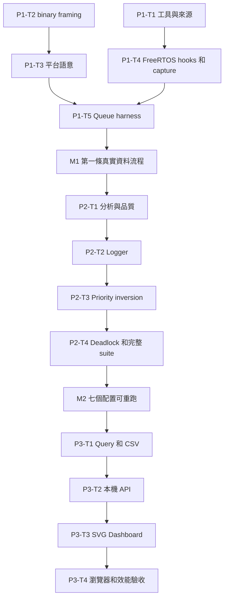

# PSF Lab 實作計畫入口

> **For agentic workers:** REQUIRED SUB-SKILL: Use superpowers:subagent-driven-development (recommended) or superpowers:executing-plans to implement this plan task-by-task. Steps use checkbox (`- [ ]`) syntax for tracking.

**Goal:** 在 RISC-V QEMU 執行 FreeRTOS＋TraceRecorder，收集正常／異常 PSF，完成可驗證的 JSON 與本機互動 Dashboard。

**Architecture:** 依序建立資料產生與解碼、案例分析、HTTP／前端呈現三個子專案。它們共用版本化資料契約；PSF、應用 oracle、工具版本及原始來源分開保存。每一階段都交付可單獨執行的 CLI 或服務。

**Tech Stack:** Python 3.13、unittest、Ruff；RISC-V GCC、QEMU、FreeRTOS、TraceRecorder；FastAPI／Uvicorn、ES modules、ECharts SVG、Tabulator、Playwright。

**Spec:** [PSF Lab 設計規格](../design/PSF-Lab-設計規格.md)

日期：2026-10-03。使用者在閱讀設計後要求「寫實作計畫」，本輪據此進入計畫階段；**使用者後續選 A 執行；M1／M2／M3 已實作並驗收，獨立整體 review 重要發現已修正，完整回歸驗證中**。

## Global Constraints

- 工作位置固定為 `~/git/percepio/poc`；新文件與實驗證據在此 Git 專案內。
- 已確認：PSF 輸入、本機 Python 服務、SVG＋JavaScript、後續離線 HTML、不購買 Tracealyzer。
- 第一版 streaming PSF v14，little-endian desktop 64-bit 與 RV32 FreeRTOS；單 hart。
- QEMU 模擬的 guest 時間、host 耗時與實體板成本分開標記；不以模擬填入板上 CPU／UART 效能。
- 每次正式 run 開始前來源必須已 commit 且乾淨，工具和上游來源 hash 必須符合 lock。
- 所有新增 Python 模組含 unittest；執行 `ruff check .`、`ruff format --check .`。瀏覽器另外驗收。
- `references/baseline/` 唯讀；上游修改放 overlay 或有來源註記的 patch。
- 所有下列程式片段、命令與預期是**實作時的規格，尚未執行的命令不是證據**。

## Review Focus

1. Parser 與自己產生的 expected 一起犯錯：P1-T2/T3 使用真實 fixture、writer source 及手工 binary，P1-T5 使用獨立 oracle。
2. 共用錯誤頻率導致校時假通過：P1-T4 先讀 QEMU DTB timebase，再核對 mtime／tick／PSF，三者來源不同。
3. 故障案例被 host timeout 誤判成功：P2-T4 要求 guest supervisor 結果和完整 PSF；host timeout 一律失敗。
4. 隱藏資料／分頁改變 CPU 分母或 CSV：P2-T1 與 P3-T1/T3/T4 分別測 interval、query 與實際匯出。
5. 錯誤版本、dirty source、缺工具卻產生成功 run：P1-T1/T5 與 P3-T4 的負向測試要求明確非零退出。

## 子計畫與里程碑

| 順序 | 文件 | 任務 | 可驗收交付 |
|---|---|---|---|
| M1 | [01 模擬、解析與 Queue](01-simulator-parser-queue.md) | P1-T1～T5 | 真實 RV32 Queue → PSF → JSON → 獨立 assertions；desktop fixture 也能解析 |
| M2 | [02 案例與分析](02-cases-and-analysis.md) | P2-T1～T4 | 七個配置各重跑三次；異常／改善成對比較；可執行分析 CLI |
| M3 | [03 本機 Dashboard](03-local-dashboard.md) | P3-T1～T4 | PSF 上傳、SVG、filters、table、timeline、CSV 與瀏覽器驗收 |

共同欄位與介面見 [資料契約](data-contract.md)。規格對照與研究邊界見 [覆蓋與自我檢查](coverage-review.md)。

[流程圖 SVG](images/implementation-flow.svg) 可供不支援 Mermaid 的閱讀器使用。

P1-T1 與 T2 的唯讀研究／測試設計可獨立進行；正式執行仍依選定方式安排，不自動啟動平行代理。P1-T3 不等 QEMU 才寫 desktop parser，P1-T5 必須使用真正 QEMU trace。

## 執行及 commit 規則

P1-T1 建立環境後，後續命令先在 POC 根目錄執行 `source .venv/bin/activate`，所以 `python`／`ruff` 來自已固定的虛擬環境。

- 每個任務使用「寫失敗測試 → 確認失敗原因 → 實作 → 定向測試＋Ruff → review／commit」。硬體行為以真實模擬驗收補足。
- 執行前用 `using-git-worktrees` 檢查隔離需求。現有 `poc` 是新建且專用的獨立 repository；若需 worktree，位置仍留在 `poc/.worktrees/`，納入 ignore，不把工作移到使用者指定目錄外。
- 不因單一 fixture 通過就擴張支援範圍。遇未知格式保留原始檔與失敗原因。
- 編譯失敗：先定位 source／toolchain／linker，再判定 SDK；capture 失敗：保存 partial PSF，不能改用人工事件冒充。
- 工具取得、校時、schema 缺口屬 agent 查證工作。只有結果需要改變已確認交付範圍時才詢問使用者。
- 每個程式碼 task 完成後更新 `docs/journal/` 和 `docs/requirements.md`；正式執行資料另一次 commit。不得為湊通過改寫預期。
- M1、M2、M3 完成時更新研究結論與證據索引。只有所有必備檢查實跑通過才能結清該里程碑。

## 建議執行方式

建議 Native：由主代理依序實作，里程碑保留測試證據，最後另做獨立整體 code review。此專案 firmware／parser／analysis 共用時鐘與 schema，順序實作方便維持契約一致。

另一選擇是 Subagent-driven：每個任務由新代理實作、另一代理 review 後才進下一個任務；獨立檢查較密集，也增加交接與上下文成本。執行方式由使用者在審閱計畫後選擇。

## 排在目前三階段之後

[Cache 相對效能最佳化](04-cache-relative-optimization.md)：使用者接受非 cycle-accurate 模型，目的是比較 data／程式碼修改前後的相對改善。先完成 M1～M3，再做 plugin 校驗、受控 A/B 與 cache 視圖；不把此項當成目前 Dashboard 交付前置。
