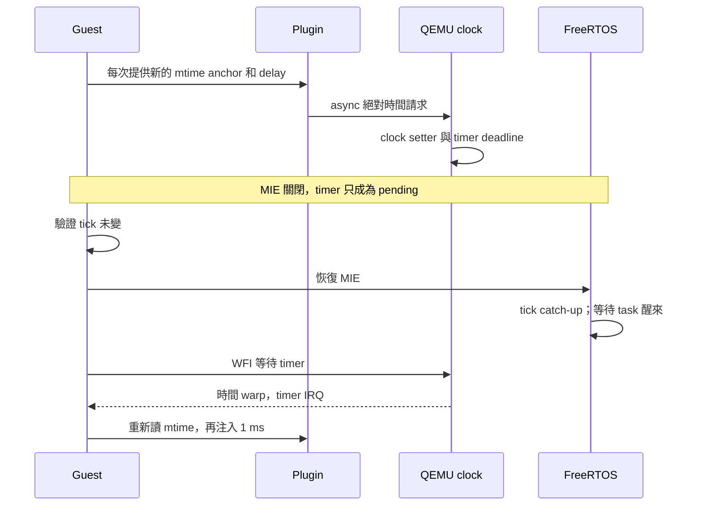

# T2c：連續時間注入、過期目標、WFI 與 IRQ 邊界

**六次正式執行全部通過：control／啟用注入各三次，guest 結果一致。** 使用前一輪的獨立 QEMU 9.2.0 clock binary，本輪沒有修改 QEMU patch。新增 guest／plugin／Python oracle，驗證 scheduler 啟動前的無 timer 情境、連續請求、過期目標、IRQ 遮蔽／恢復，以及 WFI 後再次注入。

這是毫秒級 clock API 驗證，尚未接上逐次 cache miss 或 10-cycle sysram。

## 結果

正式資料：[results.json](../runs/clock-edges-clock-v3/results.json)、[來源 manifest](../runs/clock-edges-clock-v3/manifest.json)。每個子目錄保存 ELF、symbols、PSF、guest JSON、plugin 請求、QEMU log、命令與 hashes。

| 順序／情境 | 請求 | 啟用時測量區間 | Control 區間 | 額外檢查 |
|---|---:|---:|---:|---|
| 0：scheduler 尚未設定 timer | 1 ms | 1,003,500 ns | 3,600 ns | 時間確實前進 |
| 1：接續第二次請求 | 2 ms | 2,003,500 ns | 3,600 ns | 不沿用第一次的過期基準 |
| 2：絕對目標設為 0 | 已過期 | 3,600 ns | 3,600 ns | 時間不倒退，也不增加額外 delay |
| 3：清除 mstatus.MIE 後注入 | 3 ms | 3,003,500 ns | 3,700 ns | MTIP pending；遮蔽期間 tick 不變 |
| 恢復 MIE | 無新請求 | 補進 3 ticks | 0 ticks | 等待 2 ticks 的 task 醒來 |
| WFI 等待下次 timer | 無新請求 | 986,200 ns | 987,900 ns | tick 前進 1；實際執行 WFI |
| 4：WFI 返回後再次請求 | 1 ms | 1,003,800 ns | 3,600 ns | 再次增加 tick，不使用舊指令數推算基準 |

區間含測量函式與 settle loop；不能直接當成延遲誤差或產品 CPU loading。mtime=10 MHz，一個 mtime tick=100 ns。Python oracle 允許 200 µs 的區間容差，另外獨立檢查 tick、MTIP、task wake、WFI 與 plugin target。PSF BEGIN／END timestamp 必須包住同一段 guest mtime 測量。

## 為什麼改用 guest 時間基準

前一輪 probe 的 `instruction_count + delay` 假設到觸發點前沒有 WFI。WFI 期間 icount 可以 warp 到下一個 timer deadline；只有指令數不足以知道當下 virtual time。

本輪 firmware 在每次 marker 前讀 64-bit `mtime`，乘以 100 轉為 ns，透過 RV32 ABI `a0`／`a1` 傳 anchor、`a2` 傳 delay、`a3` 傳 phase。Plugin 在函式入口使用 `QEMU_PLUGIN_CB_R_REGS` 讀取這些暫存器，以 `anchor + delay` 作絕對目標；過期案例刻意傳 target=0。

這仍假設本 QEMU virt 的 mtime epoch 與 virtual clock 一致，且 10 MHz 正確。新的板型不能直接套用。Guest 取樣到 callback 生效有時間差，mtime 又只有 100 ns 解析度，所以本輪結果**不能證明 10／20 ns 延遲可逐筆準確注入**。



## WFI 證據與兩次 harness 修正

Single-thread TCG 走 `rr_wait_io_event()`，沒有呼叫 `qemu_wait_io_event()` 中的 plugin idle／resume callback。因此 callback count=0 不代表沒執行 WFI。來源已保存：[rr 路徑](../references/qemu-time-control/accel/tcg/tcg-accel-ops-rr.c)、[一般 CPU wait](../references/qemu-time-control/system/cpus.c)，固定 revision 與 hashes 見 [SOURCE.json](../references/qemu-time-control/SOURCE.json)。

正式判定改為：

1. 解碼並觀測 RISC-V `WFI` opcode `0x10500073` 的執行。
2. phase 4 開始前，WFI 執行次數必須恰好為 1。
3. 從該 WFI 到 phase 4 的指令數為 9,235；在 `shift=0` 下僅對應 9,235 ns，遠小於 guest WFI 區間的 986,200 ns，證明時間不只是靠指令退休前進。此指令區間還包含測量區間外的少量 marker 工作，因此屬保守比較。
4. WFI 後 tick 必須前進。

Firmware 的 `poc_finish()` 在 shutdown MMIO 後也有 WFI loop。程序結束時的總 WFI 次數可能多一筆，不能套用「全程恰好一次」；驗收改看測試窗口，並增加負責此情況的 unit test。

另一項修正是 PSF 完整序列必須包含 `COMPLETE` marker。早期 harness 漏列此事件，曾將正常 trace 誤判為缺少邊界。沒有改動 PSF parser 或原始資料來讓測試通過。

## 失敗對照與版本紀錄

| 資料夾 | 用途 |
|---|---|
| `runs/clock-edges-setter-v1/` | 探索：harness 尚未包含 COMPLETE／WFI 正確窗口 |
| `runs/clock-edges-setter-v2/` | 有效負對照：control 通過，setter-only 啟用組在 phase 0 被拒絕，沒有 timer 時不前進 |
| `runs/clock-edges-clock-v1/` | 探索：全程 WFI 次數要求過嚴，誤含 shutdown WFI |
| `runs/clock-edges-clock-v2/` | 窗口修正後六次通過 |
| **`runs/clock-edges-clock-v3/`** | **正式版本：另加 PSF／mtime 交叉檢查及 plugin binary hash，六次通過** |

舊版結果不覆寫；來源 hash 可辨識各輪 harness。相同 delay 模式下三次 guest JSON 一致；不要求結束階段的 host teardown／WFI 總數一致。

## 執行方法與檔案

先按 [T2b 重建方法](qemu-clock-t2b.md) 取得已套兩項 patch 的 QEMU。

```sh
PYTHONPATH=src .venv/bin/python tools/tcp/run_clock_edges.py \
  --qemu .tools/qemu-time-control/qemu-system-riscv32-clock \
  --output runs/local/clock-edges
```

輸出目錄須不存在。預設各模式三次；`--repeats 1` 可做探索。CLI exit 0 只表示矩陣執行完成，真正驗收看 `results.json` 的 `accepted`。

- `firmware/app/cases/clock_edges.c`：五個 delay phase、IRQ／task／WFI 測量。
- `tools/tcp/clock_edges.c`：QEMU **API 4／RV32** plugin，讀 argument registers、記錄請求與 WFI 執行。
- `tools/tcp/run_clock_edges.py`：建置、執行、PSF 邊界、guest oracle 與 hash 證據。
- `src/psf_lab/clock_edges.py`：獨立 acceptance checks。
- `tests/unit/test_clock_edges.py`：9 個正常／反例測試，含時間未前進、倒退、遮蔽時錯送 tick、task 未醒、錯誤 target 與 WFI 窗口。

## Cycles → ns：保留餘數

新增 [CycleBudget](../src/psf_lab/cycle_budget.py)，為下一步 cache 成本換算準備，**目前尚未接入 QEMU plugin**。API 必須提供 `frequency_hz`，沒有把未知的產品頻率設成預設值。

```python
from psf_lab.cycle_budget import CycleBudget
budget = CycleBudget(500_000_000)  # 示範值，不是產品頻率
assert budget.add(10) == 20      # 10 cycles -> 20 ns
```

用整數 divmod 保留除法餘數。3 GHz 下連續六筆 1 cycle 的增量為 `0, 0, 1, 0, 0, 1 ns`；累計相同於一次計算 6 cycles。任意切分成本不改變總時間，無浮點數漂移；無效輸入或超出 signed 64-bit ns 會拒絕且保留舊狀態。[7 個換算測試](../tests/unit/test_cycle_budget.py)。

## 待完成

- [x] 無 timer、連續請求、過期目標、IRQ mask／restore、WFI 後新 anchor。
- [x] PSF 與 guest mtime 的一致性、三次重跑與負對照。
- [x] 不累積四捨五入誤差的 cycles → ns 模組。
- [ ] **數十 ns 級請求**：量測取 anchor 至 async callback 的時間差，避免目標已過期而吞掉 10-cycle 成本。
- [ ] 以明確 CPU Hz 接入 L1I／L1D／L2／sysram 10-cycle 模型；明訂 base instruction time 與 memory service 的加總方式，避免重複計時。
- [ ] 多筆請求尚未處理時的排隊、TB 生效邊界及 stall 中途 IRQ 語意。
- [ ] 真實 TCP A/B 重新產生 PSF；Web／離線 Dashboard 的 timing profile 與分層視圖。
- [ ] SMP、adaptive icount、record/replay／migration、實體硬體校準仍不在本輪驗證範圍。

本輪增加 16 個 unit tests，沒有修改 Dashboard；本報告不能解讀為已完成產品記憶體模型。
