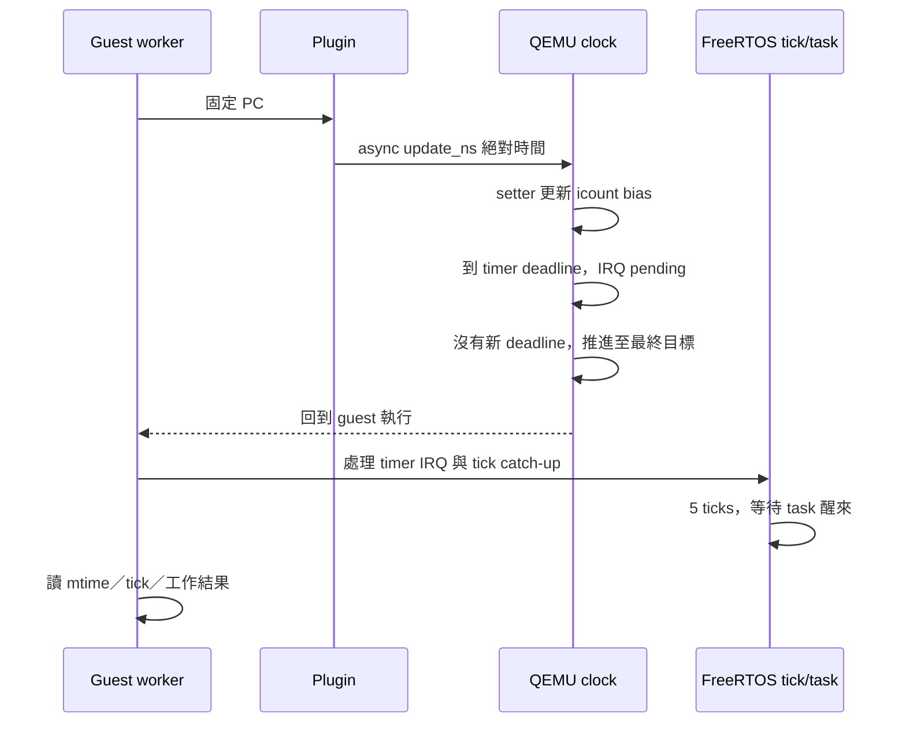

# T2b：固定時間注入已影響 guest mtime／FreeRTOS 排程

**獨立 QEMU 9.2.0 的基本 clock probe 已通過。** 0／1／5 ms 各三次，總共九次正常完成；5 ms 注入讓 guest 增加約 5.0024 ms、前進 5 ticks，等待 2 ticks 的高優先序 task 醒來。這是固定 PC 的單次時間注入，尚未接上逐次 cache miss、sysram 10 cycles 或 TCP 效能比較。

全域 Homebrew QEMU 未修改。兩個研究 patch 位於 `tools/qemu/`；三階段 binary 位於忽略的 `.tools/qemu-time-control/`，其 hash 與重建來源已保存。

## 三階段對照

相同 firmware、相同 runner、QEMU `-icount shift=0,align=off,sleep=off`、single-vCPU。

| 版本 | 0 ns ×3 | 1 ms ×3 | 5 ms ×3 | 整組驗收 |
|---|---|---|---|---|
| 原版 9.2.0 | 正常 | 全部逾時 | 全部逾時 | 失敗 |
| 只加 clock setter | 正常 | 通過允許容差 | 約 1 ms 就返回，只有 1 tick，task 未醒 | 失敗 |
| Setter＋最後 deadline 後推進至目標 | 正常 | 約 1.0003 ms／1 tick | 約 5.0024 ms／5 ticks／task 醒來 | **通過** |

表中增量以相同 control 的 `delta_mtime` 扣除後換算；mtime=10 MHz，每個 tick=100 ns。多出的 0.3／2.4 µs 包含 IRQ／排程及測量工作，不能當成硬體 cache 誤差。0 ns 的測量區間本身為 6.2 µs。三次同條件的 guest measurement 完全一致。

原始資料：[baseline](../runs/time-control-qemu92-baseline/results.json)、[setter only](../runs/time-control-qemu92-setter/results.json)、[完整修改](../runs/time-control-qemu92-clock/results.json)。各 run 保存 ELF、symbols、PSF、guest oracle、plugin receipt、命令與 hashes。`time_control_supported=true` 僅表示這組固定時間跳躍探針通過。

## 為什麼需要兩項修改

1. [0001 setter patch](../tools/qemu/0001-experimental-icount-setter.patch)：TCG 原本只設定 icount getter。候選 setter 透過既有 seqlock 更新 `qemu_icount_bias`，保留指令計數。只允許單 vCPU、固定 icount，且 callback 必須在 cpu_exec 外；已過期的絕對目標不倒退時間。
2. [0002 timer patch](../tools/qemu/0002-clock-advance-without-pending-timer.patch)：第一個 timer 到期後，guest 尚未執行，無法重新設定 mtimecmp；advance 迴圈會因沒有下一個 deadline 而提早返回。補上該情況下推進到目標時間的路徑，之後 guest 再處理 pending IRQ。

第二項是觀察到 setter-only 的 5 ms 測試失敗後才加入；沒有用「程序能結束」取代 guest clock／tick／task oracle。



這表示時間跳躍後的 IRQ catch-up 可運作。它沒有證明 CPU memory instruction 尚未完成時，IRQ 會在真實硬體相同的 cycle 邊界交付。

## 重建與重跑

前置工具：C compiler、pkg-config、glib-2.0、uv、curl、tar、patch、git；firmware 重跑另需既有 RISC-V GCC。QEMU configure 另從 GitLab 取得 dtc，固定 revision 為 `b6910bec11614980a21e46fbccc35934b671bd81`；Python 建置工具安裝在目的目錄的 venv。

```sh
# 在 poc/ 執行；目的目錄不可存在，過程需要下載來源／Python 套件
./tools/qemu/build-clock-probe.sh .tools/qemu-clock-rebuild

PYTHONPATH=src .venv/bin/python tools/tcp/run_time_probe.py \
  --qemu "$PWD/.tools/qemu-clock-rebuild/qemu-system-riscv32-clock" \
  --plugin-include references/qemu-time-control/include/qemu \
  --output runs/local/clock-rebuilt
```

可將 binary 後綴換成 `baseline`／`setter` 重跑失敗對照。Runner exit 0 只表示診斷矩陣完成，須看 `results.json` 的 `time_control_supported`。

完整來源：[QEMU 9.2.0 tarball](https://download.qemu.org/qemu-9.2.0.tar.xz)，SHA-256：

```text
f859f0bc65e1f533d040bbe8c92bcfecee5af2c921a6687c652fb44d089bd894
```

[來源核對](../artifacts/verification/qemu-clock-build/source.json) 驗證研究引用的九個原始檔與 tarball 一致。重建腳本保存 baseline／setter／clock 三個 binary，各自記錄 hash；`ninja`／`meson` 版本固定，host compiler／glib 仍需依平台準備。這不宣稱 bit-for-bit 跨機重現。

本輪實際執行腳本內對應的 configure／build／patch 命令；包裝腳本另通過 `sh -n`，尚未第二次從空目錄完整執行。兩個 patch 在暫存的 pristine 檔案依序套用，結果與實際建置來源一致。[比較與檢查紀錄](../artifacts/verification/qemu-clock-build/comparison.json)。內網離線重建仍需先準備 tarball、上述固定 dtc source、uv wheels 與 host build dependencies，只有 repo 不足以離線建置。

## API 相容與驗證

QEMU 9.2 的 plugin API 4 callback 簽名與現行 API 7 不同。原 probe 先在 API 4 header 下編譯失敗，記錄於 [red log](../artifacts/verification/qemu-clock-build/plugin-api-red.log)；相容處理後，兩個 header 都在 `-Wall -Wextra -Werror` 下編譯通過。新增 `--plugin-include` 指定對應 header，並記錄其 hash。

沒有宣稱 API 5／6 已測試。本輪未改變 parser、模型成本或 Dashboard。

## Review 與待辦

本人逐項 review，沒有獨立 reviewer。檢查了 baseline 對照、seqlock、CPU 執行邊界、單調時間、deadline 提早返回、header provenance 及 oracle。已確認的使用範圍僅本輪 single-vCPU／固定 shift／單次注入；patch 不應直接裝成產品通用 QEMU。

- [x] 固定來源獨立建置；重現原版失敗。
- [x] Setter-only 反例與完整 patch 的 0／1／5 ms 各三次驗收。
- [x] mtime／tick／等待 task／work oracle／PSF 邊界與 hashes。
- [x] 保存重建腳本、patch、原始 artifacts 與 README 入口。
- [ ] 無 timer 的獨立案例、已過期目標、連續注入與 fractional cycle 換算。
- [ ] WFI、IRQ masked／unmasked、TB 邊界；record/replay、SMP、adaptive icount 不在已驗證範圍。
- [ ] 接入 [sysram 10-cycle profile](sysram-10.md) 與 L1／L2 每次存取成本；釐清重疊及 stall 期間 IRQ 語意。
- [ ] 完整 TCP A/B 重新擷取 PSF，再接 Web／離線 Dashboard。

目前 TCP 的 sysram 結果仍是 sidecar 估算；本頁的時間注入成功不會自動使舊 PSF 或舊成本報告變成 cycle-accurate。

本輪提交後完整回歸 **158／158 通過**，全庫 Ruff lint 通過。[完成紀錄](../artifacts/verification/qemu-clock-build/completion.json) 保存被測 commit；[完整 log](../artifacts/verification/qemu-clock-build/full-tests.log)。
