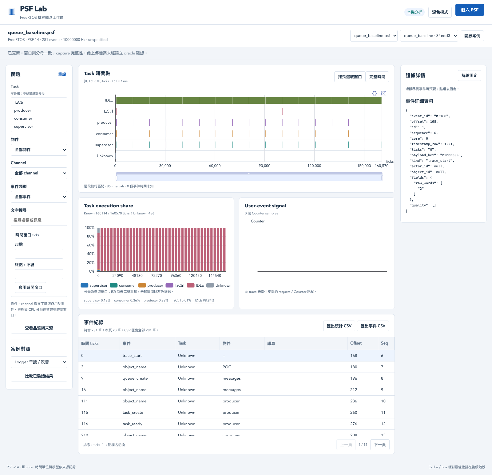
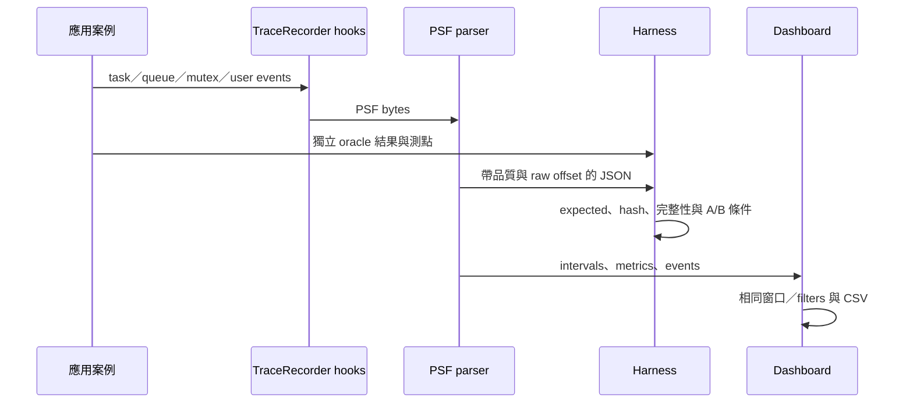

# 研究主張與實作證據

本文件補充原始研究，避免把 SDK 官方能力、控制實驗與產品實測混在一起。原完整報告見 [研究快照](../references/baseline/research/FreeRTOS-RISC-V-Observability-研究報告.md)。

| 主張 | 支持證據 | 觀察與適用條件 | 尚未證明 |
|---|---|---|---|
| 可用 FreeRTOS 既有 trace hooks 接 SDK | [integration](integration.md)、run 中 tasks.i／queue.i | 固定 FreeRTOS／TraceRecorder 4.12、RV32 單 core，無 kernel source patch | 產品 fork、其他版本與 SMP |
| 可以不用商業 viewer 解碼 PSF | [格式支援](format-support.md)、desktop fixture、七配置 raw PSF | v14 little-endian 的兩個明確 schema，保留 raw payload／offset | 所有 PSF 格式、所有 events、ISR 完整重建 |
| Task 使用率可由切換事件計算 | [query semantics](query-semantics.md)、analysis／query unit tests | interval 與 `[start,end)` 相交後累加；完整窗口為分母，Unknown 保留 | 實體 CPU cycles、recorder 自身成本占比 |
| Logger 優先權會干擾 worker response | [21 份正式案例](case-results.md)、[比較圖](../artifacts/dashboard/logger-comparison.png) | 相同 8 requests／工作量，QEMU icount；bad 約 10.014 ms，fixed 約 2.0065 ms | 相同百分比可轉移到產品、硬體 worst case |
| Mutex priority inheritance 可解優先權反轉 | [inversion／inheritance](case-results.md) | 相同 L/M/H 控制序列，trace 與 oracle 驗 boost／restore／完成順序 | 所有資源依賴與複雜產品排程 |
| 一致鎖定順序避免本案例 ABBA | [deadlock／ordered locks](case-results.md) | 兩個 mutex，根據 take/block/give 重建 owner/wait，supervisor 驗獨立結果 | 一般化 deadlock proof、遞迴／任意 OS primitive |
| Dashboard filter／CSV 語意一致 | query／export unittest、Playwright 真實 HTTP／CSV parser | 表格 20 筆分頁，CSV 包含全部符合列；保留相同排序 | 無上限資料集、所有瀏覽器 |
| 100k events 可解析與聚合顯示 | [benchmarks](benchmarks.md) | 固定合成 switch pattern，記 hash／時間／memory；不是實際 recorder workload | 產品事件分布、長期運行與 worst case |
| QEMU cache plugin 可作後續相對研究 | [cache 研究](research/Cache-Bus與CPU使用率.md)、[M4](plans/04-cache-relative-optimization.md) | 已完成原版 plugin smoke；另以 guest physical data replay 完成六次 A/B，見 [實驗與還原](cache-replay.md) | 真機相對排名、L1I 校驗、逐 task 對時、penalty feedback |

## 如何從案例讀圖

先定位 response 變長的 request，再看同窗口哪些 task 在執行，最後點事件查 payload／actor／object／offset，回到對應 source。CPU share 是排程結果；response 可以包含被其他 task 搶占、等待資源與真正執行，兩者不能互換。

## 成本與範圍不能由這些圖推論

UART 電氣吞吐、SDK CPU loading／事件 cycles、產品 Flash／RAM 增量、雲端可靠性與 TCO 都仍屬 [內網任務](handoff.md)。本 POC 的 semihosting 是可重現收集管道，會干擾 host 執行；不把 host wall time 或 synthetic parser 的 MB/s 當成板端 SDK overhead。

原 PDF 圖片、YouTube 文字稿與官方案例的分析保留在 baseline，不用本次 UI 截圖覆蓋原研究。之後每項主張要增補「相同工作量、版本、clock、有效窗口、原始資料、獨立預期」，才能升級為產品已證明。
