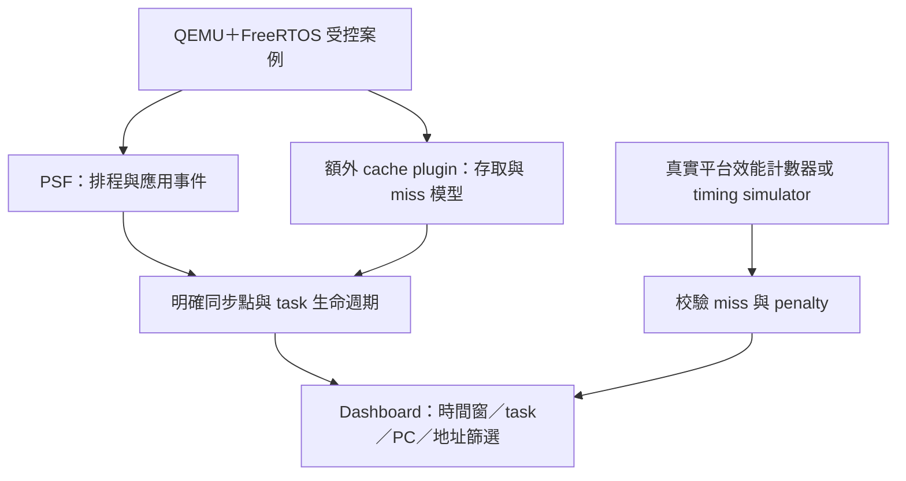

# Cache、bus 與 CPU task usage 補充研究

更新：2026-10-03。使用者新增需求：追蹤 L1／L2 read／write miss、penalty、bus latency；Dashboard 持續參照 Tracealyzer 分析功能，不限於 CPU 百分比。

## 已確認的能力邊界

| 問題 | 可行路徑 | 尚未證實或不包含 |
|---|---|---|
| L1I／L1D miss | QEMU 官方 `contrib/plugins/cache.c` 依容量、line、ways、eviction 建模 | 本 POC 尚未建置或執行此 plugin，不能聲稱已量到 cache miss |
| L2 miss | plugin 可選 unified L2 | 官方描述為 per-core；不能假定符合真實 shared L2／coherence |
| read／write 分拆 | TCG API `qemu_plugin_mem_is_store`、memory callback | stock cache 輸出是否完整符合需求須固定版本 source review；分 task／時間窗可能需擴充 |
| penalty | 另外提供經校驗的每層 latency 模型，或實體效能計數器 | miss count 不等於 stalled cycles；重疊 miss、prefetch、write buffer、DMA 均可能改變結果 |
| bus latency | 自訂具 timing 的設備／互連模型，或另評估 gem5／RTL | 目前 QEMU virt＋TCG 並沒有已驗證、可直接映射產品 bus 的通用 latency 參數 |

QEMU `icount` 用指令數推進 virtual clock，不是 cycle-accurate 模擬。Cache plugin 的模型統計不會自動將 miss penalty 回灌成 guest CPU stall。因此目前的 PSF 時間只代表本 POC 的虛擬時間模型。[QEMU icount](https://www.qemu.org/docs/master/devel/tcg-icount.html)

Cache 配置與 L2 功能依官方文件確認；本機 `qemu-system-riscv32 -help` 已確認有 `-plugin` 選項，但這只證明 loader 入口存在。[QEMU Cache Modelling](https://www.qemu.org/docs/master/about/emulation.html#cache-modelling)、[TCG plugin API](https://www.qemu.org/docs/master/devel/tcg-plugins.html)

## 建議實驗分層



PSF 本身不會憑 task switches 產生 cache counters。建議 plugin 原始結果先保存在獨立 JSON／CSV，與 PSF 同一 run manifest 管理；若從實體平台讀 counters，可另定 SDK user-event／counter schema。兩種方法都要保存單位、來源、同步方法、counter wrap、採樣窗口與有效性。

CPU、plugin 與 PSF 的時間不能未校準就直接相減。Simulator 提供的 aggregate cache summary 也不足以直接畫分時曲線，必須先增加時間分桶或採樣。CPU memory callbacks 的涵蓋範圍也不能自動推及 DMA 或所有 bus master。

後續 cache 實驗應包含：冷／暖 cache、連續／跨 stride 存取、working set 跨容量、衝突 miss、讀寫比例。先以手算小型配置校驗，再和實體 counter 比對。若需要 timing feedback，評估 gem5 的 cache／memory timing model 與 RISC-V FreeRTOS 移植；不能只換工具名稱就宣稱吻合產品。[gem5 Classic caches](https://www.gem5.org/documentation/general_docs/memory_system/classic_caches/)

## PSF 如何計算 task usage

對選取窗口 `[a,b)`，將 task i 的已知執行區間逐段與窗口相交：

```text
T_i = Σ max(0, min(interval_end, b) - max(interval_start, a))
Task execution share_i = T_i / (b-a) × 100%
```

100 ms 中 A 執行 30 ms，A share=30%。Task 的可見性或事件文字 filter 不改變分母；時間窗口才會改變統計範圍。

- 必須依 switch、ISR、clock、core 與 lifecycle 重建；不能依事件筆數比例推算。
- 需要區分 task exclusive execution、含 ISR 的排程區間、idle、unknown。ISR 還沒重建時，不宣稱精確的 exclusive task CPU load。
- 完整 coverage、idle 身分及 ISR accounted 才可用 `100% - idle%` 呈現 total busy；缺失區間不能填 idle。
- 目前 `analysis.py` 已有 intervals、unknown、window denominator、task share、request response／execution；完整 ISR nesting、產品 CPU overhead 尚未完成。
- SDK `TRACE_HANDLE_NO_TASK=2` 已有 regression，啟動前不算 task。M1 歷史 JSON 不覆寫，新 decode 與 analysis 使用修正後規則。
- QEMU 的百分比只描述這個 virtual-time model；不能推論實體 cache penalty 或 recorder overhead。

## Tracealyzer 功能對照與 Dashboard 範圍

參照來源：[官方功能頁](https://percepio.com/tracealyzer/features-capabilities/)。既有圖片證據、filter 研究仍見 [Dashboard 研究](Dashboard功能與設計研究.md)。目標是可追查的分析功能；逐項記錄實作與驗證，不以畫面相似代替語意正確。

| 分析／view | 目前第一版安排 | 後續所需證據 |
|---|---|---|
| task scheduling timeline、event log | M3 實作；連動篩選、hover、原始 offset | 真 PSF 與瀏覽器驗收 |
| CPU task share、每窗口趨勢 | M3 必含；標示窗口、單位、unknown | ISR／idle 完整性；與手算 fixture 比對 |
| execution／response 統計、request 對照 | M2 分析＋M3 視圖 | 明確 job 起訖，min／mean／max／樣本数及定位 |
| user-event data／interval | 依支援 schema 呈現 | 型別、單位、配對規則 |
| queue／mutex／semaphore、priority | M2 受控案例＋M3 詳情／對照 | 操作結果、持有與等待關係、loss invalidation |
| communication flow、queue occupancy、call intensity | 保留研究與擴充項目 | 欄位語意、初始狀態、actor/object 配對 |
| heap／stack 趨勢與 margin | 尚未啟用完整收集，不顯示假值 | allocation/free 基準、stack samples、採樣成本 |
| L1／L2 miss、penalty、bus | 本次新增研究；尚未實作 | 平台規格、plugin／counter／timing model 與同步校驗 |

## 待取得的產品資訊

CPU core／SoC、核數、L1I／L1D／L2 容量／line／ways、L2 private/shared、write policy、prefetch、cache maintenance、DMA coherence、bus 類型／寬度／時脈／仲裁、SRAM／DRAM latency、可用效能計數器。此清單供內部 AI／原始碼研究延續；不阻塞目前軟體 POC。


## 後續實測更新

已新增 [Cache 效率與 PSF 擴充研究](Cache效率與PSF擴充.md)，含 data-region A/B、雙模式 Dashboard、來源 snapshot 與內網還原。早期「尚未實跑」敘述屬歷史狀態，最新驗證以該文及 `docs/cache-replay.md` 為準。
