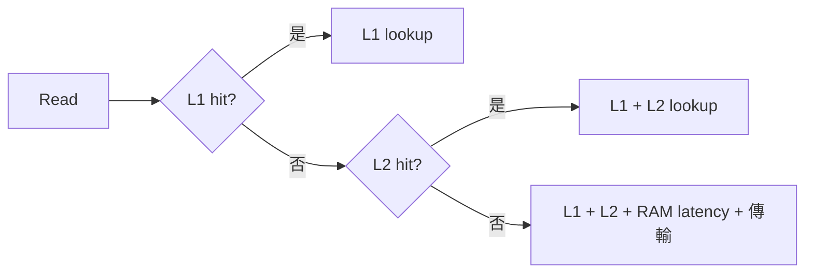

# Cache 延遲欄位、參考值與校準

目前 `lookup_cycles` 是整數，單位為 cycles，每次 cache line lookup 計一次。現有示範設定 L1I=1、L1D=1、L2=8；這些是可調整的假設，尚未校準為產品硬體。

```json
{"l1i":{"size":16384,"line":64,"ways":4,"lookup_cycles":1},
 "l1d":{"size":16384,"line":64,"ways":4,"lookup_cycles":1},
 "l2":{"size":65536,"line":64,"ways":4,"lookup_cycles":8}}
```

`size`、`line` 單位為 bytes；容量 16 KiB 無法推導命中延遲。設定完整格式見 [profile](../../cases/timing/illustrative-ram.json)，執行方法見 [T1](../memory-timing-t1.md)。

## 業界來源如何用

| 來源 | 公開值 | 對本研究的用途與限制 |
|---|---|---|
| SiFive U74 21G3.02.00 手冊 §3.2.2、§3.4.1 | L1I 1 cycle；L1D word/doubleword 2 cycles，小於 word 的存取 3 cycles | 原廠規格參考；32 KiB caches、RV64、write-back、有 store buffer，不能直接當成目前 RV32、write-through 模型 |
| 7-cpu 的 FU740／HiFive Unmatched 測試 | L1D simple pointer 3 cycles、complex address 5；L2 26 cycles；RAM 26 cycles + 145 ns | 1.2 GHz／DDR4／2 MiB L2 的實測路徑；包含相依鏈、地址運算等，不能把 26 直接填成額外 L2 lookup 延遲 |
| gem5 cache 教學 | L1 的 tag/data/response 各 2；L2 各 20 | 模擬器教學範例，並非業界統一規格；欄位與我們的單一 lookup_cycles 不同，不能直接相加套用 |

來源：[U74 原始手冊，Stanford 鏡像](https://www.scs.stanford.edu/~zyedidia/docs/sifive/sifive-u74.pdf)、[7-cpu 原始測試](https://www.7-cpu.com/cpu/SiFive_U74.html)、[gem5 官方教學](https://www.gem5.org/documentation/learning_gem5/part1/cache_config/)。U74 PDF 的實體頁次為第 32、36 頁，印刷頁碼 30、34。

本階段建議以 L1D=1／2／3 做敏感度比較，L1I 暫設 1；每組均標示假設。這不等於模擬 U74。後續若要比照該核心，需加入存取寬度、write-back、dirty eviction、store buffer 與相依鏈；目前統一的 L1D lookup 延遲無法表示 word 2／byte 3 的差異。

## Hit／miss 的延遲怎麼算

目前 T1 的 cacheable read 採串行、無重疊模型：

- L1 hit：L1 lookup。
- L1 miss、L2 hit：L1 lookup + L2 lookup。
- L2 miss：以上加 RAM read latency + ceil(line bytes / bus bytes per cycle)。

因此示範 read 成本為 1、9、97 cycles，最後一項為 1+8+80+64/8。這是記憶體服務成本；CPU 可重疊的工作、流水線與分支等尚未建模。跨 cache line 的存取會觸發多筆 lookup。

Store 使用 write-through + write-allocate，即使 L1 hit 仍可能要計下層寫入成本，不能套用上面的 read 公式。完整邊界見 [T1](../memory-timing-t1.md)。



## Cycles 與時間

`time_ns = cycles × 1e9 / cpu_frequency_hz`。假設 CPU 500 MHz，1 cycle=2 ns、2 cycles=4 ns。這只是換算範例；mtime 的 10 MHz 是 timer 頻率，不能當作 CPU 頻率。

現有 T1 不改變 guest 時間。下一步的 [T2a 探針](../time-control-probe.md) 發現目前 QEMU 的時間注入路徑無法通過驗收，必須先處理 clock／timer 接合，再把 cycles 換算成實際 guest 等待。

## 待取得的平台資料

需要產品核心、CPU／bus clocks、cache line／ways／replacement、read hit 與 load-use latency、write policy／buffer、L2 是否 inclusive、sysram／DDR latency 及 bandwidth。另以 dependent pointer chase、獨立 load、不同存取寬度、cold／warm cache、串流讀寫分開校準。這些資料會影響最佳化排名，不能只用一個 miss penalty 代表全部行為。
