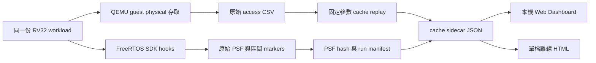

# Cache 效率、PSF 擴充與可驗證的最佳化

查核日期：2026-10-04。目標是用相同模型、相同工作量的相對比較，找出可改善的程式碼與資料配置。本文件區分已實跑結果、來源研究與尚未完成的功能。

## 1. 什麼叫 cache 有效率？

**有用的工作，能以較少的資料搬移、較好的重用和可接受的指令成本完成。** Hit rate 是其中一項，不能單獨代表速度。

| 問題 | 觀察指標 | 要避免的誤判 |
|---|---|---|
| 載入一條 line，究竟用了多少？ | 每次駐留期間 distinct bytes used / line bytes | 追蹤結束仍駐留的 bytes，未來可能再用 |
| 載入後有沒有重複用？ | 每次駐留的 access 次數、reuse distance | 重複執行無用計算也可能有高 hit rate |
| working set 能否留在 cache？ | 容量敏感度、miss count、set conflict | 相同總容量也可能因映射衝突反覆逐出 |
| 實際搬移多少？ | line fills；硬體另量 writeback／prefetch | tag 模型沒有 dirty line，不能宣稱已量完整流量 |
| 程式指令是否集中？ | executed instruction bytes、L1I MPKI、hot block layout | 大 function 不會因被呼叫就整個載入 cache |
| 是否真的更快？ | 相同工作量 cycles、延遲、code size | 模型 miss 減少 16 倍不等於執行時間快 16 倍 |

例：64-byte line 只讀寫其中 4 bytes，接著被逐出，這次駐留的空間使用比例為 6.25%。同一 line 讀取後寫回同一 4 bytes，distinct bytes 仍是 4，不是 8。本工具把已逐出未用 bytes 和結束時仍駐留未觀測 bytes 分開。

Callgrind 的 `--cacheuse=yes` 提供類似觀點：SpLoss 衡量載入後沒有用到的 bytes，AcCost 用存取重用情形協助定位區域性問題。我們採用獨立、明確命名的 observed utilization，沒有宣稱與 Callgrind counter 完全等價。[官方說明](https://valgrind.org/docs/manual/cl-manual.html)

## 2. 大 function／大變數，要不要拆？

### 程式碼

CPU 依 cache line 取得指令，不會把整個 function 一次載入。大 function 若只有小段 hot path，其他 cold path 是否浪費 L1I，要看編譯後 layout、分支、prefetch 與實際執行；只看 source 行數不夠。

可測試的改法是把低頻錯誤處理或大型 cold blocks 移開，讓 hot blocks 更集中。拆得太碎可能增加 call／return、register spill 和分支；編譯器也可能重新 inline。要比較 ELF／反組譯及 profile，不只比較 C 檔案。

LLVM 的 HotColdSplitting 實作是依 hot/cold 區域改善 code locality，並有成本判斷。[原始碼](https://github.com/llvm/llvm-project/blob/main/llvm/lib/Transforms/IPO/HotColdSplitting.cpp)

BOLT 論文研究以 profile 做 post-link code layout 最佳化，附有 LLVM 開源實作。論文的資料中心效益不能直接套成 RV32 FreeRTOS 百分比；本工具可借用「以真實 hot paths 驗證配置」的方法。[論文](https://arxiv.org/abs/1807.06735)、[程式與使用說明](https://github.com/llvm/llvm-project/tree/main/bolt)

### 資料

不是把一個大變數任意切成很多小變數，而是讓常一起存取的資料放在一起：

- 只掃描 struct 某幾個欄位：測試 hot/cold fields 分離或 AoS→SoA。
- 每次都處理同一物件的全部欄位：AoS 可能更合適。
- 大矩陣：測試 traversal order 與 tiling，讓已載入的資料先重用完。
- 分散 allocation 與 pointer chasing 可能破壞區域性；padding 可能緩解特定衝突，卻增加 footprint。

2026 年論壇仍在討論 AoS／SoA 是否應依存取方式決定；我們把這些討論當實驗題目來源，不採用貼文中的倍數當產品結論。[論壇：AoS 與 locality](https://www.reddit.com/r/C_Programming/comments/1tdslah/aos_memory_buffer_and_cache_friendliness/)、[論壇：spatial locality](https://www.reddit.com/r/C_Programming/comments/1we4y9t/at_what_point_does_spatial_cache_locality_kick_in/)

## 3. 本輪實際驗證

原創最小案例位於 `firmware/app/cases/cache_workload.h`，避免引入 benchmark framework 對 bare-metal 的額外相依。64×64 uint32 矩陣，初始化 0..4095，每個元素加一兩次。兩種遍歷都必須得到 checksum **8,394,752**。

QEMU 擷取 workload 函式 PC 範圍內、matrix 範圍內的 guest physical load/store，排除初始化和其他函式。每個 variant 各三次，共六份原始 PSF 與 access CSV。每輪有 8,192 reads + 8,192 writes。

| L1D | Column L1 miss | Row L1 miss | Column / Row byte utilization | L2 miss，兩者相同 |
|---|---:|---:|---|---:|
| 1 KiB | 8,192 | 512 | 6.25% / 100% | 256 |
| 4 KiB | 8,192 | 512 | 6.25% / 100% | 256 |
| 16 KiB | 256 | 256 | 100% / 100% | 256 |

固定 64-byte line、4-way LRU、cold start、32 KiB data-only L2；writes 分配 tag。這裡 L2 不含指令流，沒有 inclusion／dirty／writeback／prefetch／coherence 模型。三次重跑應有一致 counter；完整 log 與 manifest 見 [runs](../../runs/cache-relative-v3/)。

模型內結論：小 L1D 下，改變 traversal 可減少 93.75% L1D misses；L1D 容納整個資料集後差異消失。這能幫助選擇最佳化方向，也顯示為何必須測多組 geometry。

## 4. 能不能把 L1／L2 performance 放進 PSF？

**可以利用 SDK 已有的 user events 記錄自訂 counter；PSF 本身不會自動產生 cache 資訊。** 目前 source 的 `xTraceStringRegister` 建立 channel，`xTracePrintF` 寫入 channel、format、參數與 recorder timestamp。

本地 API：[trcPrint.h](../../references/baseline/percepio/TraceRecorder/include/trcPrint.h)、[writer 實作](../../references/baseline/percepio/TraceRecorder/trcPrint.c)、[現有 POC 用法](../../firmware/app/main.c)。上游入口：[TraceRecorder](https://github.com/percepio/TraceRecorder)。

以下是接入方式示例，尚未實作硬體 counter reader：

```c
TraceStringHandle_t cache_channel;
xTraceStringRegister("CACHE_HW", &cache_channel);
/* delta 必須由你們 PMU reader 取得；名稱明確標示來源。 */
xTracePrintF(cache_channel, "L1D_MISS_DELTA=%u", (unsigned)delta);
```

需先定義 counter 是累積還是區間 delta、wrap 位數、採樣窗口、core、task/ISR 歸屬、counter filter 和讀取開銷。64-bit counter 不能直接截斷成一個 `%u`；需使用該版本確實支援的表示法或拆成明確命名的 high/low 欄位。也不能把 recorder 寫入時刻當成被量測區間起點。

| 方案 | 適用 | 本輪狀態 |
|---|---|---|
| 真機 PMU → SDK user event → PSF | 真機 counter 與 RTOS 排程關聯 | 有 API 路徑；PMU reader／產品驗證未完成 |
| 模擬器 counter 回送 guest → SDK → PSF | 想讓 guest recorder 寫模擬 counter | 需設計 guest/host bridge，未實作；會增加被觀測工作 |
| 原始 PSF + cache sidecar JSON | host 重播計算、模型參數可改 | **本輪已實作**，以 PSF SHA-256 與 run manifest 連結 |
| host 修改／插入 PSF bytes | 需要產生衍生 PSF | 未實作；須處理版本、sequence、timestamp、entry table 與來源標記，不能直接拼接 binary |

本輪原始 PSF 已有 `CACHE_BEGIN`／`CACHE_END`，但逐筆存取 CSV 沒有 PSF timestamp。Dashboard 只對應整段 workload，不能偽造每秒／task 級 cache counters。下一步才是明確 marker handshake 或可校驗的時間同步。



## 5. 參考程式與後續實驗

已下載 PolyBench/C 的 GEMM、header、utilities、LICENSE 及固定 commit/hash，見 [來源紀錄](../../references/cache/PolyBenchC/SOURCE.json)。這些檔案可帶到內網閱讀；尚未移植、編譯或在此 RV32 POC 執行。來源：[PolyBenchC](https://github.com/ferrandi/PolyBenchC)。

| 題目 | 配對案例 | 檢查圖表 | 狀態 |
|---|---|---|---|
| 遍歷順序 | row / column | misses、byte utilization、geometry sensitivity | 本輪已實跑與呈現 |
| 資料拆分 | AoS / SoA / hot-cold | 每 residency byte-use、working set | 待新增同工作量案例 |
| Blocking | 原始 GEMM / tiled GEMM | reload、L1/L2、checksum／容許誤差 | 參考 source 已保存；尚未移植 |
| 大函式拆分 | mixed hot-cold / outlined cold | L1I、executed bytes、call cost、ELF size | 待 instruction capture 與 symbol mapping |
| 未執行指令 | 取得 line 但從未執行其中 bytes | instruction line utilization | 目前 data-only 模型不能判斷 |
| SMP false sharing | 相鄰 fields / 分隔 fields | coherence transfers、store stalls | 目前單 core 模型不能判斷 |

「未執行」也不等於可刪除；測試沒有走到的錯誤處理、低頻功能可能仍是必要程式。Dashboard 應提供候選與證據，不能自動宣告 dead code。

## 6. 兩種 Dashboard

- 本機 Web：啟動原 Python server，開啟 `/cache.html`。`GET /api/cache` 驗證 PSF／CSV／ELF／oracle hash 並回傳重播結果。
- 離線 HTML：`artifacts/offline/cache-comparison.html` 已內嵌資料、ECharts SVG 與 Tabulator，不依賴觀看端 Python 或網路。
- 都提供 geometry、variant、repeat 篩選、hover、排序／欄寬／欄位拖曳、CSV、來源 hash 與限制說明。
- 本頁是新增 cache 工作區；既有 PSF timeline 仍可用。逐 task cache overlay、L1I、任意產品 ELF hot/cold 根因分析仍待完成。


## 7. Penalty 如何用於相對比較？

若只做非重疊的額外成本估計，可定義 `L1_misses × 額外 L2 查詢成本 + L2_misses × 額外記憶體服務成本`。兩個係數必須都是 incremental cost，不能一個已含整段 miss latency、另一個又重複計入。真機可能有 memory-level parallelism、prefetch 或 store buffer，這個公式不能當精確 cycles。

本輪保留原始 counters，尚未套入任何假設 penalty 係數。後續 Dashboard 可加入參數敏感度圖，但要保留 miss／byte-use 原始值，避免只有一個加權總分掩蓋 tradeoff。
