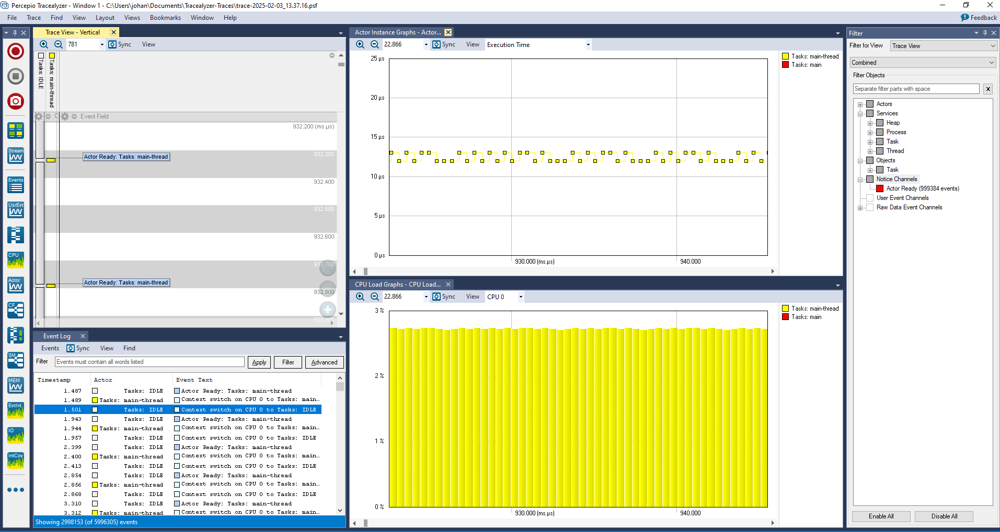
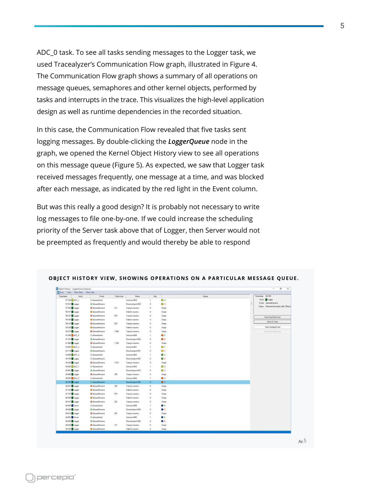
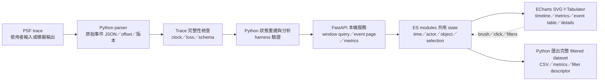

# Dashboard 功能與設計研究

研究日期：2026-10-03。狀態：使用者已確認輸入 PSF、互動 HTML 使用 SVG 與 JavaScript，先做本機 Python 服務，離線 HTML 後續再做。本文件補上架構建議、文字 wireframe 與驗收；尚未實作 UI，也沒有購買或操作 Tracealyzer。

**Dashboard 的輸入確定是 PSF：輸入 → Python 解析與完整性檢查 → 篩選 → SVG 連動視圖 → CSV。** 使用者確認原本「讀 PDF」是筆誤。PDF 繼續作為案例、功能與 UI 的研究參考，不列入 Dashboard 的執行輸入。

## 1. 已確認的要求與仍需決定的邊界

| 項目 | 已確認 | 待確認 |
|---|---|---|
| 商用工具 | 不購買 Percepio Tracealyzer；研究公開功能與 UI，自己試做 | 第一版要重現哪些分析功能，哪些留在後續 |
| 資料 | 使用者 Q1=A：輸入 PSF；Python 解析成 JSON，harness 驗證 | 第一版支援的 PSF 版本與事件語意，由 source／模擬案例驗證 |
| PDF | 原本 PDF→HTML 是筆誤；PDF 僅作研究參考 | 不新增 PDF 載入、OCR 或文件分析 UI |
| HTML | SVG 圖表、專業 JavaScript、hover、filters、可排序表格、欄寬與欄位移動、時間線互動、CSV | 圖表／表格套件與具體布局為本文件建議，待設計與 implementation review |
| 交付 | 使用者 Q2=B：先本機 Python 服務；離線 HTML 放後續 | 未授權部署成可被他人連線的內網服務；未將離線交付列為本階段完成條件 |
| 設計 | 參考 Percepio 公開圖片；請設計師研究與 review | 主要工作是除錯定位、案例教學、修正前後比較，還是涵蓋全部；各自優先序 |
| 品質 | Python `unittest`＋`ruff` | 目標瀏覽器、資料量、可接受的載入／互動時間與 browser 測試工具 |

本文件的功能分類、資料欄位與設計檢查是**建議**，不是已確認的產品規格。官方功能與自製工具要提供的功能分開標示。

## 2. 官方工具想解決什麼問題？

公開功能頁把 RTOS 排程、事件、CPU、記憶體與 timing 分析連結起來，讓工程師從異常數值追到具體事件，再對照 task／RTOS 物件。這是可參考的分析流程；自製介面是否算對，仍需原始事件與已知 test case 驗證。[Tracealyzer 官方功能頁](https://percepio.com/tracealyzer/features-capabilities/)

Datasheet 展示多個視圖同步 scrolling、zoom 與 filters，並保留 overview 與 detail 不同時間尺度。值得沿用的是「同一事件可以在不同視圖被找到」，不必沿用原產品的桌面視窗、圖示或排版。[官方 Datasheet，第 3 頁](https://percepio.com/docs/TracealyzerDatasheet.pdf)

### 2.1 觀測與分析功能對照

以下是官方公開功能名稱的簡述。每個自製 view 都要另有計算定義與驗收測試。[官方功能與說明](https://percepio.com/tracealyzer/features-capabilities/)

| 官方功能 | 要回答的問題 | 自製分析所需事件／條件 |
|---|---|---|
| Trace View | 誰在執行、何時切換、哪個呼叫阻塞？ | task switch、ready／blocked、ISR、kernel call、user event；需重建狀態 |
| CPU Load Graph | task／ISR 如何分配 CPU？ | 每 core 執行區間、idle 身分、ISR nesting、觀察窗口與 coverage |
| Event Log | 找到指定事件，追查前後關係 | 穩定 event ID、時間、actor、event kind、object、參數與來源位置 |
| Communication Flow | 哪些 actors 操作同一 RTOS 物件？ | actor↔object 操作；若宣稱 message pairing，還需可驗證的配對規則 |
| Data Plot | 應用數值如何隨時間變化？ | user event channel、型別、value、units |
| Heap／Stack Memory Usage | 記憶體是否累積、stack margin 是否縮小？ | allocation／free、初始基準、stack samples；未收集就不能補出數值 |
| Timing Metrics／Thread Instance Graphs | execution、response、periodicity 是否變差？ | job／instance 起訖定義、ready／run／complete 事件、邊界狀態 |
| Interval／State／Runnable Tracing | 某段工作或狀態持續多久？ | 成對事件或狀態轉移；runnable execution 需扣除 preemption |
| Advanced RTOS Analytics | blocking、queue usage、priority、call intensity 如何變化？ | 對應事件與 payload 欄位的版本語意；逐項實作，不能只看 UI 命名 |

上表不是「讀到任何 PSF 就能自動算出全部指標」的承諾。資料缺失、事件未啟用、格式版本不支援、clock 未確認，都可能讓某個 view 無法成立。

### 2.2 官方 filter 能確認到哪裡？

| 證據 | 可以確認 | 邊界 |
|---|---|---|
| 官方功能頁的 Event Log／Search 說明 | 事件搜尋與篩選；Finder 提供 SQL-like queries；match 可定位 trace | 沒有在本次操作商用 UI，也未取得完整 query grammar |
| 官方功能頁的 Data Plot 說明 | legend 可切換 user event channel 的可見性 | channel visibility 不等於重建所有統計的事件過濾 |
| 官方 Datasheet 第 3 頁 | 多視圖可同步 filters、scrolling、zoom | 沒有證明每個 view 都支援同一組 predicate |
| 本地 SWO `tracealyzer.png` | 畫面顯示 view selector、object search、actors／services／objects／channels tree；Event Log 有文字欄、Apply／Filter／Advanced | 是這張版本畫面的直接觀察；combined mode 與各 checkbox 的完整語意尚未操作驗證 |

官方文字來源：[功能頁](https://percepio.com/tracealyzer/features-capabilities/)、[Datasheet](https://percepio.com/docs/TracealyzerDatasheet.pdf)。畫面來源：[本地 SWO 原圖](../../references/baseline/Tracealyzer-STM32CubeIDE-SWO/img/tracealyzer.png)。

**Host view filter 不會降低 target 先前記錄的 CPU 成本或傳輸量。** 本次自製 Dashboard 的 filter 應先視為資料檢視設定；裝置端裁剪、trigger、傳輸控制是另一個驗證題目，已有研究報告的第 13 節。

## 3. 已閱讀的圖片與可以借鏡的操作

本輪逐一看過以下 8 張本地原圖。它們是案例／教學／Arm 示範，沒有證明我們的 RISC-V 模擬器或 parser 已提供相同結果。

| 原圖 | 直接看到的資訊 | 可借鏡的互動 |
|---|---|---|
| [SWO Tracealyzer 全畫面](../../references/baseline/Tracealyzer-STM32CubeIDE-SWO/img/tracealyzer.png) | 排程、Event Log、instance graph、CPU、filter tree 並排；Sync 按鈕 | 時間窗口與 selected event 共同管理；event row 可定位 timeline |
| [SWO Missed Events](../../references/baseline/Tracealyzer-STM32CubeIDE-SWO/img/missed_events.png) | received bytes、data rate、total events、event rate、duration、missed events | 載入時先呈現完整性與解析狀態，讓圖表有可信度脈絡 |
| [回應時間統計，第 3 頁](../../references/baseline/research/images/response-statistics-page3.png) | execution／response 各自的 min／avg／max，以及 CPU | 清楚顯示 units 與定義；可排序極值，點擊後追到具體 instance |
| [回應時間修正後，第 6 頁](../../references/baseline/research/images/response-time-page6.png) | task lane、事件標籤、filter、selection details | 一個分析窗口內能看到執行片段與阻塞呼叫，不只 summary numbers |
| [Object History，第 5 頁](../../references/baseline/research/images/response-object-history-page5.png) | timestamp、actor、event、block time、status、queue 內容／狀態 | 選一個 object 後產生 history table，並追查相關 send／receive |
| [Priority Inversion／Deadlock，第 4 頁](../../references/baseline/research/images/priority-inversion-deadlock-page4.png) | 阻塞 task、semaphore take／give、timeout 與排程關係 | 區分已看到的 waiting edges 與「原因」判定；正常／故障 trace 可以比較 |
| [Heap 趨勢，第 5 頁](../../references/baseline/research/images/heap-trend-page5.png) | allocation usage 隨時間累積與下降 | 選資料點回查 allocation／free；缺基準時標示相對變化 |
| [Watchdog，第 7 頁](../../references/baseline/research/images/continuous-watchdog-page7.png) | margin 曲線、CPU 與 queue blocking timeline | 選同一時間窗口同時看應用 symptom 與排程證據 |





統計圖片包含表格；本文件用上表記錄可借鏡的欄位。若後續將圖片中的數值作為可排序資料，必須忠實擷取並標註來源頁與單位，不能把截圖數字當成模擬器輸出。

## 4. 免費第三方工具候選與取捨

以下保留前一輪候選比較。現在建議採 **FastAPI＋ES modules＋ECharts SVG＋Tabulator**；尚未安裝或 benchmark，沒有以此文件宣稱套件選型已經實作。版本在實作前需固定並保留 license。免費 library 的可用性不表示分析演算法、整合與維護沒有成本。

### 4.1 圖表與應用框架

| 候選 | hover／time window／聯動 | 離線與 Python 邊界 | 適用取捨 |
|---|---|---|---|
| Plotly.py＋Plotly.js | `hovertemplate`、range slider、pan／zoom；`plotly_selected`／`plotly_relayout` 可接自己的狀態更新 | Python 產 HTML；`include_plotlyjs=True` 可把 JS 放在檔案內。跨圖表＋表格聯動需 JS；一般 HTML export 不保留 Python callbacks | Python 圖表產製直接；RTOS lane、edge、event detail 仍需自行組合 |
| Dash＋Plotly＋AG Grid Community | Python callback 串 input／graphs／table；`dcc.Download`／grid CSV | Python 服務適合 server-side filtering；可在內網部署並帶本地 assets。Dash app 不等於單一靜態 HTML | 適合資料較大、重分析與多人使用；需要服務部署與 session 管理 |
| Bokeh | shared ranges 做 linked pan／zoom；shared `ColumnDataSource` 做 linked selection；`CustomJS` 可處理 filters／hover | standalone HTML 可含 JS 互動；Python callbacks 需 Bokeh server。JS／CSS 應 bundle 在本地 | 時間線與連動圖表的自然候選；複雜 DataTable 特性需另核對，或接 Tabulator |
| Panel＋Bokeh／Plotly＋Tabulator | Python reactive components 可連動多種 plots 與 DataFrame table | server 模式便利；standalone `embed()` 是預計算 states，不是任意 Python runtime。多 filter 可能組合爆炸，外置 JSON 需 HTTP | 適合 Python 服務或有限狀態展示；不可因能 save HTML 就承諾任意離線 filter |
| Apache ECharts＋Python HTML template | tooltip、`dataZoom`、brush、events／actions；custom series 可組成 RTOS interval lanes | 本地 JS＋JSON 可離線；Python 負責輸出，JS 負責互動。不是純 Python UI | 可精細掌握時間軸與 dense views；需較多 JS 開發，需自己實作 CSV 與 table 聯動 |
| FastAPI＋ES modules＋ECharts SVG＋Tabulator | Python API 提供資料與分析；JS 共用 state，控制 SVG charts／table／detail／CSV | 本機服務先提供 API＋static assets；後續改 data adapter，可共用前端做離線 bundle | 符合已確認交付順序；UI orchestration 與資料契約需自己維護 |

官方依據：[Plotly HTML export](https://plotly.com/python/interactive-html-export/)、[hover](https://plotly.com/python/hover-text-and-formatting/)、[range slider](https://plotly.com/python/range-slider/)、[Plotly.js events](https://plotly.com/javascript/plotlyjs-events/)、[Dash callbacks](https://dash.plotly.com/basic-callbacks)、[Dash downloads](https://dash.plotly.com/dash-core-components/download)、[Bokeh linked behavior](https://docs.bokeh.org/en/latest/docs/user_guide/interaction/linking.html)、[Bokeh standalone 與 server](https://docs.bokeh.org/en/latest/docs/user_guide/output/embed.html)、[Bokeh JS callbacks](https://docs.bokeh.org/en/latest/docs/user_guide/interaction/js_callbacks.html)。

Panel 的官方文件特別提醒 states 的組合數，預設約限制在 1,000 states；外置 JSON 由 `file://` 直接開啟時不能正常讀取。[Panel embedding state](https://panel.holoviz.org/how_to/export/embedding.html)

ECharts 官方的 `dataZoom-inside`／brush／custom series 說明在本次可用 curl 讀取的 Markdown 文件中確認；web 工具對該路徑回報 unavailable，因此也保留文件索引入口。[官方文件索引](https://echarts.apache.org/en/llms.txt)、[dataZoom-inside](https://echarts.apache.org/en/llms-documents/option-parts/option.dataZoom-inside.md)、[brush](https://echarts.apache.org/en/llms-documents/option-parts/option.brush.md)、[custom series](https://echarts.apache.org/en/llms-documents/option-parts/option.series-custom.md)、[events／actions](https://echarts.apache.org/handbook/en/concepts/event/)。

**ECharts 的 `timeline` component 不是 RTOS 執行時間線的成品。** 自製 execution lanes 需要用 interval geometry／custom series 等方式建立，並驗證 clipping、state、時間比例與 hover。

### 4.2 表格候選

| 候選 | 排序／欄寬／欄位移動 | 篩選後 CSV | 限制與風險 |
|---|---|---|---|
| Tabulator | header sort、column `resizable`、`movableColumns` | `download("csv", ...)`；預設 `active` 是通過 filters 的 rows，可另選 all／selected／visible | 正確選擇輸出範圍；visible 不等於全部 filtered rows；CSVs 不承載畫面樣式 |
| AG Grid Community | 基本 sorting／filtering、column sizing／moving、virtualization | API 提供 CSV export，可指定 filtered/sorted rows；不要依賴 Enterprise context menu | Community 為免費核心；advanced filters、integrated charts／部分 grouping 等屬 Enterprise，逐 feature 查證 |
| Panel Tabulator | DataFrame、client filters、配置與列選取；可傳 Tabulator options | `.download()`／`.download_menu()`，`current_view` 可取 filtering＋sorting 後資料 | `pagination='remote'` 時 download 只包括目前 page；輸出整個 filtered set 需另外處理 |

來源：[Tabulator sorting](https://www.tabulator.info/docs/6.x/sort/)、[欄寬](https://www.tabulator.info/docs/6.x/layout/)、[欄位移動](https://www.tabulator.info/docs/6.x/move/)、[download／row range](https://www.tabulator.info/docs/6.x/download/)、[AG Grid Community vs Enterprise](https://www.ag-grid.com/javascript-data-grid/community-vs-enterprise/)、[CSV export](https://www.ag-grid.com/javascript-data-grid/csv-export/)、[column moving](https://www.ag-grid.com/javascript-data-grid/column-moving/)、[column sizing](https://www.ag-grid.com/javascript-data-grid/column-sizing/)、[Panel Tabulator](https://panel.holoviz.org/reference/widgets/Tabulator.html)。

### 4.3 License 事實

| 套件 | 官方 license | 注意的產品邊界 |
|---|---|---|
| Plotly.py／Plotly.js | MIT | Graphing library 與商用 Plotly 服務分開；打包時保留 notice |
| Dash | MIT | Open-source Dash 與 Dash Enterprise 分開 |
| Bokeh／Panel | BSD 3-clause | 第三方 extensions 仍需逐一核對 |
| Tabulator | MIT | XLSX／PDF 等額外輸出依賴可能有自己的 license；本次要求 CSV |
| AG Grid Community | MIT | Enterprise 使用另外的商用 license |
| Apache ECharts | Apache-2.0 | Bundle 保留 license／NOTICE；第三方資源與字型另列 |
| FastAPI | MIT | ASGI server、validation、multipart 等依賴也需固定版本並列 license |

Primary license：[Plotly.py](https://github.com/plotly/plotly.py/blob/main/LICENSE.txt)、[Plotly.js](https://github.com/plotly/plotly.js/blob/master/LICENSE)、[Dash](https://github.com/plotly/dash/blob/dev/LICENSE)、[Bokeh](https://github.com/bokeh/bokeh/blob/branch-3.9/LICENSE.txt)、[Panel](https://github.com/holoviz/panel/blob/main/LICENSE.txt)、[Tabulator](https://github.com/tabulator-tables/tabulator/blob/master/LICENSE)、[AG Grid Community](https://www.ag-grid.com/eula/community/)、[ECharts](https://github.com/apache/echarts/blob/master/LICENSE)、[FastAPI](https://github.com/fastapi/fastapi/blob/master/LICENSE)。

### 4.4 依已確認方向推薦的架構

推薦 **FastAPI backend＋ES modules frontend＋ECharts SVG renderer＋Tabulator**。Python 保留 PSF parser、狀態重建、統計、harness 與資料查詢；JavaScript 保留互動、view state、SVG rendering、表格與選取連動。第一版由同一個本機服務供應 HTML／JS／CSS 與 API，預設僅監聽本機介面。

FastAPI 官方有 PSF 所需的通用 file upload、static files、JSON 與 streaming response 機制；它本身不提供 PSF parser 或 RTOS 分析，這些是本專案的工作。[Request files](https://fastapi.tiangolo.com/tutorial/request-files/)、[Static files](https://fastapi.tiangolo.com/tutorial/static-files/)、[Response types](https://fastapi.tiangolo.com/advanced/custom-response/)

| 取捨 | 推薦方案的效果 | 需要自行負責 |
|---|---|---|
| 將分析與介面分開 | Python 分析也可被 CLI／`unittest`／harness 呼叫；API 不綁 UI widgets | schema、query、state、錯誤與版本相容 |
| 專業 JavaScript | 使用 ES modules 分隔 data client、state、filters、chart、table、details | module lifecycle、事件取消、resize／dispose、互動測試 |
| 先服務、後離線 | 先做 `HttpDataSource`；後續新增已計算 JSON 的 `OfflineDataSource`，可共用同一 JS views | 離線所需完整資料與 Python-only 分析的替代；本階段不承諾所有 server query 自動變離線 |
| ECharts 明確用 SVG | 符合指定 renderer、圖形縮放清楚；custom series 可顯示 execution intervals | SVG 元素數量、時間窗口、密度 aggregation；不能改用套件預設 Canvas |
| Tabulator 做事件表格 | 排序、欄寬、欄位移動、virtualization 由表格元件處理 | 依穩定 ID 選取與圖表連動；server pagination 的全量 CSV |
| 相較 Dash／Panel | UI 不依賴 Python widget callback，可沿用 JavaScript views 做後續離線 | 少了 framework 的自動 reactive binding；跨 view state 需要自己設計與驗證 |

這是依需求做出的架構推論，沒有套件效能 benchmark 支持「FastAPI 一定比 Dash／Panel 快」。若首要目標改成幾乎完全以 Python 寫 UI，Dash／Panel 仍有價值；目前使用者已要求 JavaScript，且把離線 HTML 列為後續方向。

ES modules 的 import／export 由瀏覽器標準提供；本機 HTTP 服務避免以 `file://` 直接載入 modules 時的限制。後續離線單檔形式需另外 bundle，不能只複製 module 檔案就稱完成。[MDN JavaScript modules](https://developer.mozilla.org/en-US/docs/Web/JavaScript/Guide/Modules)

### 4.5 SVG 的資料量邊界

ECharts 可以在初始化指定 `{ renderer: 'svg' }`。官方把大資料量轉 Canvas 列為一般經驗建議，並提到 `>1k` 是經驗值；這不是 SVG 的通用硬上限或本專案效能結果。**本專案維持 SVG，超過顯示預算時縮小 viewport 或顯示密度摘要，不自動改成 Canvas。**[ECharts SVG renderer 與取捨](https://echarts.apache.org/handbook/en/best-practices/canvas-vs-svg/)

建議控制四種不同數量：raw event 總數、查詢窗口內的事件數、rendered interval／point 數、實際 SVG DOM node 數。它們不是一對一關係。

- Timeline 只畫 viewport 時間窗口與可見 actor lanes；window 外資料留在 backend，分析仍保留進入窗口前的狀態。
- 設 `max_svg_items`／lane window 等可配置顯示預算，初始數值由代表性 trace benchmark 決定。達到預算時回傳明確 density bins，顯示 `aggregation_level`、原始 count 與 time range。
- 短 interval 過密時，用 lane density／switch count 表示，讓使用者 zoom 進去看到 raw intervals；不把多段不同 state 合成一個貌似精確的 execution block。
- Overview 可以依 pixel/time bins 聚合；保留 extrema／gap／fault markers 的規則，且讓 hover 指出這是摘要與涵蓋的來源區間。
- CSV 與統計讀完整 filtered dataset，不讀 SVG 可見 items。原始事件、精度、IDs 與已驗證 metrics 不因 aggregation 遺失。
- 不使用依賴 Canvas 的效果或偷偷啟用 Canvas fallback。若既有套件 feature 在 SVG 下不符合需求，記錄該限制並調整 feature 實作。

套件文件沒有證明本專案可處理特定事件量；viewport 預算、資料量與 latency 門檻仍需 benchmark／使用情境決定。

## 5. 建議的 input → filters → views → CSV 資料流



這是已確認的 PSF→本機服務方向下的建議實作資料流，尚未實作。PDF 只供研究參考。此輪已更新 Mermaid 文字；備用 `.mmd`／SVG／PNG 由主代理同步，重新驗證前不將舊圖視為新流程的驗證結果。

不支援 Mermaid 的閱讀器可使用 [SVG](images/dashboard-flow.svg)／[PNG](images/dashboard-flow.png)，並保留 [Mermaid 原始碼](images/dashboard-flow.mmd)。

### 5.1 View 與 filter 建議

| View | 建議輸入 | 建議 filter | hover／click／export |
|---|---|---|---|
| Session／品質資訊 | build、format、clock、bytes、errors／loss | run／case／session | 顯示已支援事件與缺口；匯出來源與 decoder 版本 |
| Overview | 原始事件率、完整區間、粗粒度 CPU | time window | brush 選時間，控制下方詳細窗口；顯示 downsample 說明 |
| Execution timeline | 完整狀態重建後的 intervals | core、actor；以 viewport 控制時間 | hover start/end/duration/state/source IDs；click 固定 selection |
| Event table | 原始 decoded events | kind、actor、object、channel、text、result、time | 排序／欄寬／欄位移動；click 回到 timeline；CSV 包含穩定 event ID |
| Object history | 指定 object lifetime 的 operations | object、result、actor、window | 顯示 send／receive／take／give／block／timeout；配對僅在規則驗證後 |
| Metrics／job table | 已驗證的 intervals／instances | actor、metric、window、normal／fault run | execution／response 分開；min/max click 定位事件；匯出 units／denominator |
| Application signals | user numeric／state events | channel、units、window | hover 原值與來源 event；點選與 timeline 共用 cursor |
| Memory／dependency views | 有語意支援的 memory／IPC events | object／allocator／actor／window | 不可用的 view 說明缺哪類事件；未知基準不顯示為零 |

上述 filters 是自製產品建議。官方畫面看不到／文字沒說明的 predicate，不能反過來宣稱 Tracealyzer 已提供。

### 5.2 聯動規則比圖表樣式更重要

1. 設一份共同狀態：`session_id`、`time_window`、`actor_ids`、`object_ids`、`channels`、`selected_event_id`。每個 view 從相同狀態讀資料。
2. **時間窗口、可見性、分析選擇分開。** 隱藏 actor lane 不能把它從 scheduler reconstruction 移除；否則 CPU／preemption 計算會出錯。
3. Event Log 的文字 filter 可以限制表格 rows，但不預設刪掉 CPU 計算的 underlying events。每個 filter 顯示作用範圍。
4. Zoom 改 viewport；brush 改分析窗口；click 改 selection。Agent 依套件能力提出具體手勢、快捷鍵與 reset／undo，在設計稿和瀏覽器驗收中檢查；只有影響使用目的的選擇再向使用者釐清。
5. 所有點擊與 hover 都用穩定 ID 回到原始事件，避免排序後 row index 改變造成錯誤定位。
6. 畫面對同一 actor／object 使用相同顏色；blocked／timeout／gap 另外用符號或 pattern，避免只靠紅綠辨識。
7. 匯出按鈕具體標成「匯出篩選後事件」或「匯出此圖統計」。不要讓 filtered rows、selected rows、當頁 rows 共用模糊名稱。

## 6. JSON contract 與計算風險

這是 parser／analysis／UI 之間的 contract 草案。格式細節由 PSF source 分析與 mock／實際 trace 驗證決定，本文件不宣稱已解析 PSF。

### 6.1 至少要保留的資料

| 類別 | 建議欄位 | 目的 |
|---|---|---|
| Dataset | `schema_version`、`source_type`、`source_sha256`、`decoder_version`、`recorder_version`、`build_id`、`case_id`、`session_id` | 比對來源與避免不同版本混用 |
| Clock | counter type、frequency、tick conversion、epoch／wrap rule、relative origin、units | 知道時間是否可換算、能否跨 core／session 比較 |
| Raw event | `event_id`、`source_offset`、raw ID、raw timestamp、core、actor／object lifetime ID、parameters、decode status | 保留可追溯證據，不以 prettified text 代替原始欄位 |
| Reconstruction | execution／state intervals、start/end event IDs、boundary status | 每個圖形區間能說明從哪些事件推導 |
| Derived metric | metric kind、value、units、window、denominator、coverage、input event IDs／hash | 讓 harness 驗證數學定義，不只看畫面數字 |
| Quality | unsupported event types、truncation、transport gaps、recorder drops、clock uncertainty、incomplete interval | 區分資料不完整與系統真的無事件 |
| Research reference | case reference、report anchor、PDF page／figure；optional metadata | 連結研究說明；沒有 PDF upload／OCR，也不混入 raw event schema |

### 6.2 會讓分析看起來合理、實際卻錯的情況

- **64-bit timestamp／address：**JavaScript `Number` 無法精確表示大於 `2^53-1` 的整數。Raw counters、addresses 以十進位／hex string 保存，Python 用 integer 算差；render 只用確認精度足夠的相對座標。需要 BigInt 的篩選與序列化要另有 contract。[MDN Number.MAX_SAFE_INTEGER](https://developer.mozilla.org/en-US/docs/Web/JavaScript/Reference/Global_Objects/Number/MAX_SAFE_INTEGER)
- **開始／結束不完整：**snapshot 第一個 switch 不提供此前全部狀態，最後一個 task／job 也可能還沒結束。Window 邊界 interval 要標註 left/right clipped／open，不能把 open end 偷補成完整 job。
- **Loss：**不同 drop／transport gap／unknown event 來源分開記錄。沒有 loss metadata 不代表 loss=0；以 `unknown` 或 nullable 欄位表示。不完整區間不輸出無條件的精確 CPU／waiting time。
- **Actor／object address 重用：**handle 相同不一定是同一生命週期，需 create/delete epoch 或等價規則；否則連動、ownership、heap free pairing 都可能串錯。
- **ISR nesting／SMP：**task execution 與 ISR execution 要避免 double count。不同 core 的時間基準不能在未同步時強行排序成一條可比較的線。
- **CPU 分母：**用選取窗口 wall time、單 core capacity 或多 core capacity 必須說明。Actor visibility 不應偷偷改變 denominator。不得把 task CPU percentage 當 recorder overhead。
- **Timing：**execution／response／waiting／periodicity 是不同指標；job 起訖規則需與 test case 對齊。Runnable 排除 preemption 的計算必須具備 scheduler context。
- **事件配對：**看到 queue send／receive 不必然能辨識 message identity；資料缺少 sequence／payload ID 時，要說明 FIFO、timeout／reset、ISR 等假設。Communication edges 不自動證明 deadlock。
- **Downsample：**圖表為了速度可以 aggregate，但 CSV 要能選 raw 或 aggregation；window 的 max／spike 不能被平均後消失，原始資料仍保留。
- **未知格式／語意：**保留 raw bytes／ID／parameters 與 warning；不自行套相近版本含義，不捏造 object 名稱或零值。UI 顯示「尚未支援」與來源欄位。
- **PDF 圖：**只供案例說明與 UI 研究。截圖中的數值不能填入 PSF 原始事件、模擬器結果或 harness assertions。
- **CSV：**保留 units、precision、IDs、filter descriptor、排序順序。字串含 comma／quote／newline 必須正確 escaping；spreadsheet 可能執行以 `=,+,-,@` 開頭的值，輸出策略需區分原始資料與 spreadsheet safe export。[AG Grid 官方 CSV 安全說明](https://www.ag-grid.com/javascript-data-grid/csv-export/)

## 7. 設計 review 結果

已閱讀 `frontend-design` 與 `web-design-engineer` skill。這一輪建立文字 wireframe、互動規則與取捨 review；尚未建立可操作的 v0、token system 或 UI。

### 7.1 對既有資料的 review

- 原圖的價值在同一時間窗口跨視圖定位、顏色身分一致、事件列表與細節可回查。這比照搬桌面圖示或多層 toolbar 更適合本次實作。
- 為 PSF 技術 demo 設計時，第一屏應讓使用者找到 run、case、資料品質與開始分析的位置。不要用大量概括 KPI 占掉 timeline 空間。
- Source evidence、observed events、derived metrics、harness verdict 各自清楚顯示。只有 assertion 通過才顯示其驗證結果，不能因圖表正常 render 就稱資料正確。
- Hover 可放更多欄位；核心診斷資料也要能 click 固定在 detail panel，讓讀者可複製、鍵盤存取與比較。
- 多 filter 的 scope 與 reset 要可見。每張 chart 都有獨立 filter 且未顯示有效條件，會讓使用者無法理解不同數值的原因。
- 狀態包含未載入、讀取中、無符合資料、unsupported、部分解析、品質不足、完成。未量測欄位顯示原因，不用 `0` 做 placeholder。
- 首輪視覺方向應先由真實 trace、正常／故障 cases 與工作優先序決定。不能先用假資料排版後，宣稱已驗證可用性。

### 7.2 Timeline 主工作區文字 wireframe

以下是設計師推薦的桌面布局草案，尚未回報使用者已確認布局或視覺 tokens。把頻繁操作的時間線放在中間，filters 放左側，固定 details 放右側，事件表放下方。匯入與 case／run 選擇在上方保持可見。

```text
┌──────────────────────────────────────────────────────────────────────────────────────────────┐
│ 開啟 PSF  [檔案／case／run]   模式 [單次分析｜案例比較]   clock／loss／解析狀態   重設篩選         │
├───────────────────┬───────────────────────────────────────────────────┬──────────────────────┤
│ Filters           │ Overview：整段 trace 的事件密度／異常窗口          │ Selection details    │
│ Case / Run        │ [← 可拖曳時間窗口 →]  t0／t1／units               │ event_id / raw ID    │
│ Time window       ├───────────────────────────────────────────────────┤ timestamp / offset   │
│ Core              │ Execution timeline（SVG）                         │ actor / core         │
│ Visible actors    │ core / task / ISR lanes                           │ object lifetime      │
│ Object lifetime   │ run / ready / blocked / gap                        │ parameters / result  │
│ Channel           │ hover、pan、zoom、brush；click 固定右方詳情        │ 起訖／推導來源       │
│ Event kind        ├───────────────────────────────────────────────────┤ 相關前後事件         │
│ Result / Text     │ CPU / response / signals：共用時間窗口            │ Case assertion       │
│                   │ summary 或 detail 明確標示                        │ expected / observed  │
│ 顯示 filter scope ├───────────────────────────────────────────────────┤ quality / 未知欄位   │
│ [套用] [清除]     │ Event table（Tabulator）                           │ [固定] [複製資料]    │
│                   │ time｜actor｜kind｜object｜result｜parameters      │ [顯示相關事件]       │
│                   │ 排序、欄寬、欄位移動、分頁／virtualized rows       │                      │
│                   │ matched count / total count   [匯出篩選後事件 CSV]│                      │
└───────────────────┴───────────────────────────────────────────────────┴──────────────────────┘
```

數字、事件、case 與圖形來自已解析 trace；文字 wireframe 中的欄位是規格候選，不是捏造數值。初次未載入時，中間顯示開啟 PSF 的動作與支援格式，右 details 顯示「選取事件後查看」，不顯示假 KPI。

### 7.3 Case 比較如何放入同一工具？

「案例比較」沿用 filters／右 details／下方 table，中心改成 baseline 與 fault／fixed run 的兩條 timeline，加上同一指標定義的比較表。提供具體 case／run 名稱、build、input workload 與 assertion result，讓研究案例能追到 PSF 證據。

```text
┌──────────────────────────────────────────────────────────────────────┐
│ Case [名稱]   Baseline [run A]   Compare [run B]   對齊 [原點／marker] │
├──────────────────────────────────────────────────────────────────────┤
│ A：Execution timeline（SVG）   coverage／clock／aggregation            │
│ B：Execution timeline（SVG）   coverage／clock／aggregation            │
├──────────────────────────────────────────────────────────────────────┤
│ Metric        A value / unit     B value / unit     difference         │
│ Assertion     expected           observed           pass/fail/unknown │
├──────────────────────────────────────────────────────────────────────┤
│ [A events｜B events｜derived metrics]   [匯出此比較 CSV]               │
└──────────────────────────────────────────────────────────────────────┘
```

跨 run 的 time alignment 必須標示。建議先允許 session origin 或已知 user marker 對齊；沒有可比時間基準時只比較各自的指標，不假裝兩個 timestamp 同時發生。Case 的故障判定來自 harness assertions，不能由紅色圖形直接推論。

### 7.4 專業 JavaScript 的責任分工草案

| 模組責任 | 要避免的錯誤 |
|---|---|
| `data-client` | API payload validation、取消舊請求與錯誤狀態；不讓舊窗口的回應覆寫新窗口 |
| `state`／`selectors` | time、visibility、event predicates、selection 分開；所有 view 有同一 revision |
| `timeline-view`／`metrics-view` | 明確 SVG renderer、resize／dispose、domain clipping、aggregation labels |
| `event-table` | sort／filter／pagination 狀態與 server query 一致；以 event ID 選取 |
| `details-view`／`comparison-view` | raw／derived／expected 分開，run IDs 與證據來源固定 |
| `export-client` | 完整 filters＋sort＋dataset revision；不把 page size 或 SVG sample 帶成匯出上限 |

這些是模組責任，尚未建立上述檔案。Async filters／pan 請求可用 `AbortController`，再以 request revision 防止已完成舊請求造成 stale view。[MDN AbortController](https://developer.mozilla.org/en-US/docs/Web/API/AbortController)

### 7.5 取捨 review 結論

- Timeline 優先符合事件定位工作；comparison 是同一工具的分析模式，不額外塞一排無來源 KPI。
- FastAPI／ES modules 方向符合先服務、後離線，但需要維護前後端 contract；應從可測試的 Python 分析核心切出 API，而不把所有計算寫在 route handler。
- SVG 與 dense traces 存在效能取捨，已有 viewport／aggregation 策略；若 benchmark 不達標，調整可見資料量與 query，不能默默換 Canvas。
- server table pagination 有明確 CSV 陷阱，完整匯出從 Python filtered query 產生；只下載前端 table 已載入 rows 不能滿足使用者要求。
- 正常／故障／fixed cases 共用 view，dataset quality 必須保持可見。未支援語意或 loss 不能用動畫、平均值或隱藏欄位掩蓋。
- 本輪只提出布局與責任分工。色彩、字型、間距、hover 細節與 responsive 布局在真實 fixtures 的 v0 review 決定；尚未建立 UI。

## 8. 測試與驗收建議

### 8.1 `unittest`＋`ruff` 負責什麼？

| 驗證層 | 工具／方式 | 真正要驗證的內容 |
|---|---|---|
| Binary parser | `unittest`＋獨立 bytes fixtures | headers／endianness／length、unknown／truncated handling、timestamp／object lifetime；expected 值不得全部由同一 parser 自動產生 |
| Analysis | `unittest`＋手算小 trace／已知模擬案例 | execution／blocking／response 的公式、window clipping、loss policy、normal／fault verdict |
| JSON contract | `unittest`＋schema／roundtrip checks | version、required 欄位、nullable unknown、64-bit string、source IDs／offset、units |
| Python API／CSV | `unittest`＋API client／產物檢查 | window query、typed filters、sort／page、全 filtered export、precision／escaping、來源 revision；API 200 不等於分析正確 |
| Python 程式風格 | `ruff check`、依專案約定 `ruff format --check` | imports、常見程式錯誤、格式規則；不證明 decoder 語意或圖表數值 |
| Browser integration | browser automation＋截圖／interaction checks | filters／linked views／hover／表格／CSV／pan／brush 是否按規格運作；需另選工具 |

`unittest` 是 Python 標準測試框架，`ruff` 是 Python linter／formatter，兩者各自的範圍如官方說明。[Python unittest](https://docs.python.org/3/library/unittest.html)、[Ruff linter](https://docs.astral.sh/ruff/linter/)、[Ruff formatter](https://docs.astral.sh/ruff/formatter/)

### 8.2 可執行的 Browser 驗收條件

以下是實作後可由 browser automation 執行的測試規格，**目前尚未執行**。每個 fixture 應有 `expected.json`，來源為手算／模擬案例 assertions，不能直接複製 Dashboard API 結果當 oracle。目標瀏覽器、事件規模與效能時間門檻仍待決定。

| ID | 前置資料與操作 | 可判定 pass／fail 的條件 |
|---|---|---|
| B01 PSF 載入 | 開本機服務，選正常 PSF fixture，等解析完成 | 畫面 dataset hash、format、clock 與 fixture manifest 相符；不存在 PDF upload／OCR 功能；無 browser console error |
| B02 SVG | 開含非空 timeline／CPU／signal 的 fixture | 每個已顯示 chart container 有 `<svg>`，chart containers 中沒有 `<canvas>`；zoom 後也保持 SVG |
| B03 已知指標 | 查看 fixture 指定 actor 的 execution／response／CPU | 數值、units、window、denominator 與獨立 expected 一致；未收集欄位顯示 unknown／unsupported |
| B04 時間連動 | brush fixture 已知 `t0..t1`，然後 reset | timeline／CPU／signals／table 的有效 time window 和 filter revision 一致；reset 還原原先窗口 |
| B05 可見性 | 隱藏一個會 preempt 的 actor lane，再重新顯示 | underlying scheduler metrics 依相同窗口維持正確；只改 visible lane；畫面 filter scope 表示此行為 |
| B06 Event details | 依時間排序，改 event kind filter、拖欄寬／欄位順序，click 已知 event | table、timeline 與固定 details 的 `event_id` 一致；hover／details 含正確 source offset、raw ID、timestamp、actor／object |
| B07 完整 CSV | 用 matched rows 大於 2 個 page 的 fixture；移到第 2 page 後匯出 filtered events | CSV row count 等於**全部 matched count**；完整 IDs／順序等於 expected filtered set；不受 page index／size 或 SVG aggregation 限制 |
| B08 CSV 格式 | 用含 quote／comma／newline／繁中／64-bit counter 的 fixture | Python `csv` 重新讀取下載檔後欄位正確；raw counter 未失精度；units／IDs／export descriptor 齊全 |
| B09 Fault／loss | 分別開故障、loss、truncated、unknown-event fixtures | verdict 與 expected 相符；quality 顯示具體來源；有缺口的 metrics 不顯示無條件精確值 |
| B10 Case 比較 | 開 baseline 與 fault／fixed runs，選共同 marker／session origin | run IDs、對齊方式、metric 差異與 assertion result 等於 expected；點擊各 run event 不會串到另一 run |
| B11 取消舊請求 | 人為延遲舊 window API 回應，連續切 3 個窗口，最後選 fixture 指定窗口 | 遲到回應不覆寫最後 state；所有 view／exports 使用最後 revision；loading 結束後沒有混用窗口 |
| B12 SVG 預算 | 開超過設定 `max_svg_items` 的 dense fixture，zoom out 再 zoom in | budget 生效、摘要有 level／count／range，無 Canvas；zoom 到可詳看窗口後可定位已知 raw event；CSV 仍為完整 matched set |
| B13 互動與布局 | 在目標 viewport，以滑鼠／鍵盤執行主要流程 | filters、表格、固定 details、reset 可操作；tooltip／文字不溢出；SVG resize 比例正確 |
| B14 本機 assets | 服務啟動後阻擋非本機網路，再 refresh 與操作 | 本地 HTML／JS／CSS／字型可載入；API 與 CSV 可用；沒有外部 CDN／font／telemetry 請求 |

建議每個可測部位提供穩定 `data-testid`，例如 `timeline-chart`、`event-table`、`selection-details`、`filtered-export`。這是 UI 可測性 contract；元件尚未建立。

實作後可先在 browser console 執行以下 renderer 檢查，再由 automation 以相同判斷做 assertion：

```javascript
const chartContainers = [
  ...document.querySelectorAll('[data-chart-renderer="svg"]'),
];
const rendererCheck = {
  chartCount: chartContainers.length,
  allHaveSvg: chartContainers.length > 0 && chartContainers.every(
    (element) => element.querySelector('svg') !== null,
  ),
  canvasCount: chartContainers.reduce(
    (count, element) => count + element.querySelectorAll('canvas').length,
    0,
  ),
};
console.table(rendererCheck);
```

這段只驗證 renderer 元素，沒有驗證資料語意或 SVG 效能。B12 的元素預算與 latency 門檻需在真實 fixture benchmark 後固定，不能把套件文件的經驗值當本案驗收數字。

### 8.3 CSV 匯出的服務契約

Python 匯出端接收與 event query 相同的 normalized filters、sort keys、dataset revision；**export query 不使用前端 pagination 的 page index／page size**。用 streaming response 逐筆輸出全部 matched events，匯出結果附 matched count 與 filter descriptor。若有產品級 export limit，必須回報明確限制，不能靜默截斷。[FastAPI response types](https://fastapi.tiangolo.com/advanced/custom-response/)

Tabulator 的本地 `download("csv", ...)` 可處理瀏覽器已持有的完整資料；第一版採 server-side page／window query 時，由 backend 產生完整 CSV。畫面上的 `visible` rows、loaded rows、selected rows、SVG samples 均不代表完整 filtered dataset。[Tabulator row range](https://www.tabulator.info/docs/6.x/download/)

CSV 的 expected test 在 `unittest` 與 B07 使用同一份獨立 fixture 規格，避免前後端都以同一個錯誤查詢得到相同答案。API／UI 可測，但兩者一致仍需外部 expected 證據。

### 8.4 後續離線 HTML 的驗收

離線交付已被使用者放在後續。本階段只保持前端 data adapter 與 backend 分離；不把完整離線功能列為完成。未來需要在停止 Python 服務、停用網路後，驗證 local bundle、資料載入、SVG、filters、CSV 與 module 打包；需要 Python runtime 的新分析不能因有 JSON 就視為已離線。

## 9. 後續 grilling 的決策樹與已定案分支

| 上游決定 | 解鎖的下一輪問題 | 設計師目前建議 |
|---|---|---|
| **已定案：輸入 PSF**，PDF 是筆誤 | parser 版本／事件 coverage、檔案載入、JSON contract 與 case manifest | PDF 僅研究參考；不新增 PDF runtime 分支 |
| **已定案：先本機 Python 服務，後離線 HTML** | service API／window query、SVG 渲染、JS data adapter、完整 CSV | 推薦 FastAPI＋ES modules＋ECharts SVG＋Tabulator；後續可共用 JS |
| **已定案：SVG＋JavaScript 互動** | display budget、viewport、density aggregation、可測試 UI state | 明確 renderer，不 Canvas fallback；以實際 DOM／latency benchmark 決定預算 |
| 第一版主要用途與 views？ | case navigation、timeline 配置、comparison、計算指標與測試順序 | 先讓正常／故障案例可定位和驗證，再擴充其他統計 |
| 要求的 trace 規模與目標平台？ | table virtualization、index／chunking、overview/downsample、可接受 load latency | 用真實 trace／fixtures 量測，不由套件宣傳推估 |
| Filter scope 與 export 語意？ | shared state、metrics denominator、CSV raw／derived／selected／all | 預設共同時間窗口；view visibility 與計算輸入分開；每種匯出具體命名 |
| 文字 wireframe 與設計 review | tokens、真實 fixture 的 v0 prototype、browser checks | 本輪已有 timeline／filters／table／details／comparison 草案；尚未實作 UI |

這些是待共同確認的分支，應按 prerequisites 提問；不可同一輪問尚依賴未回答 upstream 的問題。

## 10. 本輪完成與未完成紀錄

- 已完成：讀設計 skills；核對官方功能／UI 證據；逐一檢視 8 張本地圖片；比較圖表／表格架構與 primary license；記錄使用者 Q1=A／Q2=B；提出 FastAPI／ES modules／SVG／Tabulator 取捨、文字 wireframe、filter／view／CSV 契約與 B01～B14 驗收。
- 未完成：固定套件版本、真實 fixture 的 v0 設計、實作 Dashboard、SVG benchmark、PSF parser 驗證、Python／browser 測試執行；離線 bundle 是使用者安排的後續階段。
- 本次 ECharts Markdown docs 的 web tool 存取失敗，curl 讀取成功；Plotly performance 頁 web tool 因頁面過大失敗。本文件沒有據此引用任何本專案效能 benchmark。
- 此文件可供後續計畫與 review 引用；不代表 simulator／parser／UI 已有相同行為。

## 11. 實作後追記

前面第 10 節保留研究當時狀態；目前套件已固定、UI 與 parser 已實作。操作與實際截圖見 [使用指南](../dashboard-guide.md)，版本見 [第三方套件](../../web/THIRD_PARTY_NOTICES.md)，真實量測見 [benchmarks](../benchmarks.md)。

第一版 CSV 在 16 MiB／200k events 的輸入上限內完整產生再回傳，尚未實作逐列 streaming。這是記憶體成本限制，不能宣稱無上限串流。Dataset 以 immutable trace UUID 區分，無就地修改 revision。B01～B14 的功能合併為 Playwright 情境測試，細項以測試檔和報告為準；精度 helper 另以 Node unit test 驗證。
