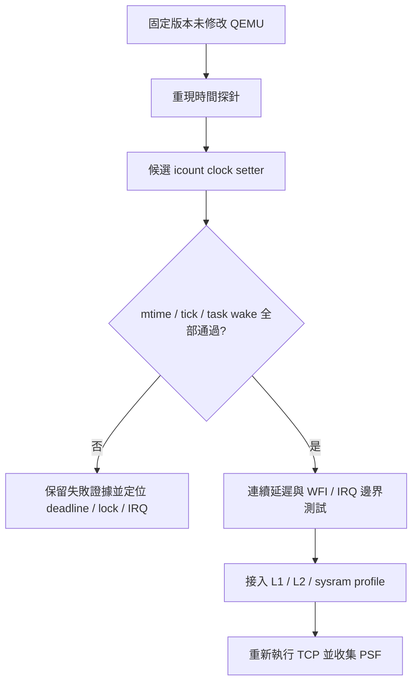

# QEMU clock 接合：固定 source 的後續研究

前一輪時間注入 probe 在目前安裝版 QEMU 的 icount 模式逾時。本輪進一步保存 QEMU v9.2.0 固定 commit `ae35f033b874c627d81d51070187fbf55f0bf1a7` 的相關原始碼，核對 getter／setter／timer 路徑。這份 source 用於研究；尚未完成獨立 QEMU build 或 patch 驗收。

[來源與逐檔 hashes](../../references/qemu-time-control/SOURCE.json)；原始檔保留各自授權，並附 COPYING。取得部分檔案，不是完整 QEMU 建置包。v9.2.0 與安裝版 11.1.2 不同，後續必須在同一固定 source 的未修改／修改 binary 間做 A/B。

## 已確認的接合位置

| 檔案 | 觀察 | 實作含義 |
|---|---|---|
| `accel/tcg/tcg-accel-ops.c` | icount 分支設定 `get_virtual_clock=icount_get`，未設定 virtual clock setter | API 呼叫不保證可以改動 TCG clock |
| `accel/tcg/icount-common.c` | 時間由 `qemu_icount_bias + icount_to_ns(...)` 組成；idle warp 會在 seqlock 保護下增加 bias | bias 是候選延遲注入位置；不可把直接寫入變數當作已驗證方案 |
| `util/qemu-timer.c` | advance 迴圈逐 deadline 呼叫 setter、run timers，再讀 clock | 缺 setter 可導致不前進；没有 deadline 時也不能假設會走到目標 |
| `system/qtest.c` | clock_step 使用相同 advance API | qtest 路徑可參考，但不等同執行中的 FreeRTOS guest |
| `plugins/api.c` | update 將絕對目標時間排入 CPU async callback | 延遲何時生效取決於 callback 邊界，並非每條 load 當下立即 stall |

官方說明指出 icount 以指令預算對齊 timer deadline，遇到 I/O 邊界也需處理 TB。[QEMU icount 官方文件](https://www.qemu.org/docs/master/devel/tcg-icount.html)。因此僅增加 bias 還不夠；需要檢查既有 TB 預算、deadline、IRQ 交付與下一輪執行預算是否一致。

固定來源：[icount](https://github.com/qemu/qemu/blob/ae35f033b874c627d81d51070187fbf55f0bf1a7/accel/tcg/icount-common.c)、[TCG ops](https://github.com/qemu/qemu/blob/ae35f033b874c627d81d51070187fbf55f0bf1a7/accel/tcg/tcg-accel-ops.c)、[timer advance](https://github.com/qemu/qemu/blob/ae35f033b874c627d81d51070187fbf55f0bf1a7/util/qemu-timer.c)。

## 下一個最小實驗

1. 在 POC 的獨立來源／build 目錄取得完整固定 revision，建置僅 RISC-V system target；保存工具、configure 命令與 binary hash。不替換 Homebrew QEMU。
2. 先用未修改 binary 重跑既有 0／1／5 ms 探針，確認固定版本的基線；plugin header 改用該版本，不能假設 API 7 binary 相容。
3. 增加僅供研究的 monotonic clock setter 候選，使用與 icount 相同的鎖；只接受單 vCPU、固定 shift，拒絕倒退。審查目前 CPU 是否仍在執行、pending icount 是否已結算及 async callback 鎖狀態。
4. 驗證 getter 不倒退、正延遲不死循環；0／1／5 ms 各三次核對 mtime、FreeRTOS tick、等待 task 醒來與 work oracle。
5. 加入無 timer、跨多個 deadlines、連續兩次注入、目標已過期、WFI、IRQ masked／unmasked 的案例。大幅 clock jump 可能先累積 IRQ 再由 guest catch up，必須與逐次 stall 分開標示。
6. 最後才接 cache 成本：使用明確 CPU Hz 把 cycles 轉 ns，累計餘數防止每次四捨五入漂移；sysram profile 採 [10-cycle 情境](../sysram-10.md)。

## 狀態與邊界

- [x] Sysram read／write 10-cycle profile 及 sidecar replay。
- [x] 固定 QEMU source revision、保存相關 clock 原始碼與來源 hashes。
- [x] 找出 bias、TCG setter、timer deadline 的接合位置與驗收缺口。
- [ ] 完整來源取得與獨立 build。
- [ ] Clock setter patch 與 probe 通過。
- [ ] Cache 模型造成的 guest time／TCP 行為變化。
- [ ] Web／離線 HTML 的分層 timing views。

本輪沒有用 host sleep、調慢整個 QEMU 或改 PSF timestamp 冒充記憶體延遲。以上研究結論不表示記憶體等待模型已完成。
