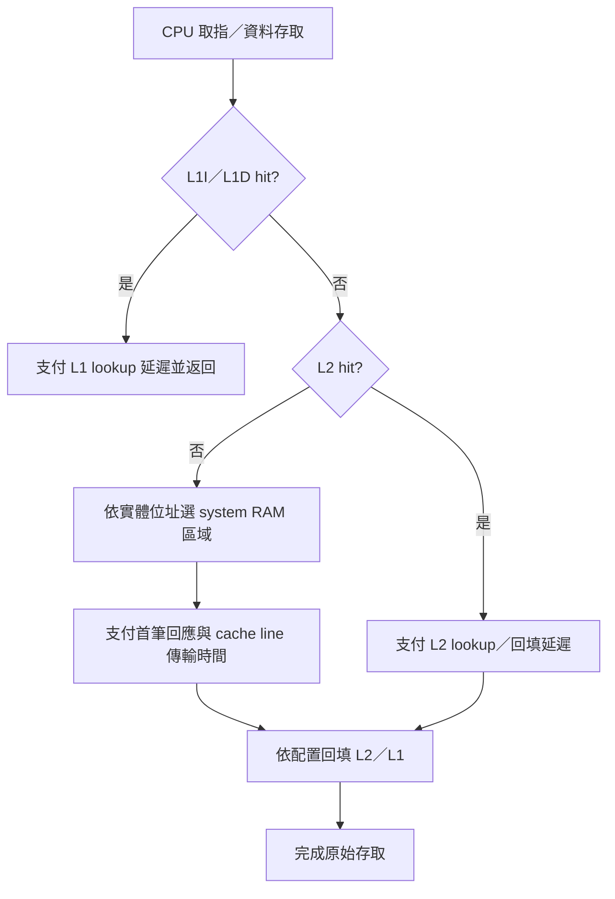

# QEMU：L1／L2／system RAM 的速度與等待模型

2026-10-04。使用者新增要求：依不同記憶體層級設定速度，cache hit 快速返回；miss 則等待下一層，最終由 system RAM 回應，用於軟體最佳化的相對比較。

**T1 參數化 memory-service 模型已實作，T2 把 penalty 注入 guest 時間仍未實作。** 見 [T1 程式、三組 RAM 延遲結果與重跑方式](../memory-timing-t1.md)。原 Z0 的 cache miss 數與指令數仍保持原定義，新估算另存 sidecar，不覆寫 CPU cycles 或 PSF 時間。

## 1. 要表現的行為



圖先描述 blocking read／instruction fetch。寫入還要分 write-back、write-through、write-allocate、dirty eviction，以及 store buffer 是否能隱藏等待。不能把所有 write miss 都當成同一種 read miss。

L1／L2 是 cache 層級，通常不是獨立的 CPU 位址區段；system SRAM、DRAM、Flash／XIP、TCM 或 uncached RAM 才需要按實體位址配置。TCM 或 uncached 區域可能繞過 cache，須由平台規格決定。此處 system RAM 是一般名稱，尚未假定產品一定使用 DRAM。

## 2. QEMU 現有能力與查證結果

| 項目 | 結果與限制 |
|---|---|
| `-icount` | 把已執行指令數映射到 virtual time；不能單靠它分辨 L1 hit 與 RAM miss 的成本 |
| TCG cache plugin | 可依存取模擬 cache；官方定位為簡化的 cache 模型，沒有自動保證符合真實微架構 |
| `MemoryRegion` | 提供 RAM／MMIO／位址空間映射；定義記憶體區域不等於自動具有 RAM timing model |
| 本機 plugin header | 已找到 `qemu_plugin_request_time_control()`、`qemu_plugin_update_ns()`；可作為 virtual-time 實驗候選 |
| Host `sleep()` | 延長 host 執行時間不能證明 guest timer／CPU 真的承受同等等待；不採此方法當 latency 模型 |

官方來源：[TCG icount](https://www.qemu.org/docs/master/devel/tcg-icount.html)、[cache modelling plugin](https://www.qemu.org/2021/08/19/tcg-cache-modelling-plugin/)、[Memory API](https://www.qemu.org/docs/master/devel/memory.html)。

本機證據：[qemu-plugin.h](../../third_party/qemu-cache/qemu-plugin.h) 的 time-control 宣告與 [SOURCE.json](../../third_party/qemu-cache/SOURCE.json)，本次 `qemu-system-riscv32 --version` 為 11.1.2，header 為 API 7。Header 說明一次只允許一個 plugin 取得 time-control handle，`update_ns` 傳入從零起算的絕對時間，不是每次增量。上游 [2024 time-control patch 討論](https://patchew.org/QEMU/20240313105504.341875-1-pierrick.bouvier%40linaro.org/20240313105504.341875-5-pierrick.bouvier%40linaro.org/) 展示以 asynchronous CPU callback 更新 virtual time 的設計；它是歷史提案，不能直接代表本機 binary 的全部語意。

本次官方 master API 頁與本機 header 的呈現不同；指定版本 `plugins/api.c` 網頁也未成功取得，因此仍需以本機對應 source／symbol 及可執行探針確認行為。**僅找到 API 宣告，還不能宣稱每次 load 都會同步 stall。**

## 3. 建議分兩個可驗證階段

### T1：同一份 trace 的參數化成本估算

先讓相同 Z0／A-B trace 以不同 latency profile 重播，顯示哪些函式與資料存取最受慢速 RAM 影響。結果命名為 `estimated_memory_service_cycles`，與 guest time、`rdinstret`、host elapsed 分開。

用完全串行的簡化模型，將參數定義為「到該層額外支付的成本」：

```text
service_cycles =
    L1I_lookup_count × L1I_lookup_cycles
  + L1D_lookup_count × L1D_lookup_cycles
  + L1_miss_count × L2_lookup_cycles
  + sum(each L2 miss: addressed_RAM_line_service_cycles)
```

計數以 cache-line transaction 為準，跨 line 存取要拆分。L2 miss 是 L1 miss 的子集合；採逐層增量才能避免把累計 hit latency 重複計算。若另有回填／bus 成本，需列明是否已包含於 line-service 參數。

純示例：L1 lookup 1 cycle、L2 額外 lookup 8 cycles、RAM line service 額外 80 cycles，則 L1 hit 為 1、L2 hit 為 9、RAM 路徑為 89 cycles。**1／8／80 僅供解釋公式，並非產品規格或實測值。** 先掃描多組參數，觀察 A/B 排名是否穩定，再用硬體量測校準。

此公式是 serialized service-cost 模型；未包含 pipeline、overlap、prefetch、memory-level parallelism 或 writeback。它不能直接與固定 CPI 相加後宣稱是 CPU 真實執行週期，因為 fetch／load service 可能已被 CPI 包含或與其他操作重疊。現有 tag-only replay 沒有 dirty 狀態，完整寫入模型需新增資料結構與測試。

### T2：讓 guest virtual time 反映成本

使用 time-control plugin 的小型探針，確認能否依模型成本推進 system time，讓 guest `mtime`、timer IRQ 及 FreeRTOS tick 看到差異。初期只做單 core、blocking 模型；不用這個近似去宣稱支援真實 out-of-order 或多核心一致性。

先驗證 time-control 與既有 `-icount` 的互動，避免兩者重複推進時間。另需確認每次更新的生效邊界、TB 中剩餘指令是否已經執行、IRQ 何時送達，以及 `WFI`／idle 如何前進。不應直接改動目前 Z0 baseline 的時間來源。

若 plugin 更新只能在較粗的邊界生效，可標示為「量子化的 timing approximation」。若無法滿足需要的 CPU／bus 等待語意，再評估 QEMU core 修改或具 timing CPU／memory 模型的模擬器，保存替代方案的移植成本與限制。

## 4. 設定與 Dashboard

| 設定群組 | 需要保存的參數 |
|---|---|
| CPU | clock Hz、base execution 成本定義、blocking／overlap 假設 |
| L1I／L1D／L2 | 容量、line、ways、replacement、hit／lookup latency、回填策略 |
| 位址區域 | start／end、RAM 類型、cacheable、read／write latency、bus bytes per beat、beat cost |
| 寫入 | write policy、write allocate、dirty eviction、store buffer 模型 |
| 匯流排 | 固定仲裁成本、bandwidth；queue／DMA contention 若未模擬須標為 unsupported |
| 出處 | profile ID、來源為硬體規格／實測／假設、工具與設定 hash |

Web／離線 HTML 都應能選 timing profile，顯示 L1、L2、RAM 各自的成本、每函式估算 penalty、相同 workload A/B 差異及參數敏感度。Tooltip／CSV 必須保留單位、分母與模型假設。改 profile 不會自動重新產生 PSF；T1 衍生結果先保存為具 trace hash 的 sidecar。T2 若改變 guest 時序，必須重新跑 firmware 產生新 PSF。

## 5. 驗收與狀態

- [x] 查證官方 icount／cache／Memory API 定位及本機 time-control 宣告。
- [x] 定義 T1 成本估算與 T2 guest 時序影響的不同驗收範圍。
- [x] T1：read／取指相同 line 第二次為 L1 hit；超過 L1 但留在 L2 為 L2 hit；兩層 miss 才計 RAM read fill。
- [x] T1：跨 line、不同 RAM 區域、uncached bypass、write-through＋write-allocate 有獨立期望值測試；write-back 尚未支援。
- [x] T1：提高 RAM read latency 只增加對應 RAM read transaction 的成本；同一份 trace 與封包維持不變。
- [ ] T2：用 guest `mtime` 而非 host stopwatch 驗證時間差；確認 clock Hz 換算與無重複計時。
- [ ] T2：開啟中斷的小案例驗證 timer／tick／task 排程；目前 Z0 capture 期間關閉中斷，不適合直接證明這件事。
- [ ] T2：驗證 IRQ／TB 生效邊界與 deterministic 重跑，再接完整 TCP 流程。
- [ ] Dashboard：顯示 profile、分層成本與假設，完成 Web／離線互動驗收。

這項研究的目的，是讓 cache locality 改善能映射成可比較的成本，並逐步驗證時序效應；目前尚未證明它能準確預測產品吞吐或最差延遲。

## T2a 最新實驗

[時間注入探針](../time-control-probe.md) 已執行：control 三次正常，1／5 ms 各三次逾時。T2 驗收仍未通過，下一步先在獨立 QEMU build 接合 clock setter。[Cache 延遲參考值](Cache延遲參考值與校準.md) 區分原廠規格、測量與示範設定。
