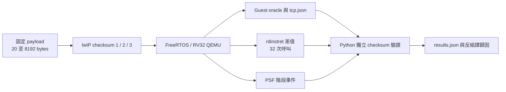
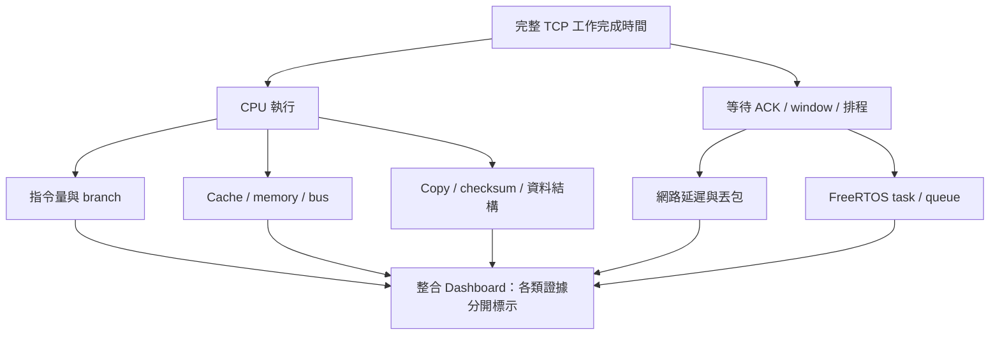

# TCP/IP 與 Cache 最佳化：候選、真實案例與第一個 RV32 實驗

日期：2026-10-04。**已完成 checksum 元件實跑；完整 TCP 連線、吞吐量與 L1I/L1D/L2 模擬尚未完成。**

## 先看結論

- 適合目前 FreeRTOS / RISC-V 方向的候選：**FreeRTOS+TCP**、**lwIP**。RISC-V ISA 本身不要求專用 TCP stack；真正需要適配的是 RTOS、網路介面、DMA/cache 一致性與平台 byte order/alignment。
- 有公開實際案例，不必先找大量不相關 C 程式。ESP32-C3 提供 RISC-V + lwIP 的硬體案例；FreeRTOS 論壇提供吞吐量、zero-copy 與 window 的排查過程。
- 本輪先取 **lwIP 2.2.1 未修改的 checksum 演算法**，在現有 FreeRTOS / RV32 QEMU 上實跑。這是元件研究，尚未替使用者定案完整 stack。
- 1,460-byte payload 重複 32 次：演算法 3 相對預設演算法 2，QEMU 指令計數減少 **49.2%**；checksum 函式由 **98 bytes** 增至 **164 bytes**。這個結果證明運算量差異，不直接證明 cache miss、硬體 cycles 或 TCP Mbps 改善。

## 1. Stack 比較與實際程式規模

| 項目 | FreeRTOS+TCP | lwIP |
|---|---|---|
| 與本 POC 的關係 | 使用 FreeRTOS task/queue 等服務，適合現有 RTOS | 可搭配 FreeRTOS，需要 sys_arch / netif 適配 |
| API | FreeRTOS socket API | raw、netconn、socket API，執行緒規則各異 |
| 可研究元件 | stream buffer、TCP window、socket、zero-copy、checksum | pbuf chain、checksum、TCP input/output、buffer/window |
| 本輪取得版本 | V4.4.1，`c12361095aca68aeed858f45d14395fbffa92c0d` | 2.2.1，`77dcd25a72509eb83f72b033d219b1d40cd8eb95` |
| C 原始檔大小抽查 | `source/*.c` 42 檔合計 1,578,854 bytes | `src/core/*.c` 20 檔合計 628,889 bytes，不含子目錄 |
| 本 POC 驗證 | 目前未完成整合或連線測試 | checksum 元件已編譯 / 執行，完整 TCP 尚未整合 |
| 授權 | MIT，應隨實際納入檔案保留通知 | BSD 類授權，已保留上游 COPYING 與檔頭 |

以上 source bytes 包含註解，兩邊計數範圍不同，**不能拿來排名 footprint**。使用者所說的「100–200 K」究竟是 source bytes 或最終 `.text`，仍待確認。完整 stack 的 flash/RAM 必須固定功能、buffer/window、連線數後實際 link；不能用下載大小推算。

來源：[FreeRTOS+TCP 官方 repository](https://github.com/FreeRTOS/FreeRTOS-Plus-TCP)、[lwIP 固定版本](https://github.com/lwip-tcpip/lwip/tree/77dcd25a72509eb83f72b033d219b1d40cd8eb95)、[ESP32-C3 lwIP API 與執行緒限制](https://docs.espressif.com/projects/esp-idf/en/latest/esp32c3/api-guides/lwip.html)。ESP-IDF 使用有修改的 esp-lwip，不能把 ESP-IDF 數字當作原版 lwIP 的效能。

兩者都還需要本平台 NIC driver。這次沒有驗證可直接插入 QEMU virt 的現成 FreeRTOS NIC driver；不要把「C 可編譯於 RISC-V」解讀為「網路已通」。

## 2. 公開真實案例：哪些值得學

### 案例 A：ESP32-C3 的 lwIP / Wi-Fi 效能設定

官方測試以單核心 160 MHz 的 ESP32-C3、80 MHz QIO flash、單一 stream 與遮蔽箱環境量測。其設定比較表列出 TCP TX 20.4 / 27.2 / 38.1 Mbps、RX 17.4 / 24.2 / 35.3 Mbps，對應 Minimum / Default / Iperf 設定。參數包含 TCP window、buffer 數量及程式碼 IRAM 放置。

**可學到：**程式碼所在記憶體與 buffer 預算都值得量測。**不能據此說：**開啟一個 cache 選項就帶來表內全部增幅，因為同時變動了多個參數。

[官方實驗條件、設定表與 iperf 程式入口](https://docs.espressif.com/projects/esp-idf/en/stable/esp32c3/api-guides/wifi-driver/wifi-performance-and-power-save.html)。此案例可作研究參考，Wi-Fi driver 與硬體不能直接移植為本 QEMU 測試。

### 案例 B：FreeRTOS+TCP 吞吐量調校與 zero-copy 使用問題

2025 年論壇案例從 100 Mbps link 上 TCP 約 70 Mbps、UDP 約 95 Mbps 展開。討論涉及 socket window、zero-copy 接收長度的使用錯誤、封包遺失，以及 PCAP/offload 對判讀的干擾；討論串有 iperf 範例程式連結與封包檔。

**可學到：**先確認資料傳送與 API 使用正確，再追 cache。Window 太小或丟包造成等待，即使 checksum 更快，也不一定改善吞吐量。論壇數字屬作者的環境，尚未在本 POC 重現。

[原始討論與程式連結](https://forums.freertos.org/t/freertos-plus-tcp-port-poor-tcp-troughput/22807)。尚未把其附件當作本專案 fixture，也沒有宣稱已執行該 iperf。

### 案例 C：checksum 的真實演算法最佳化

[RFC 1071](https://www.rfc-editor.org/rfc/rfc1071.html) 說明 checksum 的 word-wise 加總、延後 carry、loop unrolling，以及把 checksum 與 copy 合併的方向。lwIP 原始碼直接提供三種實作，可在不改 payload 意義的前提下比較。

這比只比較兩段自己編造的迴圈，更接近 TCP/IP 實際工作。但目前的測試只處理一段連續資料，還沒有 pseudo-header、pbuf chain、DMA 與 checksum offload。

## 3. 本輪已跑的 C 測試



**輸入與邊界：**

- payload 第 i byte = `(i * 17 + 31) % 256`。
- 長度：20、64、511、1460、1461、8192 bytes。8192 是 buffer 掃描案例，不代表 Ethernet MTU。
- offset：0、1；每種輸入呼叫 32 次，每個演算法獨立啟動 QEMU 3 次。
- 3 演算法 × 12 輸入 × 3 重跑 = **108 筆量測、9 份 PSF**。
- GCC 15.2、`-Os`、RV32IMAC+Zicsr、`-fno-strict-aliasing`、無 LTO。checksum 使用上游未修改 C 檔。
- 量測區段關閉中斷，避免排程混入。這是元件隔離實驗；正式網路處理不能照抄長時間關中斷。
- `rdinstret` 差值包含 32 次 checksum 呼叫、呼叫迴圈與 volatile 結果儲存；未扣空迴圈成本。PSF 標記與 semihost 寫檔在量測區段之外。
- `-icount shift=0` 的 QEMU 指令計數不包含真實 cache / bus stall，不能換算硬體 CPU loading 或 Mbps。
- 設定檔關閉 `LWIP_TCP` / sockets / netconn，只編入 checksum 元件。外層 FreeRTOS 仍正常執行。

### 結果：offset 0，32 次呼叫合計

| payload bytes | 演算法 1 指令數 | 演算法 2 指令數 | 演算法 3 指令數 |
|---:|---:|---:|---:|
| 20 | 5,826 | 3,202 | 2,722 |
| 64 | 15,682 | 7,426 | 4,642 |
| 511 | 115,714 | 50,338 | 26,434 |
| 1460 | 328,386 | 141,442 | 71,842 |
| 1461 | 328,514 | 141,538 | 71,938 |
| 8192 | 1,836,354 | 787,714 | 394,786 |

| 成本 | 演算法 1 | 演算法 2（upstream 預設） | 演算法 3 |
|---|---:|---:|---:|
| `lwip_standard_chksum` symbol 大小 | 86 bytes | 98 bytes | 164 bytes |

大小只計 checksum 主函式，不是整個 TCP stack、RTOS 或 SDK。3 相對 2 增加 66 bytes，約 67.3%。三次獨立重跑各輸入指令數一致；這反映 deterministic QEMU workload，不代表真實系統沒有 jitter。

### 瓶頸原因：已確認與待確認

**已確認的相對成本來源：**演算法 1 逐 byte 組成 16-bit 數字，反組譯有較多載入與位移；演算法 2 每輪以 `lhu` 讀 2 bytes；演算法 3 主迴圈用兩個 `lw` 處理 8 bytes，減少分支與指標更新。8192-byte 與小封包的差異也顯示固定開銷不能忽略。

**尚未確認：**checksum 是否占完整 TCP workload 最大比例。這個 microbenchmark 是主動選定 checksum，沒有先對整個 stack 做 top-down profile，因此只能稱「checksum 元件成本與改善」，不能稱「已找到整套 TCP 的最大瓶頸」。

**Cache 推論邊界：**三種演算法掃過相同 payload bytes。若 cache line 相同，冷啟動的 payload compulsory misses 可能相近；少了 load 指令不必然少了 line fills。演算法 3 程式較大，也可能增加 I-cache 壓力，需要完整程式情境驗證。

## 4. 使用者指定的 Cache 設定

| 欄位 | 狀態 |
|---|---|
| L1 instruction | 16 KiB，納入後續模型 |
| L1 data | 16 KiB，納入後續模型 |
| L2 | 64 KiB，納入後續模型 |
| Line size / ways / replacement | 尚未取得平台規格；必須在每次結果上標出假設 |
| L2 共用 I/D、inclusive/exclusive、write policy | 待模型與平台條件明確化 |
| Latency / penalty | 未指定；後續做參數掃描，不能擅自換算成真實 cycles |
| 本輪有模擬以上 cache 嗎？ | **沒有**；manifest 明確記 `simulated_in_this_run: false` |

舊 Cache Dashboard 的 row/column 實驗是 data-only，L2 32 KiB。它仍可看既有案例，不能當成這次 16+16 / 64 KiB 的結果。

「Cache 有效率」至少分三件事：載入的 line 有多少 bytes 真正被用到、被逐出前是否重用，以及 miss/stall 是否影響工作完成時間。提高 hit rate 卻增加很多指令，不一定更快。拆大函式、拆大結構需要依熱路徑與共用欄位決定，不能只按 source 大小切割。

## 5. 重跑、證據與 API

在 `poc` 目錄，沿用 [既有工具鏈與還原方式](../cache-replay.md)：

```sh
.venv/bin/python -m unittest tests.unit.test_tcp_checksum
.venv/bin/ruff check src/psf_lab/tcp_checksum.py tools/tcp tests/unit/test_tcp_checksum.py
.venv/bin/python tools/tcp/run_checksum.py --output runs/local/tcp-checksum-new
```

`--output` 必須是新目錄。可用 `--toolchain /path/to/bin --qemu /path/to/qemu-system-riscv32` 指定本機工具。Host 正確性測試需要 `cc`；guest build 需要既有 RISC-V GCC、FreeRTOS、TraceRecorder。網路只用於初次取得工具與來源，執行測試不需要外網。

| 檔案 / 目錄 | 用途 |
|---|---|
| [firmware/app/cases/tcp_checksum.h](../../firmware/app/cases/tcp_checksum.h) | FreeRTOS task、獨立 guest oracle、量測邊界 |
| [references/tcp/lwip](../../references/tcp/lwip) | 固定上游 C / headers / COPYING / SOURCE.json |
| [tools/tcp/run_checksum.py](../../tools/tcp/run_checksum.py) | 全新 build、9 次 QEMU、PSF 標記、oracle 與重跑檢查 |
| [tests/unit/test_tcp_checksum.py](../../tests/unit/test_tcp_checksum.py) | RFC 範例與三種實作、8 種 alignment、73 種長度的交叉比對 |
| [runs/tcp-checksum-v2/results.json](../../runs/tcp-checksum-v2/results.json) | 全部 108 筆結果，含 offset 1 |
| [runs/tcp-checksum-v2/manifest.json](../../runs/tcp-checksum-v2/manifest.json) | upstream / 工具 / build command / 實際相依檔 SHA256 / raw evidence SHA256 |
| `runs/tcp-checksum-v2/tcp_checksum*-*/` | PSF、ELF、map、symbol、checksum.asm、tcp.json、oracle.json |
| [實作計畫](../plans/08-tcp-cache.md) | 完成與後續工作 |

API / 原始碼入口：[inet_chksum.c 三種演算法](https://github.com/lwip-tcpip/lwip/blob/77dcd25a72509eb83f72b033d219b1d40cd8eb95/src/core/inet_chksum.c)、[inet_chksum.h](https://github.com/lwip-tcpip/lwip/blob/77dcd25a72509eb83f72b033d219b1d40cd8eb95/src/include/lwip/inet_chksum.h)、[FreeRTOS socket header](https://github.com/FreeRTOS/FreeRTOS-Plus-TCP/blob/c12361095aca68aeed858f45d14395fbffa92c0d/source/include/FreeRTOS_Sockets.h)。

內網還原包：[tcp-checksum-source.tar.gz](../../artifacts/restore/tcp-checksum-source.tar.gz)，包含本測試、FreeRTOS / SDK / lwIP 元件來源、測試與 raw evidence；[包檔收據](../../artifacts/restore/tcp-checksum-source.json) 保存 SHA256，包內 `RESTORE-SHA256.json` 列出逐檔雜湊。工具執行檔與 Python 套件不在包內；這不代表已做跨機驗證。

解開後可用 `PYTHONPATH=src python3 -m unittest discover -s tests/unit -p test_tcp_checksum.py` 驗證，再用同一個 `PYTHONPATH=src` 執行 `tools/tcp/run_checksum.py`，指定 `--toolchain`、`--qemu` 與新的 `--output`。包內沒有 `.git`，以逐檔雜湊辨識來源。

PSF 目前保存 `CHECKSUM_BEGIN/END` 階段，指令計數在 `tcp.json` sidecar；不要把 sidecar 指標說成已寫入 PSF counter。

## 6. 後續完整實驗與 Dashboard

1. 確定正式 stack 後，建立 in-memory netif 的 handshake / payload / ACK 測試，先通過逐 byte payload oracle。
2. 一次只改一個因素：checksum、copy/zero-copy、pbuf chain、buffer layout、TCP window。加上 loss/retransmit 對照，區分 CPU 工作與網路等待。
3. 追蹤 guest instruction PC 與資料位址。舊 plugin 的單一 PC 區間會漏掉 `memcpy` 等 callee，需以工作階段涵蓋完整呼叫路徑。
4. 用 16 KiB L1I、16 KiB L1D、64 KiB L2 共用模型 replay；固定 workload 與冷/暖啟動條件，保存 geometry 與模型版本。
5. Web / 離線 HTML 都提供 workload、演算法、封包長度、alignment、cache geometry 篩選；圖表顯示 instructions/byte、misses/KiB、I/D miss、code size、payload 正確性與 TCP 等待時間。支援來源定位、排序、CSV。未知的 cycles/penalty 不填 0。
6. 依使用者要求完成 curl integration、agent-browser E2E、截圖與 README。**這輪沒有新增 TCP UI，也沒有宣稱上述 UI 驗收已完成。**


