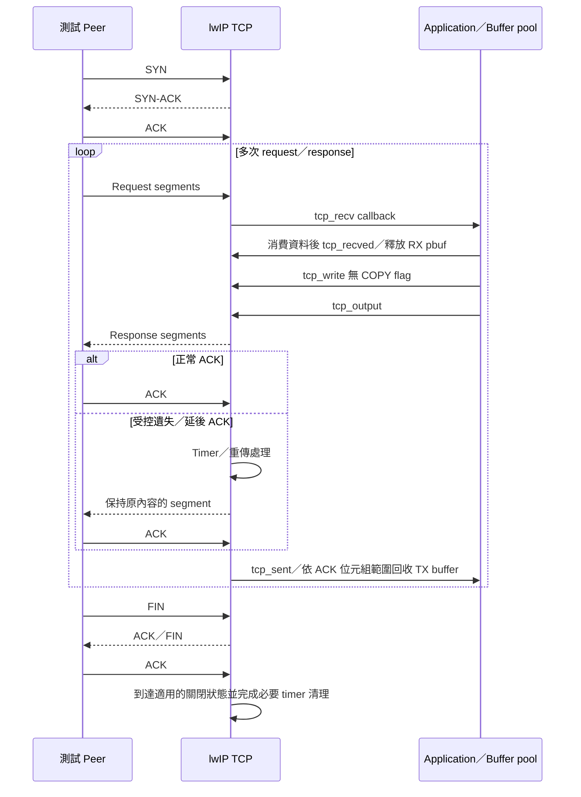

# Zero-copy 後的 TCP 完整流程最佳化

更新日期：2026-10-04。狀態：**Z0 正常基準已實作並執行三次；其他案例及新最佳化仍待執行。** 詳見 [Z0 實測報告](../tcp-session-z0.md)。新增 [分層記憶體延遲研究](QEMU分層記憶體延遲研究.md)，timing 模型仍待實作。

使用者要求：保存 `memcpy` 最佳化討論，並以「已經採用 zero-copy」為前提，找一段較完整的 TCP 流程進行最佳化。既有成果、數字及重跑方式見 [TCP 實作報告](../tcp-optimization.md)。

## 1. `memcpy` 的最佳方法取決於什麼？

必要的複製應比較符合 CPU、ABI、對齊與長度分布的實作；可避免的複製則先評估 buffer ownership。不存在適用所有長度及硬體的單一最快版本。

本次 ELF 的 `memcpy` 使用逐 byte 迴圈：一個 load、一個 store、三個計數／位址更新、一個分支，共六條指令。非零長度另有三條入口／返回指令。1,460 bytes 為 `1460 × 6 + 3 = 8,763` 條，四次為 **35,052**，對上現有 baseline 的函式熱點。

可複查證據：

```sh
# 在 poc/ 執行；依安裝位置替換 objdump 路徑
.tools/xpack-riscv-none-elf-gcc-15.2.0-1/bin/riscv-none-elf-objdump \
  -d --disassemble=memcpy runs/tcp-transfer-v2/tcp_copy2-1/firmware.elf
```

| 方法 | 值得比較的條件 | 代價／限制 |
|---|---|---|
| 32-bit word-copy | RV32 上必要的中大型複製 | 正確處理來源／目的對齊、短長度及尾端；指令減少不保證 cache miss 減少 |
| 適度展開迴圈 | 分支與位址更新成本明顯 | 增加 code size，過度展開可能增加 I-cache 壓力 |
| 複製＋checksum 同一趟 | TCP 必須複製且需要軟體 checksum | 檢查 `LWIP_CHECKSUM_ON_COPY` 與實際 port 路徑；尚未測量改善 |
| Zero-copy | buffer 能保持有效、不變直到 ACK 或安全清理 | 減少搬運，但增加生命週期與未 ACK 資料管理成本 |
| DMA／RVV | 硬體及軟體確實支援 | 啟動、同步及 cache 維護有成本；目前 RV32IMAC 測試不含 V extension |

應優先評估成熟的 RISC-V 實作，不能把任意 buffer 直接強制轉成 `uint32_t *` 就視為安全最佳化。來源與目的重疊應用 `memmove`。測試必須包含零長度、不同對齊、短長度與邊界，避免越界讀寫。

Newlib 明確提供體積優先的 RISC-V byte-copy 與另一條速度取向路徑。[上游實作紀錄](https://sourceware.org/pipermail/newlib-cvs/2019q2/004068.html)。只修改應用程式 `-Os`／`-O2` 不會自動重編預先建置的 libc，須確認最終 ELF。

**既有 76.0% 是 checksum3＋zero-copy 相對 checksum2＋byte-copy 的指令改善，不能解讀為相對最佳化 `memcpy` 的改善，也不是實機吞吐提升。** Word-copy 及 copy＋checksum 是獨立的公平基準補強；依本次新要求，下一個主要研究以已經 zero-copy 的流程為起點。

## 2. 本輪建議研究哪一段完整流程？

建議採用 **持續連線的 TCP request／response**：建立連線、接收 request、產生固定內容 response、zero-copy 傳送多個 segment、處理 ACK 與重傳，最後正常關閉並驗證資源回收。固定內容先隔離 TCP 成本；真正業務運算另列量測階段。

原有 transfer fixture 已執行握手、ACK 與重傳，但量測主要涵蓋 TX。新增 Z0 已重新擷取 RX request、ACK 處理與 FIN／正常資源回收，不能由既有 TX trace 外推；長期、多連線與異常清理仍待補齊。



圖為被動接收 FIN 的預定案例；主動關閉／TIME_WAIT 應另列案例。`tcp_sent` 的 ACK 長度可能涵蓋部分或多個 buffer，不能假設一次 callback 對應一次 `tcp_write`。`tcp_recved` 更新接收視窗，並不代替 `pbuf_free`。錯誤／abort 清理也要確認 stack 不再參照 TX buffer。

這裡的 zero-copy 指 application 到 lwIP 的 TX payload 參照；不代表 RX、header 或 NIC driver 全程零複製。先沿用 deterministic packet peer 與單 task raw API 以降低變因；第二套完整 TCP peer、`NO_SYS=0`／sys_arch、NIC／DMA 是另外的擴充層次，不能把本案例稱為產品端到端網路效能。

## 3. 先量測，再選擇最佳化位置

以下都是待驗證假設；**在取得 zero-copy 全流程 profile 前，不預設 checksum、pbuf 或 cache 一定是主要瓶頸。**

| 階段 | 要找的成本 | 可比較的方法 | 必須保留的正確性 |
|---|---|---|---|
| RX／checksum | 每 packet 掃描次數、checksum 指令量 | checksum 實作、pbuf 分段／對齊 | 奇數長度、跨 pbuf 邊界、checksum 錯誤拒收 |
| TX 排隊／輸出 | 小 `tcp_write`、segment 與 header 成本 | 相同業務輸入下適度合併寫入／輸出 | 總 bytes 相同；記錄新增等待與封包數，不只比較指令 |
| ACK／未確認佇列 | queue traversal、pbuf 釋放、回呼頻率 | buffer pool、適當 chunk 大小及 in-flight 資料量 | 部分 ACK、重複 ACK、不可過早重用 buffer |
| RX 視窗／應用回壓 | 接收消費速度與視窗更新 | 有界的接收／消費策略 | 不漏呼叫 `tcp_recved`，零視窗後可恢復 |
| Timer／重傳 | 掃描、重新 checksum、重傳工作量 | 先定位熱點，再評估安全重用衍生資料 | 不任意放寬 RTO 或省略協定步驟來製造改善 |
| 記憶體／cache | 熱資料 footprint、鏈結遍歷、配置回收 | pool／layout／hot-cold split | RAM、code size、I/D cache 一起比較；拆函式不是必然改善 |

建議先做單連線正常流程，之後各自加入長串流、遺失封包、視窗壓力，再擴充多連線。不要一次同時改 checksum、buffer、Nagle 與視窗大小，否則不能歸因。

## 4. 案例、分母與 cache 邊界

| 待建案例 | 目的 | 驗收重點 |
|---|---|---|
| Z0：正常 request／response＋關閉 | 建立 zero-copy 全流程基準 | 收送 bytes、seq／ack、checksum、關閉與資源回收 |
| Z1：多輪持續傳輸 | 超過 cache 容量後觀察重用 | 掃描工作集，例如 8／32／128 KiB；標示應用工作集與實際 in-flight bytes |
| Z2：受控資料遺失／ACK 遺失／重排 | 驗證修正不破壞恢復機制 | 三者分開執行；重傳內容一致、應用不收到重複資料 |
| Z3：慢速接收與零視窗 | 觀察回壓、持有 RAM 與 timer 成本 | 視窗重開後恢復，buffer 無提早覆寫／洩漏 |
| Z4：反覆連線與關閉 | 檢查配置／回收及累積成本 | 經適用 timer 清理後，PCB／pbuf／buffer 回到預期基準 |

第一階段固定 **L1I 16 KiB、L1D 16 KiB、L2 64 KiB**，沿用並標示 line／way／replacement 假設。容量掃描是之後的獨立因素。整個 session 的 cache replay 必須連續，包含 RX、ACK、timer 與必要的 task 執行；另報 cold-start 與 steady-state。若中間有未追蹤區間，就不能宣稱還原完整 warm-cache。

Peer 建包、封包輸出存檔及 oracle 不能混入 stack 成本。若在同一 guest 執行，需分別標記工作量，且明確定義它們是否影響 cache replay；隱藏這些存取再串接 trace 不能代表自然的實機 cache 狀態。

必要指標：每完成一次 request 的指令量、每 unique delivered byte 的指令量、各階段與函式 self instructions、L1I／L1D／L2 miss、pbuf／PCB 配置釋放次數、peak retained bytes、重傳量及 ELF text。TX 分母可用 peer 確認的 unique bytes／ACK bytes，RX 用應用實際接收 bytes，須分開標示；重傳 bytes 另計，不可灌大有效吞吐分母。

CPU task 使用率需 PSF 排程區間與明確時間分母，不能拿函式指令占比冒充。若使用模型 latency，只能輸出具假設的估算；QEMU host 耗時及手動推進 timer 均不能直接轉成產品 Mbps、RTT 或 cycles。

## 5. Dashboard 與驗收待辦

Web 與離線 HTML 應採相同資料契約，新增全流程階段圖、函式熱點、cache、buffer 持有量與重傳關聯；保留 raw PSF／trace／packet／ELF 的證據連結。篩選維度包括 variant、case、connection、phase、run 與 cold／steady-state；CSV 匯出目前篩選結果，tooltip 顯示分母、模型假設與資料來源。

- [x] 記錄 `memcpy` 分析、既有數字的適用邊界及上游依據。
- [x] 定義以 zero-copy 為前提的完整流程候選與觀測缺口。
- [x] 建立 Z0 正常 request／response baseline、完整 ACK 後 TX buffer 重用、正常關閉與資源回收 oracle。
- [ ] 擴充 partial ACK、多個 buffer 的 ACK-range 管理及錯誤／abort 清理 oracle。
- [x] Z0 完成連續 capture，另外標記 stack／callback window；存檔在 capture 外，cache 仍明示包含 peer／snapshot 的影響。
- [ ] 依 profile 選一個最高成本且可安全修改的點，建立單因素 A/B。
- [ ] 執行 Z1～Z4，保存失敗／無改善案例；每配置至少三次重跑。
- [ ] 補充分析器 `unittest`／Ruff、curl integration、Web／離線 browser E2E 與截圖。
- [ ] 保存版本／config／source hashes、原始 captures、重跑命令與內網還原材料。

Z0 的新 firmware、封包 oracle、PSF 與 I/D trace 已保存於 `runs/tcp-session-z0-v2/`。上述未勾選項目未完成；既有 Dashboard 的 TX 結果不代表它已能呈現新的 Z0 案例。

## 6. 可追查來源

- [現有 fixture](../../firmware/app/cases/tcp_transfer.h)：核對目前 TX capture 與 peer 行為。
- [固定版本 tcp_out.c](https://github.com/lwip-tcpip/lwip/blob/77dcd25a72509eb83f72b033d219b1d40cd8eb95/src/core/tcp_out.c)：`tcp_write`、COPY flag、排隊與輸出。
- [固定版本 tcp.c](https://github.com/lwip-tcpip/lwip/blob/77dcd25a72509eb83f72b033d219b1d40cd8eb95/src/core/tcp.c)：`tcp_recv`、`tcp_sent`、`tcp_recved`、關閉與 timer。
- [本機 tcp_in.c](../../references/tcp/lwip/src/core/tcp_in.c)：接收、ACK 與 state machine，供內網對照。
- [公開 TCP／cache 案例研究](TCP-IP與Cache最佳化案例.md)：原有外部案例及 stack 選擇脈絡。
