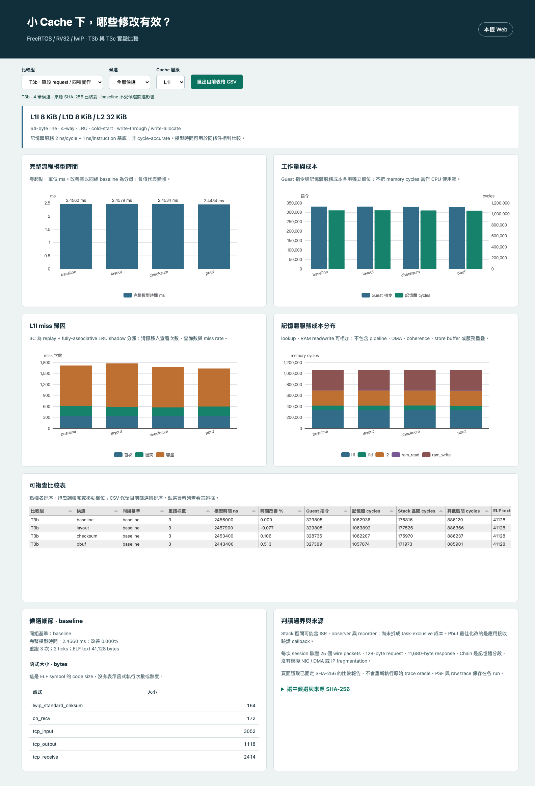
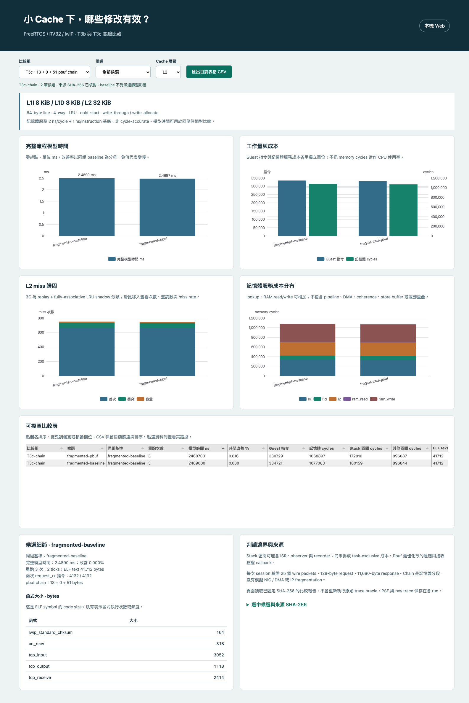
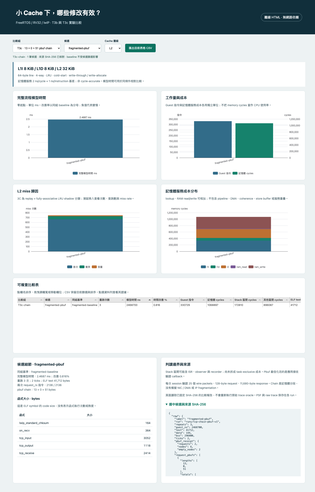
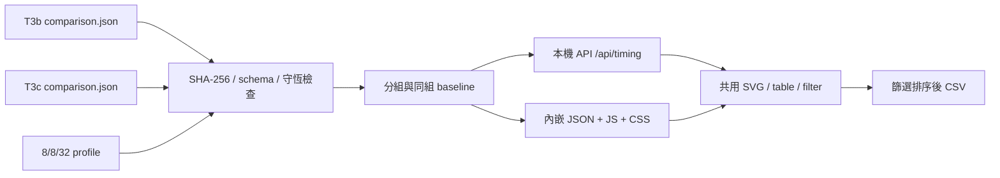

# 小 Cache 最佳化 Dashboard

這個頁面把 T3b/T3c 的實際模擬結果放在一起比較：**L1I 8 KiB、L1D 8 KiB、L2 32 KiB**。它提供本機 Web 與單檔離線 HTML；讀取既有 comparison.json，不需要重新跑 QEMU。

## 開啟與重建

在 `poc/` 執行：

```sh
cd web
npm ci
npm run build
cd ..
.venv/bin/python -m psf_lab serve --port 8016
```

瀏覽 `http://127.0.0.1:8016/timing.html`。Python 環境的準備沿用 [README](../README.md) 與 [重現指南](setup.md)。

離線成品：[small-cache-comparison.html](../artifacts/offline/small-cache-comparison.html)。下載後直接以瀏覽器開啟；觀看時不需要 Python、server 或網路。

重新產生：

```sh
.venv/bin/python -m psf_lab.timing_dashboard artifacts/offline/small-cache-comparison.html
```

## 怎麼看

1. **選比較組。** T3b 比較 baseline/layout/checksum/pbuf；T3c-chain 比較同一個 `13 + 0 + 51` pbuf workload；T3c-linear 是單段回歸。每組有自己的 baseline，不能跨組拿百分比推論。
2. **看模型時間與指令。** 圖從零開始；表格與 hover 保留精確值。`improvement_pct = (baseline_guest_ns − candidate_guest_ns) / baseline_guest_ns × 100`，正值較快、負值較慢。篩掉 baseline 後分母仍不變。
3. **看 Cache 歸因。** 選 L1I/L1D/L2，3C 堆疊顯示首次、衝突、容量 miss。Hover 顯示 `misses / accesses`；L2 accesses 包含模型向下層送出的流量，分母不能直接換成 L1 指令數。
4. **看成本及程式大小。** 記憶體服務成本圖分 lookup、RAM read、RAM write。點選表格列，查看 ELF function size、兩次 request_rx 指令及來源 SHA-256。
5. **整理後匯出。** 表格可排序、調欄寬與拖曳欄位；CSV 匯出目前篩選且排序後的資料列。CSV 欄位採固定契約，包含 miss 分母與原始 ns；視覺欄位順序不改 CSV schema。

## 畫面

### Web：T3b 四種實作



同一工作量下 layout 反而變慢；checksum 與 pbuf 改善幅度不同。小幅改善應配合精確數值判讀。

### Web：pbuf chain 比較與排序



完整模型時間從 2.4890 ms 降至 2.4687 ms，改善約 0.816%。接收 callback 的指令改善 48.31% 不等於整體速度改善 48.31%。

### 離線：候選篩選與證據



這張圖在 Python server 停止、瀏覽器 offline 且 HTTP/HTTPS routes 阻擋的條件下擷取。離線資料與 Web API 來自相同 loader。

## 資料如何進入畫面



| 檔案/資料夾 | 用途 |
|---|---|
| `src/psf_lab/timing_dashboard.py` | loader、數值驗證、分組、離線匯出 |
| `cases/timing/dashboard-sources.json` | 固定來源的 SHA-256；更新資料需同步審查 |
| `web/timing.html`、`web/src/timing*` | Web/離線共用介面、篩選與 CSV |
| `tools/tcp/verify_timing_dashboard.py` | curl integration、agent-browser E2E，可重跑 |
| `tests/unit/test_timing_dashboard.py` | hash、錯誤輸入、分母、API 與離線資料測試 |
| `artifacts/verification/small-cache-dashboard/` | regression log、curl/browser commands、CSV、驗收摘要 |
| `artifacts/screenshots/timing/` | Web、離線與窄螢幕畫面 |

## 邊界與下一步

- 原始 PSF、ELF、raw trace 仍在各報告指向的 `runs/`。本頁呈現 hash 固定的彙整報告，不會在載入時重新執行 raw trace oracle，也沒有從 PSF 憑空推導 cache counters。
- 16/16/64 的 `standard` 對照列保留於來源，未混進 8/8/32 畫面。
- 每列是既有重跑的一致結果摘要，不是統計信賴區間；T3c-linear 只有一組 control/injection，chain 為三組。
- `guest_ns` 是模型流程時間；`cycles` 是記憶體服務成本。500 MHz 僅用來把 memory cycles 換成 2 ns，另加 1 ns/instruction 基底，不等於完整 500 MHz CPU。
- Stack window 可能含 ISR/observer/recorder，未分離 task-exclusive。函式表是 size，不是 execution hotspot；這次沒有逐事件 timing timeline。
- 固定 request 長度與 chain 形狀，沒有 NIC/DMA、IP fragmentation 或硬體 PMU。更多 workload 和產品 source 比對仍是下一輪工作。

## 重跑驗收

```sh
.venv/bin/python -m unittest discover -s tests -v
.venv/bin/ruff check .
cd web
npm run test:unit
npm run build
cd ..
.venv/bin/python -m psf_lab.timing_dashboard artifacts/offline/small-cache-comparison.html
# 另開終端啟動 serve --port 8016
.venv/bin/python tools/tcp/verify_timing_dashboard.py
# 停止上述 server 後
TIMING_MODE=offline .venv/bin/python tools/tcp/verify_timing_dashboard.py
```

驗證結果與工作版本見 [completion.json](../artifacts/verification/small-cache-dashboard/completion.json)。初期測試失敗為尚未建立 loader/JS；資料接合時亦發現舊 geometry 對照列缺省零值，不將其納入新頁面數值驗證。T3b/T3c 原始證據未改寫。

最終驗收：clean commit `5955ce6` 的 **230/230 Python tests** 通過；Node **9/9**、既有 Dashboard E2E **11/11**、新頁 Web/離線 agent-browser 各一個完整流程通過，包含真實 hover、CSV 下載與窄螢幕。Ruff、format 與文件連結通過。原始 422 份研究快照 hashes 不變。
