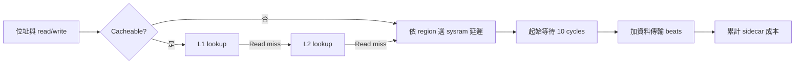

# Sysram 獨立設定為 10 cycles

**已新增 profile 並完成 Z0 TCP trace 重播。** L1I／L1D／L2 的容量、延遲與 sysram 分開設定；sysram 自己還能分開設定 read、write、bandwidth 與實體位址範圍。

本輪將使用者要求的 10 cycles 定義為 **read／write 的起始等待各 10 cycles**，資料 beats 另外計算。這是研究情境，未宣稱為產品實測值。舊 profile 保留，以便比較與還原。

## 設定在哪裡

[正式情境 sysram-10.json](../cases/timing/sysram-10.json) 的 `regions[0]`：

```json
{
  "name": "system_ram",
  "start": 2147483648,
  "end": 2281701376,
  "cacheable": true,
  "read_latency_cycles": 10,
  "write_latency_cycles": 10,
  "bus_bytes_per_cycle": 8
}
```

區間是 `[0x80000000, 0x88000000)`，對應本次 QEMU virt 的 RAM。`system_ram` 是模型中的區域名稱，不代表 QEMU 已將它變成真實 10-cycle SRAM。新增多個不重疊、cache-line 對齊的 regions，可讓不同位址各有自己的 read／write latency。實際產品的 SRAM／DDR 位址配置仍須另行填入。

L1I／L1D=16／16 KiB、L2=64 KiB，lookup 仍為 1／1／8 cycles，line=64 bytes。Sysram latency 不會修改這些設定。

## 10 cycles 包含什麼

`RAM service = latency_cycles + ceil(bytes / bus_bytes_per_cycle)`。

| 存取情況 | 目前模型成本 |
|---|---:|
| 已在 L1 的單一 line read | 1 cycle |
| L1 miss、L2 hit 的 read | 1 + 8 = 9 cycles |
| L1／L2 均 miss，讀取 64-byte line | 1 + 8 + 10 + 8 = 27 cycles |
| 4-byte uncached read／write | 10 + 1 = 11 cycles |
| 4-byte write，兩層均 hit | 1 + 8 + 10 + 1 = 20 cycles |

最後一列採本模型的同步 write-through：L1 hit 仍需寫入下層。Write miss 可能多出 line fill。這些數值是串行記憶體服務成本，不是 CPU pipeline 的 load-use latency；亦未模擬 store buffer、overlap 或 bandwidth contention。



圖示是 read 路徑；write-through 規則見上表與 [T1 完整模型](memory-timing-t1.md)。

## 同一份 TCP trace 的結果

來源 [Z0 第一次 capture](../runs/tcp-session-z0-v2/z0-1/)。全部情境使用相同 PSF、封包與 I/D trace，僅更換延遲參數。

| Sysram read／write 起始延遲 | 全 trace service cycles | Stack windows | Harness |
|---|---:|---:|---:|
| 80／20，舊示範 | 1,362,401 | 230,823 | 1,131,578 |
| 10／20，只調 read 的對照 | 1,323,201 | 214,933 | 1,108,268 |
| **10／10，本輪設定** | **1,003,681** | **167,163** | **836,518** |

三組都是 560 次 RAM read、31,952 次 RAM write；cache accesses／misses 相同。只調 read 減少 `560 × (80−10) = 39,200` cycles；再將 write 20→10 減少 `31,952 × 10 = 319,520` cycles。這驗證讀寫欄位可獨立生效。

全 trace 包含測試 peer、snapshot 等 harness。大部分降幅來自 write-through 寫入成本，不能拿總降幅宣稱 TCP 軟體已加速，也不能套用到 write-back 產品。`cpu_cycles` 仍為 null、`guest_time_changed` 為 false。

## 重跑與複查

```sh
.venv/bin/python -m psf_lab.timing_report \
  --run runs/tcp-session-z0-v2/z0-1 \
  --profile cases/timing/illustrative-ram.json \
  --profile cases/timing/sysram-read-10-write-20.json \
  --profile cases/timing/sysram-10.json \
  --output runs/local/sysram-10-rerun
```

輸出目錄必須不存在。[JSON](../runs/timing-sysram-10-v1/timing.json)、[每函式 CSV](../runs/timing-sysram-10-v1/functions.csv)、[manifest](../runs/timing-sysram-10-v1/manifest.json) 保存 profile 與來源 hashes。

14 個既有模型／報告 unit tests 與 Ruff 通過，另核對上述讀寫差值、cache 計數、cold read=27／warm read=1 及輸出 hashes。證據：[檢查結果](../artifacts/verification/sysram-10/receipt.json)、[unit test log](../artifacts/verification/sysram-10/model-tests.log)、[Ruff](../artifacts/verification/sysram-10/ruff.log)。本輪未修改 Python 邏輯或 UI。

## 下一步

10-cycle profile 已能供 sidecar 比較；guest 真正等待仍需 [QEMU 時間接合研究](research/QEMU-clock接合下一步.md)。完成 clock／tick／task wake probe 後，才能在相同 TCP 流程重新產生帶有時序差異的 PSF。Web／離線 Dashboard 的 timing profile selector 仍待接入，現有 CSV 可先檢查各函式成本。
