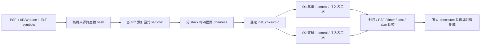

# T3a：第一組完整 TCP 最佳化 A/B：checksum 的 Os／O2 取捨

**只將 lwIP checksum 編譯單元從 `-Os` 改成 `-O2`，完整 TCP IRQ 案例的模型 guest interval 減少 5,800 ns，約 0.24%。** stack 呼叫區間的 memory-service 成本下降約 1.56%。但 20-byte checksum 的指令數增加，函式與 object 也變大，因此保留 `-Os` 為預設，提供 `-O2` 作可選實驗。

這次修改的是產生機器碼的編譯策略，沒有重寫 TCP／checksum 演算法、關閉 checksum 或更改 zero-copy buffer 語意。結果適用本工作負載與模型，不能當作產品速度提升百分比。

## 先找對瓶頸

以 PC 歸屬函式，累加該函式自身 I／R／W 的 memory-service cycles。這是 self cost，不是完整呼叫樹成本，也不是 task CPU usage。

`z0_stack_begin`／`z0_stack_end` 定義 27 個 stack 呼叫區間；其他時間屬 harness。IRQ、observer 或 recorder 若發生在某區間內，仍計在該區間，所以欄位明確命名為 `stack_window_including_preemption`。

基準 `-Os`：

| 函式 | self memory-service cycles | 位於 stack 呼叫區間 | 位於 harness 區間 |
|---|---:|---:|---:|
| memcpy | 355,062 | 0 | 355,062 |
| session_task | 333,458 | 919 | 332,539 |
| memcmp | 105,282 | 0 | 105,282 |
| lwip_standard_chksum | 25,954 | 23,706 | 2,248 |

本案例的 `memcpy`／`memcmp` 全落在 harness 區間，包含 snapshot／payload 檢查；不能把這些成本當成 TCP stack 的複製瓶頸。完整模型有 883,416 cycles 在 harness 區間，168,330 cycles 在 stack 呼叫區間。修改 harness 可能讓總時間大幅下降，卻不能證明 stack 更有效率。

因此第一個目標選擇 `inet_chksum.c`：它包含有實際 stack 工作的 checksum 熱點，而且可以只改一個編譯單元，保留功能與驗收條件。



## A/B 結果與 code size

兩個 variant 各六次 QEMU 執行，固定同一個 QEMU binary、GCC、500 MHz 換算、sysram 10 cycles、16+16／64 KiB cache 模型。每個模式三次結果一致；十二次捕捉的 25 個 packet binary 逐檔完全相同。

| 指標，啟用成本注入 | Os | O2 | 差異 |
|---|---:|---:|---:|
| 完整 guest interval | 2,433,600 ns | 2,427,800 ns | -5,800 ns，約 -0.24% |
| instruction events | 329,805 | 328,307 | -1,498 |
| memory-service cycles | 1,051,746 | 1,049,591 | -2,155 |
| stack 呼叫區間 cycles | 168,330 | 165,703 | -2,627，約 -1.56% |
| harness 區間 cycles | 883,416 | 883,888 | +472 |
| checksum 函式 self cycles | 25,954 | 24,297 | -1,657 |
| lwip_standard_chksum 大小 | 164 bytes | 246 bytes | +82，+50% |
| inet_chksum.o 的 text | 790 bytes | 970 bytes | +180 |
| 最終 ELF 的 size 工具 text 欄位 | 41,128 bytes | 41,128 bytes | 相同 |
| 最終 ELF data／bss | 144／296,736 bytes | 144／296,736 bytes | 相同 |
| .text section 的 padding | 214 bytes | 64 bytes | -150 |

最終 ELF 大小相同不表示最佳化沒有 code-size 代價。link map 顯示本次 layout 的 `.text` padding 減少 150 bytes，吸收保留下來的程式碼成長；object 的 +180 bytes 還包含不同於最終連結集合的 section。換 linker script、其他功能或函式排列，不保證還有這個空間。

可核算的工作量差異為 `1,498 × 1 ns + 2,155 × 2 ns = 5,808 ns`，與 guest 的 5,800 ns 改善相差 8 ns。這裡 1 ns 是 QEMU icount 基礎時間，2 ns 是選定的 memory cycle 換算；仍不是完整 500 MHz CPU pipeline。

兩版都前進 2 ticks，observer 於第 2 tick 搶占並返回 TCP task。原本時間守恆檢查也通過：Os 誤差 +57 ns，O2 +67 ns，皆在 ±200 ns 的量化容許範圍。

來源：[完整 comparison JSON](../artifacts/verification/tcp-checksum-opt/comparison.json)、[函式／區間 CSV](../artifacts/verification/tcp-checksum-opt/hotspots.csv)、[Os 正式 runs](../runs/tcp-opt-os-v1/)、[O2 正式 runs](../runs/tcp-opt-o2-v1/)。

## 為什麼會變快，也可能變慢？

反組譯顯示，兩版都使用 `sltu` 處理加總 carry；差別不是 O2 才有無分支 carry。Os 的 8-byte 主迴圈包含長度遞減、跳回迴圈頭與條件分支，每次正常迭代約 12 條指令；O2 預先計算結束指標，主迴圈約 10 條指令，但多了前置／尾端處理與較大程式碼。

長 payload 可以攤提前置成本，短 header 不一定。以相同 QEMU／GCC 另跑三種上游 checksum algorithm、六種長度、兩種 offset、各三次：每版 108 個測量、9 份 PSF，共 216 個測量，全部 checksum 通過 Python oracle。

以下為 TCP 使用的 algorithm 3；指令數是案例連續呼叫 32 次的量測區間，包含其迴圈開銷，**不是 cycles**。

| bytes | offset | Os 指令數 | O2 指令數 | 指令數減少比例 |
|---|---:|---:|---:|---:|
| 20 | 0 | 2,722 | 3,202 | -17.63%，變差 |
| 20 | 1 | 2,786 | 3,042 | -9.19%，變差 |
| 64 | 0 | 4,642 | 4,482 | +3.45% |
| 64 | 1 | 5,090 | 5,282 | -3.77%，變差 |
| 511 | 0 | 26,434 | 22,978 | +13.07% |
| 511 | 1 | 26,498 | 23,106 | +12.80% |
| 1,460 | 0 | 71,842 | 60,802 | +15.37% |
| 1,460 | 1 | 71,906 | 60,642 | +15.66% |
| 1,461 | 0 | 71,938 | 60,898 | +15.35% |
| 1,461 | 1 | 72,002 | 61,026 | +15.24% |
| 8,192 | 0 | 394,786 | 329,602 | +16.51% |
| 8,192 | 1 | 395,234 | 330,402 | +16.40% |

[矩陣 CSV](../artifacts/verification/tcp-checksum-opt/component-comparison.csv)、[矩陣驗證 receipt](../artifacts/verification/tcp-checksum-opt/components-receipt.json)、[Os 反組譯](../artifacts/verification/tcp-checksum-opt/checksum-Os.asm)、[O2 反組譯](../artifacts/verification/tcp-checksum-opt/checksum-O2.asm)。

另一個取捨是：本固定模型的 RAM line fills 從 672 增至 673，總成本仍下降。只看 miss 次數，不足以決定哪版更快；要一起看執行指令、服務成本、工作負載、程式碼大小及功能結果。

## 使用與重現

新增 `CHECKSUM_OPT=Os|O2`，只套用到 `inet_chksum.o`。build log 核對 O2 variant 只有一個 translation unit 的 compile command 使用 `-O2`；其餘保持 `-Os`，沒有改動下載的 lwIP、FreeRTOS 或 TraceRecorder 原始碼。

```sh
# 完整 TCP IRQ A/B：各自使用新的 output 目錄
.venv/bin/python tools/tcp/run_live_cache.py --case tcp-irq --checksum-opt Os \
  --qemu .tools/qemu-time-control/qemu-system-riscv32-relative --output runs/local/tcp-os
.venv/bin/python tools/tcp/run_live_cache.py --case tcp-irq --checksum-opt O2 \
  --qemu .tools/qemu-time-control/qemu-system-riscv32-relative --output runs/local/tcp-o2

# checksum 元件矩陣，Os／O2 分別執行
.venv/bin/python tools/tcp/run_checksum.py --checksum-opt O2 \
  --qemu .tools/qemu-time-control/qemu-system-riscv32-relative --output runs/local/checksum-o2

# 在本輪來源版本的 POC 根目錄，重驗已保存的資料並重新匯出 JSON／CSV
.venv/bin/python artifacts/verification/tcp-checksum-opt/analyze.py
.venv/bin/python artifacts/verification/tcp-checksum-opt/verify_components.py
```

維持預設 `-Os`。`--checksum-opt O2` 只允許 TCP／TCP IRQ case；Makefile 也限制為 Os／O2。內網複查所需的 object、link map、反組譯、ELF、PSF、封包、CSV 與 hashes 都保存；重驗腳本不依賴 ignored build 目錄。host GCC／QEMU／Python 套件的安裝前提沿用 [T2e](live-cache-t2e.md)，沒有宣稱完全離線安裝包已備齊。

| 檔案 | 用途 |
|---|---|
| [firmware/Makefile](../firmware/Makefile) | checksum object 專用 optimization flag |
| [run_live_cache.py](../tools/tcp/run_live_cache.py) | 完整 TCP 參數與驗收 |
| [run_checksum.py](../tools/tcp/run_checksum.py) | 元件矩陣與 Python checksum oracle |
| [tcp_hotspots.py](../src/psf_lab/tcp_hotspots.py) | PC self cost、stack／harness 區間分析 |
| [test_tcp_hotspots.py](../tests/unit/test_tcp_hotspots.py) | PC 歸屬、函式邊界、stack window 正常與反例 |
| [驗證資料夾](../artifacts/verification/tcp-checksum-opt/) | comparison／CSV／組譯碼／size／inputs／重驗腳本 |

## 失敗路徑、限制與決策

checksum 元件 runner 原先把相對 QEMU 路徑帶進 run 工作目錄，第一次執行出現 `FileNotFoundError`。已在切換工作目錄前轉為絕對路徑，並用相同相對路徑呼叫完成重跑；[原失敗 log](../artifacts/verification/tcp-checksum-opt/component-o2.log) 與失敗目錄保留，暫存 `.build` 忽略。正式元件結論使用 `tcp-opt-checksum-o2-v2`。

這個受控工作負載仍是程式內 peer、`NO_SYS=1`，lwIP timers 手動呼叫，沒有真實 RTT、NIC／DMA 或硬體 calibration。模型中的 footprint、LRU、write-through 與非 inclusive 假設沿用既有 profile。IRQ 在 stack 區間內發生時仍計入該區間；不把這個值當純 TCP CPU usage。

**採用決策：暫不替換預設。** O2 是長 payload 的候選；header-heavy 工作可能退步。公司內網應用產品的封包長度／對齊分布、link map、目標 PMU／clock 驗證，再決定是否採用或做大小分流。不要因本 POC 的 ELF text 沒變就視為沒有成本。

- [x] 真實 TCP 完整流程的 compiler-generated code A/B、三次重複與 byte-identical 封包。
- [x] checksum 元件的長度／對齊矩陣、code size 與反組譯原因。
- [x] stack／harness 區分、JSON／CSV 與內網重驗資料。
- [ ] ISR／observer／recorder 的獨立歸因，及完整 call-tree／task-exclusive 成本。
- [ ] 真正 C 程式重寫、資料布局或大小分流的下一組 A/B。
- [ ] Web／離線 timing Dashboard 與畫面驗收；本輪沒有 UI 變更。
- [ ] 真實產品工作負載、硬體量測與 lwIP timer／RTO／RTT。

完整回歸 **207／207 通過**，Ruff 與本輪 Python 格式檢查通過。

Review 為自行檢查，沒有獨立 reviewer。完整回歸與 tested commit 見 [完成紀錄](../artifacts/verification/tcp-checksum-opt/completion.json)。
