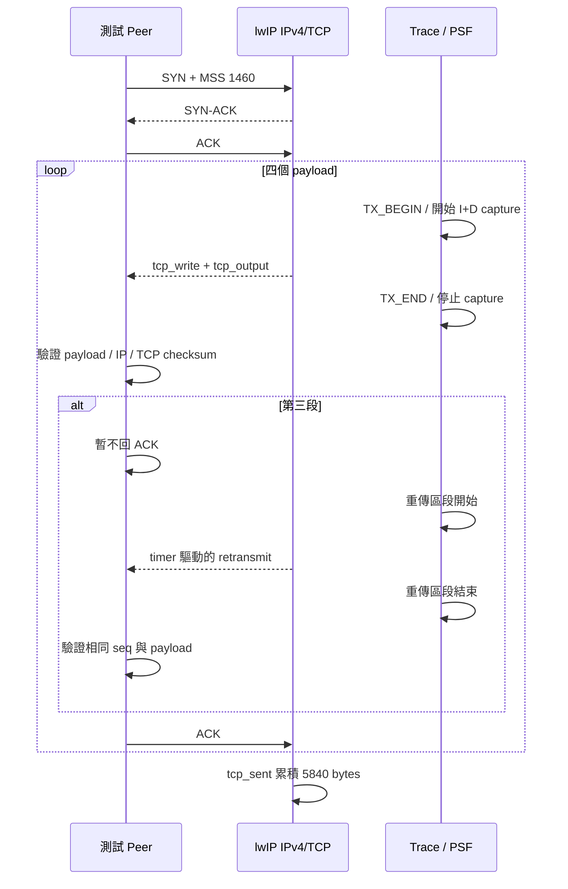
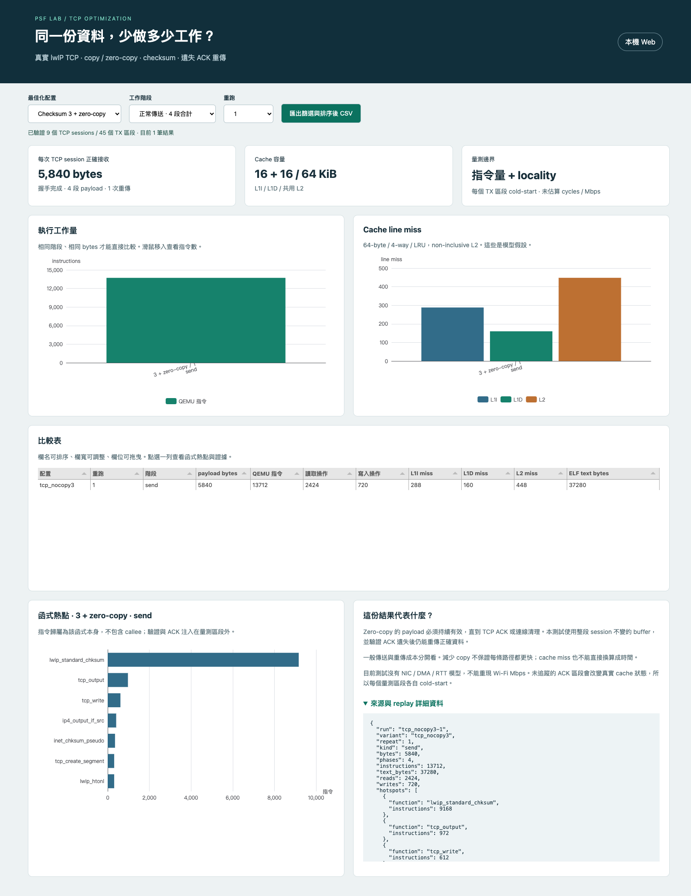
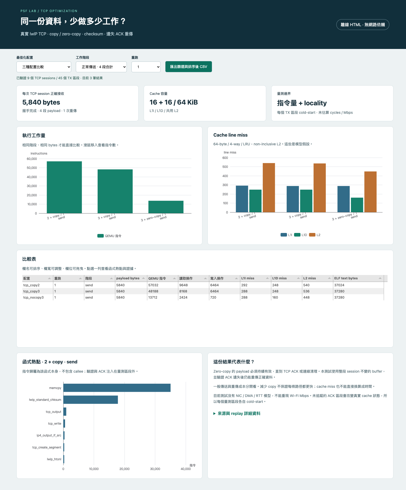

# TCP 最佳化實作：先找熱點，再用相同封包驗證

2026-10-04。**已實作並執行真實 lwIP TCP 握手、資料傳送、ACK 與重傳。**三配置各重跑三次，全部通過逐 byte payload 與獨立 IPv4/TCP checksum 驗證。這次比較的是 RV32 QEMU 指令工作量與 cache locality，不是實機 Mbps。

## 先看結果

以下是每個 session 的四段正常傳送合計，共 5,840 bytes。三次重跑結果一致。

| 配置 | 指令量 | 資料讀取操作 | 資料寫入操作 | L1I miss | L1D miss | L2 miss | 整份 ELF text |
|---|---:|---:|---:|---:|---:|---:|---:|
| Checksum 2 + copy | 57,032 | 9,648 | 6,464 | 292 | 248 | 540 | 37,024 B |
| Checksum 3 + copy | 48,188 | 8,168 | 6,464 | 288 | 248 | 536 | 37,280 B |
| Checksum 3 + zero-copy | 13,712 | 2,424 | 720 | 288 | 160 | 448 | 37,280 B |

**第一步：只換 checksum。**指令減少 **15.5%**，但 L1D miss 完全相同。前一輪 checksum microbenchmark 的 49.2% 改善，放進更完整 TX 路徑後，不能直接套用成整條路徑的改善百分比。

**第二步：再去掉 payload copy。**相對 Checksum 3 + copy，指令減少 **71.5%**，資料寫入操作減少 **88.9%**，模型 L1D miss 減少 **35.5%**。相對原始 baseline，指令減少 **76.0%**。

### 瓶頸在哪裡？

baseline 的函式熱點中，`memcpy` 占 35,052 個 trace 指令，約為 TX trace 的 **61%**；`lwip_standard_chksum` 為 17,844。Checksum 改完後 `memcpy` 仍是 35,052，因此下一個值得處理的對象是複製。

這組工具鏈使用 newlib nano，實際 `memcpy` 成本與連結的 C library 有關。換成別的 libc、編譯旗標或硬體搬移，不應直接預期相同比例。Top functions 是函式本身的指令數，不重複把 callee 算進 caller。

**這輪找到的是受測 TX 路徑的主要熱點。**握手、ACK 注入與封包驗證在量測區段外，不能稱為所有 TCP 工作或整台系統的 CPU 使用率。

### 沒有變好的案例：重傳

| 配置 | 一次重傳相關指令 | L1D miss | L2 miss |
|---|---:|---:|---:|
| Checksum 2 + copy | 6,109 | 41 | 99 |
| Checksum 3 + copy | 3,898 | 41 | 100 |
| Checksum 3 + zero-copy | 3,955 | 42 | 101 |

Zero-copy 相對同樣 checksum3 的 copy 版，重傳指令反而增加 **1.46%**。重傳直接使用已保留的資料，不再享有「省掉第一次 payload copy」的好處；兩種 pbuf 配置造成的 traversal/checksum 路徑仍不同。已確認 checksum 函式 trace 指令由 2,250 變為 2,292；尚未把所有 57 條差額逐條歸因，不能全部都說是 cache penalty。

## 實驗究竟執行了什麼？

- 上游 lwIP 2.2.1 的 IPv4/TCP core，未改寫 TCP 演算法。
- 一個 FreeRTOS task 呼叫 lwIP raw API，`NO_SYS=1`；不需要修改 FreeRTOS kernel source。
- 本機構造的 peer 封包透過 `ip4_input()` 進入真實 lwIP TCP state machine。Peer 是 bounded packet generator，不是第二套完整 TCP stack。
- SYN 包含 MSS 1460；lwIP 回 SYN-ACK，peer 回 ACK，驗證 `ESTABLISHED`。
- `tcp_write()` + `tcp_output()` 傳送四段 1460-byte payload。相同 source bytes、socket/PCB 與 buffer 設定。
- 第三段故意不回 ACK，呼叫受控 `tcp_slowtmr()` 推進協定 timer，直到 lwIP 真的重傳同一個 sequence，再回 ACK。
- `tcp_sent()` 確認累積 ACK 5840 bytes；六份輸出 IPv4 packet 全部保存，包含 SYN-ACK、四個正常資料包與一個重傳包。



重傳區段包含從第一個 `tcp_slowtmr()` 到輸出重傳封包的所有 timer 處理，但沒有真實 RTT 或 CPU 等待數秒。沒有 FIN/長時間連線清理、concurrent connections、NIC、DMA 或網路驅動測試。

## 實際改了哪裡？代價是什麼？

### Checksum

編譯時 `LWIP_CHKSUM_ALGORITHM=2` 改成 `3`。沿用上游實作，先驗證 checksum 完全相同；這組設定的整份 ELF text 增加 256 bytes。它包括 RTOS、SDK、TCP 與測試程式，不能當成 lwIP 單獨 footprint。

### Copy / zero-copy

```c
/* baseline：lwIP 複製 payload，呼叫後 application 可重用原 buffer */
tcp_write(connection, payload, sizeof payload, TCP_WRITE_FLAG_COPY);

/* 本次 zero-copy：lwIP 保留對原資料的參照 */
tcp_write(connection, payload, sizeof payload, 0);
```

這是 application 到 lwIP 的 payload zero-copy，後續 NIC driver 仍可能再複製。測試採用整個 session 不變的 static buffer，直到 ACK 後也不修改，因此可以安全重傳。正式系統需要以 ACK/連線清理管理 buffer ownership；若過早覆寫，可能在重傳時送出錯誤資料。

本次 `TCP_OVERSIZE=0`、`LWIP_CHECKSUM_ON_COPY=0`，是為了把 copy 與 checksum 的因素分開。這不是 lwIP 所有預設設定；下一個合理比較是 copy+checksum 合併，並評估是否值得付出 zero-copy 的 buffer ownership 複雜度。

上游依據：[tcp_write 實作與 API 說明](https://github.com/lwip-tcpip/lwip/blob/77dcd25a72509eb83f72b033d219b1d40cd8eb95/src/core/tcp_out.c)、[checksum 實作](https://github.com/lwip-tcpip/lwip/blob/77dcd25a72509eb83f72b033d219b1d40cd8eb95/src/core/inet_chksum.c)。公開案例與候選 stack 的比較見 [原研究報告](research/TCP-IP與Cache最佳化案例.md)。

## Cache 模型與可信邊界

| 項目 | 本次設定 |
|---|---|
| L1I / L1D / unified L2 | **16 KiB / 16 KiB / 64 KiB** |
| Line / associativity / replacement | 64 bytes / 4-way / LRU；實驗假設，未由硬體規格確認 |
| 寫入策略 | write-allocate tags；不計 dirty/writeback traffic |
| L2 | 共用 I/D、non-inclusive；L1 miss 才查詢 L2 |
| 初始狀態 | 每個 TX phase 各自 cold-start，再加總 |
| 指令位址 | 此 bare-metal RV32 M-mode fixture 無 MMU，guest VA = physical RAM address |
| 計時 | 沒有 prefetch、pipeline、cache latency 或 bus contention；沒有輸出 cycles |

QEMU plugin 在 `tcp_capture_begin/end` 控制動態區段，捕捉所有 callee 的指令與資料存取；因此 `memcpy` 與 checksum 不會像舊的單一函式 PC filter 一樣被漏掉。記憶體位址必須是 guest physical RAM，不使用 host pointer。

ACK 處理在區段外，會改變真實 cache 狀態，因此不能把相鄰兩段當作完整 warm-cache 串流。這次每段都重設模型。其工作集小於所設容量，數字主要呈現 cold footprint，**尚未證明 16 KiB 的 capacity 壓力或 64 KiB L2 的最佳大小**。正常 TX 中 L2 misses 恰等於 L1I+L1D misses，因此本案例也不能展示 L2 重用的效益。

指令表使用 guest `rdinstret` 區段差值；cache/函式熱點使用較外層 capture markers 的 trace。每個 phase 的 trace 多 **11 條 instrumentation 指令**。這是已知固定邊界差異，兩個指標不可直接視為完全相同分母。

## 如何看 Dashboard

**本機 Web：**

```sh
# 在 poc 目錄
npm --prefix web ci
npm --prefix web run build
.venv/bin/python -m psf_lab serve --port 8765
# 開啟 http://127.0.0.1:8765/tcp.html
```


上方選配置、正常傳送／重傳與重跑次數。左圖看指令工作量，右圖看 cache miss；點表格一列，下面切換到該列函式熱點。表格可排序、調整欄寬、移動欄位，CSV 匯出目前篩選與排序結果。



**離線 HTML：**下載 [tcp-optimization.html](../artifacts/offline/tcp-optimization.html) 後直接開啟，不需 Python 或網路。它是固定證據快照；新增 capture 後要重新匯出，不會在瀏覽器裡執行 QEMU。



**務必再切到重傳。**不要從正常傳送柱狀圖推斷所有情境都改善。


此頁讀取 PSF 對應的 TCP/cache sidecar 結果。PSF 保存階段標記，packet、指令與 cache 的完整證據仍在原始檔；沒有宣稱把 cache counters 全寫入 PSF。一般 PSF timeline/CPU task share 頁面仍保留。

## 重跑與內網還原

```sh
# output 必須不存在；每次使用獨立 build 目錄
.venv/bin/python tools/tcp/run_transfer.py --output runs/local/tcp-new
# 非本機路徑可另加 --toolchain /path/to/riscv/bin --qemu /path/to/qemu-system-riscv32
```

捕捉需要 QEMU plugin API 7、host C compiler、pkg-config / GLib headers，以及既有 RISC-V GCC。Python replay / packet oracle 不需要 QEMU。

```sh
.venv/bin/python - <<'PY'
from pathlib import Path
from psf_lab.tcp_report import analyze_run, export_transfer
print(analyze_run(Path('runs/tcp-transfer-v2/tcp_nocopy3-1')))
export_transfer(Path('runs/tcp-transfer-v2'), Path('artifacts/local/tcp.html'))
PY
```

| 位置 | 保存內容 |
|---|---|
| [firmware/app/cases/tcp_transfer.h](../firmware/app/cases/tcp_transfer.h) | 真 TCP session、peer 封包、no-copy ownership 與 TX 量測 |
| [firmware/tcp_stack/lwipopts.h](../firmware/tcp_stack/lwipopts.h) | 完整實驗設定，明確關閉 checksum-on-copy |
| [tools/tcp/trace.c](../tools/tcp/trace.c) | QEMU phase-gated I/D capture |
| [tools/tcp/run_transfer.py](../tools/tcp/run_transfer.py) | 固定來源、全新建置、9 次執行與 repeatability assertions |
| [src/psf_lab/tcp_report.py](../src/psf_lab/tcp_report.py) | packet / PSF / trace 驗證與 replay / 匯出 |
| [runs/tcp-transfer-v2](../runs/tcp-transfer-v2) | PSF、六份封包、ELF、map、symbols、壓縮 trace、manifest、results |
| [artifacts/verification/tcp-optimization](../artifacts/verification/tcp-optimization) | unittest、Ruff、curl、browser commands / CSV / review / restore 證據 |
| [artifacts/screenshots/tcp](../artifacts/screenshots/tcp) | Web 與離線各四張截圖 |
| [tcp-transfer-source.tar.gz](../artifacts/restore/tcp-transfer-source.tar.gz) | 原始碼、FreeRTOS / SDK / lwIP 依賴、captures、已建置 UI 與離線 HTML |

可直接驗證還原與重新擷取：

```sh
.venv/bin/python tools/tcp/verify_restore.py --rebuild \
  --toolchain .tools/xpack-riscv-none-elf-gcc-15.2.0-1/bin \
  --qemu /opt/homebrew/bin/qemu-system-riscv32
```

不加 `--rebuild` 時只驗證雜湊與 Python tests，不重新執行 QEMU。依機器更換 toolchain / qemu 位置。

包內 `RESTORE-SHA256.json` 提供逐檔雜湊。已建置 UI 不需 npm，重新建置 UI 才需套件。Host tools / Python wheels 未打包，亦不宣稱跨機驗證完成。

## 完成與後續

**Z0 基準已完成：**[固定 request／response 全流程實測](tcp-session-z0.md)。與本篇的 TX-only 比較有不同 capture 邊界及 stats 設定，請勿直接相減計算收益。

**2026-10-04 新增研究方向：**使用者要求在「已經 zero-copy」前提下最佳化更完整的 TCP 流程。見 [memcpy 分析與 zero-copy 後的完整 TCP 流程研究](research/Zero-copy後的TCP完整流程最佳化.md)，包含 request／response、RX／ACK／timer／關閉、cache 與 buffer 指標、案例和未完成驗收。Z0 正常基準已執行；本報告原有數字仍限於上述 TX 量測邊界。

已完成本輪三配置 × 三次、真 TCP state machine、遺失 ACK 重傳、逐 byte / checksum 驗證、I/D 共用 L2 replay、雙模式 Dashboard。

後續合理實驗仍分開列管：copy+checksum 合併、更多 PCB / buffer 的 working-set 壓力、TCP window / delayed ACK、接入 NIC/DMA 後的 cache coherence，以及硬體 PMU 對照。ESP32-C3 的 IRAM / Wi-Fi Mbps 案例只作研究依據，沒有把本次 QEMU 數字冒充它的重現結果。

### 還原時發現並修正的建置路徑問題

初次還原的 TCP 正確性全部通過，但 absolute `__FILE__` 路徑字串讓 `.text` 隨目錄長度增加84 bytes，位址變化使正常TX的L1D miss多4。已加入 `-ffile-prefix-map=$(ROOT)=/poc`，固定來源路徑，並重新擷取正式結果。修正前差異保留在 [restore-before-path-fix.log](../artifacts/verification/tcp-optimization/restore-before-path-fix.log)，正式還原結果見 [restore.json](../artifacts/verification/tcp-optimization/restore.json)。這是工具／建置再現性修正，不是TCP演算法最佳化。
