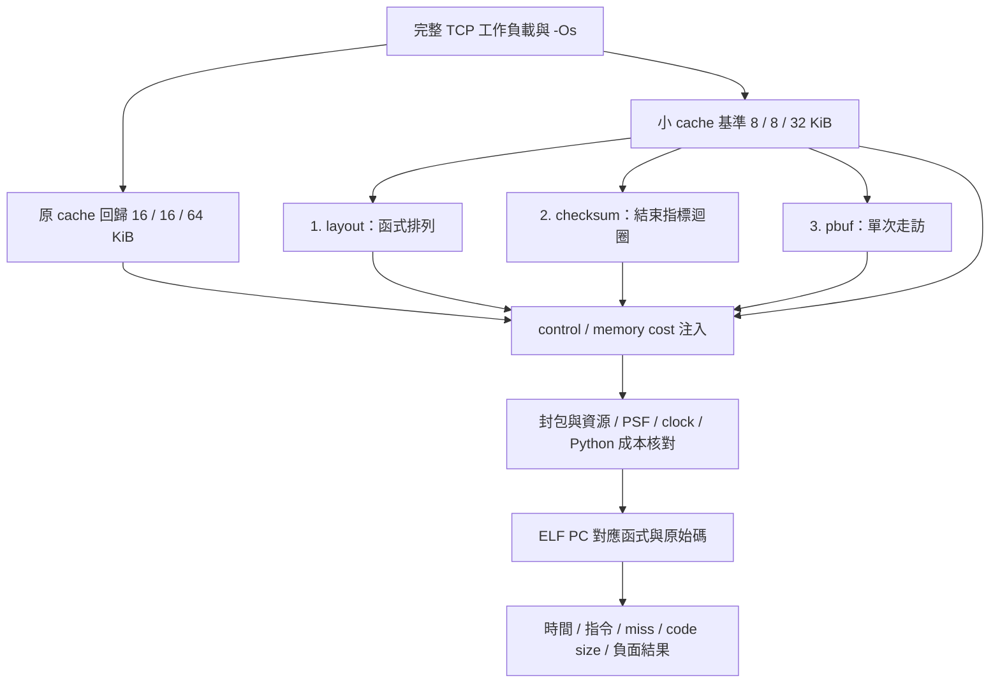

# T3b：8/8/32 KiB Cache 下，三種 -Os 改法的實作比較

後續已補上 [T3c：RISC-V guest 三段 pbuf／空段 holdout 驗證](tcp-pbuf-holdout.md)。本篇「guest 多段 pbuf 尚未驗證」保留為 T3b 當時狀態；任意 chain／payload 矩陣仍未完成。

**已完成三種獨立改法。小 cache 使 L1I miss 增至原本約 3.25 倍，但最佳化仍有正反結果：目前這個函式排列慢 0.077%，checksum 迴圈快 0.106%，pbuf 單次走訪快 0.513%。** 最後一項改善的是應用／測試接收驗證 callback，不能宣稱 lwIP TCP 演算法本身快了 0.513%。所有數字都是本模型與固定工作負載的比較。

[計畫與執行紀錄](tcp-os-small-cache-plan.md) · [完整比較 JSON](../artifacts/verification/tcp-os-small-cache/results/comparison.json) · [比較 CSV](../artifacts/verification/tcp-os-small-cache/results/comparison.csv)

## 1. 固定條件與比較方式

| 項目 | 本輪條件 |
|---|---|
| CPU／工具鏈 | RV32IMAC、xPack GCC 15.2.0-1、獨立 patched QEMU 9.2.0 |
| Guest 編譯 | 每個 C 編譯命令皆為 `-Os`；沒有使用 `-O2` 或 PGO |
| Cache | L1I 8 KiB、L1D 8 KiB、L2 32 KiB；各 4-way、64-byte line、LRU |
| 記憶體策略 | non-inclusive；L1/L2 write-through + write-allocate；cold start |
| 模型延遲 | L1 查詢 1 cycle、L2 查詢 8 cycles；sysram read/write startup 各 10 cycles，另計每 8 bytes 一個 transfer cycle |
| 時間 | 1 ns/instruction 基底，加上 memory-service cycles × 2 ns；並非完整 500 MHz CPU pipeline |
| TCP | lwIP raw API、NO_SYS=1；建連、兩個 64-byte request、8 個 1460-byte response segment、ACK、FIN |
| 語意 | `tcp_write(...,flags=0)`，payload 保留到 ACK；封包保存與驗證完整保留 |
| 重複 | 小 cache 四個版本，各 control/injection 3 次；原 cache 回歸各 1 次，共 26 次正式執行 |

原本的 16/16/64 KiB profile 與預設行為保留。新設定是 [sysram-10-small.json](../cases/timing/sysram-10-small.json)。Runner 同時選擇 C plugin 的小 cache geometry 與 Python profile，逐筆比對成本，避免只改報表參數。

三種改法各自從 baseline 出發，沒有疊加；全程沒有修改下載的 lwIP／FreeRTOS 原始碼。



## 2. 縮小 cache 是否增加 miss？

| 層級 | 原 cache miss／查詢 | 原 miss rate | 小 cache miss／查詢 | 小 miss rate |
|---|---:|---:|---:|---:|
| L1I | 528 / 331,881 | 0.1591% | 1,715 / 331,881 | 0.5168% |
| L1D | 341 / 82,412 | 0.4138% | 392 / 82,412 | 0.4757% |
| L2 | 672 / 33,247 | 2.0212% | 751 / 34,468 | 2.1788% |

兩個 baseline 都執行 329,805 筆指令。原 cache 的 guest interval 為 2,433,600 ns，小 cache 為 2,456,000 ns，增加 22,400 ns，約 0.92%。縮小 cache 對 I-cache 的影響較明顯，D-cache 壓力增加較少。

指令可能跨 cache line，所以 L1I 查詢次數可大於指令數。L2 也會接收 write-through stores，不能直接拿 L2 miss rate 與 L1 miss rate 比較。

### 小 cache 的 miss 類別

| 層級 | Compulsory／首次載入 | Conflict | Capacity | 合計 |
|---|---:|---:|---:|---:|
| L1I | 338 | 272 | 1,105 | 1,715 |
| L1D | 333 | 36 | 23 | 392 |
| L2 | 671 | 63 | 17 | 751 |

分類逐筆追蹤每層實際查詢：首次看到 line 算 compulsory；其餘 miss 用同容量、fully associative LRU shadow 比較，shadow hit 算 conflict，shadow miss 算 capacity。這是模型的 3C 分類，不能當實機 PMU 測值。

L1I 主要增加的是 capacity misses。把熱門函式放在一起仍可能排擠其他常用路徑，因此不能預設排列一定有效。

## 3. 三種改法的結果

正值的改善表示時間縮短；所有百分比相對小 cache baseline。

| 版本 | Guest interval ns | 時間改善 | 指令數 | Memory-service cycles | Stack window cycles |
|---|---:|---:|---:|---:|---:|
| 小 cache baseline | 2,456,000 | — | 329,805 | 1,062,936 | 176,816 |
| layout | 2,457,900 | **-0.077%** | 329,805 | 1,063,892 | 177,526 |
| checksum v2 | 2,453,400 | **+0.106%** | 328,736 | 1,062,207 | 175,970 |
| pbuf | 2,443,400 | **+0.513%** | 327,389 | 1,057,874 | 171,973 |

Stack window 是 27 個 `z0_stack_begin/end` 呼叫區間，其中可能包含 ISR／observer／recorder，不是 exclusive TCP CPU time。三個改法的 stack-window memory-service 成本分別變化 +0.402%、-0.478%、-2.739%。這些百分比不能稱為 CPU loading。

| 版本 | L1I misses | L1D misses | L2 misses | L1I miss rate |
|---|---:|---:|---:|---:|
| baseline | 1,715 | 392 | 751 | 0.5168% |
| layout | 1,773 | 392 | 814 | 0.5353% |
| checksum v2 | 1,680 | 393 | 751 | 0.5055% |
| pbuf | 1,634 | 393 | 755 | 0.4943% |

pbuf 總時間下降，即使 D/L2 misses 略增。**判斷最佳化需同時看工作量、指令、存取成本與 miss；只挑 miss rate 最低者，可能選錯版本。**

### 改法一：函式排列，這一版不採用

[hot-layout.ld](../firmware/tcp_stack/hot-layout.ld) 將 `tcp_input`、`tcp_receive`、`tcp_free_acked_segments`、`tcp_output`、`tcp_output_segment`、`tcp_write` 與 checksum 的 input sections 提前排列；其他 sections 保留。它衍生自 pinned FreeRTOS linker script，沒有改上游檔案。

L1I conflict 由 272 降到 247，但 capacity 由 1,105 增到 1,185；L2 miss 由 751 增到 814，整體反而較慢。某些 input sections 可能因 inline／GC 而沒有獨立實體，以 map 為準。

結論只涵蓋這個排列，不能推論所有 code layout 最佳化無效。若繼續研究，應根據實際 basic-block 熱度與呼叫關係排列，且保留不同流量的 holdout 工作負載。

### 改法二：checksum 結束指標，保留為實驗選項

[os_checksum.c](../firmware/tcp_stack/os_checksum.c) 衍生自 lwIP algorithm 3，保留原授權。利用 lwIP 的 `LWIP_CHKSUM` 擴充點，改用 `poc_endpoint_chksum`；每回合仍處理 8 bytes 並補回 carry，保留 alignment、odd head/tail 語意。

原本每輪減少 `len`；新版預先計算結束指標，內迴圈只前進指標與比較終點。正式 v2 用 unsigned 位移及遮罩，RV32 反組譯沒有 `div/rem`。

- 函式指令數：22,476 → 21,454。
- 函式 self memory-service：26,058 → 26,807 cycles，反而增加。
- 函式 L1I 查詢：22,476 → 23,151。新機器碼位置造成更多跨 line 的指令查詢，不能把「少指令」直接等同「少 memory cost」。
- 全流程仍小幅改善 2,600 ns；變動也包含函式位置與 linker relaxation 的影響，並非完全隔離的迴圈因果估計。

探索 v1 使用 signed `/8`、`%8`，編成 `div/rem`；雖然模型結果較快，但模型沒有校準除法 latency，故不採用此版。完整六次探索結果保存在 [tcp-small-checksum-v1](../runs/tcp-small-checksum-v1/results.json)，[原始 C snapshot](../artifacts/verification/tcp-os-small-cache/checksum-v1-source.c) 與 [hash 核對紀錄](../artifacts/verification/tcp-os-small-cache/checksum-v1-receipt.json) 可還原當時來源。不能用現在的 v2 原始碼宣稱重現 v1。

### 改法三：pbuf 單次走訪，改善接收驗證 callback

原 [on_recv](../firmware/app/cases/tcp_request_response.c) 對 64 bytes 每個 byte 呼叫 `pbuf_get_at()`。新 [os_pbuf.h](../firmware/tcp_stack/os_pbuf.h) 逐個 pbuf、逐 byte 向前驗證，保留 chain、空 segment、總長度及錯誤內容檢查，沒有另外複製 payload。

本案例兩個請求，原本有 128 次 `pbuf_get_at()` 呼叫；新版 trace 不再執行此函式。全流程少 2,416 筆指令，stack-window memory cost 減少 4,843 cycles。

這是應用／測試 callback 的改善。TCP wire data、傳送和 ACK 規則不變；目前正式 TCP 輸入的 request 不是多段 pbuf，chain 的邊界由 host native tests 額外覆蓋，尚未在 guest 注入多段 request 工作負載。

## 4. 哪些 C 程式位置最常 I-cache miss？

小 cache baseline，以 PC 所屬函式歸因：

| 函式 | L1I misses | 內容 |
|---|---:|---|
| tcp_input | 274 | TCP 輸入與狀態處理 |
| tcp_output | 142 | segment 送出，包含編譯後內嵌程式 |
| ip4_input | 130 | IP 輸入驗證與 TCP 分派 |
| tcp_receive | 118 | ACK、擁塞視窗、已確認 segment 回收 |
| inject | 85 | 模擬對端封包建構，屬 harness |

[PC → C 位置](../artifacts/verification/tcp-os-small-cache/results/baseline-locations.txt)、[完整 profile](../artifacts/verification/tcp-os-small-cache/results/baseline-profile.json) 保存每個 PC 和函式的各層查詢、miss、3C 分類與 self cost。最佳化來源行是候選位置；不能把一次 line fill 的全部責任推給該 C 行，因為同 line 還有其他指令。

## 5. Code size 與代價

| 項目 | baseline | layout | checksum v2 | pbuf |
|---|---:|---:|---:|---:|
| GNU size text，包含唯讀資料 | 41,128 B | 41,128 B | 41,128 B | 41,128 B |
| data | 144 B | 144 B | 144 B | 144 B |
| BSS | 296,736 B | 296,736 B | 296,736 B | 296,736 B |
| checksum 函式 | 164 B | 164 B | 190 B | 164 B |
| on_recv 函式 | 172 B | 172 B | 172 B | 210 B |
| .text padding | 214 B | 184 B | 188 B | 236 B |

ELF 總量相同不代表所有函式一樣大。Padding、GC 與 relaxation 都會影響最後配置；pbuf callback 變大，也移除了無其他引用的舊呼叫路徑。請用各版本 `*-firmware.map`、`*-assembly.txt` 與 `*-size.txt` 複查，而不要只看 ELF 檔案大小。

## 6. 驗證與可重跑步驟

每次正式執行均核對：25 個封包、128-byte request、11,680-byte response、checksum、序號與 ACK、FIN、buffer lifetime、資源歸零、PSF boundary／task switch，以及 memory-cost 注入與 guest clock 的守恆。26 次正式執行的封包逐 byte 相同，每組三次重複的 access stream hash 一致；observer 都在第 2 tick 被喚醒。

另有 6 次 checksum v1 探索結果。這些是確定性模型重複，不是硬體統計信賴區間。

新增 tests 涵蓋兩種 cache geometry 的 C/Python 差分、3C 分類、跨 line write、錯用 profile 的拒絕、checksum alignment/tail/carry、RV32 無除法檢查與 pbuf chain 邊界。完整回歸 **220/220** 通過，44.777 秒；Ruff 與七個修改 Python 檔案的格式檢查通過。驗證基準 commit `b21d040`。見 [測試 log](../artifacts/verification/tcp-os-small-cache/full-tests.log)、[completion.json](../artifacts/verification/tcp-os-small-cache/completion.json)、[自我 review](../artifacts/verification/tcp-os-small-cache/review.md)。測試保留一則既有 Starlette/httpx deprecation warning，沒有測試失敗。

```sh
# 在 poc 根目錄，先依原有環境文件準備 .venv、pinned toolchain 與 patched QEMU。
# 每次使用尚不存在的 output 目錄。
for variant in baseline layout checksum pbuf; do
  PYTHONPATH=src .venv/bin/python tools/tcp/run_live_cache.py \
    --qemu .tools/qemu-time-control/qemu-system-riscv32-relative \
    --case tcp-irq --cache-profile small --tcp-variant "$variant" \
    --output "runs/local/small-$variant"
done

# 原 cache 回歸
PYTHONPATH=src .venv/bin/python tools/tcp/run_live_cache.py \
  --qemu .tools/qemu-time-control/qemu-system-riscv32-relative \
  --case tcp-irq --repeats 1 --output runs/local/standard-os

# 重分析已保存的正式產物，不需要重跑 QEMU。
PYTHONPATH=src .venv/bin/python tools/tcp/analyze_os_cache.py \
  --runs runs/tcp-standard-os-v1 runs/tcp-small-baseline-v1 \
         runs/tcp-small-layout-v1 runs/tcp-small-checksum-v2 runs/tcp-small-pbuf-v1 \
  --output artifacts/verification/tcp-os-small-cache/results

.venv/bin/python -m unittest discover -s tests -v
.venv/bin/ruff check src tests tools
```

分析腳本會檢查目前來源的 manifest hash。若之後原始碼變動，應回到本次 commit 後重分析；不能把 hash 不符當成可以忽略的警告。現有 output 已保存 map，刪除被 Git 忽略的 build 目錄後仍可重分析。自訂新的 output 目錄時需有對應 run 的 build map。

| 資料夾／重要檔案 | 用途 |
|---|---|
| `cases/timing/sysram-10-small.json` | 小 cache 設定 |
| `firmware/tcp_stack/hot-layout.ld`、`os_checksum.c`、`os_pbuf.h` | 三個實作選項 |
| `tools/tcp/run_live_cache.py` | 編譯、QEMU capture、PSF／封包／成本驗證 |
| `tools/tcp/analyze_os_cache.py` | 來源與產物核對、PC 歸因、比較 JSON/CSV |
| `src/psf_lab/tcp_hotspots.py` | 3C classifier 與函式／PC／區間統計 |
| `runs/tcp-small-*`、`runs/tcp-standard-os-v1` | ELF、PSF、trace gzip、封包、manifest 與 QEMU log |
| `artifacts/verification/tcp-os-small-cache` | TDD、分析、探索 snapshot、結果、map／assembly 與檢查紀錄 |

## 7. 結論邊界與後續研究

- 目前只驗證單一連線、固定 MSS／payload、同 task 模擬對端；沒有 NIC、DMA、真實 RTT 或 timer 驅動 RTO 工作負載。
- 模型不含 pipeline、prefetch、store buffer、write-back、bus overlap；clock 注入發生於 QEMU 非同步邊界，沒有證明每一筆 load 的硬體 stall 順序。
- 全部改法仍是實驗選項，不改預設。layout 這一版沒有改善；checksum 增加 26 B 且改善很小；pbuf 對接收驗證 callback 有效。
- 三者尚未疊加，也尚未交叉測試不同 request 長度、並行連線、out-of-order／重傳、不同 alignment／linker seed；不能推論組合後仍快。
- Dashboard 尚未加入這一輪 live-timing／3C 比較 view。本輪交付是 Markdown、JSON、CSV、PSF、ELF 與可重跑腳本。
- 本輪依 side-conversation 邊界自行實作與 review，沒有獨立 reviewer。
