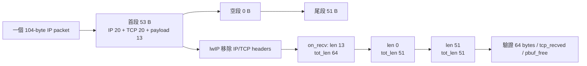
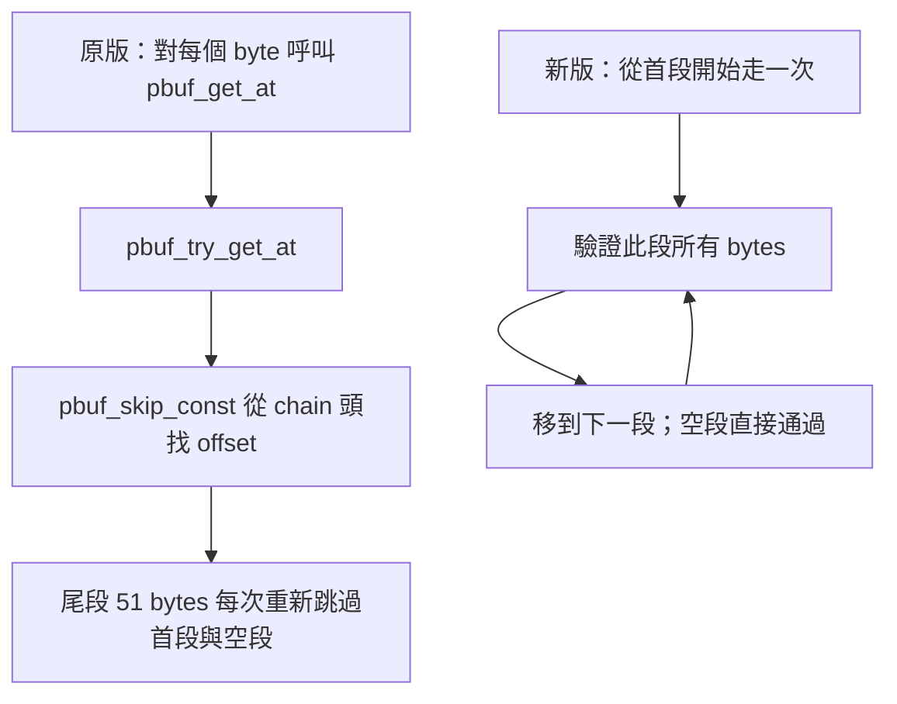

# T3c：在 RISC-V guest 驗證分段 pbuf 的 -Os 最佳化

**相同 64-byte request 改成 `13 + 0 + 51 bytes` 的 pbuf chain 後，單次走訪仍有效：每次 request_rx 的指令數從 4,132 降到 2,136，減少 48.31%；完整模型時間從 2.4890 ms 降到 2.4687 ms，改善 0.816%。** 這是應用接收驗證 callback 的改善，不能解讀為 TCP 核心演算法或產品 throughput 提升 48%。

[計畫與紀錄](tcp-pbuf-holdout-plan.md) · [比較 JSON](../artifacts/verification/tcp-pbuf-holdout/results/comparison.json) · [比較 CSV](../artifacts/verification/tcp-pbuf-holdout/results/comparison.csv) · [前一輪三種改法](tcp-os-small-cache.md)

## 為什麼做這一步？

T3b 的 pbuf 最佳化只在 guest 的單段 request 上量測；分段、空段的 correctness 只有 host native tests。這一輪把真實 lwIP 的 `pbuf_alloc`、`pbuf_cat`、IP/TCP input、callback 與釋放全部放進 RISC-V QEMU 執行，補上該缺口。

固定條件仍為 **-Os、L1I/L1D 各 8 KiB、L2 32 KiB、64-byte line、4-way LRU、write-through + write-allocate**。保留 sysram read/write startup 10 cycles、2 ns/model cycle 與 1 ns/instruction 基底；沒有疊加 checksum 或 layout 改法。

這裡的分段只表示一個封包在記憶體中使用多個 pbuf。**沒有 IP fragmentation、沒有增加 TCP segments，也沒有 NIC/DMA。** 25 個 wire packets 與上一輪內容一致。

## Guest 真的收到什麼？

`inject()` 先建立原本完整封包並算 checksum，再於 harness 區間分配 53、0、51-byte 三個 pbuf。首段的 53 bytes 包含 20-byte IP header、20-byte TCP header、13-byte payload。組好 chain 後釋放原本暫存封包，經 `ip4_input()` 交給 lwIP。



Callback 實際讀取 `q->len`、`q->tot_len`，保存至 `session.json`。兩個 request 都觀測到：

```json
{"lengths": [13, 0, 51], "totals": [64, 51, 51]}
```

此 receipt 不是根據 command-line 設定直接填入。Host validator 要求兩筆觀測，拒絕缺漏、單段冒充、錯誤總長度，以及用 bool/float 冒充整數。節點計數為 6，包含 2 個空段。

## 正式比較

分段 baseline 與 pbuf 版，各 control/injection 三次，共 12 次。單段兩版各重跑一組，共 4 次回歸。另保留 2 次初步 probe。正式共 **16 次**，分段的三次 repeat access stream hash 一致。

| 工作負載／版本 | Guest interval ns | 指令數 | Memory-service cycles | Stack window cycles |
|---|---:|---:|---:|---:|
| 單段 baseline | 2,456,000 | 329,805 | 1,062,936 | 176,816 |
| 單段 pbuf | 2,443,400 | 327,389 | 1,057,874 | 171,973 |
| 分段 baseline | 2,489,000 | 334,721 | 1,077,003 | 180,159 |
| 分段 pbuf | 2,468,700 | 330,729 | 1,068,897 | 172,810 |

- 分段完整時間減少 **20,300 ns，0.8156%**。
- 分段指令減少 **3,992**；memory-service 少 **8,106 cycles**。
- 分段 stack-window memory-service 少 **7,349 cycles，4.079%**。
- 每個 request_rx phase：**4,132 → 2,136 instructions，-48.306%**，兩個 request 與所有 control/injection repeats 都相同。
- PSF 都有 2 ticks、observer 於第 2 tick 執行。Cost 守恆誤差 baseline +43 ns、pbuf -45 ns，均在 200 ns 驗收範圍內。

Stack window 可能包含 preemption／recorder，phase 的 `rdinstret` 也不是 exclusive task CPU time。上述百分比不能稱為 CPU loading。完整流程含封包保存、對端模擬、payload 建構及驗證，因此 request 指令大幅減少，整體改善仍小於 1%。

單段兩個新版的 control/injection `audit`，包括解壓 trace SHA256，以及 guest measurements，均與 T3b 原版完全相同。這證明新增 workload 選項沒有改變本次觀測到的預設路徑行為。

## 改善原因：減少重複走訪

原始 [pbuf.c](../references/tcp/lwip/src/core/pbuf.c) 的呼叫路徑是：



64-byte request 原本逐 byte 呼叫 `pbuf_get_at()`；兩個 request 合計 128 次。對尾段的 byte，每次都重新從頭找到目標 pbuf。新版以 chain 節點、段內 byte 兩層向前走訪，不再重頭找 offset。

| 函式 self 指令 | 分段 baseline | 分段 pbuf |
|---|---:|---:|
| on_recv | 1,496 | 1,312 |
| pbuf_get_at | 1,280 | 0 |
| pbuf_try_get_at | 2,528 | 0 |
| 合計 | 5,304 | 1,312 |

這三個函式的指令差為 3,992，與完整 trace 指令差相同。各函式 self memory-service 則會受到位置、cache state 及其他程式存取影響，不能用相同方式把全部時間改善歸因成純迴圈成本。

這個結果支持把**順序掃描 chain 中每個 byte**改成一次走訪；不表示所有 `pbuf_get_at()` 都應刪除。少量隨機 offset 存取仍是不同的使用情境。

## Cache miss 有一起變好嗎？

| 層級 | 分段 baseline misses | 分段 pbuf misses | Baseline rate | pbuf rate |
|---|---:|---:|---:|---:|
| L1I | 1,724 | 1,662 | 0.5125% | 0.5001% |
| L1D | 388 | 387 | 0.4629% | 0.4674% |
| L2 | 750 | 746 | 2.1488% | 2.1491% |

Miss 次數都下降，但 D-cache／L2 的 **miss rate 略升**，因為查詢總數也減少。因此需一起比較次數、分母、指令與成本，不能只用 miss rate 排名。

L1I conflict 由 266 降到 191，capacity 則由 1,112 增到 1,127。分析採同容量 fully associative LRU shadow 的 3C 分類，涵蓋逐層實際查詢；沒有把 write-through 的 RAM 寫入都算成 miss。

[分段 baseline profile](../artifacts/verification/tcp-pbuf-holdout/results/fragmented-baseline-profile.json)、[分段 pbuf profile](../artifacts/verification/tcp-pbuf-holdout/results/fragmented-pbuf-profile.json) 保存各 PC、函式與區間的完整統計。`*-locations.txt` 對應原始碼，`*-assembly.txt` 可查看產生的 RV32 指令。

## Code size 與實驗本身的代價

| 項目 | 單段 baseline | 單段 pbuf | 分段 baseline | 分段 pbuf |
|---|---:|---:|---:|---:|
| GNU size text，含唯讀資料 | 41,128 B | 41,128 B | 41,712 B | 41,712 B |
| data | 144 B | 144 B | 144 B | 144 B |
| BSS | 296,736 B | 296,736 B | 296,800 B | 296,800 B |
| on_recv 函式 | 172 B | 210 B | 318 B | 364 B |

分段版多了建構、觀測與輸出 receipt 的測試程式；BSS 包含 shape arrays 與 linker alignment。這些是新 workload 的驗證成本，不能當成單次走訪演算法的成本。

分段 baseline／pbuf 的 on_recv 差為 +46 B；ELF text 總量相同還受 GC、padding、relaxation 影響。不同版本的 maps 與 assembly 全數保存。

建構 chain 在 harness window，為保持同一份 wire data 會額外分配與複製。這不代表產品的 zero-copy RX 必須如此實作。兩個版本都 執行同一建構流程；跨「單段／分段」的總時間差還包含觀測程式與配置影響，不是純 fragmentation penalty。

## 使用與複查

主要新增選項：`--tcp-workload linear|fragmented`，預設 `linear`。`--tcp-variant pbuf` 使用 T3b 已有單次走訪實作，這輪沒有再改該演算法。

```sh
# poc 根目錄；output 必須尚不存在。
for variant in baseline pbuf; do
  PYTHONPATH=src .venv/bin/python tools/tcp/run_live_cache.py \
    --qemu .tools/qemu-time-control/qemu-system-riscv32-relative \
    --case tcp-irq --cache-profile small --tcp-workload fragmented \
    --tcp-variant "$variant" --output "runs/local/chain-$variant"
done

# 使用已保存的正式證據重分析；需保持來源與 manifest 相符。
PYTHONPATH=src .venv/bin/python tools/tcp/analyze_pbuf_holdout.py \
  --runs runs/tcp-chain-linear-base-v1 runs/tcp-chain-linear-pbuf-v1 \
         runs/tcp-chain-baseline-v1 runs/tcp-chain-pbuf-v1 \
  --output artifacts/verification/tcp-pbuf-holdout/results

# 複查探索 probe；使用保存的早期 source snapshot。
PYTHONPATH=src .venv/bin/python artifacts/verification/tcp-pbuf-holdout/verify_probe.py

.venv/bin/python -m unittest discover -s tests -v
.venv/bin/ruff check src tests tools
```

| 路徑 | 用途 |
|---|---|
| `firmware/app/cases/tcp_request_response.c` | chain 建構、callback 真實 shape 觀測、session receipt |
| `src/psf_lab/tcp_session.py` | chain receipt oracle，拒絕錯誤／缺漏證據 |
| `tools/tcp/analyze_pbuf_holdout.py` | 核對來源、產物、wire bytes、PSF、clock、miss 與單段回歸 |
| `runs/tcp-chain-*` | ELF、PSF、trace gzip、封包、session.json、manifest |
| `artifacts/verification/tcp-pbuf-holdout` | tests、probe 原始碼、maps／assembly、JSON/CSV 與 review |

## 完成界線

- 已補上 RISC-V guest 的三段 chain 與空段案例；兩個 request 內容正確，ACK／FIN／zero-copy buffer ownership、資源歸零、PSF/timer 驗證通過。
- 未驗證任意 chain 長度、跨 pbuf 的 protocol headers、不同 payload 長度、多連線、IP fragmentation、out-of-order／retransmission 或 NIC/DMA。
- 沒有改預設，也沒有新增 Dashboard；這次交付可重跑的下一組驗證與研究文件。
- 模型沒有 pipeline、prefetch、write-back／store buffer、真實 bus overlap，結果可作相對研究，不是產品效能數據。
- 本 side conversation 依限制自行 review，沒有獨立 reviewer。完整測試收據在完成驗證後補入。
