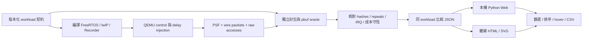
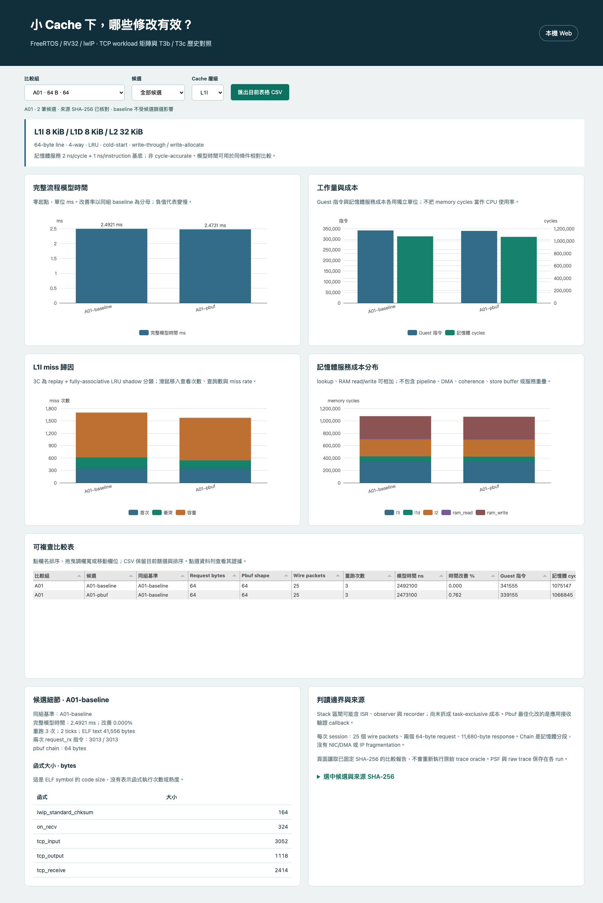
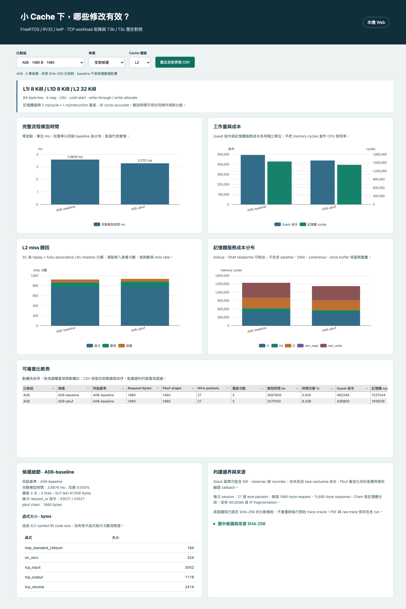
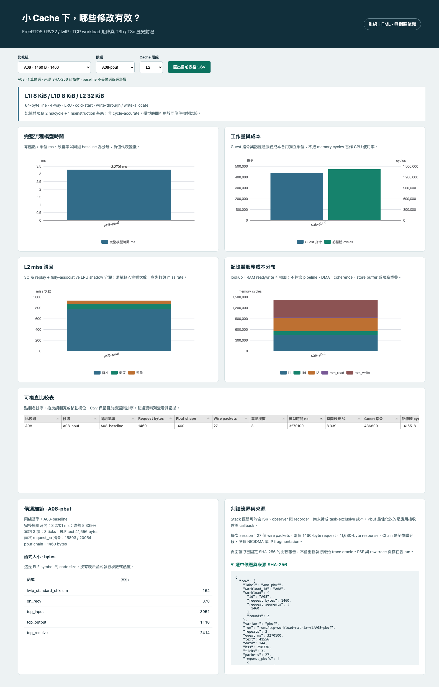
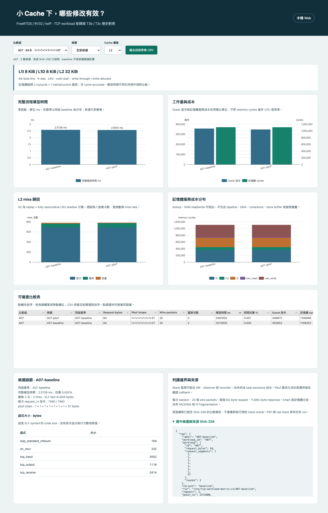
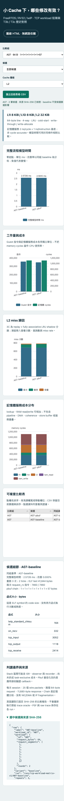

# 八種 TCP request 的 pbuf 最佳化驗證

這輪把既有 64-byte 範例擴充成八種 request，檢查單次走訪 pbuf 的效果是否能跨工作量維持。所有數值來自同一模型的 RISC-V guest execution，可作軟體相對比較；硬體 latency、DMA/NIC、網路 RTT 與產品 throughput 尚未量測。

## 怎麼看結果

每個 workload 各有 baseline 和 pbuf，分別執行 control／memory-delay injection，各重跑三次，共 **96 次正式執行**。Dashboard 顯示各候選 injection 的結果；改善率分母固定為同 workload baseline，篩掉 baseline 也不會改分母。

- Cache：L1I 8 KiB、L1D 8 KiB、L2 32 KiB，64-byte line、4-way、LRU、write-through/write-allocate。
- 時間：500 MHz 僅用來把 memory cycles 換成 2 ns；另有 1 ns/instruction。沒有 pipeline 模型。
- 每次 session：兩個 request、四個 1460-byte response × 兩輪，共 11,680 response bytes。
- Chain 是同一 TCP/IP 封包進入 lwIP 時的記憶體分段，沒有 IP fragmentation 或 NIC/DMA。
- Request phase 與 stack window 包含期間搶占；不能把它們當成 task-exclusive CPU usage。



## 探索時修正的實際問題

A08 的 1460-byte request 首次觸發 guest `pending ACK` assertion。以同一 ELF 關掉 plugin 並開 UART，定位到 lwIP `tcp_recved()` 的 receive-window update：它會立即送出 standalone ACK。修正測試 peer 消費該 ACK，host oracle 仍檢查 seq、ack、flags 與空 payload。A08 因而每個 session 有 27 個 packets，其他 workload 有 25 個。

首次失敗的兩次 probe 保留在 `runs/tcp-workload-probe-v1/A08-baseline/`；修正後 baseline/pbuf 各 control/injection 一次，共四次成功 probe，分別保存於 `A08-baseline-v2/` 與 `A08-pbuf-v2/`。未放寬 `control ticks == 0` 或 IRQ 容差。

## 解讀邊界

baseline/pbuf 在每個 workload 使用相同 wire bytes。不同 workload 的 wire bytes 不同，不能交叉當作同工作量改善率。編譯後 code layout、payload address、observer/recorder 成本也可能影響 cache，所有 ELF/map/assembly 與實際 payload address 均保存。這輪證明整體候選的結果；精確成本歸屬留給 B。

三次重跑是 deterministic 模型的一致性檢查，不能解讀為硬體的信賴區間。正式擷取時每次都有 native/Python audit；彙整時重新核對全部 96 份原始 stream digest，並對每組 injection 第一份 trace 做詳細 3C replay，共 16 份。


## 實測結果：injection 模型時間

| Workload | Request / chain bytes | baseline ms | pbuf ms | 改善率 | ELF text B baseline / pbuf |
|---|---|---:|---:|---:|---:|
| A01 | 64 / 64 | 2.4921 | 2.4731 | +0.762% | 41556 / 41556 |
| A02 | 64 / 13+0+51 | 2.5229 | 2.5284 | -0.218% | 41824 / 41824 |
| A03 | 63 / 63 | 2.4877 | 2.4731 | +0.587% | 41556 / 41556 |
| A04 | 65 / 65 | 2.4892 | 2.4742 | +0.603% | 41556 / 41556 |
| A05 | 256 / 256 | 2.6382 | 2.5783 | +2.270% | 41556 / 41556 |
| A06 | 256 / 63+0+64+129 | 2.7226 | 2.6650 | +2.116% | 41828 / 41828 |
| A07 | 64 / 1+1+1+1+1+1+1+57 | 2.5726 | 2.5610 | +0.451% | 41844 / 41844 |
| A08 | 1460 / 1460 | 3.5676 | 3.2701 | +8.339% | 41556 / 41556 |

正值代表 pbuf 較快，負值代表較慢。7/8 組改善，A02 慢 0.218%；兩版每組 ELF text 相同，並不代表位址布局或 Cache 行為相同。A08 改善 8.339% 是本輪最大值，不能推廣為所有 TCP 工作量。

A02 兩次 request_rx 指令為 baseline `[4146, 4146]`、pbuf `[2150, 2150]`，全程 L1I misses 為 `1687 → 1731`、memory cycles 為 `1088094 → 1092825`。局部指令減少與全程結果方向不同；尚未隔離 layout、觀測與搶占的貢獻，原因保留待 B 歸因。舊 T3c 使用不同 harness/code layout，不能直接拿舊改善率代替這輪結果。

## 操作與重跑

在 `poc/`，沿用已安裝且 lock 指定的 QEMU/GCC/Python/Node 工具。工具安裝與既有還原程序見 [POC README](../README.md)。跨機安裝驗證仍依使用者要求暫緩。

```sh
# 本機 Web；瀏覽 http://127.0.0.1:8016/timing.html
.venv/bin/python -m psf_lab serve --port 8016

# 重建 Web 與離線 HTML；不需外部 CDN
npm --prefix web run build
.venv/bin/python -m psf_lab.timing_dashboard artifacts/offline/tcp-workload-matrix.html

# 單組重跑，先確認 source 已 commit 且 Git clean
.venv/bin/python tools/tcp/run_live_cache.py \
  --qemu .tools/qemu-time-control/qemu-system-riscv32-relative \
  --case tcp-irq --cache-profile small --checksum-opt Os \
  --tcp-variant baseline --workload-id A01 --repeats 3 \
  --output runs/local/A01-baseline-new

# 批次排程器：先 A01～A04 成功，才繼續 A05～A08
.venv/bin/python tools/tcp/run_workload_matrix.py --output runs/local/matrix-new

# 重播保存的正式資料；output 必須尚不存在
.venv/bin/python tools/tcp/analyze_workload_matrix.py \
  --runs runs/tcp-workload-matrix-v1 --output artifacts/local/matrix-replay
```

正式 capture 的來源 commit 是 `6a0ef47`。之後只修改分析、UI、tests 與文件，未改擷取來源。manifest 的 `sources` 核對內容 hash；若未來改動擷取來源，請另建該 commit 的 checkout，再取回這輪已保存的 `runs/`。不要改寫舊 hash 來配合新程式。

每組 `manifest.json` 保存 workload、來源 commit、compiler/QEMU/plugin hashes、generated `workload.h` 與六次執行。每次有 ELF、PSF、封包、symbols、session receipt、原始 `accesses.csv.gz`、audit 與量測。`build/` 保留 map/object/dependency；分析目錄另存 assembly、size、3C profile、comparison JSON/CSV。大型工具沿用既有內網還原程序，這輪沒有重新發佈 toolchain。

| 位置 | 內容 |
|---|---|
| [案例契約](../cases/tcp/workload-matrix-v1.json) | 八種長度與 chain；host expected 的來源 |
| [正式資料](../runs/tcp-workload-matrix-v1/) | 16 組、96 次原始證據與 build 中間檔 |
| [探索資料](../runs/tcp-workload-probe-v1/) | 原始失敗與四次成功探索 |
| [分析結果](../artifacts/verification/tcp-workload-matrix/results/) | 16 份詳細 replay、逐次量測、CSV、code size |
| [驗收與過程](../artifacts/verification/tcp-workload-matrix/) | 執行紀錄、tests、curl、browser、completion |
| [離線 HTML](../artifacts/offline/tcp-workload-matrix.html) | 24 列，包含 16 列新 workload 與 8 列歷史比較 |

Web 的 `/api/timing` 先核對已釘選的 report/profile hashes；頁面載入不會重新跑 QEMU 或 replay raw trace。離線檔內嵌相同資料與 JS/CSS，支援 workload/candidate/Cache 篩選、SVG hover、表格排序、欄位調整、CSV。舊 [T4 離線檔](../artifacts/offline/small-cache-comparison.html) 保留不覆蓋。

## 後續 B → C

- B：分開 code-role self-cost 與 task/IRQ 執行上下文，保持各維度成本守恆；目前未完成。
- C1：函式／PC 熱點、可追溯 source line、完整篩選 CSV；目前未完成。
- C2：先研究 raw event 與 PSF 的時間對齊誤差，再做時間軸縮放、拖拉與 context filter；目前未完成。

## 畫面與驗收

本機 Web 的 A01 總覽：左右比較同工作量 baseline/pbuf；下方表格包含 request 長度與 shape。



A08 的 L2 hover：顯示實際查詢分母與 3C 分類，而不只顯示百分比。



離線 A08 篩選到 pbuf，改善率仍以 A08-baseline 計算。Python server 已停止，瀏覽器封鎖 HTTP/HTTPS；仍可排序、hover 與下載 CSV。



A07 八節點 chain 與窄螢幕版：





可重跑驗收腳本：`tools/tcp/verify_workload_dashboard.py`。先啟動 port 8016 跑預設模式，再停止 server，以 `TIMING_MODE=offline` 跑離線。收據保存 curl response bytes、agent-browser 每步命令、排序／篩選 CSV、4 張 SVG、browser errors 與網路資源清單。舊 T4 驗收腳本依舊對應 frozen T4 頁面，不用它驗新版 24 列矩陣。
