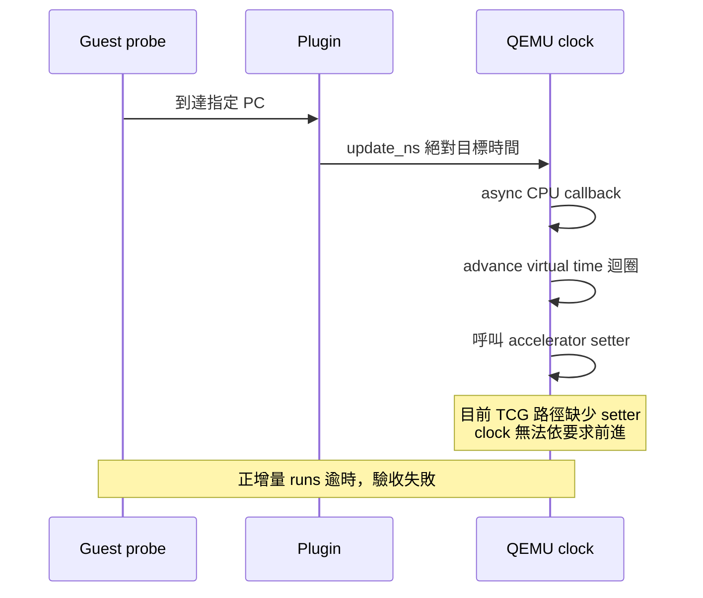

# T2a：QEMU guest time 注入可行性探針

**探針已執行；時間注入未通過。** T1 仍僅提供 sidecar 記憶體服務成本。尚未完成會影響 FreeRTOS tick／排程的 L1／L2 stall，也未把這項結果接上 Dashboard。

## 目的與驗收

在固定 guest PC 注入 1 ms／5 ms 的 virtual time 增量，驗證 mtime、tick IRQ 與等待 2 ticks 的高優先序 task 是否醒來。先通過此條件，才有依每次 cache miss 插入等待的基礎。

| 注入 | 重複次數 | 結果 |
|---|---:|---|
| 0 ns control | 3 | 全部正常，work oracle=523776、PSF BEGIN／END 完整 |
| 1,000,000 ns | 3 | 全部超過 3 秒上限，中止，guest 未完成 |
| 5,000,000 ns | 3 | 全部超過 3 秒上限，中止，guest 未完成 |

[正式結果](../runs/time-control-probe-v2/results.json)、[來源與檔案 hashes](../runs/time-control-probe-v2/manifest.json)。每個子目錄保存命令、ELF、symbols、qemu.log、PSF 與 manifest。失敗 run 的 PSF／plugin.json 可能不完整，不可當作成功 capture。

Runner 結束碼 0 表示診斷矩陣執行完成；真正驗收欄位為 `time_control_supported`，本次為 `false`。逾時以 host wall clock 限制程序，不用 host sleep 模擬 guest latency。

## 目前原因與證據強度

安裝的 QEMU 11.1.2／plugin API 7 有 `qemu_plugin_request_time_control` 與 `qemu_plugin_update_ns`。Plugin log 顯示已呼叫 update 並排入工作。API 存在不足以證明目前 accelerator 支援 clock setter。

[安裝 binary 的反組譯](../artifacts/verification/time-control/installed-clock-path.asm) 顯示 update 經 `async_run_on_cpu` 執行；`cpus_set_virtual_clock` 只有在 accelerator setter 存在時才呼叫它；TCG 初始化的 icount 分支設定 getter 與 elapsed ticks，未設定 setter。

公開 [QEMU v9.2.0 plugins/api.c](https://raw.githubusercontent.com/qemu/qemu/v9.2.0/plugins/api.c)、[system/cpus.c](https://raw.githubusercontent.com/qemu/qemu/v9.2.0/system/cpus.c)、[util/qemu-timer.c](https://raw.githubusercontent.com/qemu/qemu/v9.2.0/util/qemu-timer.c)、[tcg-accel-ops.c](https://raw.githubusercontent.com/qemu/qemu/v9.2.0/accel/tcg/tcg-accel-ops.c) 提供相符路徑：advance 迴圈需要 setter 推進 clock。icount callback 期間若 setter 未接上，clock 不前進，迴圈可能無法結束。

這是由實際 binary 加相符舊版 source 得出的強推論；沒有宣稱已取得安裝版本完整對應 source，也沒有宣稱所有 QEMU 版本均不支援。後續須以可建置的固定 source revision 定位與修正。



## 重跑

```sh
PYTHONPATH=src .venv/bin/python tools/tcp/run_time_probe.py --output runs/time-control-new
.venv/bin/python -m unittest tests.unit.test_time_control -v
```

程式入口：`tools/tcp/run_time_probe.py`、`tools/tcp/time_probe.c`、`firmware/app/cases/time_control_probe.c`。比較 oracle 位於 `src/psf_lab/time_control.py`。五個 unit tests 驗證 oracle 的正反例；通過 unit tests 不代表 QEMU 時間注入成功。

使用 `-icount shift=0,align=off,sleep=off`；plugin 以 instruction count + delay 構造絕對時間。這個假設僅適用此短探針、到 trigger 前無 WFI／warp 的情況，不能直接用於通用 workload。callback 排程造成的額外指令，以 0 ns control 與 200 µs 容差比較。

先前探索 [v1](../runs/time-control-probe-v1/) 對正增量等待 20 秒亦逾時。移除 icount 的探索雖結束，但沒有預期增量；該模式 guest clock 已可能超過由 instruction count 推算的絕對目標，因此不能用該探索否定所有非 icount 方案。

## 下一步與完成條件

- [x] 保存 API 探針、失敗 evidence 與 acceptance oracle。
- [ ] 在獨立建置目錄固定 QEMU source revision，確認 clock setter／icount offset 可行接法，不修改全域 QEMU。
- [ ] 先讓 0／1／5 ms 各三次通過 mtime、tick 與 task wake oracle。
- [ ] 定義 stall 與 IRQ 的關係；CPU memory instruction 尚未完成期間何時可接受 IRQ，需明確建模。
- [ ] 接入 L1／L2／RAM 模型、CPU frequency 與累計時間，驗證單調性、重跑一致性及 timer deadline。
- [ ] 跑相同 zero-copy TCP 流程 A/B；對照封包、PSF、guest tick 與模型成本。
- [ ] Web／離線 Dashboard 顯示模型版本、latency profile 與假設，避免把估計當作硬體測量。
