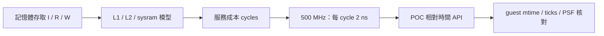

# 500 MHz 記憶體成本換算基準

2026-10-05 使用者選擇 B：固定以 **500 MHz** 作為研究情境。產品實際時脈仍待硬體校準。

## 已確定設定

- 每 cycle = 2 ns；sysram read／write startup 各 10 cycles = 20 ns。
- [記憶體 profile](../cases/timing/sysram-10.json)：L1I／L1D 各 16 KiB，L2 64 KiB，64-byte line，各 4 ways。
- L1 lookup 1 cycle，L2 lookup 8 cycles；sysram 每 cycle 傳輸 8 bytes。
- Write-through、write-allocate、串行成本；沒有 store buffer、重疊、DMA 或 coherence 模型。
- [獨立決策設定](../cases/timing-experiments/500mhz.json) 保存頻率；原 profile schema 不變。此設定目前是研究紀錄，runner 尚未讀取它。

## 成本範例

| 操作 | 計算 | cycles | ns |
|---|---|---:|---:|
| L1 read hit | L1 lookup | 1 | 2 |
| L1 miss／L2 hit | 1 + 8 | 9 | 18 |
| 冷 cache，填入 64-byte line | 1 + 8 + 10 + 64/8 | 27 | 54 |
| 4-byte write，L1／L2 均 hit | 1 + 8 + 10 + ceil(4/8) | 20 | 40 |

20 ns 只代表 sysram 起始服務延遲，不能直接當成整筆 miss 的耗時。表格由現有 Python 模型核對，證據見 [換算結果](../artifacts/verification/timing-500mhz/conversion.json)。

## QEMU 時間的邊界

現有實驗仍使用 `-icount shift=0`，其基礎指令時間是 1 ns／instruction。選定 500 MHz 僅確定模型 cycles → ns 換算，**尚未改動 runner、CPU 基礎時間或逐筆記憶體 callback**。

後續報表必須分列基礎指令時間、記憶體服務成本、timer／idle 與實測 guest elapsed。若保留 shift=0 作對照，應稱為混合研究模型，不可稱為 500 MHz CPU 執行時間。若改用 shift=1，則另外明示假設 CPI=1，重跑 control，不能沿用舊基準。避免把 L1 lookup 同時計入基礎指令成本與額外 penalty。

圖示為待接合流程；目前模型與相對 API 分別通過驗證，整條流程尚未驗收。

## 後續驗收

- [x] 頻率決策與模型換算核對。
- [ ] 逐筆 I/D callback 接模型，核對跨 line、region、write policy 與 Python oracle。
- [ ] 相同控制程式分別停用／啟用成本注入，核對累計 ns 與 guest mtime。
- [ ] 驗證 timer／IRQ／scheduler 順序、host overhead，保留 PSF 與來源 hashes。
- [ ] 完整 zero-copy TCP 流程 A/B 比較，呈現在 Web／離線 Dashboard。

既有 [T2d 報告](qemu-clock-nano-t2d.md) 的「待選頻率」屬當時狀態，由本決策取代；原始完成 receipt 不修改。
