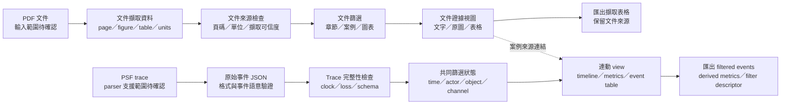

# Dashboard 功能與設計研究

研究日期：2026-10-03。狀態：功能與工具研究完成，輸入範圍、交付形式、第一版功能與設計方向待共同確認。尚未實作 UI，也沒有購買或操作 Tracealyzer。

**建議把分析介面建立在可驗證的資料上：輸入 → 完整性檢查 → 篩選 → 連動視圖 → CSV。** PDF 的案例文字／圖片與 PSF 的原始事件有不同的證據能力。目前保留兩種輸入分支，不能把「讀 PDF」自行改成「讀 PSF」。

## 1. 已確認的要求與仍需決定的邊界

| 項目 | 已確認 | 待確認 |
|---|---|---|
| 商用工具 | 不購買 Percepio Tracealyzer；研究公開功能與 UI，自己試做 | 第一版要重現哪些分析功能，哪些留在後續 |
| 資料 | 模擬環境要產生真實 PSF，Python 解析成 JSON，harness 驗證 | Dashboard 是否直接接受 PSF、只接受已解析 JSON，或兩者皆可 |
| PDF | 使用者明確寫出 Python 讀 PDF、產生互動 HTML | PDF 是獨立文件分析輸入、圖表數值擷取輸入，還是此處指 PSF |
| HTML | hover 詳情、篩選、可排序表格、欄寬與欄位移動、時間線互動、CSV | 單檔離線 HTML、HTML＋本地 assets，或 Python 本地／內網服務 |
| 設計 | 參考 Percepio 公開圖片；請設計師研究與 review | 主要工作是除錯定位、案例教學、修正前後比較，還是涵蓋全部；各自優先序 |
| 品質 | Python `unittest`＋`ruff` | 目標瀏覽器、資料量、可接受的載入／互動時間與 browser 測試工具 |

本文件的功能分類、資料欄位與設計檢查是**建議**，不是已確認的產品規格。官方功能與自製工具要提供的功能分開標示。

## 2. 官方工具想解決什麼問題？

公開功能頁把 RTOS 排程、事件、CPU、記憶體與 timing 分析連結起來，讓工程師從異常數值追到具體事件，再對照 task／RTOS 物件。這是可參考的分析流程；自製介面是否算對，仍需原始事件與已知 test case 驗證。[Tracealyzer 官方功能頁](https://percepio.com/tracealyzer/features-capabilities/)

Datasheet 展示多個視圖同步 scrolling、zoom 與 filters，並保留 overview 與 detail 不同時間尺度。值得沿用的是「同一事件可以在不同視圖被找到」，不必沿用原產品的桌面視窗、圖示或排版。[官方 Datasheet，第 3 頁](https://percepio.com/docs/TracealyzerDatasheet.pdf)

### 2.1 觀測與分析功能對照

以下是官方公開功能名稱的簡述。每個自製 view 都要另有計算定義與驗收測試。[官方功能與說明](https://percepio.com/tracealyzer/features-capabilities/)

| 官方功能 | 要回答的問題 | 自製分析所需事件／條件 |
|---|---|---|
| Trace View | 誰在執行、何時切換、哪個呼叫阻塞？ | task switch、ready／blocked、ISR、kernel call、user event；需重建狀態 |
| CPU Load Graph | task／ISR 如何分配 CPU？ | 每 core 執行區間、idle 身分、ISR nesting、觀察窗口與 coverage |
| Event Log | 找到指定事件，追查前後關係 | 穩定 event ID、時間、actor、event kind、object、參數與來源位置 |
| Communication Flow | 哪些 actors 操作同一 RTOS 物件？ | actor↔object 操作；若宣稱 message pairing，還需可驗證的配對規則 |
| Data Plot | 應用數值如何隨時間變化？ | user event channel、型別、value、units |
| Heap／Stack Memory Usage | 記憶體是否累積、stack margin 是否縮小？ | allocation／free、初始基準、stack samples；未收集就不能補出數值 |
| Timing Metrics／Thread Instance Graphs | execution、response、periodicity 是否變差？ | job／instance 起訖定義、ready／run／complete 事件、邊界狀態 |
| Interval／State／Runnable Tracing | 某段工作或狀態持續多久？ | 成對事件或狀態轉移；runnable execution 需扣除 preemption |
| Advanced RTOS Analytics | blocking、queue usage、priority、call intensity 如何變化？ | 對應事件與 payload 欄位的版本語意；逐項實作，不能只看 UI 命名 |

上表不是「讀到任何 PSF 就能自動算出全部指標」的承諾。資料缺失、事件未啟用、格式版本不支援、clock 未確認，都可能讓某個 view 無法成立。

### 2.2 官方 filter 能確認到哪裡？

| 證據 | 可以確認 | 邊界 |
|---|---|---|
| 官方功能頁的 Event Log／Search 說明 | 事件搜尋與篩選；Finder 提供 SQL-like queries；match 可定位 trace | 沒有在本次操作商用 UI，也未取得完整 query grammar |
| 官方功能頁的 Data Plot 說明 | legend 可切換 user event channel 的可見性 | channel visibility 不等於重建所有統計的事件過濾 |
| 官方 Datasheet 第 3 頁 | 多視圖可同步 filters、scrolling、zoom | 沒有證明每個 view 都支援同一組 predicate |
| 本地 SWO `tracealyzer.png` | 畫面顯示 view selector、object search、actors／services／objects／channels tree；Event Log 有文字欄、Apply／Filter／Advanced | 是這張版本畫面的直接觀察；combined mode 與各 checkbox 的完整語意尚未操作驗證 |

官方文字來源：[功能頁](https://percepio.com/tracealyzer/features-capabilities/)、[Datasheet](https://percepio.com/docs/TracealyzerDatasheet.pdf)。畫面來源：[本地 SWO 原圖](../../Tracealyzer-STM32CubeIDE-SWO/img/tracealyzer.png)。

**Host view filter 不會降低 target 先前記錄的 CPU 成本或傳輸量。** 本次自製 Dashboard 的 filter 應先視為資料檢視設定；裝置端裁剪、trigger、傳輸控制是另一個驗證題目，已有研究報告的第 13 節。

## 3. 已閱讀的圖片與可以借鏡的操作

本輪逐一看過以下 8 張本地原圖。它們是案例／教學／Arm 示範，沒有證明我們的 RISC-V 模擬器或 parser 已提供相同結果。

| 原圖 | 直接看到的資訊 | 可借鏡的互動 |
|---|---|---|
| [SWO Tracealyzer 全畫面](../../Tracealyzer-STM32CubeIDE-SWO/img/tracealyzer.png) | 排程、Event Log、instance graph、CPU、filter tree 並排；Sync 按鈕 | 時間窗口與 selected event 共同管理；event row 可定位 timeline |
| [SWO Missed Events](../../Tracealyzer-STM32CubeIDE-SWO/img/missed_events.png) | received bytes、data rate、total events、event rate、duration、missed events | 載入時先呈現完整性與解析狀態，讓圖表有可信度脈絡 |
| [回應時間統計，第 3 頁](../images/response-statistics-page3.png) | execution／response 各自的 min／avg／max，以及 CPU | 清楚顯示 units 與定義；可排序極值，點擊後追到具體 instance |
| [回應時間修正後，第 6 頁](../images/response-time-page6.png) | task lane、事件標籤、filter、selection details | 一個分析窗口內能看到執行片段與阻塞呼叫，不只 summary numbers |
| [Object History，第 5 頁](../images/response-object-history-page5.png) | timestamp、actor、event、block time、status、queue 內容／狀態 | 選一個 object 後產生 history table，並追查相關 send／receive |
| [Priority Inversion／Deadlock，第 4 頁](../images/priority-inversion-deadlock-page4.png) | 阻塞 task、semaphore take／give、timeout 與排程關係 | 區分已看到的 waiting edges 與「原因」判定；正常／故障 trace 可以比較 |
| [Heap 趨勢，第 5 頁](../images/heap-trend-page5.png) | allocation usage 隨時間累積與下降 | 選資料點回查 allocation／free；缺基準時標示相對變化 |
| [Watchdog，第 7 頁](../images/continuous-watchdog-page7.png) | margin 曲線、CPU 與 queue blocking timeline | 選同一時間窗口同時看應用 symptom 與排程證據 |

統計圖片包含表格；本文件用上表記錄可借鏡的欄位。若後續將圖片中的數值作為可排序資料，必須忠實擷取並標註來源頁與單位，不能把截圖數字當成模擬器輸出。

## 4. 免費第三方工具候選與取捨

以下是架構候選，不是已選定套件。尚未安裝或 benchmark；套件版本在實作前需固定並保留 license。免費 library 的可用性不表示分析演算法、整合與維護沒有成本。

### 4.1 圖表與應用框架

| 候選 | hover／time window／聯動 | 離線與 Python 邊界 | 適用取捨 |
|---|---|---|---|
| Plotly.py＋Plotly.js | `hovertemplate`、range slider、pan／zoom；`plotly_selected`／`plotly_relayout` 可接自己的狀態更新 | Python 產 HTML；`include_plotlyjs=True` 可把 JS 放在檔案內。跨圖表＋表格聯動需 JS；一般 HTML export 不保留 Python callbacks | Python 圖表產製直接；RTOS lane、edge、event detail 仍需自行組合 |
| Dash＋Plotly＋AG Grid Community | Python callback 串 input／graphs／table；`dcc.Download`／grid CSV | Python 服務適合 server-side filtering；可在內網部署並帶本地 assets。Dash app 不等於單一靜態 HTML | 適合資料較大、重分析與多人使用；需要服務部署與 session 管理 |
| Bokeh | shared ranges 做 linked pan／zoom；shared `ColumnDataSource` 做 linked selection；`CustomJS` 可處理 filters／hover | standalone HTML 可含 JS 互動；Python callbacks 需 Bokeh server。JS／CSS 應 bundle 在本地 | 時間線與連動圖表的自然候選；複雜 DataTable 特性需另核對，或接 Tabulator |
| Panel＋Bokeh／Plotly＋Tabulator | Python reactive components 可連動多種 plots 與 DataFrame table | server 模式便利；standalone `embed()` 是預計算 states，不是任意 Python runtime。多 filter 可能組合爆炸，外置 JSON 需 HTTP | 適合 Python 服務或有限狀態展示；不可因能 save HTML 就承諾任意離線 filter |
| Apache ECharts＋Python HTML template | tooltip、`dataZoom`、brush、events／actions；custom series 可組成 RTOS interval lanes | 本地 JS＋JSON 可離線；Python 負責輸出，JS 負責互動。不是純 Python UI | 可精細掌握時間軸與 dense views；需較多 JS 開發，需自己實作 CSV 與 table 聯動 |

官方依據：[Plotly HTML export](https://plotly.com/python/interactive-html-export/)、[hover](https://plotly.com/python/hover-text-and-formatting/)、[range slider](https://plotly.com/python/range-slider/)、[Plotly.js events](https://plotly.com/javascript/plotlyjs-events/)、[Dash callbacks](https://dash.plotly.com/basic-callbacks)、[Dash downloads](https://dash.plotly.com/dash-core-components/download)、[Bokeh linked behavior](https://docs.bokeh.org/en/latest/docs/user_guide/interaction/linking.html)、[Bokeh standalone 與 server](https://docs.bokeh.org/en/latest/docs/user_guide/output/embed.html)、[Bokeh JS callbacks](https://docs.bokeh.org/en/latest/docs/user_guide/interaction/js_callbacks.html)。

Panel 的官方文件特別提醒 states 的組合數，預設約限制在 1,000 states；外置 JSON 由 `file://` 直接開啟時不能正常讀取。[Panel embedding state](https://panel.holoviz.org/how_to/export/embedding.html)

ECharts 官方的 `dataZoom-inside`／brush／custom series 說明在本次可用 curl 讀取的 Markdown 文件中確認；web 工具對該路徑回報 unavailable，因此也保留文件索引入口。[官方文件索引](https://echarts.apache.org/en/llms.txt)、[dataZoom-inside](https://echarts.apache.org/en/llms-documents/option-parts/option.dataZoom-inside.md)、[brush](https://echarts.apache.org/en/llms-documents/option-parts/option.brush.md)、[custom series](https://echarts.apache.org/en/llms-documents/option-parts/option.series-custom.md)、[events／actions](https://echarts.apache.org/handbook/en/concepts/event/)。

**ECharts 的 `timeline` component 不是 RTOS 執行時間線的成品。** 自製 execution lanes 需要用 interval geometry／custom series 等方式建立，並驗證 clipping、state、時間比例與 hover。

### 4.2 表格候選

| 候選 | 排序／欄寬／欄位移動 | 篩選後 CSV | 限制與風險 |
|---|---|---|---|
| Tabulator | header sort、column `resizable`、`movableColumns` | `download("csv", ...)`；預設 `active` 是通過 filters 的 rows，可另選 all／selected／visible | 正確選擇輸出範圍；visible 不等於全部 filtered rows；CSVs 不承載畫面樣式 |
| AG Grid Community | 基本 sorting／filtering、column sizing／moving、virtualization | API 提供 CSV export，可指定 filtered/sorted rows；不要依賴 Enterprise context menu | Community 為免費核心；advanced filters、integrated charts／部分 grouping 等屬 Enterprise，逐 feature 查證 |
| Panel Tabulator | DataFrame、client filters、配置與列選取；可傳 Tabulator options | `.download()`／`.download_menu()`，`current_view` 可取 filtering＋sorting 後資料 | `pagination='remote'` 時 download 只包括目前 page；輸出整個 filtered set 需另外處理 |

來源：[Tabulator sorting](https://www.tabulator.info/docs/6.x/sort/)、[欄寬](https://www.tabulator.info/docs/6.x/layout/)、[欄位移動](https://www.tabulator.info/docs/6.x/move/)、[download／row range](https://www.tabulator.info/docs/6.x/download/)、[AG Grid Community vs Enterprise](https://www.ag-grid.com/javascript-data-grid/community-vs-enterprise/)、[CSV export](https://www.ag-grid.com/javascript-data-grid/csv-export/)、[column moving](https://www.ag-grid.com/javascript-data-grid/column-moving/)、[column sizing](https://www.ag-grid.com/javascript-data-grid/column-sizing/)、[Panel Tabulator](https://panel.holoviz.org/reference/widgets/Tabulator.html)。

### 4.3 License 事實

| 套件 | 官方 license | 注意的產品邊界 |
|---|---|---|
| Plotly.py／Plotly.js | MIT | Graphing library 與商用 Plotly 服務分開；打包時保留 notice |
| Dash | MIT | Open-source Dash 與 Dash Enterprise 分開 |
| Bokeh／Panel | BSD 3-clause | 第三方 extensions 仍需逐一核對 |
| Tabulator | MIT | XLSX／PDF 等額外輸出依賴可能有自己的 license；本次要求 CSV |
| AG Grid Community | MIT | Enterprise 使用另外的商用 license |
| Apache ECharts | Apache-2.0 | Bundle 保留 license／NOTICE；第三方資源與字型另列 |

Primary license：[Plotly.py](https://github.com/plotly/plotly.py/blob/main/LICENSE.txt)、[Plotly.js](https://github.com/plotly/plotly.js/blob/master/LICENSE)、[Dash](https://github.com/plotly/dash/blob/dev/LICENSE)、[Bokeh](https://github.com/bokeh/bokeh/blob/branch-3.9/LICENSE.txt)、[Panel](https://github.com/holoviz/panel/blob/main/LICENSE.txt)、[Tabulator](https://github.com/tabulator-tables/tabulator/blob/master/LICENSE)、[AG Grid Community](https://www.ag-grid.com/eula/community/)、[ECharts](https://github.com/apache/echarts/blob/master/LICENSE)。

### 4.4 目前的條件式建議

- **若確認單檔／離線 HTML 為優先：**Python 解析與計算 → JSON → Plotly.js 或 ECharts＋Tabulator；bundle JS、CSS、字型、圖片。先比較圖表 prototype 的互動能力，再固定其中一套。
- **若確認 Python 服務與較大資料為優先：**Dash＋Plotly＋AG Grid Community，或 Panel＋Bokeh＋Tabulator；以 server-side window query 與 filtered export 控制資料量。
- **若確認 PDF 也是獨立輸入：**先產 document evidence JSON，帶 page／figure／text／extracted table／source unit，再決定要與 trace views 並排或分頁。PDF 截圖不具有 event-level 完整性。

上述分支不替使用者定案。套件文件沒有證明本專案能處理特定事件量；效能仍要以本次 trace fixtures／模擬輸出測試。

## 5. 建議的 input → filters → views → CSV 資料流

這是研究用資料流。PDF 分支是否進入同一 Dashboard 是待確認事項；圖中保留文件與 trace 各自的篩選語意，案例引用不會將 PDF 圖片轉成原始事件。Mermaid 的語法與備用圖驗證結果另見本階段驗證紀錄。

不支援 Mermaid 的閱讀器可使用 [SVG](images/dashboard-flow.svg)／[PNG](images/dashboard-flow.png)，並保留 [Mermaid 原始碼](images/dashboard-flow.mmd)。

### 5.1 View 與 filter 建議

| View | 建議輸入 | 建議 filter | hover／click／export |
|---|---|---|---|
| Session／品質資訊 | build、format、clock、bytes、errors／loss | run／case／session | 顯示已支援事件與缺口；匯出來源與 decoder 版本 |
| Overview | 原始事件率、完整區間、粗粒度 CPU | time window | brush 選時間，控制下方詳細窗口；顯示 downsample 說明 |
| Execution timeline | 完整狀態重建後的 intervals | core、actor；以 viewport 控制時間 | hover start/end/duration/state/source IDs；click 固定 selection |
| Event table | 原始 decoded events | kind、actor、object、channel、text、result、time | 排序／欄寬／欄位移動；click 回到 timeline；CSV 包含穩定 event ID |
| Object history | 指定 object lifetime 的 operations | object、result、actor、window | 顯示 send／receive／take／give／block／timeout；配對僅在規則驗證後 |
| Metrics／job table | 已驗證的 intervals／instances | actor、metric、window、normal／fault run | execution／response 分開；min/max click 定位事件；匯出 units／denominator |
| Application signals | user numeric／state events | channel、units、window | hover 原值與來源 event；點選與 timeline 共用 cursor |
| Memory／dependency views | 有語意支援的 memory／IPC events | object／allocator／actor／window | 不可用的 view 說明缺哪類事件；未知基準不顯示為零 |

上述 filters 是自製產品建議。官方畫面看不到／文字沒說明的 predicate，不能反過來宣稱 Tracealyzer 已提供。

### 5.2 聯動規則比圖表樣式更重要

1. 設一份共同狀態：`session_id`、`time_window`、`actor_ids`、`object_ids`、`channels`、`selected_event_id`。每個 view 從相同狀態讀資料。
2. **時間窗口、可見性、分析選擇分開。** 隱藏 actor lane 不能把它從 scheduler reconstruction 移除；否則 CPU／preemption 計算會出錯。
3. Event Log 的文字 filter 可以限制表格 rows，但不預設刪掉 CPU 計算的 underlying events。每個 filter 顯示作用範圍。
4. Zoom 改 viewport；brush 改分析窗口；click 改 selection。Agent 依套件能力提出具體手勢、快捷鍵與 reset／undo，在設計稿和瀏覽器驗收中檢查；只有影響使用目的的選擇再向使用者釐清。
5. 所有點擊與 hover 都用穩定 ID 回到原始事件，避免排序後 row index 改變造成錯誤定位。
6. 畫面對同一 actor／object 使用相同顏色；blocked／timeout／gap 另外用符號或 pattern，避免只靠紅綠辨識。
7. 匯出按鈕具體標成「匯出篩選後事件」或「匯出此圖統計」。不要讓 filtered rows、selected rows、當頁 rows 共用模糊名稱。

## 6. JSON contract 與計算風險

這是 parser／analysis／UI 之間的 contract 草案。格式細節由 PSF source 分析與 mock／實際 trace 驗證決定，本文件不宣稱已解析 PSF。

### 6.1 至少要保留的資料

| 類別 | 建議欄位 | 目的 |
|---|---|---|
| Dataset | `schema_version`、`source_type`、`source_sha256`、`decoder_version`、`recorder_version`、`build_id`、`case_id`、`session_id` | 比對來源與避免不同版本混用 |
| Clock | counter type、frequency、tick conversion、epoch／wrap rule、relative origin、units | 知道時間是否可換算、能否跨 core／session 比較 |
| Raw event | `event_id`、`source_offset`、raw ID、raw timestamp、core、actor／object lifetime ID、parameters、decode status | 保留可追溯證據，不以 prettified text 代替原始欄位 |
| Reconstruction | execution／state intervals、start/end event IDs、boundary status | 每個圖形區間能說明從哪些事件推導 |
| Derived metric | metric kind、value、units、window、denominator、coverage、input event IDs／hash | 讓 harness 驗證數學定義，不只看畫面數字 |
| Quality | unsupported event types、truncation、transport gaps、recorder drops、clock uncertainty、incomplete interval | 區分資料不完整與系統真的無事件 |
| PDF evidence | document hash、page、figure/table ID、source text、extracted values、units、extraction method／confidence | 支援文件分析，避免混成 trace 原始事件 |

### 6.2 會讓分析看起來合理、實際卻錯的情況

- **64-bit timestamp／address：**JavaScript `Number` 無法精確表示大於 `2^53-1` 的整數。Raw counters、addresses 以十進位／hex string 保存，Python 用 integer 算差；render 只用確認精度足夠的相對座標。需要 BigInt 的篩選與序列化要另有 contract。[MDN Number.MAX_SAFE_INTEGER](https://developer.mozilla.org/en-US/docs/Web/JavaScript/Reference/Global_Objects/Number/MAX_SAFE_INTEGER)
- **開始／結束不完整：**snapshot 第一個 switch 不提供此前全部狀態，最後一個 task／job 也可能還沒結束。Window 邊界 interval 要標註 left/right clipped／open，不能把 open end 偷補成完整 job。
- **Loss：**不同 drop／transport gap／unknown event 來源分開記錄。沒有 loss metadata 不代表 loss=0；以 `unknown` 或 nullable 欄位表示。不完整區間不輸出無條件的精確 CPU／waiting time。
- **Actor／object address 重用：**handle 相同不一定是同一生命週期，需 create/delete epoch 或等價規則；否則連動、ownership、heap free pairing 都可能串錯。
- **ISR nesting／SMP：**task execution 與 ISR execution 要避免 double count。不同 core 的時間基準不能在未同步時強行排序成一條可比較的線。
- **CPU 分母：**用選取窗口 wall time、單 core capacity 或多 core capacity 必須說明。Actor visibility 不應偷偷改變 denominator。不得把 task CPU percentage 當 recorder overhead。
- **Timing：**execution／response／waiting／periodicity 是不同指標；job 起訖規則需與 test case 對齊。Runnable 排除 preemption 的計算必須具備 scheduler context。
- **事件配對：**看到 queue send／receive 不必然能辨識 message identity；資料缺少 sequence／payload ID 時，要說明 FIFO、timeout／reset、ISR 等假設。Communication edges 不自動證明 deadlock。
- **Downsample：**圖表為了速度可以 aggregate，但 CSV 要能選 raw 或 aggregation；window 的 max／spike 不能被平均後消失，原始資料仍保留。
- **未知格式／語意：**保留 raw bytes／ID／parameters 與 warning；不自行套相近版本含義，不捏造 object 名稱或零值。UI 顯示「尚未支援」與來源欄位。
- **PDF 圖：**像素、文字或表格擷取不提供完整事件順序。數值擷取結果需可回到 page／figure／unit，不能用截圖反推缺失 task transitions。
- **CSV：**保留 units、precision、IDs、filter descriptor、排序順序。字串含 comma／quote／newline 必須正確 escaping；spreadsheet 可能執行以 `=,+,-,@` 開頭的值，輸出策略需區分原始資料與 spreadsheet safe export。[AG Grid 官方 CSV 安全說明](https://www.ag-grid.com/javascript-data-grid/csv-export/)

## 7. 設計 review 結果

已閱讀 `frontend-design` 與 `web-design-engineer` skill。這一輪只研究與 review，尚未建立 v0 wireframe、token system 或 UI。

### 7.1 對既有資料的 review

- 原圖的價值在同一時間窗口跨視圖定位、顏色身分一致、事件列表與細節可回查。這比照搬桌面圖示或多層 toolbar 更適合本次實作。
- 為 PSF 技術 demo 設計時，第一屏應讓使用者找到 run、case、資料品質與開始分析的位置。不要用大量概括 KPI 占掉 timeline 空間。
- Source evidence、observed events、derived metrics、harness verdict 各自清楚顯示。只有 assertion 通過才顯示其驗證結果，不能因圖表正常 render 就稱資料正確。
- Hover 可放更多欄位；核心診斷資料也要能 click 固定在 detail panel，讓讀者可複製、鍵盤存取與比較。
- 多 filter 的 scope 與 reset 要可見。每張 chart 都有獨立 filter 且未顯示有效條件，會讓使用者無法理解不同數值的原因。
- 狀態包含未載入、讀取中、無符合資料、unsupported、部分解析、品質不足、完成。未量測欄位顯示原因，不用 `0` 做 placeholder。
- 首輪視覺方向應先由真實 trace、正常／故障 cases 與工作優先序決定。不能先用假資料排版後，宣稱已驗證可用性。

### 7.2 待確認後才做的設計交付

輸入與交付形式確定後，再提出少量布局方向與色彩／字體／間距／狀態規則，供使用者選擇。優先比較「timeline 主工作區」與「case 驗證／比較主工作區」兩種組織方式；它們服務不同主工作，不能在本輪直接選一種。

## 8. 測試與驗收建議

### 8.1 `unittest`＋`ruff` 負責什麼？

| 驗證層 | 工具／方式 | 真正要驗證的內容 |
|---|---|---|
| Binary parser | `unittest`＋獨立 bytes fixtures | headers／endianness／length、unknown／truncated handling、timestamp／object lifetime；expected 值不得全部由同一 parser 自動產生 |
| Analysis | `unittest`＋手算小 trace／已知模擬案例 | execution／blocking／response 的公式、window clipping、loss policy、normal／fault verdict |
| JSON contract | `unittest`＋schema／roundtrip checks | version、required 欄位、nullable unknown、64-bit string、source IDs／offset、units |
| CSV／HTML generator | `unittest`＋產物檢查 | filtered IDs、排序、precision、escaping、內容來源、asset 引用／hash；HTML 存在不等於 UI 行為正確 |
| Python 程式風格 | `ruff check`、依專案約定 `ruff format --check` | imports、常見程式錯誤、格式規則；不證明 decoder 語意或圖表數值 |
| Browser integration | browser automation＋截圖／interaction checks | filters／linked views／hover／表格／CSV／pan／brush 是否按規格運作；需另選工具 |

`unittest` 是 Python 標準測試框架，`ruff` 是 Python linter／formatter，兩者各自的範圍如官方說明。[Python unittest](https://docs.python.org/3/library/unittest.html)、[Ruff linter](https://docs.astral.sh/ruff/linter/)、[Ruff formatter](https://docs.astral.sh/ruff/formatter/)

### 8.2 Browser 驗收至少包含

1. 開正常／故障 trace fixtures，畫面數值與 harness expected metrics 一致。
2. 以 brush 選固定窗口：timeline、CPU、signals、table 共享相同 window；reset 還原。
3. 切 actor visibility：排程和 CPU 基礎計算維持正確；filter scope 符合設定。
4. Event table 排序／欄寬／欄位移動後，選中 row 仍定位同一 `event_id`；hover 顯示真實欄位和 units。
5. Filtered CSV 行數、IDs、順序與目前有效 filters 的結果一致；有 pagination 時不誤匯出當頁而聲稱全量。
6. Unknown／loss／truncated fixtures 會顯示具體狀態，不用綠色成功 badge 掩蓋缺失。
7. 若選離線交付：停用網路、從指定開啟方式載入；無 CDN／遠端字型／telemetry 依賴；圖片、CSV download 與連動皆可用。
8. 以目標資料量驗證 load time、memory、pan／filter latency；dense plots 的 sampling／aggregation 可辨識，table virtualization 不改變輸出語意。
9. 主要工作在目標 viewport 可完成，文字／tooltip 不溢位；keyboard focus、固定 detail、reset 可操作。

第 7～9 點的數量與時間門檻尚未指定；不能在目前回報 browser tests 已通過。

## 9. 後續 grilling 的決策樹

| 上游決定 | 解鎖的下一輪問題 | 設計師目前建議 |
|---|---|---|
| PDF 是獨立輸入或 PSF？ | document evidence schema、圖表數值擷取／人工核對、PDF 與 trace views 是否共存 | 明確保留文件證據與事件資料兩條來源，不默默互換 |
| 靜態離線 HTML 或 Python 服務？ | library 組合、任意 filter 可計算位置、檔案載入與內網部署方式 | 可攜優先偏 Python generator＋JS；資料規模優先偏 Python service |
| 第一版主要用途與 views？ | case navigation、timeline 配置、comparison、計算指標與測試順序 | 先讓正常／故障案例可定位和驗證，再擴充其他統計 |
| 要求的 trace 規模與目標平台？ | table virtualization、index／chunking、overview/downsample、可接受 load latency | 用真實 trace／fixtures 量測，不由套件宣傳推估 |
| Filter scope 與 export 語意？ | shared state、metrics denominator、CSV raw／derived／selected／all | 預設共同時間窗口；view visibility 與計算輸入分開；每種匯出具體命名 |
| 使用者確認設計方向？ | tokens、v0 wireframe／prototype、review、實作 | 才建立具體 UI；本次研究不替使用者下此決定 |

這些是待共同確認的分支，應按 prerequisites 提問；不可同一輪問尚依賴未回答 upstream 的問題。

## 10. 本輪完成與未完成紀錄

- 已完成：讀設計 skills；核對官方功能／UI 證據；逐一檢視 8 張本地圖片；比較圖表／表格架構與 primary license；列 contract 風險、filter／view／CSV 規則與測試範圍。
- 未完成：選套件、固定版本、v0 設計、實作 Dashboard、library benchmark、PSF parser 驗證、Python／browser 測試執行、離線 bundle 驗收。
- 本次 ECharts Markdown docs 的 web tool 存取失敗，curl 讀取成功；Plotly performance 頁 web tool 因頁面過大失敗。本文件沒有據此引用任何本專案效能 benchmark。
- 此文件可供後續計畫與 review 引用；不代表 simulator／parser／UI 已有相同行為。
